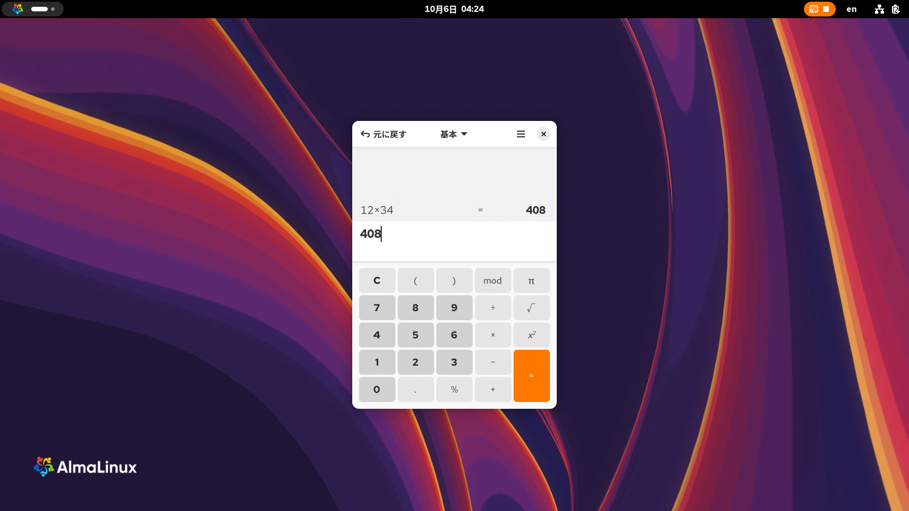
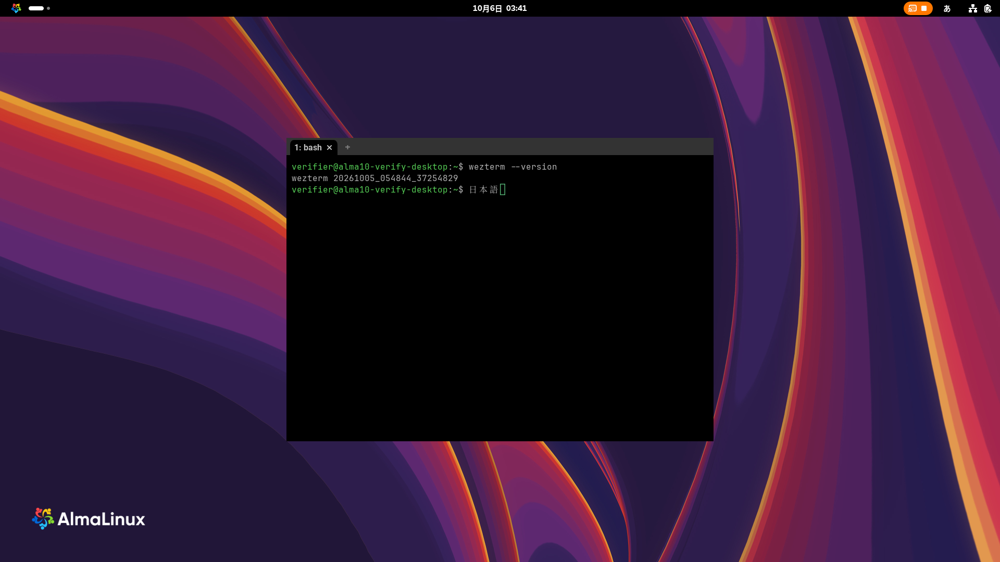

# AlmaLinux 10 のクリーンインストールからの環境構築の検証（2026-10-06）

## 状態と対象

**状態**: **AlmaLinux 10.2 の x86_64 VM で本実行した記録。実機・aarch64・Windows の構築手順の検証ではない**。

公式 ISO から Workstation を新規インストールし、その状態のスナップショットから用途ごとの VM を作った。既に環境構築済みのホストを使い回さず、各 VM で前提の手順書から順に通した。導入・設定・CLI / GUI の確認と、サーバー間の通信を対象にした。アカウントの認証が必要な手順、ハードウェアの条件を満たさない分岐、実機のルーター設定は、到達したところと未実施の範囲を分けて記録する。

この文書は検証結果の一覧。実行するときは、リンク先の手順書を使う。各手順書から案内する `verification/<手順書名>.md` にも、今回の状態と検証範囲を記録している。2026-10-08 に、Homebrew・EPEL・bash の設定など 13 本の手順書を [AlmaLinux 10 の初期設定](almalinux-setup.md)にまとめた。表のそれらの文書へのリンクは、まとめた先を指す（当時の記録と手順番号の対応は、その[検証記録](verification/almalinux-setup.md)の「統合前の記録」）。

**現行版の結果**: 共通 bash と設定サブモジュールを含む現行版は、その後に新規作成した 6 台で通し直した。[現行版と全サブモジュールの再検証](#現行版と全サブモジュールの再検証2026-10-06)を参照。以下の前半は、それより前の検証版の記録として残している。

前半の検証開始時の手順書は [`0dbb522` 版](https://github.com/ryo-aoki-pc/setup-notes/tree/0dbb522)。この検証で直したブロックは再実行した。その後に上流へ入った共通 bash 設定への統一（#93）、lazydocker の実機検証・改良（#94）、starship の常時表示の任意節（#95）は保持したが、この時点では変更後の手順を VM で通し直していなかった。前半に対応する個別の検証記録の付録の手順番号は検証した版を指す。共通 bash 設定の新規導入・移行と、追加された任意節は前半の範囲外だった。現行版で再検証した範囲は後半に分けている。

## 環境と開始時点

| 項目 | 実際の検証環境 |
|---|---|
| ホスト | Windows 11、VirtualBox 7.2.20。Hyper-V の NEM バックエンド |
| ISO | [公式配布](https://repo.almalinux.org/almalinux/10/isos/x86_64/)の `AlmaLinux-10-latest-x86_64-boot.iso`。取得時点では 10.2 |
| SHA256 | `b3f865468075bcada8f208d830289302c67529789d668041d24e8d6fc697ba6a`。公式 CHECKSUM と照合 |
| ゲスト | AlmaLinux 10.2 (Lavender Lion)、kernel `6.12.0-211.61.1.el10_2.x86_64` |
| インストール | 公式 BaseOS / AppStream を使う Kickstart、`@^workstation-product-environment`、XFS / LVM、96 GiB の仮想ディスク |
| VM | UEFI、1 vCPU、KVM の準仮想化、VMSVGA。通常 6 GiB、オフライン用 4 GiB RAM |
| セキュリティ | SELinux Enforcing、firewalld 有効。Secure Boot は無効 |
| ロケール | `ja_JP.UTF-8`、US キーボード、Asia/Tokyo、UTC のハードウェア時計 |
| ネットワーク | SSH 用 NAT と、VM 間の内部ネットワーク `10.77.0.0/24`。オフライン用は NAT の既定経路を無効にした |

SSH の操作用に、試験用ユーザー、専用の鍵、sshd、sudo の設定だけをインストール時に追加した。sudo の通常の実行は NOPASSWD だが、Homebrew インストーラの認証は VM 専用のパスワードで答えた。利用者の実アカウントのトークン・SSH 鍵・Dropbox の認証情報は持ち込んでいない。対話入力や GUI の初回案内の確認を自動インストール済みとは扱わない。

開始時点で Homebrew、Podman、EPEL の追加ツール、個人用の設定は無かった。Workstation に含まれる Git、curl、procps-ng、file、bash-completion、fontconfig、gnupg2、ibus-anthy、cifs-utils、gvfs などは既に入っていた。既存のパッケージを確認して飛ばす手順は、本文の条件に従って飛ばした。linger は `no` だった。

ベース VM を停止して `clean-install` スナップショットを取り、CLI、デスクトップ、サーバー、コンテナ、オフラインの検証用 VM をリンククローンとして作った。サーバー / コンテナの 2 台は Samba、Syncthing、WireGuard の通信相手にも使った。オフライン試験は、経路設定の問題を切り分けた後、同じスナップショットからもう 1 台作って取り直した。

VM の準備では、VirtualBox の無人インストールの生成物に Kickstart の起動引数が入らず、起動メニューで止まった。ISO のメニューが `linuxefi` を使うことを確認し、検証用の GRUB 設定に `inst.ks` とシリアルコンソール・テキストモードの引数を直接追加して通した。準仮想化を `none` にした試行は `IO-APIC + timer doesn't work!` でカーネルが停止したため、KVM に戻してインストール・起動を完了した。この観測を、別のホストの CPU 数や設定でも必ず失敗するという意味には扱わない。

## 通した手順と結果

### 導入基盤・CLI

| 手順書 | 今回の範囲と結果 |
|---|---|
| [Git](git.md) | 導入・設定・一時リポジトリの操作。認証を伴う GitHub への送信は除外 |
| [Homebrew](almalinux-setup.md) / [EPEL](almalinux-setup.md) | 新規導入、PATH と導入元の確認。インストーラの Return / sudo / パッケージ導入の問い合わせにも答えた |
| [gh](gh.md) / [Claude Code](claude-code.md) / [Codex CLI](codex.md) | 導入・版・未ログインの確認まで。Codex はインストーラの再実行で 0.160.0 → 0.160.1 の更新も確認。実アカウントへのログインと認証後の操作は除外 |
| [btop](btop.md) / [tmux](almalinux-setup.md) / [bat](almalinux-setup.md) / [eza](almalinux-setup.md) / [gdu](gdu.md) | 導入と実行。TUI は文字を読み取り、キーの応答と終了を確認 |
| [zoxide](almalinux-setup.md) / [fzf](almalinux-setup.md) | bash の設定を読み直し、移動・履歴・ファイル・ディレクトリ選択を実際に操作 |
| [yazi](yazi.md) / [lazygit](lazygit.md) / [Neovim](neovim.md) / [delta](git-delta.md) | 導入と対話操作。yazi の追加ツールは本文の既定を全て導入し、ディレクトリ移動・ZIP プレビューも確認。Neovim の checkhealth はエラー無し、任意 provider などの警告 8 件。delta のページャと複数の変更間の n / N の移動も成功 |
| [ShellCheck](shellcheck.md) / [HackGen Console NF](hackgen.md) / [bash の設定](almalinux-setup.md) / [starship](almalinux-setup.md) | 導入・設定・読み戻し。ShellCheck で WG スクリプトを検査し、フォントの 4 字種、Tab・履歴・移動、再 SSH 後のプロンプトも確認 |

### デスクトップ

| 手順書 | 今回の範囲と結果 |
|---|---|
| [電源とロック](almalinux-setup.md#画面オフ画面ロック自動サスペンドを止める任意) | ユーザー・GDM・OS の設定を実行して読み戻し。Workstation の自動サスペンドを止めた |
| [ヘッドレスのセッション](gnome-headless-session.md) / [GUI の操作](claude-code-gui.md) | セッションと仮想モニターを作り、画面を撮影。電卓への入力とクリックを確認。GUI 構成を戻した後の再起動でも 1920×1080 の撮影・入力・クリックが成功 |
| [日本語入力](almalinux-setup.md) | Anthy を有効にして実際に日本語を確定。Mutter のキーコード入力で `日本語` を確認。既存スクリプトの keysym によるローマ字入力は別の制限として記録 |
| [RPM Fusion](almalinux-setup.md) / [Firefox](firefox.md) | リポジトリ・Firefox・FFmpeg の導入。H.264 / AAC の動画を表示し、復号フレームの増加を確認。音声の実出力と GPU デコードは未確認 |
| [Flatpak](almalinux-setup.md) / [VS Code](vscode.md) | 導入と実ウィンドウの起動。VS Code の desktop ファイルの確認方法を修正。Flatseal は Activities と CLI 検索で見えるが、GNOME Software の検索では表示されなかった |
| [WezTerm nightly](wezterm-nightly.md) | COPR の EL9 RPM を EL10 に導入、依存を確認して実ウィンドウを起動 |
| [GNOME Remote Desktop](gnome-remote-desktop.md) | 別 VM の FreeRDP から 3390 の既存セッションと 3389 の GDM に接続。新規セッション・再接続・既存セッションへの引き渡し、再起動後の接続と LAN の接続元制限も確認 |

ヘッドレスの RDP 接続から、電卓に `12×34` を入力し `408` を確認した画面:

デスクトップ VM の再起動後は、GDM → システムの GNOME Remote Desktop の順に起動し、`GetManagedObjects` の警告は無かった。3389 の GDM からヘッドレスのセッションへ引き渡し、電卓の `9×9 = 81` を確認した。切断して 3390 へ直接接続しても同じ表示が残った。これは Linux の FreeRDP クライアントでの確認で、Windows の「リモートデスクトップ接続」は今回使っていない。

### サーバー・ネットワーク

| 手順書 | 今回の範囲と結果 |
|---|---|
| [linger](linger.md) | 有効化、解除、再有効化。ユーザーサービスの前提として使用 |
| [Samba](samba.md) | 共有の作成と認証、ホームと root の任意共有、SELinux Enforcing での読み書き |
| [Samba クライアント](samba-client.md) | 別 VM から CIFS の手動マウント、読み書き、資格情報の権限、fstab / automount。再起動・未使用時の解除・再アクセスと、GNOME Files の接続・F5・切断も確認 |
| [Syncthing](syncthing.md) | 2 台への導入・ユーザーサービス・GUI の設定、日本語名ファイルの双方向同期、バックアップ 8 個の一致と設定の復元。TLS 設定の応答が切れる問題を修正 |
| [WireGuard](wireguard.md) | 2 台で鍵生成・apply、カーネルの WireGuard と firewalld を使用。各 LAN を模した namespace 間で双方向 ICMP、MTU 1420、TCP / HTTP を確認 |
| [WireGuard Road Warrior](wireguard-road-warrior.md) | 別 VM で鍵生成、ホストでクライアント追加、NetworkManager への import、切断と接続。実機の回線切り替えは除外 |

WireGuard の拠点間通信には VM の内部ネットワークを使った。家庭のルーターのポート転送、外部の回線からの接続、実際の LAN に置いた機器は今回の検証に含まれない。

サーバー VM の再起動では、ユーザーの systemd、Syncthing、設定バックアップの path / timer、WireGuard、Samba が SSH の再ログインより前に自動起動した。Syncthing の両フォルダーは `idle` / 未受信 0 件で、相手との直接 TCP 接続も戻った。

Samba とクライアント、Syncthing のロールバックも実行した。初めから入っていた cifs-utils / gvfs は残し、今回作った共有・受信規則・資格情報・fstab の行・Syncthing の現行設定とサービスを片付けた。Syncthing の保存済みバックアップは保管した。WireGuard は backup → remove / purge → restore / apply で鍵の一致と 0600 の復元、再起動後の通信も確認した。

### コンテナ・オフライン導入

| 手順書 | 今回の範囲と結果 |
|---|---|
| [Podman](podman.md) | 実施手順 1〜3・5〜7、API、Docker 向けの節、Quadlet。subuid / subgid は既存のため補う分岐は飛ばした |
| [podman-compose](podman-compose.md) | 実施手順 1〜6。公開ポートとサービス名で HTTP が返り、`:Z` のラベルとカテゴリも一致 |
| [Distrobox](distrobox.md) | 実施手順 1〜6。Ubuntu 24.04.5 の初期化と入退場。pids の読み替えは不要 |
| [hadolint / dive / Trivy](image-tools.md) | 実施手順 1〜10。意図した lint エラー、イメージのビルド、dive の判定・画面操作、Trivy の DB 取得と走査 |
| [podman-tui](podman-tui.md) / [lazydocker](lazydocker.md) | 各実施手順 1〜5。実際のコンテナを画面から停止し、CLI でも停止を確認 |
| [Dropbox](dropbox.md) | 実施手順 1〜7。署名の検証、新規導入、ユーザーサービス、リンク用 URL の表示まで。アカウント未リンク |
| [Dropbox（rclone）](dropbox-rclone.md) | 導入と OAuth 待ち受けまで。ブラウザで許可する前に中断。同期は未実施 |
| [ssh の SOCKS トンネル](ssh-socks-tunnel.md) / [Homebrew のオフライン導入](homebrew-offline.md) / [npm のオフライン導入](npm-offline.md) | 既定経路の無い VM と Windows の OpenSSH を使用。Homebrew の新規導入、jq、dnf、Node.js / npm、Mason の範囲は各付録に記録 |
| [VirtualBox](virtualbox.md) / [Secure Boot の MOK](secure-boot-mok.md) | ゲストに仮想化支援が見えず、Secure Boot も無効。本文の条件に従って止めた。入れ子の VM 起動と MOK 登録は未実施 |

コンテナ用 VM の再起動では、Quadlet の Web サーバーが最初の SSH ログインより前に起動し、HTTP 応答も戻った。Podman の API ソケットと未リンクの Dropbox サービスも active だった。一方、Compose の例と Distrobox は自動起動を設定していないため、停止したままだった。

[VirtualBox の bootc ゲスト](virtualbox-guest-bootc.md)は、AlmaLinux Atomic Desktop を作る別の構築手順で、今回の Workstation のクリーンインストール試験には含めていない。導入元一覧の手順書が無いツールも、一括してインストールしたわけではない。

## 見つかった問題と切り分け

| 問題 | 原因・対応と確認 |
|---|---|
| `wg-vpn.sh apply` が終了 141 | `pipefail` の下で、IP の一覧を読む awk が最初の一致で終了し、上流の `ip` が SIGPIPE になった。修正前は 1,000 回中 117 回失敗。awk が最後まで読み、最初の一致を END で出す形に修正。修正後 1,000 回すべて成功、`bash -n` / ShellCheck と apply・通信も成功 |
| Syncthing の TLS を有効にする CLI が `EOF` | 設定値は `true` になったが、CLI が終了 1 になり、後ろの `&&` の処理まで進まなかった。GUI の待ち受け切り替えに伴う応答中断と推定。設定の読み戻しと短い再試行を足し、設定が意図した値か確かめる形へ修正 |
| VS Code の `code*.desktop` が見つからない | 配布 RPM の名前が `com.microsoft.VSCode*.desktop` に変わっていた。固定の glob ではなく RPM のファイル一覧から確認する形へ修正して再実行 |
| GNOME RDP の firewalld 確認が終了 253 | SSH の一般ユーザーからの `firewall-cmd --list-services` が polkit の認可に失敗した。確認コマンドにも `sudo` を付けて再実行 |
| GNOME Software で Flatseal を検索できない | Activities と `flatpak search`、実ウィンドウの起動は成功した。GNOME Software 47.5 は AppStream の更新と再起動後も `NoAppFound`。原因は特定できておらず、GUI の検索まで成功とは扱わない |
| GUI の初回起動にフォーカスが移らない / 電卓が間に合わない | クリーン状態では初回の案内とアクティビティ画面があり、1 vCPU のソフトウェア描画では起動に約 18 秒かかった。案内を閉じ、実際に窓が出てから操作する必要があった |
| Distrobox の入場時に brew が見つからない | ホストのホームと `.bashrc` が共有されるが、ボックスに Homebrew の prefix は無い。エラーの後もシェルとコマンドは動いた。導入失敗とは区別して記録 |
| オフライン試験中に直接通信が復活 | `ip route del` だけでは、NetworkManager の DHCP / RA が既定経路を復元した。試験環境側の問題。新しいクリーン VM で `ipv4.never-default=yes` / `ipv6.method=disabled` を設定し、再起動後の経路と直接通信の失敗を確認して取り直した |

GUI 用のキー注入では、既存の `NotifyKeyboardKeysym` で送るローマ字が Anthy に期待どおり届かなかった。一方、同じセッションで `NotifyKeyboardKeycode` による入力では `日本語` を確定できた。日本語入力の OS 設定の結果と、操作スクリプトの制限を分けた。スクリプト本体の入力方式は変更していない。

## 記録の取り方と残る範囲

本文のコードブロックを読み、折り畳みの補足と Windows の節を除いて、SSH の対話の bash に貼った。問い合わせは終わってから次のブロックを実行した。主にブラケットペーストを使ったため、今回だけでブラケットペースト無しのすべての手順を保証するものではない。TUI は擬似端末の文字とキー応答、GUI は GNOME の ScreenCast / RemoteDesktop と PNG で確認した。

検証の補助として、専用の SSH / 端末ドライバ、内部ネットワーク、WireGuard の LAN を模す namespace、オフライン用 NetworkManager 設定を使った。手順書の代わりのコマンド、設定値を変えた箇所、認証前で止めた箇所は各付録に書いた。スタブでサービスやカーネルを置き換えて成功とはしていない。

生ログ、端末画面、PNG、インストールメディア、試験用の認証情報は `.verification/` に置き、Git の追跡対象から除外した。仮想ディスクは Windows の一時ディレクトリに置いた。認証 URL・パスワード・鍵の値は手順書に転載しない。

検証の終了時に、ベースとクローンの計 7 台をすべて停止した。SSH トンネル、FreeRDP、Xvfb と検証用の補助プロセスも終了した。ログと VM は確認用に保管し、仮想ディスクの保存先は `%LOCALAPPDATA%\Temp\setup-notes-vm-verification-20261006`。

今回の範囲外は、実機と aarch64、デュアルブート、Windows の各構築手順、実アカウントへのログイン・クラウドとの同期、家庭のルーター・テザリング・Wi-Fi / サスペンド復帰、Secure Boot の鍵登録、VM 内への VirtualBox の導入。個人用設定の別リポジトリの導入、全ツールを 1 台にまとめた併用状態、すべての任意節・更新・ロールバックも一括して検証済みとは扱わない。各手順書の付録に、通した手順と残る範囲を示した。

---

## 現行版と全サブモジュールの再検証（2026-10-06）

前半の `0dbb522` 版の検証とは別に、サブモジュールの各手順書を確認対象として、現行の共通 bash と設定リポジトリを使って再検証した。Windows の手順、bootc 専用の手順、実アカウントの認証、VM がハードウェアの条件を満たさない分岐は、通った範囲と分けている。

`setup-notes/docs` の Markdown 58 本のうち、AlmaLinux 向けの手順書 50 本を対象にした。Windows 専用 5 本、bootc 専用 1 本、導入元の一覧とこの検証報告は、その 50 本に含めない。ほかの 6 サブモジュールの Linux 向け導入・設定手順も確認した。前提条件で止めた分岐や未実施の任意節を含むため、全てのコードブロックが通ったという意味ではない。

### 新規 VM と検証した版

既存の環境構築済み VM は使わず、公式 ISO の Workstation クリーンインストールの `clean-install` スナップショットから、次の **6 台を新規作成**した。今回は ISO インストーラの操作をもう一度実行した試験ではない。既存 ISO の SHA256 は再計算し、前半の検証記録の値と一致した。

| VM 名の末尾 (`alma10-current-20261006-`) | RAM | 役割 |
|---|---|---|
| `cli` | 4 GiB | 共通 bash、CLI、設定サブモジュール、WireGuard のクライアント |
| `desktop` | 6 GiB | GNOME、GUI、IME、RDP、WezTerm |
| `server` | 4 GiB | Samba、Syncthing、WireGuard の拠点 A |
| `peer` | 4 GiB | サーバー間通信、CIFS、同期、拠点 B |
| `containers` | 4 GiB | Podman、Compose、Distrobox、TUI、イメージ検査、KVM ビルド、Dropbox の認証前の導入 |
| `offline` | 4 GiB | 既定経路を無効にした状態からの SOCKS、Homebrew、dnf、npm、Mason |

共通のゲスト条件は AlmaLinux 10.2 (Lavender Lion)、x86_64、kernel `6.12.0-211.61.1.el10_2.x86_64`、UEFI、1 vCPU、SELinux Enforcing、firewalld 有効、Secure Boot 無効。外側は Windows 11 / VirtualBox 7.2.20 / Hyper-V NEM。開始時は Homebrew、Podman、個人の bash / Neovim 設定が無く、linger は `no`。Workstation に含まれる Git や Anthy などは、本文の条件に従って確認して飛ばした。

通信は専用の内部ネットワーク `docs-alma10-current-lan` (`10.78.0.0/24`) と NAT。ホストへの転送は `127.0.0.1:22371`〜`22376` の SSH だけで、ブリッジとホストオンリーは使わず、SMB / Syncthing / RDP のポートを実 LAN に公開していない。VM 専用のユーザー、秘密鍵、パスワードを作り、実アカウントの認証情報は持ち込んでいない。

| サブモジュール | 開始時のコミット | 対象 |
|---|---|---|
| `setup-notes` | `5da3478` | AlmaLinux 向けの導入・設定・運用手順 |
| `bash` | `3d5323e` | README、quick-start、install の新規導入・移行と回帰確認 |
| `LazyVimStarter` | `ae7f049` | AlmaLinux 導入、lock の復元、Mason、検索・整形、GNOME の連携 |
| `lazygit` | `dc3873e` | Linux の設定導入と TUI |
| `yazi` | `41c5124` | Linux の設定導入と TUI |
| `wezterm` | `4bdfbf1` | Linux の設定導入と GUI |
| `kvm-container` | `5cf5712` | 依存・clone・イメージのビルドと起動前提 |

表は修正前の開始点。必要な修正を適用した部分は、変更後のブロックや設定を同じ新規 VM で再実行した。

### 実行範囲と結果

| 分類 | 現行版で通した範囲 |
|---|---|
| 導入基盤 | Git、共通 bash の初回・再実行・移行・root ログイン、Homebrew、EPEL、bash 設定。専用ユーザーで既存設定保持とバックアップの権限、非対話時の無出力、8 個の bash 回帰確認も実行 |
| CLI / シェル | gh 2.102.0 / Claude Code 2.1.291 / Codex 0.160.1 の導入・版・未認証状態。bat / eza / gdu / btop / tmux / fzf / zoxide / starship / delta / ShellCheck / HackGen を現行の共通 bash から確認。fzf の Ctrl+R / Ctrl+T / Alt+C / `**`+Tab、bash 補完などの本文 7 項目、tmux の detach / attach、man 表示、プリセットの適用・復元を実操作。tmux は mouse / history 設定も読み戻した。delta は 6 設定と差分表示までで、今回の less の n/N と lazygit の delta 固有操作は未実施 |
| エディター / 設定 | LazyVimStarter ae7f049 の CLI 導入、38 プラグインの HEAD と lock の一致、Mason 11 ツール、30 パーサー、実 UI の日本語検索・Tab・Markdown 保存。lazygit custom 設定の TUI と修正後の設定不変。Yazi 26.9.1 と全追加依存を 145 ボトルで導入し、custom 41c5124 の 3 ペイン・隠しファイル・ソート・テキスト preview・smart-enter から Neovim・空白/日本語の cwd をシェルへ戻す操作を確認 |
| GNOME / GUI | GNOME 49.4 の仮想モニター・電卓・1920x1080 / 1280x720 の画面、Anthy の実キー経路で「日本語」の変換・保存、WezTerm custom 設定・フォント、Flatseal / VS Code の実ウィンドウ、Firefox 157 の H.264 動画と AAC デコードを確認。RDP 3389 は GDM ログイン・handover、3390 は直接接続と OS 再起動後の実再接続・入力まで確認。更新は変更無しで成功し、各 GUI 手順の設定解除・アプリ撤去も実行 |
| サーバー / VPN | Samba の通常・root・home 共有、LAN の手動・自動 CIFS、GNOME Files、WireGuard 越しの手動 CIFS。Syncthing の GUI 登録・日本語名の双方向同期・バックアップ 7 個の SHA256 一致・再起動後の双方 9 個への同期完了・同一ホスト復元。WireGuard A/B は namespace の端末間の双方向 ICMP / HTTP、Road Warrior は両 LAN への ICMP / HTTP と逆方向 ping。鍵と設定 4 ファイルの実削除後の復元、サーバー OS 再起動後の自動起動、対象サービスと設定の撤去も確認 |
| コンテナ | Podman 5.8.2 の rootless・ユーザー socket・共通 bash の Docker API、Quadlet の OS 再起動後の自動起動、Compose 1.5.0 の公開ポートとサービス名での通信、Distrobox 1.8.2.3 の初期化と Ubuntu 対話シェル。以前のコンテナ検証のラッパーは不要 |
| コンテナの TUI / イメージ検査 | EPEL の podman-tui 1.10.0 と Homebrew の lazydocker 0.25.2 を実画面で操作して対象コンテナを停止。hadolint 2.15.1 の成功・失敗、dive 0.13.1 の CI 判定とレイヤー画面、Trivy 0.75.0 の socket 経由の検査 |
| Dropbox / rclone | 公式 tarball 272.4.3798 の署名と認証前の service 導入。rclone 1.75.1 は実クラウドを認証せず、専用のローカル alias で dry-run / resync / 双方向ファイル伝播 / service / timer を追加検証 |
| オフライン | Windows の OpenSSH から逆向き SOCKS、共通 bash 導入後の Homebrew 7.0.8 / jq、dnf / Node.js / npm、個人用 LazyVimStarter ae7f049 の実 UI から Mason 11 ツールを導入。転送終了後も jq とリンターが動き、直接通信と npm ping は失敗。OS 再起動後も既定経路は無く、jq / Node.js / npm / dnf proxy 設定の撤去も完了 |
| KVM / ハードウェアの分岐 | KVM の現行 `kvm` / `gui` イメージを両方ビルド。`up` はネストした仮想化が提供されず `modprobe kvm_amd: Operation not supported` で停止。VirtualBox の前提確認は CPU の仮想化支援が見えず、導入は見送り。MOK は Secure Boot 無効を確認して登録の分岐を飛ばした |

コンテナ用 VM では、主要な導入の後にロールバックも通した。共有イメージは使用元が残る間は削除が拒否され、使用元を全て撤去すると削除できた。Podman の reset は、今回の rootless の保管場所と試験用資源だけであることを確認して行い、API socket・サービス・パッケージの撤去を確認した。rclone と Dropbox のクラウド側の許可撤回は、認証していないため対象にしていない。

### 修正と残る条件

- 共通 bash の man ページャは `col -bx` を通すと SGR の断片が文字として残ったため、`MANPAGER=bat -plman` へ変更した。実 PTY の表示・終了と 8 回帰テスト、bash の構文・ShellCheck が修正後も成功した。移行の既知行は旧値を保持し、新値を追加した。
- lazygit 0.66.0 で自動移行された 4 キーを、設定ファイル側で改名・移動した。コメントとほかの設定は保持し、公式 JSONSchema のエラー 0 件、実 TUI 再起動後の設定 SHA256 不変を確認した。
- 1 vCPU の VM では正常な `markdownlint-cli2` も約 3 秒掛かり、保存時に既定の 3 秒上限へ達した。Markdown / MDX だけ上限を 10 秒にし、`opts` 関数で整形連鎖を置き換えた。Markdown の保存で見出しを修正し、GitLab の数式と TOC が不変、ほかの filetype の上限が従来どおりであることを確認した。MDX の実整形は今回未実施。
- starship の既存設定がある場合、プリセット書き出しは上書きを拒否した。先に退避する注意に合わせ `--force` を明示し、成功時だけ後続確認へ進む `&&` にした。実 VM で置換と元設定の SHA256 一致を確認した。
- WezTerm の `ls-fonts | head -5` は Broken pipe の panic を再現したため、最後まで入力を読む `sed -n '1,5p'` へ変更し、該当ブロックが終了 0 になることを確認した。yazi の設定導入の URL は、確認済みの実リポジトリ URL に置き換えた。
- GNOME の起動直後の撮影は最初のフレームが出ず空ファイルになり、後からの再試行で成功した。撮影と解像度変更の確認は、コマンドの成功と MIME `image/png` を確認してから情報を表示し、失敗時は中断を明示する形へ修正した。修正後の両ブロックで正常な PNG と画面を確認した。固定の待ち時間だけで成功を保証していない。
- KVM の起動前提と `modprobe kvm_amd: Operation not supported` の原因を明記した。ビルド成功と、入れ子の VM の起動・ライフサイクルの未検証を分けた。
- 現行の共通 bash から通った範囲を、各手順書の状態・今回の付録に反映した。前半と以前の付録は履歴として残し、過去の検証版の結果を現行版の結果に言い換えていない。
- KVM / VirtualBox の入れ子の VM、Secure Boot 有効時の MOK 登録、aarch64 の新規構築、物理ルーター・ブリッジ、bootc 固有の構築、Windows 固有の手順、実アカウントへのログイン・GitHub への送信・Dropbox のクラウド同期は今回の VM では検証していない。個別文書の任意節や更新・撤去の未確認範囲も、その文書の今回の付録を優先する。
- サーバー関連では、WireGuard 越しの fstab 自動 CIFS、Road Warrior のクライアント OS 再起動、OS 再インストール後の復元、Syncthing の夜間 timer / relay / QUIC は未実施。実施した更新の一部は `already installed` / `Nothing to do` の確認で、版が上がった試験とは分けている。
- CLI / エディターでは、Yazi の画像・動画・書庫 preview、複数ファイル用の任意設定、tmux のマウス・Shift+Enter・SSH 切断後の維持、GitLab の実サービス、画像貼り付け、SSH 越しの手元のクリップボード、Neovide は今回未実施。ツールや設定の更新・全撤去も、一括して検証済みとはしていない。
- GUI では、物理キーボード・JIS 配列、実際のサスペンドと蓋操作、音声の実出力・ハードウェアデコード、VS Code の拡張・IME、Windows / Android の RDP、LAN 外からの拒否、別ユーザー同時接続は未実施。Firefox の追加 AAC デコードは成功したが、素材の観測ピークは 0 である。RDP 3389 の再起動後は待受とサービスを確認し、実再接続は 3390 で行った。
- SSH の擬似端末による TUI は、実際の文字とキー応答を読んだ確認。GUI の画面と入力も別に確認したが、全ての配色・描画と全キーを網羅した試験ではない。

### 保存した証跡

各手順書の末尾の「現行版を新規 VM で再検証」などの付録に、その文書の範囲と結果を記録した。VM 名、ベースライン、実行したブロック、対話の応答、CLI / TUI のログ、GUI の画面、再起動前後の記録は、ローカルの `.verification/rerun`・`rerun-cli`・`rerun-desktop`・`rerun-server` に保存した。これらは `.gitignore` 対象で、秘密鍵や試験用パスワードをリポジトリへ追加していない。

VM は検証後に正常停止し、ディスクと記録を保持した。実験の途中の送信待ち・端末応答・並行 Homebrew のロックなど、ハーネス側の問題は切り分けて再実行し、手順書の不具合と混同していない。

新規 VM の保存先は `%LOCALAPPDATA%\Temp\docs-alma10-current-20261006`。VirtualBox に表の名前で登録してあり、元の `clean-install` スナップショットに依存するリンククローンとして保持した。CLI VM は検証完了状態の `verified-current-cli-20261006` スナップショットも保存した。
