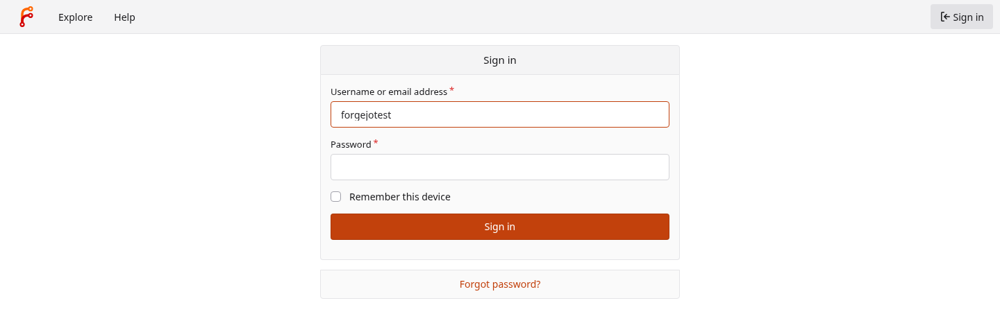
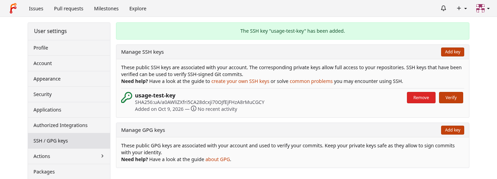
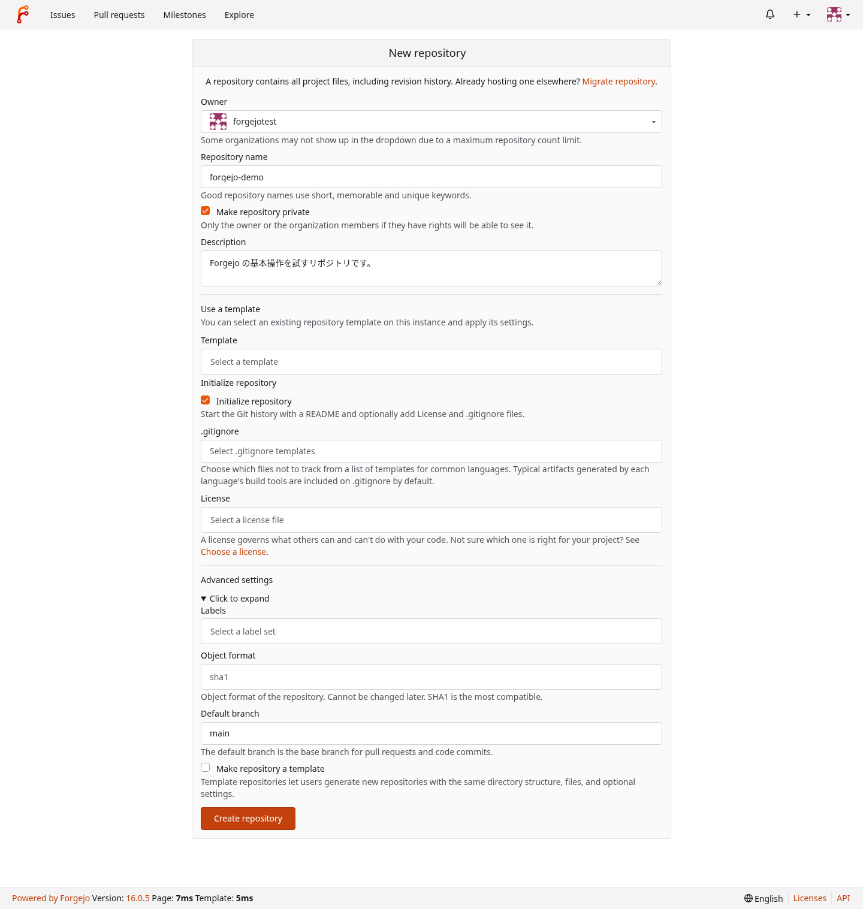
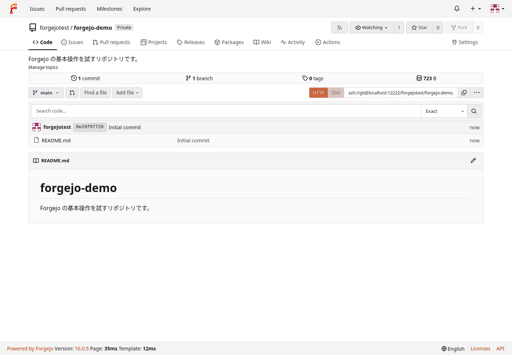
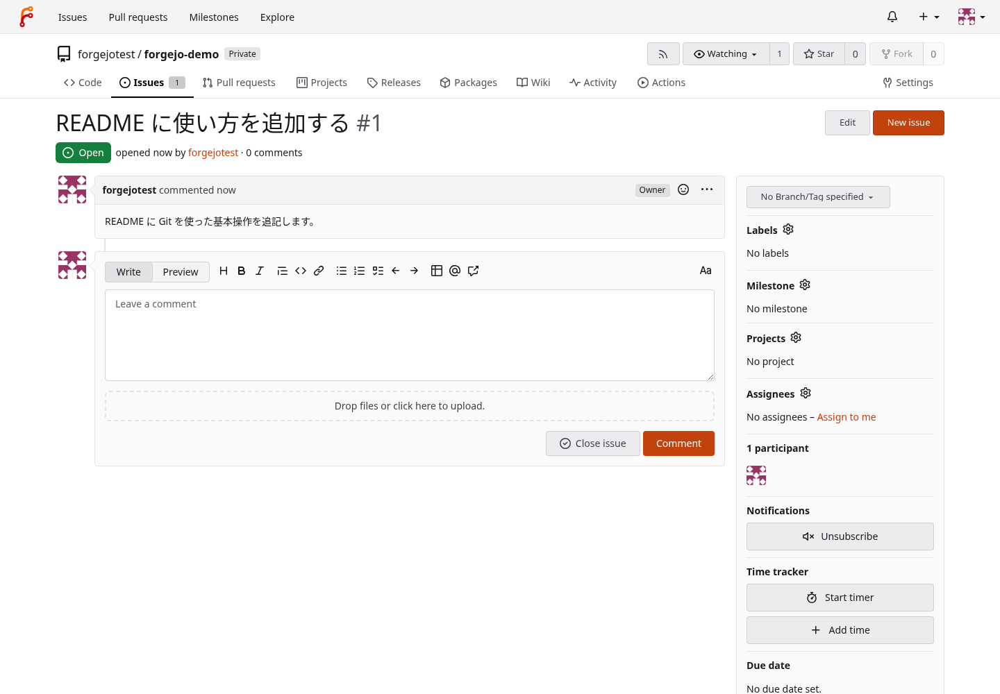
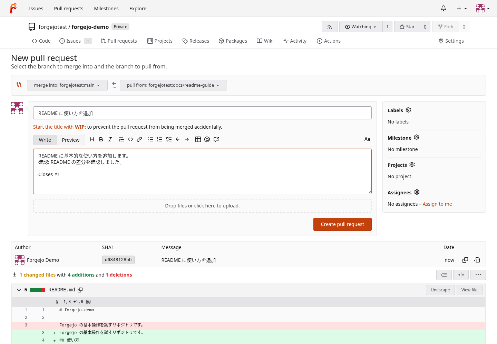
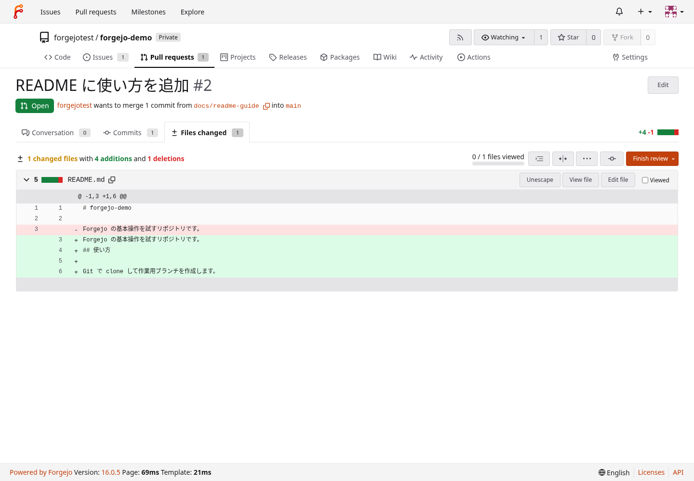
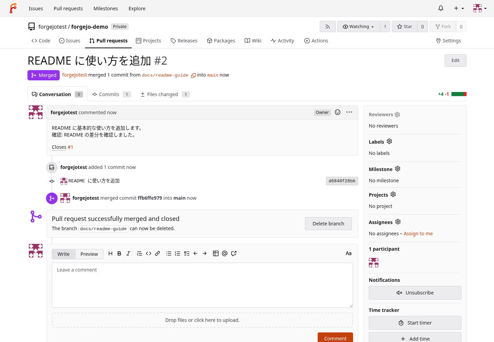

# Forgejo 構築手順（AlmaLinux 10 / rootless Podman + Quadlet / LAN・VPN 内で使う）

## 実施手順

> [!IMPORTANT]
> - **サーバーを動かす一般ユーザー自身の bash（デスクトップの端末か SSH）で実行する**。`sudo -i` や `sudo -iu` で切り替えたシェルは使わない
> - 先に [AlmaLinux 10 の初期設定の手順 3](almalinux-setup.md#実施手順)（NOPASSWD の sudo）、[Podman](podman.md)・[linger](linger.md) を通す。常時動かす PC は、初期設定の[画面オフ・画面ロック・自動サスペンドを止める任意節](almalinux-setup.md#画面オフ画面ロック自動サスペンドを止める任意)も通す
> - 別の PC からホストの SSH にログインでき、サーバーの IPv4 が固定されていることを前提にする。firewalld と SELinux は有効なまま使う
> - 手順 6・7・11・12・14〜16・18〜20 は別の PC やブラウザで行う。Git の確認に使う PC は、先に [Git](git.md) を通す
> - 手順 21 でサーバーを再起動する。ログインし直した後は、手順 1 の変数だけを貼り直す

- 上から順にコードブロックを貼る
- 貼った後は、反転表示の「確認」から後ろの出力を箇条書きで確かめる
- [検証記録](verification/forgejo.md)・[参考資料](reference/forgejo.md)・[ロールバック](extra/forgejo.md)
- 手順 2 で公式の最新安定版を調べて入れる。手順 24〜26 で、毎日最新の安定版へ自動で更新するタイマーを有効にする（[更新](#更新)）
- 手順の後: [使い方の基本](#使い方の基本)・[設定ファイル](#設定ファイル)・[バックアップ](#バックアップ)・[バックアップから復元する](#バックアップから復元する)・[更新](#更新)・[ロールバック](extra/forgejo.md#ロールバック)
- Web は HTTP、Git は SSH で使う。HTTP の内容は暗号化されない。VPN 経由で開く場合は VPN の区間が暗号化される
- 初期設定用の SSH トンネルは、LAN の待ち受けへ切り替えた後には使えない。インターネット向けのポート転送は設定しない

1. 変数を設定する（`SERVER_IP` と `LAN_SUBNET` は必ず値を入れる）。

   ```bash
   SERVER_IP=''                       # サーバーの待ち受け IPv4（例: 192.168.1.10）
   ```

   ```bash
   LAN_SUBNET=''                      # 許可する送信元 IPv4 の CIDR（例: 192.168.1.0/24）
   ```

   ```bash
   {
     FORGEJO_HTTP_PORT=3000            # ホスト側の Web ポート（1024〜65535）
     FORGEJO_SSH_PORT=2222             # ホスト側の Git 用 SSH ポート（1024〜65535）
     FW_ZONE=$(sudo firewall-cmd --get-default-zone)
     printf '\n\033[7m 確認 \033[0m\n'
     printf '待ち受け: %s\n許可する送信元: %s\nWeb: %s / SSH: %s\nfirewalld: %s\n' \
       "${SERVER_IP}" "${LAN_SUBNET}" "${FORGEJO_HTTP_PORT}" "${FORGEJO_SSH_PORT}" "${FW_ZONE}"
   }
   ```

   - ホストの SSH のポート 22 は変えない
   - `LAN_SUBNET` は、サーバーから見えるクライアントの送信元に合わせる。VPN の相手だけに許可するときは、その VPN の CIDR にする
   - 待ち受ける NIC が別の zone に属しているなら、任意変数のブロックの `FW_ZONE=` をその名前に変える
   - ポートを変えたら、別の PC で打つ手順 6・14・16 の番号も同じにする
   - 空のままなら先へ進まない

1. 値と前提を確かめ、公式の最新安定版の rootless イメージを取得する。

   ```bash
   unset FORGEJO_VERSION
   printf '\n\033[7m 確認 \033[0m\n'
   if [ -z "${SERVER_IP}" ] || [ -z "${LAN_SUBNET}" ] || [ -z "${FORGEJO_HTTP_PORT}" ] || [ -z "${FORGEJO_SSH_PORT}" ] || [ -z "${FW_ZONE}" ]; then
     echo '中断: 手順 1 の変数を設定する' >&2
   elif /usr/bin/python3 - "${SERVER_IP}" "${LAN_SUBNET}" "${FORGEJO_HTTP_PORT}" "${FORGEJO_SSH_PORT}" <<'PY'
   import ipaddress
   import json
   import subprocess
   import sys

   address = ipaddress.IPv4Address(sys.argv[1])
   network = ipaddress.IPv4Network(sys.argv[2], strict=True)
   ports = [int(value) for value in sys.argv[3:]]
   if address.is_loopback or address.is_unspecified or address.is_multicast:
       raise SystemExit('中断: SERVER_IP は LAN または VPN の待ち受け IPv4 にする')
   if network.prefixlen == 0:
       raise SystemExit('中断: LAN_SUBNET に全 IPv4 の許可は指定しない')
   if any(not 1024 <= port <= 65535 for port in ports) or ports[0] == ports[1]:
       raise SystemExit('中断: 2 つのポートは異なる 1024〜65535 の番号にする')
   links = json.loads(subprocess.check_output(['ip', '-j', '-4', 'addr', 'show']))
   if not any(item.get('local') == str(address) for link in links for item in link['addr_info']):
       raise SystemExit('中断: SERVER_IP がこのサーバーに付いていない')
   print('IPv4・CIDR・ポートの確認: OK')
   PY
   then
     if [ "$(podman info --format '{{.Host.Security.Rootless}}')" != true ]; then
       echo '中断: 自分のユーザーの rootless Podman を使う' >&2
     elif [ "$(loginctl show-user "$(id -u)" -p Linger --value)" != yes ]; then
       echo '中断: 先に linger を有効にする' >&2
     else
       sudo firewall-cmd --state &&
       sudo firewall-cmd --get-active-zones &&
       sudo firewall-cmd --zone="${FW_ZONE}" --list-all &&
       sudo firewall-cmd --permanent --zone="${FW_ZONE}" --list-all &&
       FORGEJO_VERSION=$(/usr/bin/python3 - <<'PY'
   import json
   import re
   import urllib.request


   def latest_version():
       url = 'https://codeberg.org/api/v1/repos/forgejo/forgejo/releases?draft=false&pre-release=false&limit=50'
       with urllib.request.urlopen(url, timeout=30) as response:
           releases = json.load(response)
       versions = []
       for release in releases:
           match = re.fullmatch(r'v(\d+)\.(\d+)\.(\d+)', release['tag_name'])
           if match and not release['draft'] and not release['prerelease']:
               versions.append(tuple(int(part) for part in match.groups()))
       return '.'.join(str(part) for part in max(versions))


   print(latest_version())
   PY
   ) &&
       printf '導入する版: %s\n' "${FORGEJO_VERSION}" &&
       podman pull "codeberg.org/forgejo/forgejo:${FORGEJO_VERSION}-rootless" &&
       podman run --rm --entrypoint /usr/local/bin/gitea "codeberg.org/forgejo/forgejo:${FORGEJO_VERSION}-rootless" --version
     fi
   else
     echo '中断: 手順 1 の値を直す' >&2
   fi
   ```

   - 値の確認が `OK` で、firewalld が `running`、`導入する版:` と同じ番号の Forgejo の版が表示されればよい
   - 調べられないときは `urllib.error.URLError` などを表示し、何も取得せずに止まる。サーバーから `codeberg.org` へ HTTPS で接続できるか確かめてから貼り直す
   - `--get-active-zones` で待ち受ける NIC の zone が `FW_ZONE` と異なっていたら、手順 1 の値を直す
   - zone の `target` が `ACCEPT`、zone が `trusted`、または Web・Git 用 SSH ポートへの広い許可があれば、公開前に管理者へ確認する
   - **`sudo podman` は使わない**
   - **手順 3 は、同じシェルに続けて貼る**

1. 既存の設定やデータが無いことを確かめ、localhost 用の Quadlet を置く。

   ```bash
   if [ -z "${FORGEJO_HTTP_PORT}" ] || [ -z "${FORGEJO_SSH_PORT}" ]; then
     echo '中断: 手順 1 の変数を設定する' >&2
   elif [[ ! ${FORGEJO_VERSION} =~ ^[0-9]+\.[0-9]+\.[0-9]+$ ]]; then
     echo '中断: 同じシェルで手順 2 を通す' >&2
   elif [ -e ~/.config/containers/systemd/forgejo.container ] || [ -L ~/.config/containers/systemd/forgejo.container ] ||
        [ -e ~/.config/containers/systemd/forgejo.container.d ] || [ -L ~/.config/containers/systemd/forgejo.container.d ] ||
        [ -e ~/.config/systemd/user/forgejo.service ] || [ -L ~/.config/systemd/user/forgejo.service ] ||
        [ -e ~/.config/systemd/user/forgejo.service.d ] || [ -L ~/.config/systemd/user/forgejo.service.d ] ||
        [ -e ~/.local/share/forgejo ] || [ -L ~/.local/share/forgejo ] || podman container exists forgejo ||
        systemctl --user cat forgejo.service >/dev/null 2>&1; then
     echo '中断: 既存の Forgejo の設定・コンテナ・データがあるので上書きしない' >&2
   else
     install -d -m 700 ~/.config/containers/systemd ~/.local/share/forgejo &&
     (umask 077; cat > ~/.config/containers/systemd/forgejo.container <<EOF
   # setup-notes: forgejo
   [Unit]
   Description=Forgejo

   [Container]
   Image=codeberg.org/forgejo/forgejo:${FORGEJO_VERSION}-rootless
   ContainerName=forgejo
   UserNS=keep-id:uid=1000,gid=1000
   User=1000
   Group=1000
   Volume=%h/.local/share/forgejo:/var/lib/gitea:Z
   PublishPort=127.0.0.1:${FORGEJO_HTTP_PORT}:3000
   PublishPort=127.0.0.1:${FORGEJO_SSH_PORT}:2222
   Environment=FORGEJO__database__DB_TYPE=sqlite3
   Environment=FORGEJO__database__PATH=/var/lib/gitea/data/forgejo.db
   Environment=FORGEJO__server__HTTP_ADDR=0.0.0.0
   Environment=FORGEJO__server__HTTP_PORT=3000
   Environment=FORGEJO__server__DOMAIN=localhost
   Environment=FORGEJO__server__ROOT_URL=http://localhost:${FORGEJO_HTTP_PORT}/
   Environment=FORGEJO__server__SSH_DOMAIN=localhost
   Environment=FORGEJO__server__SSH_PORT=${FORGEJO_SSH_PORT}
   Environment=FORGEJO__server__START_SSH_SERVER=true
   Environment=FORGEJO__server__SSH_LISTEN_PORT=2222
   Environment=FORGEJO__service__DISABLE_REGISTRATION=true
   Environment=FORGEJO__service__REQUIRE_SIGNIN_VIEW=true
   Environment=FORGEJO__openid__ENABLE_OPENID_SIGNIN=false
   Environment=FORGEJO__openid__ENABLE_OPENID_SIGNUP=false
   Environment=FORGEJO__security__REVERSE_PROXY_TRUSTED_PROXIES=127.0.0.1/32,::1/128

   [Service]
   Restart=on-failure
   TimeoutStartSec=300

   [Install]
   WantedBy=default.target
   EOF
     ) &&
     chmod 600 ~/.config/containers/systemd/forgejo.container
   fi
   ```

   - **中断したときは手順 4 へ進まない**。既存の構築を使うか、必要なデータを退避してからやり直す
   - `INSTALL_LOCK` と `AutoUpdate` は定義に追加しない

1. 定義を読み直し、localhost でサービスを起動する。

   ```bash
   printf '\n\033[7m 確認 \033[0m\n'
   systemctl --user daemon-reload &&
   systemctl --user start forgejo.service &&
   systemctl --user is-active forgejo.service &&
   systemctl --user is-enabled forgejo.service &&
   podman exec forgejo id
   ```

   - `active`・`generated` が出て、コンテナ内の UID・GID が 1000 ならよい
   - **`systemctl --user enable` は使わない**
   - 起動に失敗したら `journalctl --user -u forgejo.service -n 100 --no-pager` と `podman logs forgejo` を見る。SELinux の拒否は `sudo ausearch -m AVC -ts recent` で確かめ、SELinux を無効にしない

1. 初期設定のページと localhost の待ち受けを確かめる。

   ```bash
   if [ -z "${FORGEJO_HTTP_PORT}" ] || [ -z "${FORGEJO_SSH_PORT}" ]; then
     echo '中断: 手順 1 の変数を設定する' >&2
   else
     printf '\n\033[7m 確認 \033[0m\n'
     curl -fsS --retry 10 --retry-delay 1 --retry-all-errors -o /dev/null -w '%{http_code}\n' \
       "http://127.0.0.1:${FORGEJO_HTTP_PORT}/"
     podman port forgejo
     ss -ltn "( sport = :${FORGEJO_HTTP_PORT} or sport = :${FORGEJO_SSH_PORT} )"
   fi
   ```

   - 初期設定のページが HTTP 200 を返し、2 つの公開ポートが `127.0.0.1` に限定されていればよい

1. 別の PC で、初期設定用の SSH トンネルを開く。

   - クライアントの端末で `ssh -N -o ExitOnForwardFailure=yes -L 127.0.0.1:3000:127.0.0.1:3000 <OSユーザー>@<SERVER_IP>` を実行する。`<OSユーザー>` はサーバーを動かす一般ユーザー、`<SERVER_IP>` は手順 1 の IPv4 に置き換える
   - Web ポートを変えたら、`-L` の最初と最後の `3000` を両方ともその番号にする
   - クライアントのローカルポートが使用中なら、そのサービスを止めるか、同じ番号のポートが空いている別の PC で行う
   - トンネルの端末は開いたままにする

1. 別の PC のブラウザで初期設定を開き、管理者を作成する。

   - `http://localhost:3000/` を開く。Web ポートを変えたらその番号にする
   - 表示言語が違う場合は、画面下部の言語メニューで English を選ぶ
   - DB は SQLite3、DB のパスは `/var/lib/gitea/data/forgejo.db`、ドメインは `localhost`、ベース URL は `http://localhost:3000/`（ホストの Web ポートに合わせる）を確かめる
   - HTTP ポートはコンテナ内部の `3000`、SSH ポートは手順 1 のホスト側の番号にする。リポジトリとアプリケーションのデータの場所は自動で入った値を使う
   - 自己登録を無効にする項目を有効にし、「Administrator account settings」を開いてユーザー名・メールアドレス・パスワードを入力する
   - 「Install Forgejo」を押し、作った管理者でログインできることを確かめる
   - **次の手順は、管理者でログインできてから貼る**

1. 初期設定のロックと自己登録の無効化をサーバーで確かめる。

   ```bash
   printf '\n\033[7m 確認 \033[0m\n'
   if /usr/bin/python3 - <<'PY'
   import configparser
   from pathlib import Path

   data = Path.home() / '.local/share/forgejo'
   config = configparser.ConfigParser(interpolation=None)
   path = data / 'custom/conf/app.ini'
   if not path.is_file():
       raise SystemExit('中断: app.ini が見つからない')
   config.read_string('[DEFAULT]\n' + path.read_text())
   for section, key in [('security', 'INSTALL_LOCK'), ('service', 'DISABLE_REGISTRATION')]:
       if not config.getboolean(section, key, fallback=False):
           raise SystemExit(f'中断: {section}.{key} が true ではない')
       print(f'{section}.{key}=true')
   if not (data / 'data/forgejo.db').is_file():
       raise SystemExit('中断: SQLite の DB が見つからない')
   print('SQLite の DB: OK')
   PY
   then
     podman exec forgejo /usr/local/bin/gitea --config /var/lib/gitea/custom/conf/app.ini admin user list
   else
     echo '中断: 手順 7 の初期設定を完了する' >&2
   fi
   ```

   - ロックと自己登録無効が `true` で、ユーザーの一覧に作成した管理者があり、管理者の列が有効ならよい
   - **`app.ini` を `cat` しない**。トークンの署名鍵などの秘密が入る

1. 送信元と宛先を限定した、この手順専用の firewalld の規則を追加する。

   ```bash
   printf '\n\033[7m 確認 \033[0m\n'
   if [ -z "${SERVER_IP}" ] || [ -z "${LAN_SUBNET}" ] || [ -z "${FORGEJO_HTTP_PORT}" ] || [ -z "${FORGEJO_SSH_PORT}" ] || [ -z "${FW_ZONE}" ]; then
     echo '中断: 手順 1 の変数を設定する' >&2
   else
     FORGEJO_RULES=(
       "rule family=\"ipv4\" priority=\"100\" source address=\"${LAN_SUBNET}\" destination address=\"${SERVER_IP}\" port port=\"${FORGEJO_HTTP_PORT}\" protocol=\"tcp\" accept"
       "rule family=\"ipv4\" priority=\"100\" source address=\"${LAN_SUBNET}\" destination address=\"${SERVER_IP}\" port port=\"${FORGEJO_SSH_PORT}\" protocol=\"tcp\" accept"
     )
     FORGEJO_RULE_EXISTS=no
     for rule in "${FORGEJO_RULES[@]}"; do
       if sudo firewall-cmd --zone="${FW_ZONE}" --query-rich-rule="${rule}" >/dev/null ||
          sudo firewall-cmd --permanent --zone="${FW_ZONE}" --query-rich-rule="${rule}" >/dev/null; then
         FORGEJO_RULE_EXISTS=yes
       fi
     done
     if [ "${FORGEJO_RULE_EXISTS}" = yes ]; then
       echo '中断: 同じ規則が既にあるので、既存の構築と重ねない' >&2
     else
       for rule in "${FORGEJO_RULES[@]}"; do
         sudo firewall-cmd --permanent --zone="${FW_ZONE}" --add-rich-rule="${rule}" &&
         sudo firewall-cmd --zone="${FW_ZONE}" --add-rich-rule="${rule}" || break
       done
       sudo firewall-cmd --permanent --zone="${FW_ZONE}" --list-rich-rules
       sudo firewall-cmd --zone="${FW_ZONE}" --list-rich-rules
     fi
   fi
   ```

   - runtime と permanent に、指定した送信元・宛先・Web と Git 用 SSH の 2 規則があればよい
   - **既存の zone が `trusted`・`ACCEPT`、または同じポートへの広い許可があると、この規則だけでは送信元を絞れない**。公開前に管理者へ既存の許可を確認する
   - **中断や失敗が出たら手順 10 へ進まない**。追加できた規則を外す場合は[ロールバック](extra/forgejo.md#ロールバック)の手順 3 を使う

1. 初期設定済みの Quadlet を LAN 用に変え、サービスを再起動する。

   ```bash
   printf '\n\033[7m 確認 \033[0m\n'
   if [ -z "${SERVER_IP}" ] || [ -z "${FORGEJO_HTTP_PORT}" ] || [ -z "${FORGEJO_SSH_PORT}" ]; then
     echo '中断: 手順 1 の変数を設定する' >&2
   elif /usr/bin/python3 - "${SERVER_IP}" "${FORGEJO_HTTP_PORT}" "${FORGEJO_SSH_PORT}" <<'PY'
   import configparser
   import ipaddress
   import os
   from pathlib import Path
   import sys

   address = str(ipaddress.IPv4Address(sys.argv[1]))
   http_port, ssh_port = sys.argv[2:]
   config = configparser.ConfigParser(interpolation=None)
   config.read_string('[DEFAULT]\n' + (Path.home() / '.local/share/forgejo/custom/conf/app.ini').read_text())
   if not config.getboolean('security', 'INSTALL_LOCK', fallback=False):
       raise SystemExit('中断: 初期設定が終わっていない')
   if not config.getboolean('service', 'DISABLE_REGISTRATION', fallback=False):
       raise SystemExit('中断: 自己登録が無効ではない')
   path = Path.home() / '.config/containers/systemd/forgejo.container'
   text = path.read_text()
   if not text.startswith('# setup-notes: forgejo\n'):
       raise SystemExit('中断: この手順が作った Quadlet ではない')
   replacements = {
       f'PublishPort=127.0.0.1:{http_port}:3000': f'PublishPort={address}:{http_port}:3000',
       f'PublishPort=127.0.0.1:{ssh_port}:2222': f'PublishPort={address}:{ssh_port}:2222',
       'Environment=FORGEJO__server__DOMAIN=localhost': f'Environment=FORGEJO__server__DOMAIN={address}',
       f'Environment=FORGEJO__server__ROOT_URL=http://localhost:{http_port}/': f'Environment=FORGEJO__server__ROOT_URL=http://{address}:{http_port}/',
       'Environment=FORGEJO__server__SSH_DOMAIN=localhost': f'Environment=FORGEJO__server__SSH_DOMAIN={address}',
   }
   lines = text.splitlines()
   for old, new in replacements.items():
       if lines.count(old) != 1:
           raise SystemExit(f'中断: 変更前の行が一致しない: {old}')
       lines[lines.index(old)] = new
   temporary = path.with_suffix('.container.tmp')
   with temporary.open('x') as stream:
       stream.write('\n'.join(lines) + '\n')
   temporary.chmod(0o600)
   os.replace(temporary, path)
   print('LAN 用の待ち受けと URL: 設定済み')
   PY
   then
     systemctl --user daemon-reload &&
     systemctl --user restart forgejo.service &&
     systemctl --user is-active forgejo.service &&
     podman port forgejo
   else
     echo '中断: 初期設定または Quadlet の内容を確認する' >&2
   fi
   ```

   - `active` が出て、Web と Git 用 SSH が `SERVER_IP` にだけ公開されていればよい
   - `0.0.0.0` や `[::]` には公開しない。ほかの NIC や IPv6 から使う設定は含めない

1. 別の PC でトンネルを閉じ、LAN の URL で管理者のログインを確かめる。

   - 手順 6 の端末で `Ctrl+C` を押してトンネルを閉じる
   - 許可した LAN または VPN の PC で `http://<SERVER_IP>:3000/` を開き、管理者でログインする。Web ポートを変えたらその番号にする
   - 登録のボタンが無いことと、`http://<SERVER_IP>:3000/user/sign_up` から通常の登録も OpenID の登録もできないことを確かめる
   - サーバーへ届く別の許可外の送信元からは、Web と Git 用 SSH の両方へ接続できないことを確かめる。ルーターのポート転送は作らない
   - 接続できないときは、サーバーの IP・FW_ZONE・クライアントの送信元と VPN の経路を確かめる

1. 別の PC のブラウザで、Git に使う公開鍵を Forgejo に登録する。

   - 管理者の設定から「SSH / GPG keys」を開き、Git を使う PC の SSH 公開鍵（`.pub`）を追加する
   - 公開鍵を持っていなければ、その PC で `ssh-keygen -t ed25519` を実行し、保存先とパスフレーズに答える。既存の鍵には上書きしない
   - **秘密鍵は登録しない**。公開鍵の末尾までを貼り、登録した鍵が一覧に出ることを確かめる

1. サーバーで、Git 用 SSH のホスト鍵の指紋を表示する。

   ```bash
   printf '\n\033[7m 確認 \033[0m\n'
   for public_key in ~/.local/share/forgejo/ssh/*.pub; do
     if [ -f "${public_key}" ]; then
       ssh-keygen -lf "${public_key}"
     fi
   done
   ```

   - `SHA256:` で始まる指紋を控え、次の手順で表示されるホスト鍵と照合する
   - 指紋が 1 つも出ないときは、`podman logs forgejo` で Git 用 SSH が起動しているか確かめる
   - ホストの OpenSSH（ポート 22）の指紋とは別になる

1. 別の PC で、ホスト鍵を照合して Git 用 SSH へ接続する。

   - `ssh -T -p 2222 git@<SERVER_IP>` を実行する。`<SERVER_IP>` は手順 1 の IPv4、`2222` はホスト側の Git 用 SSH ポートに置き換える
   - 初回に表示される指紋を手順 13 と照合し、一致したときだけ `yes` と答える
   - 公開鍵で認証され、Forgejo のユーザー名を含む案内が表示されればよい。シェルは開かない
   - パスワードを聞かれるときは、ホストのポート 22 へ接続していないか、登録した公開鍵に対応する秘密鍵をクライアントが使っているか確かめる
   - `REMOTE HOST IDENTIFICATION HAS CHANGED` が出たら、鍵を消して進めず、サーバーの指紋と再構築の有無を照合する

1. 別の PC のブラウザで、確認用のプライベートなリポジトリを作成する。

   - 新しいリポジトリを開き、名前を `forgejo-test` にする
   - プライベートを選び、README で初期化して作成する
   - Git 用 SSH の clone URL が `SERVER_IP` とホスト側の Git 用 SSH ポートを指していることを確かめる

1. 別の PC で clone と push を行い、ブラウザでコミットを確かめる。

   - 空の作業場所で `git clone ssh://git@<SERVER_IP>:2222/<Forgejoユーザー>/forgejo-test.git` を実行する。URL は手順 15 の画面からコピーしてもよい
   - `cd forgejo-test`、`printf 'Forgejo の接続確認\n' > connection-check.txt`、`git add connection-check.txt`、`git commit -m 'Forgejo の接続確認'`、`git push` の順に実行する
   - ブラウザで `connection-check.txt` と作成したコミットが見えればよい
   - `forgejo-test` が既に作業場所にあるときは、別の空の場所を使い、既存の作業を上書きしない
   - **次の手順は、clone と push の両方を確かめてから貼る**

1. サーバーでサービスを再起動し、設定とデータが残ることを確かめる。

   ```bash
   printf '\n\033[7m 確認 \033[0m\n'
   systemctl --user restart forgejo.service &&
   systemctl --user is-active forgejo.service &&
   podman port forgejo
   ```

   - `active` と LAN 向けのポートが出ればよい
   - 起動し直した直後は、Web と Git 用 SSH の待ち受けが始まるまで数秒待つ

1. 別の PC で、再起動後のログインと Git の接続を確かめる。

   - ブラウザで LAN の URL を開き、作成した管理者でログインする
   - `forgejo-test` と手順 16 のコミットが残ることを確かめる
   - clone した作業場所で `git fetch` を実行する。再起動のたびに SSH のホスト鍵の確認を求められないことを確かめる

1. サーバーを動かすユーザーをログアウトし、別の PC から接続する。

   - サーバーの同じユーザーの端末・デスクトップ・SSH セッションをすべて閉じる
   - 別の PC から、Web のログインと `git fetch` が引き続き使えることを確かめる
   - サーバーが眠ると接続できなくなる。自動サスペンドを止める前提を確かめる

1. サーバーを動かすユーザーで、ホストの SSH にログインし直す。

   - ポート 22 の通常の SSH で、サーバーを動かす OS のユーザーにログインする。`git` や Forgejo の管理者名ではログインしない
   - 手順 1 の変数を貼り直す
   - **次の手順は、再起動してよい時間に貼る**

1. サーバーを再起動する。

   ```bash
   sudo systemctl reboot
   ```

   - Web と Git の接続がいったん切れる
   - **次の手順は、再起動後に同じ OS のユーザーでログインし直し、手順 1 の変数を貼り直してから貼る**

1. 再起動後の自動起動と待ち受けを確かめる。

   ```bash
   {
     if [ -z "${FW_ZONE}" ]; then
       echo '中断: 手順 1 の変数を貼り直す' >&2
     else
       printf '\n\033[7m 確認 \033[0m\n'
       systemctl --user is-active forgejo.service
       systemctl --user is-enabled forgejo.service
       systemctl --user show forgejo.service -p ActiveEnterTimestamp
       loginctl show-session "${XDG_SESSION_ID}" -p Timestamp
       loginctl show-user "$(id -u)" -p Linger
       podman port forgejo
       sudo firewall-cmd --zone="${FW_ZONE}" --list-rich-rules
     fi
   }
   ```

   - `active`・`generated`・`Linger=yes` が出て、サービスが起動した時刻がログインした時刻より前ならよい
   - LAN 向けの 2 つのポートと、手順 9 の 2 規則が残っていればよい

1. 別の PC で、OS の再起動後の Web と Git を確かめる。

   - LAN または VPN の URL で管理者がログインでき、リポジトリとコミットが残っていることを確かめる
   - 作業場所で `git fetch` を実行する。許可外の送信元からは、Web と Git 用 SSH の両方へ接続できないことも確かめる
   - **次の手順は、Web と Git を確かめてから貼る**

1. 自動更新のプログラムを置く。

   ```bash
   if [ ! -f ~/.config/containers/systemd/forgejo.container ] ||
      ! grep -qx '# setup-notes: forgejo' ~/.config/containers/systemd/forgejo.container; then
     echo '中断: この手順で作った Quadlet が無い' >&2
   else
     printf '\n\033[7m 確認 \033[0m\n'
     mkdir -p ~/.local/bin &&
     (umask 077; cat > ~/.local/bin/forgejo-auto-update <<'EOF'
   #!/usr/bin/python3 -I
   # setup-notes: forgejo
   # Forgejo を公式の最新安定版へ自動で更新する（docs/forgejo.md の手順 24〜26）。
   # 新しい版があれば、停止バックアップ → イメージの行の更新 → 起動 → 確認を行う。
   # 確認に失敗したら直前のバックアップへ戻し、その版を保留する。
   # 終了コード: 0 最新・更新済み・停止中で何もしない / 1 変更せずに中断・保留中 / 2 戻して保留した / 3 戻せなかった
   import fcntl
   import http.client
   import json
   import os
   from pathlib import Path
   import re
   import shutil
   import socket
   import subprocess
   import sys
   import tempfile
   import time
   import urllib.request

   HOME = Path.home()
   QUADLET = HOME / '.config/containers/systemd/forgejo.container'
   DROPIN = HOME / '.config/containers/systemd/forgejo.container.d'
   DATA = HOME / '.local/share/forgejo'
   BACKUPS = HOME / '.local/state/forgejo-backups'
   STATE = HOME / '.local/state/forgejo-auto-update'
   SKIP = STATE / 'skip-version'
   IMAGE = 'codeberg.org/forgejo/forgejo:{}-rootless'
   IMAGE_LINE = re.compile(r'^Image=codeberg\.org/forgejo/forgejo:(\d+\.\d+\.\d+)-rootless$', re.M)
   KEEP_BACKUPS = 3


   class Failure(Exception):
       pass


   def latest_version():
       url = 'https://codeberg.org/api/v1/repos/forgejo/forgejo/releases?draft=false&pre-release=false&limit=50'
       with urllib.request.urlopen(url, timeout=30) as response:
           releases = json.load(response)
       versions = []
       for release in releases:
           match = re.fullmatch(r'v(\d+)\.(\d+)\.(\d+)', release['tag_name'])
           if match and not release['draft'] and not release['prerelease']:
               versions.append(tuple(int(part) for part in match.groups()))
       return '.'.join(str(part) for part in max(versions))


   def parse(version):
       return tuple(int(part) for part in version.split('.'))


   def systemctl(*args, check=True, timeout=600):
       return subprocess.run(['systemctl', '--user', *args], check=check, timeout=timeout,
                             capture_output=True, text=True).stdout.strip()


   def unit_state():
       return systemctl('show', '-p', 'ActiveState', '--value', 'forgejo.service')


   def container_exists():
       return subprocess.run(['podman', 'container', 'exists', 'forgejo'], timeout=60).returncode == 0


   def binary_version(output):
       match = re.search(r'version (\d+\.\d+\.\d+)', output)
       return match.group(1) if match else ''


   def endpoints(text):
       web = re.findall(r'^PublishPort=([0-9.]+):(\d+):3000$', text, re.M)
       ssh = re.findall(r'^PublishPort=([0-9.]+):(\d+):2222$', text, re.M)
       if len(web) != 1 or len(ssh) != 1:
           raise Failure('Quadlet の Web と Git 用 SSH の PublishPort が 1 行ずつではない')
       return web[0], ssh[0]


   def write_quadlet(text):
       descriptor, temporary = tempfile.mkstemp(dir=QUADLET.parent, prefix='.forgejo.', suffix='.tmp')
       with os.fdopen(descriptor, 'w') as stream:
           stream.write(text)
           stream.flush()
           os.fsync(stream.fileno())
       os.replace(temporary, QUADLET)


   def stop():
       systemctl('stop', 'forgejo.service')
       for _ in range(60):
           if unit_state() in ('inactive', 'failed') and not container_exists():
               return
           time.sleep(1)
       raise Failure('forgejo.service とコンテナが止まらない')


   def start():
       systemctl('daemon-reload')
       systemctl('reset-failed', 'forgejo.service', check=False)
       systemctl('start', 'forgejo.service')


   def check(text, version):
       (web_host, web_port), (ssh_host, ssh_port) = endpoints(text)
       opener = urllib.request.build_opener(urllib.request.ProxyHandler({}))
       deadline = time.monotonic() + 900
       while True:
           state = unit_state()
           if state == 'failed':
               raise Failure('forgejo.service が failed になった')
           if state == 'active':
               try:
                   with opener.open(f'http://{web_host}:{web_port}/api/healthz', timeout=10) as response:
                       status = json.load(response).get('status')
                   with socket.create_connection((ssh_host, int(ssh_port)), timeout=10) as connection:
                       banner = connection.recv(64)
                   if status == 'pass' and banner.startswith(b'SSH-2.0-'):
                       break
               except (OSError, http.client.HTTPException, ValueError):
                   pass
           if time.monotonic() > deadline:
               raise Failure('15 分待っても、Web の /api/healthz と Git 用 SSH が応答しない')
           time.sleep(5)
       output = subprocess.run(['podman', 'exec', 'forgejo', '/usr/local/bin/gitea', '--version'],
                               check=True, timeout=60, capture_output=True, text=True).stdout
       if binary_version(output) != version:
           raise Failure(f'動いている版が {version} ではない: {output.strip()}')


   def doctor():
       for attempt in range(3):
           if attempt:
               time.sleep(30)
           result = subprocess.run(['podman', 'exec', 'forgejo', '/usr/local/bin/gitea',
                                    '--config', '/var/lib/gitea/custom/conf/app.ini', 'doctor', 'check', '--all'],
                                   timeout=600, capture_output=True, text=True)
           lines = (result.stdout + result.stderr).strip().splitlines()
           if result.returncode == 0:
               print('doctor check --all: ' + (lines[-1] if lines else 'OK'))
               return
           print('\n'.join(['doctor check --all が失敗した:', *lines[-30:]]))
       raise Failure('doctor check --all が 3 回とも失敗した')


   def backup(version):
       name = 'forgejo-auto-{}-{}.tar.gz'.format(time.strftime('%Y%m%dT%H%M%SZ', time.gmtime()), version)
       temporary = BACKUPS / f'.{name}.tmp'
       subprocess.run(['tar', '--create', '--gzip', f'--file={temporary}', f'--directory={HOME}',
                       '.local/share/forgejo', '.config/containers/systemd/forgejo.container'], check=True)
       os.chmod(temporary, 0o600)
       with temporary.open('rb') as stream:
           os.fsync(stream.fileno())
       os.rename(temporary, BACKUPS / name)
       directory = os.open(BACKUPS, os.O_RDONLY)
       try:
           os.fsync(directory)
       finally:
           os.close(directory)
       return BACKUPS / name


   def rollback(archive, old_text, old_version):
       work = Path(tempfile.mkdtemp(prefix='rollback-', dir=BACKUPS))
       subprocess.run(['tar', '--extract', '--gzip', '--preserve-permissions', '--no-same-owner',
                       f'--file={archive}', f'--directory={work}',
                       '.local/share/forgejo', '.config/containers/systemd/forgejo.container'], check=True)
       stop()
       failed = BACKUPS / 'failed-update-{}'.format(time.strftime('%Y%m%dT%H%M%SZ', time.gmtime()))
       failed.mkdir(mode=0o700)
       os.rename(DATA, failed / 'data')
       shutil.copy2(QUADLET, failed / 'forgejo.container')
       os.rename(work / '.local/share/forgejo', DATA)
       os.chmod(DATA, 0o700)
       write_quadlet(old_text)
       start()
       check(old_text, old_version)
       shutil.rmtree(work)
       print(f'更新に失敗したデータと定義の退避: {failed}')


   def prune(versions):
       archives = sorted(BACKUPS.glob('forgejo-auto-*.tar.gz'))
       for archive in archives[:-KEEP_BACKUPS]:
           archive.unlink()
           print(f'古い自動更新のバックアップを削除: {archive}')
       output = subprocess.run(['podman', 'images', '--format', '{{.Repository}}:{{.Tag}}', 'codeberg.org/forgejo/forgejo'],
                               timeout=60, capture_output=True, text=True).stdout
       for reference in output.split():
           match = re.fullmatch(r'codeberg\.org/forgejo/forgejo:(\d+\.\d+\.\d+)-rootless', reference)
           if match and match.group(1) not in versions:
               subprocess.run(['podman', 'rmi', reference], timeout=300, capture_output=True)


   def main():
       sys.stdout.reconfigure(line_buffering=True)
       if os.geteuid() == 0:
           print('中断: root では動かさない。Forgejo を動かす一般ユーザーで実行する')
           return 1
       os.umask(0o077)
       STATE.mkdir(mode=0o700, parents=True, exist_ok=True)
       BACKUPS.mkdir(mode=0o700, parents=True, exist_ok=True)
       os.chmod(BACKUPS, 0o700)
       lock = (STATE / 'lock').open('w')
       try:
           fcntl.flock(lock, fcntl.LOCK_EX | fcntl.LOCK_NB)
       except BlockingIOError:
           print('中断: 別の自動更新が動いている')
           return 1
       for stale in [*QUADLET.parent.glob('.forgejo.*.tmp'), *BACKUPS.glob('.forgejo-auto-*.tmp')]:
           stale.unlink()

       if not QUADLET.is_file():
           print(f'中断: {QUADLET} が無い')
           return 1
       text = QUADLET.read_text()
       images = IMAGE_LINE.findall(text)
       if not text.startswith('# setup-notes: forgejo\n') or len(images) != 1:
           print('中断: この手順が作った Quadlet ではないか、固定したイメージの行が 1 行ではない')
           return 1
       if DROPIN.exists() and any(re.search(r'^Image=', path.read_text(), re.M) for path in DROPIN.glob('*.conf')):
           print(f'中断: {DROPIN} にイメージの指定がある')
           return 1
       try:
           endpoints(text)
       except Failure as error:
           print(f'中断: {error}')
           return 1
       current = images[0]

       try:
           latest = latest_version()
       except (OSError, ValueError, KeyError, http.client.HTTPException) as error:
           print(f'中断: 公式の最新安定版を調べられない: {error}')
           return 1
       hold = SKIP.read_text().strip() if SKIP.exists() else ''
       if hold and not re.fullmatch(r'\d+\.\d+\.\d+', hold):
           print(f'中断: {SKIP} の内容が x.y.z ではない')
           return 1
       if hold and parse(hold) <= parse(current):
           SKIP.unlink()
           hold = ''
       if parse(latest) <= parse(current):
           print(f'最新版 {current} を使用中')
           return 0
       if latest == hold:
           print(f'保留中: {latest} へは更新しない（{current} を使用中）。{SKIP} を消すと、次の実行で試し直す')
           return 1
       state = unit_state()
       if state == 'inactive':
           print(f'forgejo.service が止まっているので更新しない（{current} → {latest} は次の実行で行う）')
           return 0
       if state != 'active':
           print(f'中断: forgejo.service が {state}')
           return 1

       image = IMAGE.format(latest)
       try:
           subprocess.run(['podman', 'pull', '--quiet', image], check=True, timeout=1800, stdout=subprocess.DEVNULL)
           output = subprocess.run(['podman', 'run', '--rm', '--network=none', '--entrypoint', '/usr/local/bin/gitea',
                                    image, '--version'], check=True, timeout=300, capture_output=True, text=True).stdout
       except subprocess.SubprocessError as error:
           print(f'中断: {image} を取得・実行できない: {error}')
           return 1
       if binary_version(output) != latest:
           print(f'中断: {image} の版が {latest} ではない: {output.strip()}')
           return 1
       if DATA.stat().st_dev != BACKUPS.stat().st_dev:
           print(f'中断: {DATA} と {BACKUPS} が同じファイルシステムに無い')
           return 1
       size = sum(path.lstat().st_size for path in DATA.rglob('*'))
       if shutil.disk_usage(BACKUPS).free < size * 2 + 2**30:
           print(f'中断: {BACKUPS} の空きが足りない（データの 2 倍と 1 GiB が要る）')
           return 1
       if unit_state() != 'active':
           print('中断: forgejo.service が動いていない')
           return 1

       print(f'更新を始める: {current} → {latest}')
       try:
           stop()
           archive = backup(current)
       except (Failure, subprocess.SubprocessError, OSError) as error:
           print(f'中断: 停止またはバックアップに失敗した: {error}')
           start()
           return 1
       print(f'バックアップ: {archive}')
       new_text = IMAGE_LINE.sub(f'Image={image}', text, count=1)
       try:
           write_quadlet(new_text)
           start()
           check(new_text, latest)
           doctor()
       except (Failure, subprocess.SubprocessError, OSError) as error:
           print(f'更新に失敗した: {error}')
           SKIP.write_text(latest + '\n')
           try:
               rollback(archive, text, current)
           except (Failure, subprocess.SubprocessError, OSError) as error:
               print(f'戻せなかった: {error}。バックアップから復元する: {archive}')
               return 3
           print(f'{current} に戻し、{latest} を保留した')
           return 2
       SKIP.unlink(missing_ok=True)
       prune({current, latest})
       print(f'更新: {current} → {latest}')
       return 0


   if __name__ == '__main__':
       sys.exit(main())
   EOF
     ) &&
     chmod 700 ~/.local/bin/forgejo-auto-update &&
     ls -l ~/.local/bin/forgejo-auto-update
   fi
   ```

   - `-rwx------` の `~/.local/bin/forgejo-auto-update` が表示されればよい

1. 自動更新のサービスとタイマーを置き、読み込ませる。

   ```bash
   printf '\n\033[7m 確認 \033[0m\n'
   mkdir -p ~/.config/systemd/user
   cat > ~/.config/systemd/user/forgejo-auto-update.service <<'EOF'
   [Unit]
   Description=Update Forgejo to the latest stable release

   [Service]
   Type=oneshot
   Environment=PATH=/usr/bin
   TimeoutStartSec=2h
   ExecStart=%h/.local/bin/forgejo-auto-update
   EOF
   cat > ~/.config/systemd/user/forgejo-auto-update.timer <<'EOF'
   [Unit]
   Description=Update Forgejo to the latest stable release daily

   [Timer]
   OnCalendar=*-*-* 04:00
   RandomizedDelaySec=30min

   [Install]
   WantedBy=timers.target
   EOF
   systemctl --user daemon-reload
   ```

   - 何も表示されなければよい

1. タイマーを有効にし、自動更新を 1 回動かして確かめる。

   ```bash
   systemctl --user enable --now forgejo-auto-update.timer
   printf '\n\033[7m 確認 \033[0m\n'
   systemctl --user start forgejo-auto-update.service
   systemctl --user show -p Result -p ExecMainStatus forgejo-auto-update.service
   journalctl --user -u forgejo-auto-update.service -t forgejo-auto-update -n 20 --no-pager
   systemctl --user list-timers forgejo-auto-update.timer --no-pager
   podman exec forgejo /usr/local/bin/gitea --version
   ```

   - `start` は、プログラムが終わるまで戻らない。新しい版があればその場で更新するので数分かかり、その間は Web と Git が止まる
   - `Result=success`・`ExecMainStatus=0` で、journal の最後に `最新版 <版> を使用中` か `更新: <旧版> → <新版>` が出ればよい
   - `list-timers` の `NEXT` に、次の 4 時台の時刻が出る。最後の行の版は、journal の版と同じになる
   - 失敗すると、`start` が `Job for forgejo-auto-update.service failed` を出す。journal の最後の行と、[更新](#更新)のリードの終了コードを見る
   - `更新:` が出たときは、[更新](#更新)の手順 3 で別の PC から確かめる

---

## 使い方の基本

- 構築が済んだ Forgejo を、許可された LAN または VPN の PC から使う。端末の操作はその PC の bash（Windows は Git Bash）で行う。先に [Git](git.md) で名前・メールアドレスを設定する
- 初回はログイン・SSH 公開鍵の登録・リポジトリの作成・clone を行う。普段は Issue → 作業ブランチ → commit / push → Pull Request → マージ → main の更新を繰り返す
- Issue は作業内容と完了条件を共有する場所、Pull Request はブランチの変更を確認して main に取り込むための画面
- この節では、新しいプライベートな `forgejo-demo` で操作を練習する。同名のリポジトリや作業ディレクトリが既にあるときは、上書きせず別の名前で作る
- 画面は試験用コンテナの Forgejo 16.0.5 の英語 UI。自動更新で新しい版になると、表示が変わることがある。画面内のユーザー・接続先・ポートは試験用で、接続には自分のサーバーの URL を使う

1. 利用する PC のブラウザで、Forgejo にログインする。

   - `http://<SERVER_IP>:3000/` を開く。表示言語が違う場合は、画面下部の言語メニューで English を選ぶ。Web ポートを変更した場合はその番号を使う
   - Forgejo のユーザー名とパスワードを入力して「Sign in」を押す
   - アカウントが無いときは管理者に作成を依頼する
   - ログイン後に自分のダッシュボードが開けばよい
   - 

1. ブラウザで、自分のアカウントに SSH 公開鍵を登録する。

   - 右上のアカウントメニューから「Settings」を開き、「SSH / GPG keys」の「Add key」で公開鍵を登録する。名前は利用する PC を識別できるものにする
   - [実施手順の手順 12](#実施手順)で、同じ Forgejo アカウントに同じ PC の鍵を登録済みなら、この節の手順 2 は飛ばす
   - 公開鍵が無ければ、その PC で `ssh-keygen -t ed25519` を実行し、保存先とパスフレーズに答える。既存の鍵へ上書きしない
   - `.pub` の内容を末尾まで貼る。秘密鍵は登録しない
   - 登録した鍵の名前と指紋が一覧に出ればよい
   - 

1. 利用する PC の端末で、Git 用 SSH の接続先を確かめる。

   - 管理者から、[実施手順の手順 13](#実施手順)で表示したサーバーのホスト鍵の指紋を受け取る
   - [実施手順の手順 14](#実施手順)の初回接続時に表示される指紋と照合し、一致したときだけ接続を許可する。同じサーバーへ照合済みなら、この節の手順 3 は飛ばす
   - 接続先は `git@<SERVER_IP>` と Git 用 SSH ポート（既定は 2222）
   - 自分の Forgejo のユーザー名を含む認証成功の案内が出ればよい。シェルは開かない

1. ブラウザで、新しいプライベートなリポジトリを作る。

   - 右上の `+` から「New repository」を開き、所有者を自分、名前を `forgejo-demo` にする
   - 「Make repository private」と「Initialize repository」を選び、README で初期化する。「Advanced settings」の「Default branch」は `main` にする
   - 「Create repository」を押す
   - 作成後に `README.md` と `main` が表示されればよい
   - 

1. 利用する PC の端末で、リポジトリを clone する。

   - リポジトリ画面で SSH を選び、clone URL をコピーする
   - 空の作業場所で `git clone ssh://git@<SERVER_IP>:2222/<Forgejoユーザー>/forgejo-demo.git` を実行する。URL は画面でコピーしたものに置き換える
   - 別のリポジトリ名で作った場合は、clone URL と `cd forgejo-demo` の名前も合わせる
   - `cd forgejo-demo`、`git status` の順に実行し、ブランチが `main` で未コミットの変更が無いことを確かめる
   - 初回の指紋がこの節の手順 3 で確認したものと違うときは、接続を中止して管理者に確認する
   - 

1. ブラウザで、作業内容を Issue に書く。

   - リポジトリの「Issues」で「New issue」を開く
   - タイトルを「README に使い方を追加する」にし、本文へ追加したい内容と完了条件を書く
   - 「Create issue」を押し、作成後の Issue 番号を控える。次の Pull Request でこの番号を使う
   - 

1. 利用する PC の端末で、main を更新して作業ブランチを作る。

   ```bash
   git switch main &&
   git pull --ff-only &&
   git switch -c docs/readme-guide
   ```

   - この節の手順 5 で clone した `forgejo-demo` の中で実行する。未コミットの変更がある場合は、先にその作業を保存する
   - `docs/readme-guide` が既にある場合は新しい名前を使い、以後の push と Pull Request の比較元も同じ名前にする
   - `--ff-only` が失敗したときは先へ進まず、ローカルとサーバーの main の差分を確認する

1. 利用する PC の端末で、README に使い方を追加して差分を見る。

   ```bash
   printf '\n\033[7m 確認 \033[0m\n'
   printf '\n## 使い方\n\nGit で clone して作業用ブランチを作成します。\n' >> README.md &&
   git diff -- README.md
   ```

   - `README.md` に、この節で追加した見出しと説明だけが増えていればよい
   - このブロックは練習用に 1 回だけ実行する。普段の作業ではエディタで必要なファイルを編集する

1. 利用する PC の端末で、変更を commit して作業ブランチを push する。

   ```bash
   git add README.md &&
   git commit -m 'README に使い方を追加' &&
   git push --set-upstream origin docs/readme-guide
   ```

   - `main` へ直接 push せず、作業ブランチをサーバーへ送る
   - push が成功した後、ブラウザのブランチ一覧に `docs/readme-guide` が出ればよい
   - 認証で失敗したときは、登録した公開鍵・対応する秘密鍵・clone URL の SSH ポートを確かめる

1. ブラウザで、main に取り込む Pull Request を作る。

   - リポジトリの「Pull requests」で「New pull request」を開く
   - 「merge into」を `main`、「pull from」を `docs/readme-guide` にする。向きを逆にしない
   - タイトルを「README に使い方を追加」にし、本文に変更の目的・内容・確認結果を書く
   - 本文に `Closes #1` を書くと、main へのマージ時に Issue を閉じる。`#1` は、この節の手順 6 で控えた実際の番号に置き換える
   - 「Create pull request」を押し、作成後の画面に main と作業ブランチの名前が表示されればよい
   - 

1. ブラウザで、Pull Request の変更ファイルと差分を確認する。

   - 「Files changed」のタブで、`README.md` に意図した内容だけが追加されているか見る
   - 直す必要があれば、同じ作業ブランチで編集・commit・push する。Pull Request の差分も更新される
   - 共同作業では担当者へレビューを依頼し、必要な承認と CI の結果を確かめる
   - 

1. ブラウザで、確認した Pull Request をマージする。

   - マージ権限があるユーザーで「Conversation」を開き、「Create merge commit」を押す。確認フォームでも同じボタンを押して確定する
   - 競合や必須チェックの失敗が表示される場合は、解消するまでマージしない
   - 「Merged」と表示され、main に変更が入ったことを確かめる。`Closes` で指定した Issue も「Closed」になればよい
   - 

1. 利用する PC の端末で、マージ後の main を取り込む。

   ```bash
   printf '\n\033[7m 確認 \033[0m\n'
   git switch main &&
   git pull --ff-only &&
   git log -1 --oneline
   ```

   - main の `README.md` に、この節の手順 8 で追加した内容が残っていればよい
   - 次の作業も更新した main から別の作業ブランチを作る

---

## 設定ファイル

| 場所 | 内容 |
|---|---|
| `~/.config/containers/systemd/forgejo.container` | イメージ、ポート、URL、設定の環境変数、自動起動 |
| `~/.local/share/forgejo/custom/conf/app.ini` | 初期設定の結果と秘密を含む Forgejo の設定 |
| `~/.local/share/forgejo/data/forgejo.db` | SQLite の DB |
| `~/.local/share/forgejo/` の残り | リポジトリ、添付、SSH のホスト鍵などの永続データ |
| `~/.local/bin/forgejo-auto-update` | 毎日の自動更新のプログラム（手順 24） |
| `~/.config/systemd/user/forgejo-auto-update.service`・`.timer` | 自動更新を毎日 4:00〜4:30 に動かすユーザーユニット（手順 25） |
| `~/.local/state/forgejo-auto-update/` | 保留した版（`skip-version`）と、自動更新を重ねて動かさないためのロック |
| `~/.local/state/forgejo-backups/forgejo-<日時>.tar.gz` | [バックアップ](#バックアップ)で作る停止中のバックアップ |
| `~/.local/state/forgejo-backups/forgejo-auto-<日時>-<旧版>.tar.gz` | 自動更新が更新の直前に作る停止中のバックアップ。新しい 3 つを残す |
| `~/.local/state/forgejo-backups/` の残り | 復元前の退避（`before-restore-*`）、自動更新で戻したときの退避（`failed-update-*`）、ロールバックで外した定義（`removed-*`） |

- コンテナでは `~/.local/share/forgejo` が `/var/lib/gitea` に見える
- Quadlet の `FORGEJO__...` で指定した項目は、再起動時に `app.ini` へ反映される。同じ項目は Quadlet 側を変更する
- `app.ini`・バックアップは秘密を含むので、内容を端末へ一覧表示したり、Git に登録したりしない

---

## バックアップ

- サーバーを動かすユーザーのシェルで行う。データと Quadlet を一緒に取る
- この節の手順 1 から 3 まで、Web と Git の操作が止まる。止めている間は、自動更新は版を上げない
- バックアップにはリポジトリ・アカウント・SSH のホスト秘密鍵などが入る。保管先のディレクトリは 0700、アーカイブは 0600 にする

1. サービスを停止し、コンテナが止まったことを確かめる。

   ```bash
   printf '\n\033[7m 確認 \033[0m\n'
   if [ "$(systemctl --user show -p ActiveState --value forgejo-auto-update.service)" = activating ]; then
     echo '中断: 自動更新の実行中。終わってから貼り直す' >&2
   else
     systemctl --user stop forgejo.service &&
     systemctl --user show forgejo.service -p ActiveState -p SubState
     podman ps --filter name='^forgejo$'
   fi
   ```

   - `ActiveState=inactive` で、動いている `forgejo` の行が無ければよい
   - `中断: 自動更新の実行中` が出たら、`systemctl --user is-active forgejo-auto-update.service` が `inactive` を返してから貼り直す
   - **次の手順は、サービスが止まってから貼る**

1. 停止中のデータと Quadlet を新しいアーカイブに保存する。

   ```bash
   unset FORGEJO_BACKUP FORGEJO_BACKUP_CANDIDATE
   if systemctl --user is-active --quiet forgejo.service || podman container exists forgejo; then
     echo '中断: 先にサービスを停止する' >&2
   elif [ ! -d ~/.local/share/forgejo ] || [ ! -f ~/.config/containers/systemd/forgejo.container ]; then
     echo '中断: データまたは Quadlet が無い' >&2
   elif ! install -d -m 700 ~/.local/state/forgejo-backups; then
     echo '中断: バックアップの保管ディレクトリを用意できない' >&2
   else
     FORGEJO_BACKUP_CANDIDATE="$HOME/.local/state/forgejo-backups/forgejo-$(date -u +%Y%m%dT%H%M%SZ).tar.gz"
     if [ -e "${FORGEJO_BACKUP_CANDIDATE}" ] || [ -L "${FORGEJO_BACKUP_CANDIDATE}" ]; then
       echo '中断: 同じ名前のバックアップがある' >&2
     elif (umask 077; tar --create --gzip --file="${FORGEJO_BACKUP_CANDIDATE}" --directory="$HOME" \
             .local/share/forgejo .config/containers/systemd/forgejo.container); then
       printf '\n\033[7m 確認 \033[0m\n'
       chmod 600 "${FORGEJO_BACKUP_CANDIDATE}" &&
       FORGEJO_BACKUP="${FORGEJO_BACKUP_CANDIDATE}" &&
       stat -c '%a %n' ~/.local/state/forgejo-backups "${FORGEJO_BACKUP}" &&
       printf 'バックアップ: %s\n' "${FORGEJO_BACKUP}"
     else
       echo '中断: バックアップに失敗した。アーカイブを復元には使わない' >&2
     fi
   fi
   ```

   - 保管ディレクトリが 700、アーカイブが 600 で、バックアップの場所が表示されればよい
   - **次の手順は、バックアップが完了してから貼る**

1. サービスを起動し直す。

   ```bash
   printf '\n\033[7m 確認 \033[0m\n'
   systemctl --user start forgejo.service &&
   systemctl --user is-active forgejo.service
   ```

   - `active` が出ればよい。別の PC から Web のログインと `git fetch` を確かめる

1. バックアップを、アクセスを制限した別の保管先にも保存する。

   - バックアップのアーカイブを、別のディスクまたは別のサーバーへ暗号化した通信でコピーする
   - コピー先でも、ほかのユーザーに読ませない権限にする。外部の共有先に置くなら、アーカイブを暗号化してから送る
   - サーバーのディスクを失っても残る保管先を使う

---

## バックアップから復元する

> [!IMPORTANT]
> - 自分がこの文書の[バックアップ](#バックアップ)か自動更新（[更新](#更新)）で作ったアーカイブを使う。バックアップと同じイメージの版・Quadlet・データを組にして戻す
> - 同じサーバー・同じユーザー・同じ IP とポートの復元を扱う。IP や許可 CIDR を変える移設では、Quadlet の URL・待ち受けと firewalld も合わせ直す

- 先に現在の状態を[バックアップ](#バックアップ)する。復元前のデータは消さず、別のディレクトリへ退避する
- この節の手順 3 から 5 まで Web と Git の操作が止まる
- 戻した後は、次の自動更新で最新版へ上がる。新しい版の不具合で戻すときは、この節の手順 7 でその版を保留する

1. 復元するバックアップを指定する（`FORGEJO_RESTORE` は必ず値を入れる）。

   ```bash
   FORGEJO_RESTORE=''                 # 復元する .tar.gz の絶対パス
   ```

   - [バックアップ](#バックアップ)の手順 2 で表示された場所を入れる。自動更新のアーカイブは、[更新](#更新)の手順 1 の journal の `バックアップ:` の行に出る
   - 作成途中や失敗したアーカイブは使わない

1. バックアップの構成とイメージを確かめ、空の作業場所に展開する。

   ```bash
   unset FORGEJO_RESTORE_WORK FORGEJO_RESTORE_READY
   printf '\n\033[7m 確認 \033[0m\n'
   if [ -z "${FORGEJO_RESTORE}" ] || [ ! -f "${FORGEJO_RESTORE}" ]; then
     echo '中断: 復元するバックアップの絶対パスを指定する' >&2
   elif install -d -m 700 ~/.local/state/forgejo-backups &&
     FORGEJO_RESTORE_WORK=$(mktemp -d "$HOME/.local/state/forgejo-backups/restore-XXXXXXXX") &&
     tar --extract --gzip --file="${FORGEJO_RESTORE}" --directory="${FORGEJO_RESTORE_WORK}" \
       --no-same-owner .local/share/forgejo .config/containers/systemd/forgejo.container &&
     /usr/bin/python3 - "${FORGEJO_RESTORE_WORK}" <<'PY'
   import configparser
   from pathlib import Path
   import re
   import subprocess
   import sys

   work = Path(sys.argv[1])
   quadlet = work / '.config/containers/systemd/forgejo.container'
   text = quadlet.read_text()
   if not text.startswith('# setup-notes: forgejo\n'):
       raise SystemExit('中断: この手順の Quadlet が入っていない')
   images = re.findall(r'^Image=(codeberg\.org/forgejo/forgejo:\d+\.\d+\.\d+-rootless)$', text, re.M)
   if len(images) != 1:
       raise SystemExit('中断: 固定した rootless イメージの行が一意ではない')
   config = configparser.ConfigParser(interpolation=None)
   data = work / '.local/share/forgejo'
   config.read_string('[DEFAULT]\n' + (data / 'custom/conf/app.ini').read_text())
   if not config.getboolean('security', 'INSTALL_LOCK', fallback=False) or not (data / 'data/forgejo.db').is_file():
       raise SystemExit('中断: 初期設定済みのデータが入っていない')
   print('復元するイメージ: ' + images[0])
   subprocess.run(['podman', 'pull', images[0]], check=True)
   print('復元前の構成確認: OK')
   PY
   then
     FORGEJO_RESTORE_READY="${FORGEJO_RESTORE_WORK}"
   else
     echo '中断: バックアップの展開または構成確認に失敗した' >&2
   fi
   ```

   - `復元前の構成確認: OK` が出て、バックアップ当時のイメージが取得できればよい
   - **次の手順は、復元する版が正しく、構成確認が完了してから貼る**

1. サービスを停止する。

   ```bash
   printf '\n\033[7m 確認 \033[0m\n'
   if [ "$(systemctl --user show -p ActiveState --value forgejo-auto-update.service)" = activating ]; then
     echo '中断: 自動更新の実行中。終わってから貼り直す' >&2
   else
     systemctl --user stop forgejo.service &&
     systemctl --user show forgejo.service -p ActiveState -p SubState
     podman ps --filter name='^forgejo$'
   fi
   ```

   - `inactive` で、動いている `forgejo` の行が無ければよい
   - `中断: 自動更新の実行中` が出たら、`systemctl --user is-active forgejo-auto-update.service` が `inactive` を返してから貼り直す
   - **次の手順は、サービスが止まってから貼る**

1. 現在のデータを退避し、復元したデータと定義へ入れ替える。

   ```bash
   printf '\n\033[7m 確認 \033[0m\n'
   if [ -z "${FORGEJO_RESTORE_WORK}" ] || [ "${FORGEJO_RESTORE_READY}" != "${FORGEJO_RESTORE_WORK}" ] ||
        [ ! -d "${FORGEJO_RESTORE_WORK}/.local/share/forgejo" ] ||
        [ ! -f "${FORGEJO_RESTORE_WORK}/.config/containers/systemd/forgejo.container" ]; then
     echo '中断: この節の手順 2 の展開が終わっていない' >&2
   elif systemctl --user is-active --quiet forgejo.service || podman container exists forgejo; then
     echo '中断: 先にサービスを停止する' >&2
   elif [ ! -d ~/.local/share/forgejo ] || [ -L ~/.local/share/forgejo ] ||
        [ ! -f ~/.config/containers/systemd/forgejo.container ]; then
     echo '中断: 現在のデータまたは Quadlet の状態を確認する' >&2
   else
     FORGEJO_RESTORE_SAVED=$(mktemp -d "$HOME/.local/state/forgejo-backups/before-restore-XXXXXXXX") &&
     cp -p ~/.config/containers/systemd/forgejo.container "${FORGEJO_RESTORE_SAVED}/forgejo.container" &&
     mv ~/.local/share/forgejo "${FORGEJO_RESTORE_SAVED}/data" &&
     mv "${FORGEJO_RESTORE_WORK}/.local/share/forgejo" ~/.local/share/forgejo &&
     install -m 600 "${FORGEJO_RESTORE_WORK}/.config/containers/systemd/forgejo.container" ~/.config/containers/systemd/forgejo.container &&
     chmod 700 ~/.local/share/forgejo &&
     printf '復元前の退避: %s\n' "${FORGEJO_RESTORE_SAVED}"
   fi
   ```

   - 復元前のデータと定義は表示された場所に残る
   - **失敗したら起動せず、退避と復元先の両方がどこにあるか確認する**
   - **次の手順は、入れ替えがすべて完了してから貼る**

1. 定義を読み直し、復元した版で起動する。

   ```bash
   printf '\n\033[7m 確認 \033[0m\n'
   systemctl --user daemon-reload &&
   systemctl --user start forgejo.service &&
   systemctl --user is-active forgejo.service &&
   podman exec forgejo /usr/local/bin/gitea --version
   ```

   - `active` とバックアップ当時の版が出ればよい

1. 別の PC で、復元したアカウント・リポジトリ・SSH を確かめる。

   - Web にログインし、バックアップ時点のリポジトリとコミットが見えることを確かめる
   - `git fetch` を実行し、確認用の新しいコミットを push する。SSH のホスト鍵の指紋もバックアップ当時と一致することを確かめる
   - 自己登録が無効なことと、許可外の送信元から接続できないことを確かめる
   - 退避した現在のデータと展開用の作業場所は、復元を確認するまで消さない

1. 新しい版の不具合で戻したときだけ、その版への自動更新を保留する。

   ```bash
   if [ -z "${FORGEJO_RESTORE_SAVED}" ] || [ ! -f "${FORGEJO_RESTORE_SAVED}/forgejo.container" ]; then
     echo '中断: 同じシェルでこの節の手順 4 を通す' >&2
   else
     printf '\n\033[7m 確認 \033[0m\n'
     /usr/bin/python3 - "${FORGEJO_RESTORE_SAVED}/forgejo.container" <<'PY'
   from pathlib import Path
   import re
   import sys

   pattern = r'^Image=codeberg\.org/forgejo/forgejo:(\d+\.\d+\.\d+)-rootless$'
   saved = re.findall(pattern, Path(sys.argv[1]).read_text(), re.M)
   restored = re.findall(pattern, (Path.home() / '.config/containers/systemd/forgejo.container').read_text(), re.M)
   if len(saved) != 1 or len(restored) != 1:
       raise SystemExit('中断: イメージの行が 1 行ではない')
   if tuple(map(int, saved[0].split('.'))) <= tuple(map(int, restored[0].split('.'))):
       raise SystemExit(f'中断: 退避した {saved[0]} は、復元した {restored[0]} より新しくない')
   state = Path.home() / '.local/state/forgejo-auto-update'
   state.mkdir(mode=0o700, parents=True, exist_ok=True)
   (state / 'skip-version').write_text(saved[0] + '\n')
   print(f'保留: {saved[0]}（{restored[0]} を使用中）')
   PY
   fi
   ```

   - `保留: <新しい版>（<戻した版> を使用中）` が出ればよい
   - 保留を解くときは、[更新](#更新)の手順 4 を行う

---

## 更新

- [手順 24〜26](#実施手順)のタイマーが、毎日 4:00〜4:30（サーバーの時刻）に公式の最新安定版を調べる。今の版が最新なら何もしない
- 新しい版があれば、Forgejo を止めてバックアップを取り、イメージの行を新しい版に変えて起動する。続けて、Web の `/api/healthz`・Git 用 SSH・動いている版・`doctor check --all` を確かめる。止まるのは数分で、DB の移行があると長くなる
- 確かめられなければ、直前のバックアップへ自動で戻し、その版を保留する（`~/.local/state/forgejo-auto-update/skip-version`）。さらに新しい版が出たら、また自動で更新する
- 自動更新のバックアップは `~/.local/state/forgejo-backups/forgejo-auto-<日時>-<旧版>.tar.gz` で、新しい 3 つを残す。戻したときは、更新後のデータと定義を同じ場所の `failed-update-<日時>` に残す
- Forgejo が止まっている間（[バックアップ](#バックアップ)・[バックアップから復元する](#バックアップから復元する)の途中など）は、版を上げずに終わる
- 終了コード
  - `0`: 最新版を使用中、更新した、または Forgejo が止まっているので何もしなかった
  - `1`: 何も変えずに中断した（最新版を調べられない・イメージを取得できない・空きが足りないなど）、または保留中
  - `2`: 更新に失敗し、前の版とデータに戻して保留した
  - `3`: 戻せなかった。journal の `バックアップ:` のアーカイブを、[バックアップから復元する](#バックアップから復元する)で戻す
- この文書の前の版で構築したサーバー（自動更新の無いもの）は、[手順 24〜26](#実施手順)を通すと自動更新になる

> [!WARNING]
> メジャー版の更新と DB の移行も、確認無しで自動で入る。自動の確認で見つからない不具合に気付いたら、[バックアップから復元する](#バックアップから復元する)で更新直前のアーカイブを戻し、その節の手順 7 で新しい版を保留する。戻すと、更新後に受け付けた変更は失われる。

1. 自動更新の結果と、次に動く時刻を確かめる。

   ```bash
   printf '\n\033[7m 確認 \033[0m\n'
   systemctl --user list-timers forgejo-auto-update.timer --no-pager
   systemctl --user show -p Result -p ExecMainStatus forgejo-auto-update.service
   journalctl --user -u forgejo-auto-update.service -t forgejo-auto-update -n 30 --no-pager
   cat ~/.local/state/forgejo-auto-update/skip-version 2>/dev/null
   podman exec forgejo /usr/local/bin/gitea --version
   ```

   - `list-timers` の `NEXT` に、次の 4 時台の時刻が出る
   - `Result=success` なら、最後の実行は最新版の確認か更新で終わった。`exit-code` なら、`ExecMainStatus` の終了コード（この節のリード）と journal の最後の行で理由を見る
   - 版の番号が 1 行出たら、その版は保留中。保留を解くときは、この節の手順 4 を行う
   - 最後の行の版が、journal の最後の `最新版 <版> を使用中` か `更新: <旧版> → <新版>` の版と同じならよい

1. 次の自動更新を待たないときだけ、今すぐ最新版へ更新する。

   ```bash
   systemctl --user start forgejo-auto-update.service
   printf '\n\033[7m 確認 \033[0m\n'
   systemctl --user show -p Result -p ExecMainStatus forgejo-auto-update.service
   journalctl --user -u forgejo-auto-update.service -t forgejo-auto-update -n 20 --no-pager
   ```

   - 新しい版があれば、終わるまで数分戻らない。その間は Web と Git が止まる
   - `更新: <旧版> → <新版>` が出たら、この節の手順 3 を行う

1. 更新したときは、別の PC で更新後の Web と Git を確かめる。

   - 管理者のログイン、リポジトリの一覧・既存のコミット、`git fetch`、新しいコミットの push を確かめる
   - 自己登録が無効で、許可外の送信元から接続できないことを確かめる
   - 問題があれば、この節のリードの WARNING のとおり、更新直前のアーカイブを戻して新しい版を保留する

1. 保留した版を試し直すときだけ、保留を解いて自動更新を動かす。

   ```bash
   rm -f ~/.local/state/forgejo-auto-update/skip-version
   systemctl --user start forgejo-auto-update.service
   printf '\n\033[7m 確認 \033[0m\n'
   systemctl --user show -p Result -p ExecMainStatus forgejo-auto-update.service
   journalctl --user -u forgejo-auto-update.service -t forgejo-auto-update -n 20 --no-pager
   ```

   - 失敗の原因を直してから行う。また失敗すると、自動で戻して同じ版を保留する
   - `更新: <旧版> → <新版>` が出たら、この節の手順 3 を行う

---
