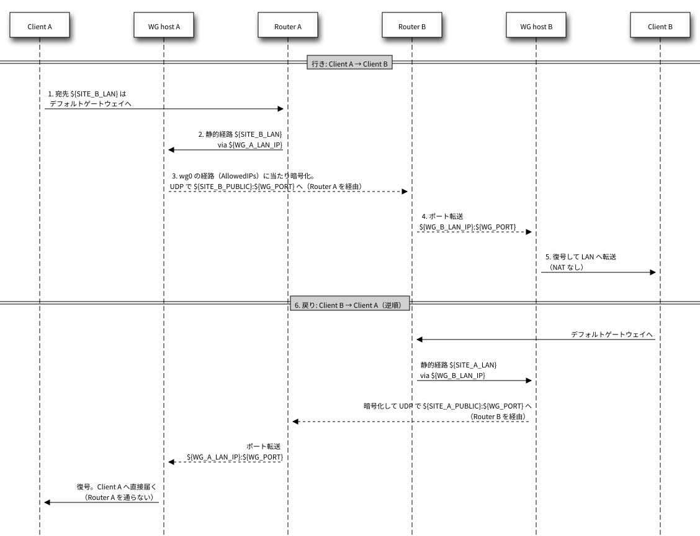
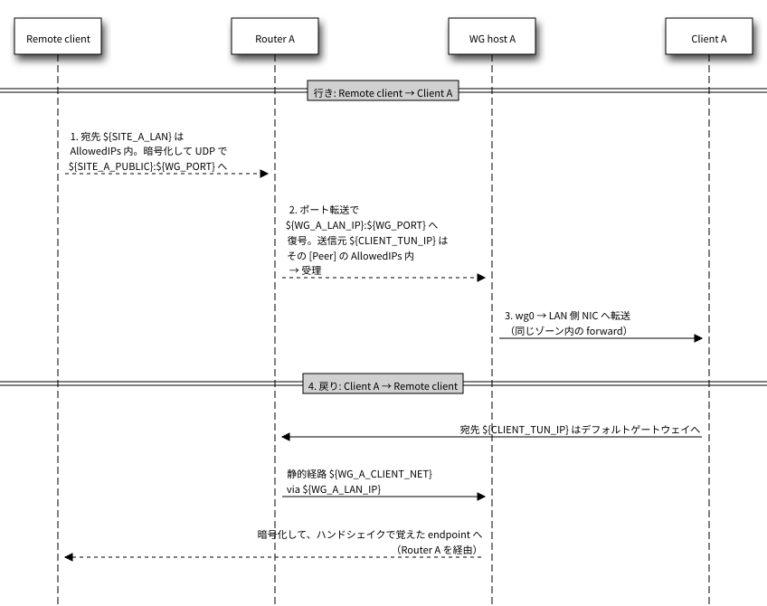
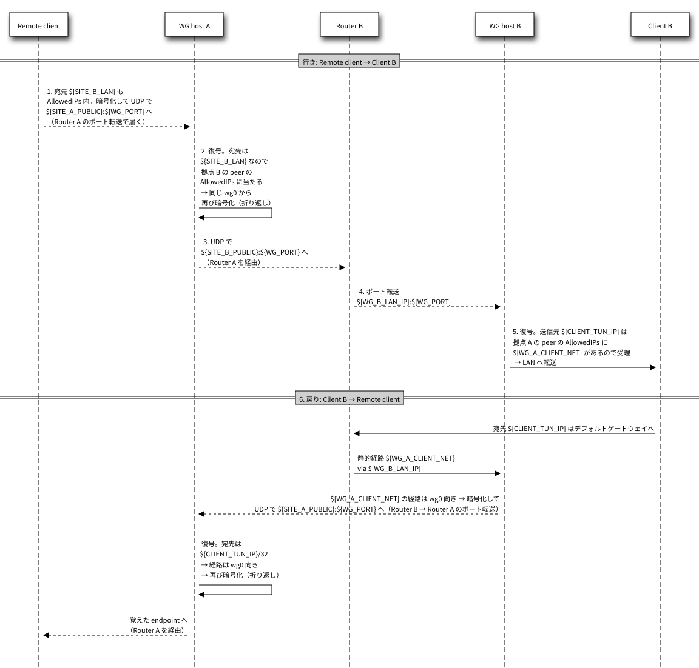

# WireGuard VPN 構築手順（site-to-site + road warrior / wg-quick + firewalld）の参考資料

[手順書](../wireguard.md)・[ロールバックと注意点](../extra/wireguard.md)

## 補足

### 実施手順 / 鍵を作って適用する / 手順 1: 補足: keygen の出力

**出力例**

```
公開鍵: <SITE_A_PUBKEY>
site.env の SITE_A_PUBKEY に書き、同じ site.env を相手拠点にも置いてください。
```

### 実施手順 / 鍵を作って適用する / 手順 5: 補足: apply が行うこと

`apply` が行うのは次のとおり。詳しくは[スクリプトの動作](#スクリプトの動作)。

- `wg0.conf` の生成
- IP フォワーディング
- firewalld（LAN 側ゾーンに `${WG_PORT}/udp` と `wg0` を追加し、ゾーン内転送を有効にする）
- `wg-quick@wg0` の有効化と起動
- 旧レイアウトの専用ゾーンと policy が残っていれば、先に消す
- 再実行しても設定は重複しない。`site.env` を変えたときやクライアントを足したときも、`apply` で反映する（最後に必ず restart する）

### 実施手順 / 鍵を作って適用する / 手順 5: 補足: 疎通を確かめる時期

- 拠点間の疎通は、「鍵を作って適用する」の手順 6（ルーター）の後で確認できる（「状態と疎通を確かめる」の手順 1・2 の疎通確認）

### 実施手順 / クライアントを登録する / 手順 1: 補足: 登録簿の名前

- 登録簿は名前で一意。そのため、`CLIENT_NAME` と同じ名前が一覧にあるときだけ、「クライアントを登録する」の手順 2 で旧登録を消す

### 実施手順 / クライアントを登録する / 手順 3: 補足: 登録簿とトンネル IP

- 登録は `~/wg/clients.list` に残り、`apply` のたびに同じ conf が組み立て直される
- トンネル IP は帯の中で最小の空きが割り当たる（`--ip` で指定できる）

詳しくは[スクリプトの動作](#スクリプトの動作)。

### 実施手順 / クライアントを登録する / 手順 4: 補足: --pubkey で登録した conf

- `--pubkey` で登録した conf の `PrivateKey` は `<CLIENT_PRIVATE_KEY>` のまま（「クライアントを登録する」の手順 8 で置き換える）

### 実施手順 / クライアントを登録する / 手順 4: 補足: WG ホストでの登録

- `client add` は同じ名前・同じ公開鍵・同じトンネル IP を拒否する（`wg-vpn.sh` の `cmd_client_add`）
- `--pubkey` で登録した conf の `PrivateKey` は、文字列 `<CLIENT_PRIVATE_KEY>` のまま書かれる（`client add` の末尾にもその旨が出る）
- `apply` は `wg0.conf` を作り直して `systemctl restart` するので、他のクライアントと拠点間トンネルが数秒切れる（`reload` では経路が入らない。→ [落とし穴 2](../extra/wireguard.md#落とし穴-2-reload-では経路が追加されない)）
- `apply` の末尾に出るルーターの設定（クライアント帯の静的経路）は、既に入っていれば変更不要
- トンネル IP は帯の中で最小の空きが割り当たる（`--ip` で指定できる）

### 実施手順 / クライアントを登録する / 手順 5: 補足: 反映と届く範囲

- 反映は `apply`（restart）で行う。`reload` では新しい peer の経路が入らない（[落とし穴 2](../extra/wireguard.md#落とし穴-2-reload-では経路が追加されない)）
- どちらか片方の拠点で登録すれば、そのクライアントは両拠点の LAN に届く（[パケットの流れ](#パケットの流れremote-client--各拠点)）
  - 前提: 両拠点で `apply` 済みで、両拠点のルーターにクライアント帯の静的経路がある

### AlmaLinux 10 の PC からつなぐ / 鍵を作る / 手順 1: 補足: 変数について

- 変数名は PC 視点（`WG_HOST_*` = 接続先拠点、`PEER_*` = 相手拠点）
- 拠点 B がクライアントを受ける構成なら、`site.env` の `WG_B_TUN_IP` / `WG_B_LAN_IP` / `ROUTER_B_LAN_IP` と `WG_A_LAN_IP` を入れる
- `WG_DIR` を WG ホストの `~/wg`（`site.env` と `clients.list` の置き場）と別の名前にしてあるのは、同じ人が両方のマシンを触るときに、ロールバックの `rm` を取り違えても登録簿が消えないようにするため

### AlmaLinux 10 の PC からつなぐ / 鍵を作る / 手順 2: 補足: パッケージ

- `wireguard-tools` は `wg` / `wg-quick` と、依存の `systemd-resolved` を入れる
- `systemd-resolved` は有効にしない。有効にすると NetworkManager の DNS 処理が resolved 経由に切り替わる（`DNS =` を使わない本手順では不要）
- `modinfo -n` はモジュールの存在確認だけで、ロードは `nmcli connection up` の時点で NetworkManager が行う

### AlmaLinux 10 の PC からつなぐ / 鍵を作る / 手順 3: 補足: 鍵ペア

- `umask 077` で `wg0.key` / `wg0.pub` を 0600 にする
- `tee` で秘密鍵をファイルに落としつつ `wg pubkey` に流すので、秘密鍵は端末に出ない
- `wg genkey` / `wg pubkey` はカーネルモジュール無しで動く
- 既に `wg0.key` があるときに中断するのは、上書きするとホストに登録済みの公開鍵と対応しなくなるため

### AlmaLinux 10 の PC からつなぐ / conf を取り込む / 手順 1: 補足: ファイル名と運び方

- ファイル名を `wg0.conf` にするのは、NetworkManager がファイル名から接続名とインターフェース名を決めるため
- `client show` の出力には秘密鍵が入っていないので、ファイルで渡すときも平文でよい

### AlmaLinux 10 の PC からつなぐ / conf を取り込む / 手順 3: 補足: LAN の外につなぐ理由

- クライアント conf の `AllowedIPs` には両拠点の LAN が入るので、LAN 内で「conf を取り込む」の手順 4 を貼ると、そこで通信が切れる

### AlmaLinux 10 の PC からつなぐ / conf を取り込む / 手順 4: 補足: 取り込んだ直後に切る理由

- `import` した直後に、NetworkManager が `wg0` を自動で張る（`connection.autoconnect` の既定が `yes` のため）。張られた時点で拠点 LAN 宛ての経路が入れ替わる
- そのため、張られたトンネルは取り込んだ直後に切る（「トンネルを確かめる」の手順 1 で改めて張る）

### AlmaLinux 10 の PC からつなぐ / トンネルを確かめる / 手順 4: 補足: 再起動したとき

- autoconnect を無効にしてあるので、再起動しても勝手には張られない

### AlmaLinux 10 の PC からつなぐ / トンネルを確かめる / 手順 5: 補足: 平文の鍵と conf を消す理由

- 秘密鍵は「conf を取り込む」の手順 4 で NetworkManager のプロファイルに入っているので、平文のファイルを残さない（`wg0.pub` は公開鍵なので残してよい）

### Windows 11 で使う / Windows 11 で WireGuard と鍵を用意する / 手順 2: 補足: 変数について

- 変数の名前と意味は、AlmaLinux 10 の[「鍵を作る」の手順 1](../wireguard.md#鍵を作る)と同じ（PC 視点。`WG_HOST_*` = 接続先拠点、`PEER_*` = 相手拠点）。拠点 B がクライアントを受ける構成なら、`site.env` の `*_B_*` 側の値を入れる
- 使うのは、「Windows 11 でトンネルを確かめる」の手順 3 の疎通の確認だけ
- 鍵と conf の一時置き場は `%USERPROFILE%\wg-client`（`C:\Users\<WIN_USER>\wg-client`）に決めてあり、変数にしていない。WG ホストの `~/wg`（`site.env` と `clients.list` の置き場）とは別の名前

### Windows 11 で使う / Windows 11 で WireGuard と鍵を用意する / 手順 3: 補足: 見ているもの

- `WireGuardManager` は WireGuard の窓（マネージャー）のサービス、`WireGuardTunnel$<名前>` は張っているトンネルごとのサービス（[WireGuard for Windows の文書](https://git.zx2c4.com/wireguard-windows/about/docs/enterprise.md)）
- `C:\Program Files\WireGuard\Data\Configurations` は、WireGuard が取り込んだトンネルの設定（`<名前>.conf.dpapi`）の置き場所。アクセス権が SYSTEM と Administrators だけなので、管理者の PowerShell でないと何も出ない
- `--source winget` を付けた `winget list` は、入っているアプリを winget のカタログと照合し、確認に要らない Microsoft Store のソースの初回同意を避ける
- `--accept-source-agreements` は、winget を初めて使う PC で出るソースの同意の問いに答えるため（続けて貼った行が答えとして食われないように）
- `WireGuard.WireGuard` の行が出たら、WireGuard はもう入っている（公式のインストーラーで入れたものも出るはず）。そのまま進めてよい（「Windows 11 で WireGuard と鍵を用意する」の手順 4 は、新しい版があれば上げる）

### Windows 11 で使う / Windows 11 で WireGuard と鍵を用意する / 手順 4: 補足: 版

- `winget list` に出る版は、実行した日の最新

### Windows 11 で使う / Windows 11 で WireGuard と鍵を用意する / 手順 5: 補足: マネージャーのサービス

- 引数無しの `wireguard.exe` は、マネージャーが動いていれば窓を出し、動いていなければマネージャーのサービス `WireGuardManager` を作って起動してから窓を出す（ソースの `main.go`、WireGuard の文書の「Enterprise Usage」）。スタートメニューの「WireGuard」も同じ
- `WireGuardManager` は自動で起動するサービスになる。以後は、Administrators の一員がサインインするたびに、通知領域に WireGuard のアイコンが出る
- マネージャーは、「Windows 11 で WG ホストに登録して取り込む」の手順 4 の取り込み（設定の置き場所を見張って暗号化する）と、更新の知らせ（[Windows 11 の更新](../wireguard.md#windows-11-の更新)）に要る
- 窓は Administrators の一員にしか出ない（ソースの `main.go` の `checkForAdminGroup`）
- 管理者の PowerShell から開くので、UAC の確認は出ないはず
- `wireguard.exe` は GUI のプログラムなので、PowerShell は窓が開くのを待たずにプロンプトに戻る
- 窓を閉じても、マネージャーは動き続ける

### Windows 11 で使う / Windows 11 で WG ホストに登録して取り込む / 手順 1: 補足: 関数が読むもの

- 「Windows 11 で WG ホストに登録して取り込む」の手順 3 で `Import-WgClientConf` と手入力すると、クリップボードを読み込む

### Windows 11 で使う / Windows 11 で WG ホストに登録して取り込む / 手順 3: 補足: 表示するもの

- 関数は、置き換えた鍵そのものは表示しない

### Windows 11 で使う / Windows 11 で WG ホストに登録して取り込む / 手順 4: 補足: 取り込みと、理由の見方

- マネージャーは `C:\Program Files\WireGuard\Data\Configurations` を見張っていて、`.conf` のファイルが来ると、読んで `<名前>.conf.dpapi` に暗号化して書き、元のファイルを消す（WireGuard の文書の「Enterprise Usage」、ソースの `conf/migration_windows.go`）。トンネルの名前はファイル名から決まる（`wg0`）
- `.conf.dpapi` は LocalSystem の DPAPI で暗号化され、アクセス権は SYSTEM だけが読み書きでき、Administrators は消せるだけ（ソースの `conf/filewriter_windows.go`）。秘密鍵の置き場所は、以後これだけになる（AlmaLinux 10 の `/etc/NetworkManager/system-connections/wg0.nmconnection` に当たる）
- `Data` のフォルダーのアクセス権は SYSTEM と Administrators のフル コントロールなので、管理者の PowerShell から写せる（ソースの `conf/path_windows.go`）
- 読めなかったときは、マネージャーのログに `Unable to ingest and encrypt` の行が出て、`wg0.conf` が残る。ログは `& "$env:ProgramFiles\WireGuard\wireguard.exe" /dumplog | Select-String -SimpleMatch 'wg0.conf'` で見られる（窓の「ログ」のタブでも見られる）
- 同じ名前の `wg0.conf.dpapi` があると上書きしない（取り込めずに残る）ので、ブロックの先頭で止めている

### Windows 11 で使う / Windows 11 でトンネルを確かめる / 手順 1: 補足: LAN の外につなぐ理由

- クライアント conf の `AllowedIPs` には両拠点の LAN が入るので、LAN 内で「Windows 11 でトンネルを確かめる」の手順 2 を貼ると、そこで LAN の通信が切れる

### Windows 11 で使う / Windows 11 でトンネルを確かめる / 手順 2: 補足: DNS

- `ServerAddresses` が空なのは、conf に `DNS =` が無いため。DNS は変わらない

### Windows 11 で使う / Windows 11 でトンネルを確かめる / 手順 5: 補足: 切ったときと、日常の使い方

- `/uninstalltunnelservice wg0` は、トンネルのサービスを止めて消す。窓の「無効化」も同じ（ソースの `manager/ipc_server.go` の `Stop`）。アダプターは、トンネルが止まると消える
- トンネルの設定（`wg0.conf.dpapi`）は残るので、次は有効化だけでよい
- サービスは消されてもすぐには無くならないことがあるので、消えるまで 30 秒まで待つ
- NetworkManager の `autoconnect no` に当たる設定は無い。張ったまま（サービスが残ったまま）再起動すると、起動のときに張られ、拠点の LAN の中なら LAN の通信を奪う

### Windows 11 で使う / Windows 11 でトンネルを確かめる / 手順 6: 補足: 平文の鍵と conf を消す理由

- 秘密鍵は、「Windows 11 で WG ホストに登録して取り込む」の手順 4 で WireGuard の設定（`wg0.conf.dpapi`）に入っているので、平文のファイルを残さない（`wg0.pub` は公開鍵なので残してよい）

### Windows 11 の更新 / 手順 1: 補足: winget の定義の遅れ

- winget の定義は、公式の版より遅れて出ることがある

### クライアントを削除する / 手順 3: 補足: client remove が消すもの

- `client remove` は登録簿と配布用 conf を消す。ホストの conf と動作中の peer は、まだ変わらない

### クライアントを削除する / 手順 6: 補足: 静的経路を残す理由

- ルーターのクライアント帯の静的経路は、ほかのクライアントも使うので残す

### 回線に合わせて MTU を下げる（任意） / 手順 1: 補足: WG_MTU に書く値

- wg-quick は `MTU` の指定が無いと、`Endpoint` への経路（無ければ既定の経路）に `mtu` の指定があればその値、無ければ出口の NIC の MTU から、80 を引いて `wg0` の MTU にする（wireguard-tools 1.0.20250521-1.el10 の `/usr/bin/wg-quick` の `set_mtu_up`）
  - NIC の MTU が 1500 なら 1420 になる。ルーターの先の回線の MTU は見ない
- WireGuard が外側に足す大きさは、IP ヘッダー（IPv4 は 20、IPv6 は 40）・UDP ヘッダー 8・WireGuard のヘッダーと認証タグ 32 で、IPv4 なら 60、IPv6 なら 80（→ [参照](#参照)のメーリングリストの説明）
- 中身は 16 バイトの倍数になるよう詰めてから暗号化するが、`wg0` の MTU を超えては詰めない（Linux 6.12 の `drivers/net/wireguard/send.c` の `calculate_skb_padding`）
  - `WG_MTU` が「回線の MTU − 60」以下なら、外側のパケットは回線の MTU に収まる
  - 既定の 1420 のままだと、回線の MTU が 1454 のとき、中身が 1393 バイト以上のパケットは 1408 以上に詰められ、外側が 1468 以上になって回線の MTU を超える
- 外側の IPv4 パケットには DF（分割禁止）を立てない（同じく `socket.c` の `send4`）。回線の MTU を超えた分は途中のルーターが分割して送り、送り元には何も返らないので、`wg0` の MTU が自動で下がることは無い
- 分割された片方でも落ちると、もとの 1 パケットが丸ごと失われる。小さいパケットは分割されないので、ping や ssh のキー入力は通り、TCP の大きいセグメントだけが再送になる
- `1380` は、実機（回線の MTU が 1454 と 1460 の 2 拠点）で確かめた値（[検証記録の付録](../verification/wireguard.md#付録-実機の-2-拠点で-wg0-の-mtu-を下げた記録2026-10-10)）
- `tracepath` の宛先の `1.1.1.1` は、回線の先にあって応答する宛先として選んだだけで、インターネット上のほかの宛先でもよい
- `Endpoint` が IPv6 のときに 80 を引くのは上の内訳からの計算で、実機では確かめていない

### 回線に合わせて MTU を下げる（任意） / 手順 3: 補足: 両拠点で同じ値にする理由

- `site.env` は両拠点に同じ内容で置くファイルで、`WG_MTU` を拠点ごとに変える書き方は無い
- 拠点間のパケットは両拠点の回線を通るので、小さいほうの回線に合わせる

### 回線に合わせて MTU を下げる（任意） / 手順 4: 補足: ip link で先に下げる

- `ip link set` は、動いている `wg0` の MTU だけを変える。トンネルは張ったままで、作業中の ssh も切れない（実機で確かめた）
- `wg0.conf` には書かれない。`wg-quick@wg0` の restart と OS の再起動では、conf の `MTU =`（無ければ wg-quick が決める値）になる（restart は、実機の `apply` で確かめた。OS の再起動は確かめていない）
- 張ってある TCP の接続も、その後に送る分は小さいセグメントになる（実機の拠点間の接続で確かめた）

### 回線に合わせて MTU を下げる（任意） / 手順 7: 補足: ping の大きさ

- `-M do` は分割を禁じる指定、`-s` は ICMP の中身の大きさ。IP ヘッダー 20 と ICMP ヘッダー 8 を足して `wg0` の MTU ちょうどになるよう、MTU から 28 を引く
- 小さい ping と並べるのは、回線そのものの損失（混雑など）と見分けるため
- 下げる前に同じ 2 つを打つと、分割されたパケットが落ちている向きでは、MTU いっぱいの ping だけが落ちる（実測は検証記録の同じ付録）

### 回線に合わせて MTU を下げる（任意） / 手順 8: 補足: クライアントにも入れる理由

- クライアントから拠点へ向かうパケットも拠点の回線を通る。クライアントの MTU が 1420 のままだと、外側が回線の MTU を超える
- WG ホスト自身との TCP（ssh・Samba・Syncthing）は、両端の小さいほうに合わせてセグメントを決めるので、ホスト側を下げただけで両方向とも収まる（拠点間の ssh で、張ってあった接続の `mss` が変わるのを実機で確かめた）
- 拠点の LAN のほかの機器との通信と、TCP 以外は、クライアントの MTU の大きさで送られる
  - 拠点からクライアントへ向かう向きは、WG ホストが大きすぎるパケットを送り元へ知らせ、送り元が小さくし直す（経路 MTU 探索）ことに頼る
  - この 2 つは仕組みからの見立てで、クライアントでは測っていない
- `apply` は配布済みのクライアントに触れない。`client add` が作る conf に `MTU =` を書くのは、`WG_MTU` に値を書いた後の登録だけ（[スクリプトの動作](#スクリプトの動作)）
- クライアントは conf の `MTU` を読む（ソースで確かめただけで、取り込みは流していない。[検証記録の付録](../verification/wireguard.md#付録-クライアント用-conf-に-mtu-を書く変更の検証2026-10-10)）
  - NetworkManager は、取り込みで `MTU =` を `wireguard.mtu` にする（1.56.0 の `nm_conn_wireguard_import`）
  - WireGuard for Windows と Android の公式アプリは、`[Interface]` の `MTU` を読む（`conf/parser.go`・`config/Interface.java`）

### 構成とパケットの流れ

- **構成**: 各拠点で、既存ルーターの配下にある AlmaLinux 1 台を WireGuard ホストにする（ルーターの置き換えはしない）。外出先のクライアントは、どちらかの拠点のホストに接続する
- **設定方式**: `wg-quick` + systemd（`/etc/wireguard/wg0.conf` / `wg-quick@wg0.service`）
  - firewalld は `wg0` を LAN 側ゾーンに入れてゾーン内転送（forward）で通す（policy は作らない。転送は WG ホストでは絞らず、宛先ホストのファイアウォールに任せる）
  - クライアントを足すときも既存の `wg0` に `[Peer]` を加えるだけで、インターフェースも待ち受けポートも増やさない
- **スクリプト**: 本書のメインの手順は、同じ `site.env` を読んで手順をまとめて実行する [`scripts/wireguard/wg-vpn.sh`](../../scripts/wireguard/wg-vpn.sh) を使う（拠点間の構築、クライアントの追加、鍵と設定のバックアップ・復旧に対応。[実施手順](../wireguard.md#実施手順)）

拠点ルーターの配下に WG ホストを 1 台ずつ置き、`wg0` 同士をトンネルで結ぶ。外出先のクライアントは、どちらかの拠点の WG ホストに接続する（図は拠点 A で受ける場合）。

- WG host A から見ると、拠点 B の peer とクライアントの peer が同じ `wg0` に並ぶ
- ルーターには次の 2 つが要る（[ルーターの設定](#ルーターの設定)）
  - **ポート転送**（WAN の `${WG_PORT}/udp` → WG ホスト。拠点間トンネルとクライアントの両方がこれを使う）
  - **相手拠点 LAN とクライアント帯宛ての静的経路**（via 自拠点の WG ホスト）

#### パケットの流れ（Client A → Client B）



実線は平文のホップ、破線は暗号化された UDP（宛先ポート `${WG_PORT}`）のホップ。番号は次の箇条書きに対応する。

1. Client A は宛先 `${SITE_B_LAN}` を知らないので、デフォルトゲートウェイの **Router A** に送る
1. Router A の**静的経路**（`${SITE_B_LAN}` via `${WG_A_LAN_IP}`）で **WG host A** に転送される
1. WG host A は `wg0` の経路（`AllowedIPs` から wg-quick が自動で追加する）で暗号化し、Router B のグローバル IP（`Endpoint` の `${SITE_B_PUBLIC}:${WG_PORT}`）へ UDP で送る。この UDP は WG host A のデフォルトゲートウェイである Router A を通って出て行く
1. Router B の**ポート転送**（WAN の `${WG_PORT}/udp` → `${WG_B_LAN_IP}:${WG_PORT}`）で WG host B に届く
1. WG host B で復号され、LAN B の Client B へ転送される（NAT しないので送信元は Client A のまま）
1. 戻りは逆順（Client B → Router B → WG host B → トンネル → WG host A → Client A）。最後の WG host A → Client A は同じ LAN 内なので Router A を通らない（[ヘアピン](../extra/wireguard.md#ルーターの静的経路とヘアピン非対称経路)）

ヘッダの書き換わり方（行き）:

- WG ホストは NAT しないので、**内側の送信元・宛先は端から端まで変わらない**
- 書き換わるのは外側の UDP だけで、それをするのはルーターである（[選択した方針](../verification/wireguard.md#選択した方針)）

| ホップ | 外側（UDP。ルーターが書き換える） | 内側（元のパケット） |
|---|---|---|
| 1〜2（LAN A 内） | なし（平文） | `${SITE_A_LAN}.100` → `${SITE_B_LAN}.100` |
| 3（WG host A → Router B） | 送信元 `${WG_A_LAN_IP}`・宛先 `${SITE_B_PUBLIC}:${WG_PORT}`。Router A を出るとき送信元が `${SITE_A_PUBLIC}` に書き換わる（LAN → WAN の通常の NAPT） | 暗号化されて UDP のペイロードに入る。内容は変わらない |
| 4（Router B → WG host B） | ポート転送で宛先が `${WG_B_LAN_IP}:${WG_PORT}` に書き換わる | 同上 |
| 5（LAN B 内） | なし（復号済み） | `${SITE_A_LAN}.100` → `${SITE_B_LAN}.100`（そのまま） |

#### パケットの流れ（Remote client → 各拠点）

**Remote client → Client A（接続先拠点の LAN）**



実線・破線の意味は上の図と同じ。番号は次の箇条書きに対応する。

1. クライアントは宛先 `${SITE_A_LAN}` を `AllowedIPs` に持つので、暗号化して `${SITE_A_PUBLIC}:${WG_PORT}` へ送る
1. Router A のポート転送で WG host A に届き、復号される。送信元 `${CLIENT_TUN_IP}` はそのクライアントの `[Peer]` の `AllowedIPs` に含まれるので受け入れられる
1. WG host A は `wg0` → LAN 側 NIC に転送する（同じゾーン内の転送。ゾーンの forward で通る）
1. 戻りは Client A → デフォルトゲートウェイの Router A → **静的経路 `${WG_A_CLIENT_NET}` via `${WG_A_LAN_IP}`** → WG host A → ハンドシェイクで覚えたクライアントの endpoint へ

**Remote client → Client B（もう一方の拠点の LAN）**



WG host A に届くまでは上の図の 1〜2 と同じなので、Router A は省いている。番号は次の箇条書きに対応する。

1. クライアントは宛先 `${SITE_B_LAN}` も `AllowedIPs` に持つので、同じように暗号化して `${SITE_A_PUBLIC}:${WG_PORT}` へ送り、Router A のポート転送で WG host A に届く（クライアントの peer は WG host A だけ）
1. WG host A で復号された後、宛先 `${SITE_B_LAN}` は `wg0` 向きの経路（拠点 B の peer の `AllowedIPs`）に当たるので、**同じ `wg0` から**拠点 B の peer へ再び暗号化して出て行く（`wg0` → `wg0` の折り返し。ゾーンの forward はこれも通す）
1. 拠点間トンネルと同じく、`${SITE_B_PUBLIC}:${WG_PORT}` 宛ての UDP として Router A を通ってインターネットへ出る
1. Router B のポート転送で WG host B に届く
1. WG host B で復号される。送信元 `${CLIENT_TUN_IP}` は**拠点 A の peer の `AllowedIPs` に `${WG_A_CLIENT_NET}` が入っていて初めて**受け入れられる。入っていなければ、WireGuard は ICMP も返さず黙って捨てる。受け入れられれば LAN 側に転送する
1. 戻りは Client B → Router B → **静的経路 `${WG_A_CLIENT_NET}` via `${WG_B_LAN_IP}`** → WG host B（`${WG_A_CLIENT_NET}` の経路は `wg0` 向き）→ 拠点間トンネル → WG host A（`${CLIENT_TUN_IP}/32` の経路は `wg0` 向き。ここでも折り返す）→ クライアント

したがって、必要な設定は次のとおり。

| 場所 | 必要な設定 |
|---|---|
| WG ホスト（両拠点） | WireGuard（相手拠点の peer の `AllowedIPs` に相手 LAN と相手拠点のクライアント帯を含める）、IP フォワーディング、firewalld（`wg0` を LAN 側ゾーンに入れ、ゾーン内転送を有効にする） |
| WG ホスト（クライアントを受ける拠点） | 加えて、クライアントごとの `[Peer]`（`AllowedIPs` = そのクライアントの `/32`） |
| 拠点ルーター（両拠点） | WAN → `${WG_x_LAN_IP}:${WG_PORT}/udp` の**ポート転送**、`相手 LAN` と `クライアント帯`（両拠点の帯とも）via `${WG_x_LAN_IP}` の**静的経路** |
| 拠点の LAN 上のクライアント | 変更なし |
| 外出先のクライアント | conf を取り込む（`AllowedIPs` = 両拠点の LAN + `${WG_TUNNEL_NET}`） |

### ルーターの設定

機種ごとに画面は違うので、要件だけを書く。**両拠点のルーターで実施する。** 入力する値は `apply` の末尾に表示される。あとから見るには:

```bash
./wg-vpn.sh -e ~/wg/site.env router A
```

```
---- 拠点 A のルーターに設定する値 ----
ポート転送 : WAN（198.51.100.1）の 51820/udp → 192.168.110.2:51820
静的経路   : 宛先 192.168.120.0/24 → ゲートウェイ 192.168.110.2
静的経路   : 宛先 10.99.1.0/24 → ゲートウェイ 192.168.110.2（拠点 A のクライアント）
DHCP 予約  : 192.168.110.2 をこの WG ホストに固定
（ルーターの LAN 側 IP: 192.168.110.1）
```

- クライアント帯の静的経路は**両拠点のルーターに、両拠点の帯とも**入れる（表示される分だけ。[理由](../extra/wireguard.md#ルーターにはクライアント帯の静的経路も要る)）

| 設定 | 拠点 A のルーター | 拠点 B のルーター |
|---|---|---|
| ポート転送（静的 NAT / NAPT） | WAN `${WG_PORT}/udp` → `${WG_A_LAN_IP}:${WG_PORT}` | WAN `${WG_PORT}/udp` → `${WG_B_LAN_IP}:${WG_PORT}` |
| 静的経路（相手拠点 LAN） | 宛先 `${SITE_B_LAN}` → ゲートウェイ `${WG_A_LAN_IP}` | 宛先 `${SITE_A_LAN}` → ゲートウェイ `${WG_B_LAN_IP}` |
| 静的経路（クライアント帯。**両拠点の帯とも**、値のあるもの） | 宛先 `${WG_A_CLIENT_NET}`・`${WG_B_CLIENT_NET}` → ゲートウェイ `${WG_A_LAN_IP}` | 宛先 `${WG_A_CLIENT_NET}`・`${WG_B_CLIENT_NET}` → ゲートウェイ `${WG_B_LAN_IP}` |
| DHCP | `${WG_A_LAN_IP}` を固定（予約）する | `${WG_B_LAN_IP}` を固定（予約）する |

- クライアント帯の静的経路は**両拠点のルーターに、両拠点の帯とも**入れる。NAT をしない構成なので、LAN 側ホストの返事はデフォルトゲートウェイに向かい、ルーターがクライアント帯を知らないとそこで行き場を失う（[注意点](../extra/wireguard.md#ルーターにはクライアント帯の静的経路も要る)）
- `${WG_TUNNEL_NET}` とクライアント帯を 1 つの大きな帯（例: `10.99.0.0/16`）の中に取っておけば、ルーターの静的経路はその帯 1 本で済む。[「WG ホスト自身から相手 LAN へ送る場合」](../extra/wireguard.md#wg-ホスト自身から相手-lan-へ送る場合)の問題（トンネル網への経路が無い）も同時に解消する
- WG ホスト自身のデフォルトゲートウェイは拠点ルーターのままでよい。ルーターに静的経路を入れられない場合と、折り返し（ヘアピン）の注意は[注意点](../extra/wireguard.md#ルーターの静的経路とヘアピン非対称経路)を参照

### スクリプトの動作

[`scripts/wireguard/wg-vpn.sh`](../../scripts/wireguard/wg-vpn.sh) は、パッケージの導入からクライアントの登録までを `site.env` の値で実行する。

- クライアントの登録簿 `clients.list`（[`clients.list.example`](../../scripts/wireguard/clients.list.example)）は、`client add` が `site.env` と同じディレクトリに作る（クライアントを受ける拠点のホストにあればよい）
- どちらも `.gitignore` で除外している

`apply` の動作:

`clients.list` に登録を残すので、**`apply` を何度実行しても同じ conf が組み立て直される**。

- `client add` は、帯の重複・名前や IP の重複・拠点の取り違えなどを**何かを書く前に**検査する
- トンネル IP は、`--ip` が無ければ帯の中で最小の空きを割り当てる
- クライアント用 conf には、`site.env` の `WG_MTU` に値があれば、同じ `MTU =` を書く（空なら書かない）。書くのは `client add` のときだけで、配布済みの conf は作り直さない
- `remove A` は `wg0` と待ち受けポートを LAN 側ゾーンから外し（forward は戻さない。旧レイアウトの残骸があればそれも消す）、`--purge` を付けると `clients.list` にあるクライアントの conf も消す（`clients.list` 自体は残す）

`keygen` の動作: `wireguard-tools` が無ければ dnf で入れ、鍵が無ければ生成する。**既存の鍵は上書きしない**（公開鍵だけ表示し直す）。

`restore` の動作:

- **拠点（A/B）は鍵から判定する。** `backup` に `A|B` を付けてもよいが、付けなくても `site.env` の `SITE_x_PUBKEY` と突き合わせて決まる。LAN 側 IP には依存しないので、NIC 名や IP が変わったホストでもバックアップできる
- **`restore` は `-e` を付けなければ、アーカイブに記録された元の場所**（`~/wg/site.env` など）**に戻す。** 別の場所にしたいときだけ `-e` を付ける
  - `wg-env.sh` と `clients.list` は `site.env` と同じディレクトリに置かれる
- **次の検査をしてからファイルを戻す。** ただし鍵の検査より前に、必要なら wireguard-tools を導入する
  - アーカイブの形式（`MANIFEST` の有無・`FORMAT`・絶対パスや `..` を含むエントリ）
  - 鍵から算出した公開鍵が `MANIFEST` および `site.env` の `SITE_x_PUBKEY` と一致するか
  - 復旧先が**相手拠点のホスト**でないか（両拠点が同じ鍵になる事故を止める）
  - どちらの拠点の LAN 側 IP もこのホストに無い場合は**警告にとどめて続行**する（再インストール直後はありうるため）
- 既にあるファイルは `.bak-日時` に退避してから置き換える（内容が同じなら「変更なし」で触らない）
- 項目ごとの検査・復元は順に行う。後半の不正なパーミッションや書き込み失敗で止まった場合、先に戻したファイルは残る。自動で元に戻す処理は無い
- **パーミッションは `MANIFEST` の値をそのまま使わない。** 鍵・conf・`site.env` は 600 に固定して置く（細工したアーカイブで秘密鍵が 0644 になるのを防ぐ）
- `site.env` と `clients.list` は**置き先ディレクトリの所有者**で置く。`sudo` で実行しても `~/wg` 配下なら自分の所有のままなので、`client list` と `router` を非 root で実行できる
- **`restore` はサービスを起動しない。** 続けて `apply` を実行する。`wg0.conf` は `clients.list` から作り直されるので、クライアントの `[Peer]` も戻る
- クライアントの秘密鍵入り conf（`/etc/wireguard/clients/*.conf`）は**含めない**。ホストに残っていれば警告する

`remove` の動作:

- サービスを `disable --now` し、`wg0` を LAN 側ゾーンから外し、旧レイアウトの policy・専用ゾーンがあれば消し、待ち受けポートを外して reload する
- ゾーンの forward は戻さない（`apply` 前の状態が分からず、組み込みゾーンでは既定で有効なため）
- LAN 側ゾーンの `<ゾーン名>.xml.old` は、firewalld がゾーンを書き換えるたびに作る通常のバックアップなので消さない（旧レイアウト由来の `*.xml.old` だけ消す）
- `/etc/sysctl.d/90-wireguard.conf` を消して、`ip_forward` を 0 に戻す
- `--purge` を付けたときだけ、`wg0.conf`・鍵・`clients.list` にあるクライアント用 conf を消す
- `clients.list`・`~/wg`・パッケージは残し、ルーター側は手で戻す

### バックアップと復旧の補足

**残しておく価値があるのは「鍵」と「値を書いたファイル」だけ。** `wg0.conf`・sysctl・firewalld は `apply` で作り直せる。

#### 何を保存し、何は手順で作り直せるか

| 対象 | 場所 | バックアップ | 失ったときの代償 |
|---|---|---|---|
| **ホストの秘密鍵** `${WG_IFACE}.key` | `/etc/wireguard/` | **必須** | 公開鍵が変わる。**相手拠点の `site.env` と conf の差し替え**、**クライアント全台の conf 再発行**が要る |
| `site.env` | `~/wg/` | **必須** | 変数表を見ながら書き直す |
| `clients.list`（スクリプトでクライアントを運用する場合） | `site.env` と同じディレクトリ | **必須** | 各クライアントの公開鍵とトンネル IP を失う。端末側の conf から読み出すか、全台登録し直す |
| `${WG_IFACE}.conf` | `/etc/wireguard/` | 入れる | `apply` が `clients.list` から作り直す |
| `${WG_IFACE}.pub` | `/etc/wireguard/` | 入れる | なし（`wg pubkey < ${WG_IFACE}.key` で再計算できる） |
| `/etc/sysctl.d/90-wireguard.conf` | — | 入れない | なし（`apply`） |
| firewalld のゾーン設定（`wg0`・ポート・forward） | `/etc/firewalld/zones/<LAN_ZONE>.xml` | 入れない | なし（`apply`） |
| クライアントの秘密鍵・クライアント用 conf | **端末側**（ホストからは「クライアントを登録する」の手順 9 で削除済み） | **入れない** | ホストの鍵が同じなら端末はそのままでよい |
| `wireguard-tools` | — | 入れない | なし（`keygen` / `apply` が入れる） |
| ルーターのポート転送・静的経路 | 拠点ルーター | 入れない（機器側に残る） | WG ホストの LAN 側 IP が変わったときだけ入れ直す（[ルーターの設定](#ルーターの設定)） |

> [!NOTE]
> **鍵は「拠点の身元」そのもので、ポート転送も静的経路も鍵とは無関係。** だから OS を入れ直しても**ルーターは触らなくてよい**。
>
> - ただし再インストールで WG ホストの LAN 側 IP が変わった場合は別で、両拠点の `site.env` をそろえ、IP が変わったホスト側のルーターのポート転送先と静的経路のゲートウェイを入れ直す（[ルーターの設定](#ルーターの設定)）
> - DHCP 予約を入れてあれば変わらない

**バックアップを取るときの注意:**

- クライアントの秘密鍵入り conf は**入れない**。「クライアントを登録する」の手順 6〜9 で端末に渡した時点で消してあり、ホストの鍵が同じなら端末側はそのまま動く

**クリーンインストール後に復旧するときの注意:**

- **`/etc/wireguard` の外から持ってきたファイルは `install`（新規作成）で置き、`restorecon` をかける。** `mv` で持ち込むと SELinux のコンテキスト（`user_tmp_t` など）を持ち越し、`wg-quick` が鍵を読めなくなることがある
- **公開鍵とネットワークの値が同じなら、相手拠点は変更不要。** LAN 側 IP を変えた場合は両拠点の `site.env` をそろえる。相手の conf の公開鍵は変わらず、トンネルは `PersistentKeepalive`（既定 25 秒）で張り直される
- **配布済みのクライアント conf もそのまま。** クライアント側の `[Peer] PublicKey` はホストの公開鍵で、これが変わっていない

#### 鍵を失った場合

鍵を失ったら、その拠点の身元を作り直すことになる。手順は多いが決まっている。

1. 鍵ファイル（`/etc/wireguard/wg0.key`・`.pub`）を消して `keygen` し直し、新しい公開鍵を**両拠点の `site.env`** の `SITE_x_PUBKEY` に書く
1. **相手拠点**でも `apply`（conf の作り直しと restart）を行う。相手拠点も一度止まる
1. **クライアント全台**の conf の `[Peer] PublicKey` を書き換えて配り直す（端末側の conf の `[Peer] PublicKey` を書き換えるだけでもよい）。QR で配っている場合も全台やり直し
1. クライアントの**秘密鍵**は変わらないので、`clients.list` が残っていれば `[Peer]` の作り直しは不要（`wg-vpn.sh apply` が `clients.list` から作り直す）

`clients.list` も失った場合は、各クライアントの公開鍵を端末側の conf から読み出すか、全台を登録し直す。

### 全部消すときの補足

#### 旧レイアウト（専用ゾーン + policy）からの移行

**移行は現在の `apply` が自動で行う。** 両拠点の WG ホストで:

```bash
sudo ./wg-vpn.sh -e ~/wg/site.env --dry-run apply B   # 消す policy・ゾーンと、LAN 側ゾーンに足すものを確認する
```

dry-run の出力を確かめてから、本実行する。

```bash
sudo ./wg-vpn.sh -e ~/wg/site.env apply B
```

`apply` は次の順に行う（変更は permanent にまとめて入れ、最後に 1 回だけ reload する）。

1. 名前が `site[AB]-to-(site|clients)[AB]` / `clients[AB]-to-site[AB]` に一致する policy を消す（他の policy には触れない）
1. `${WG_FW_ZONE}` ゾーンを消す（所属していた `wg0` はここで外れる）。旧レイアウト由来の `*.xml.old` も消す
1. LAN 側ゾーンに `${WG_PORT}/udp`・`wg0`・forward を入れて reload する

```bash
{
  for p in $(sudo firewall-cmd --permanent --get-policies | tr ' ' '\n' \
             | grep -E '^(site[AB]-to-(site|clients)[AB]|clients[AB]-to-site[AB])$'); do
    sudo firewall-cmd --permanent --delete-policy="$p"
  done
  sudo firewall-cmd --permanent --delete-zone=wireguard
  sudo firewall-cmd --permanent --zone="$LAN_ZONE" --add-interface=wg0 --add-port="$WG_PORT/udp" --add-forward
  sudo firewall-cmd --reload
}
```

**移行は両拠点で行う。**

#### `gateway-lan-to-world` について（LAN 側ゾーンが `internal` / `home` / `trusted` の場合）

firewalld 2.4 には `gateway-lan-to-world`（`internal` / `home` / `trusted` → `external` / `public` を ACCEPT）などの policy が同梱されているが、**`<disable/>` 付きで既定では無効**。

これを有効化している環境（`--policy=gateway-lan-to-world --remove-disable`）では、次の条件がそろうと、`wg0` を LAN 側ゾーンに入れた時点で、トンネルから届いた通信が別の NIC へも転送される。

- LAN 側ゾーンが `internal` / `home` / `trusted`
- 別の NIC が `public` / `external` にある

本書は WG ホストの NIC が LAN 側 1 枚であることを前提にしている。確認は `firewall-cmd --get-active-policies` と `sudo firewall-cmd --info-policy=gateway-lan-to-world`。

### 外出先の PC で選択した方針

Windows 11 で conf を取り込んで張る方法を比べた:

| 方法 | 状況 | 採否 |
|---|---|---|
| **設定の置き場所（`C:\Program Files\WireGuard\Data\Configurations`）に `wg0.conf` を写し、マネージャーに暗号化させる。張る・切るは `wireguard.exe /installtunnelservice` / `/uninstalltunnelservice`** | マネージャーが `wg0.conf.dpapi` に暗号化して、写した平文を消す（WireGuard の文書の「Enterprise Usage」）。窓の一覧にも出て、窓と通知領域のアイコンからも張る・切るができる。2 つのコマンドは、窓の「有効化」「無効化」がすることと同じ | **採用**（ブロックで写して、できたことを確かめられる） |
| 窓の「トンネルをファイルからインポート…」 | 結果は同じ（`wg0.conf.dpapi` になる）。ファイルを選ぶ画面の操作になり、確かめをブロックにまとめられない | 不採用（[Windows 11 で WG ホストに登録して取り込む](../wireguard.md#windows-11-で-wg-ホストに登録して取り込む)の手順 4 の代わりにしてよい） |
| `/installtunnelservice` に作業用の `wg0.conf` を直接渡す | すぐ張られるが、トンネルのサービスは起動のたびにそのファイルを読むので、秘密鍵入りの平文のファイルを消せない | 不採用 |

- **Windows 11 でも、鍵は PC で作り、公開鍵だけを WG ホストに渡す**（AlmaLinux 10 と同じ）
  - 秘密鍵は、`wg.exe genkey` の出力をブロックの中の変数で受け、画面に出さずにファイルに書く
  - `client show` の conf は、ファイルにせずクリップボードから読む（`vi` を開く手順の代わり）。秘密は入っていないので、運ぶ経路を選ばない
- **Windows 11 の秘密鍵の置き場所は、WireGuard の設定（`wg0.conf.dpapi`）だけ**
  - LocalSystem（マネージャー）の DPAPI で暗号化され、アクセス権は SYSTEM だけが読み書きでき、Administrators は消せるだけ（ソースの `conf/filewriter_windows.go`）
  - 作業用の置き場所（`%USERPROFILE%\wg-client`）は、アクセス権を Administrators と SYSTEM だけにし（管理者の PowerShell からだけ読める）、[Windows 11 でトンネルを確かめる](../wireguard.md#windows-11-でトンネルを確かめる)の手順 6 で平文の鍵と conf を消す
  - バックアップは取らず、失ったら作り直す（AlmaLinux 10 と同じ。ホスト側は[クライアントを登録する](../wireguard.md#クライアントを登録する)の手順 2 の共通の削除手順で反映した後、同じ項の手順 4 で `client add --pubkey`）
- **Windows 11 では、拠点の LAN に戻る前に手で切る**
  - トンネルのサービスは自動で起動するので、張ったまま再起動すると、起動のときに張られる。NetworkManager の `autoconnect no` に当たる設定は無い
  - 取り込みだけではトンネルは張られない（NetworkManager の `import` と違う）
- **Windows 11 のファイアウォールとネットワークの種類は変えない**
  - PC 側で開けるものは無い（外向きの UDP は既定で通る）。WireGuard は自分のパケットを通す規則を自分で足す
  - `wg0` のネットワークはパブリックのはず（識別されないネットワーク）。プライベートにすると、プライベート向けの受信の規則（[Windows 11 の初期設定の「OpenSSH サーバー」](../windows-setup.md#openssh-サーバー)など）が、拠点からトンネル越しに届くようになる
  - 拠点から PC への ping（[トンネルを確かめる](../wireguard.md#トンネルを確かめる)の手順 3 の最後）は、Windows の既定のファイアウォールが ICMP のエコー要求を受けないので、返らないはず。トンネルが動いているかは、WG ホストの `client list` の `LAST_HANDSHAKE` で見る
- **Windows 11 ではキルスイッチは出ない**: `AllowedIPs` に `/0` が無いので、窓の編集の「トンネルを通らないトラフィックのブロック（キルスイッチ）」は出ず、ファイアウォールの制限も掛からない（WireGuard の文書の「Network Configuration Quirks」）。全トラフィックを通す構成は、AlmaLinux 10 と同じく対象外
- **Windows 11 の手順もこの文書に置いた**: 同じツールを AlmaLinux 10 と Windows 11 に入れる手順は、OS ごとにファイルを分けない。手順が OS で違うので、[syncthing.md](../syncthing.md) と同じく後ろの節に分けた。WG ホストの手順は共通なので、[クライアントを登録する](../wireguard.md#クライアントを登録する)の手順 1・2・4〜6、[トンネルを確かめる](../wireguard.md#トンネルを確かめる)の手順 3 と[AlmaLinux 10 の PC のロールバック](../extra/wireguard.md#almalinux-10-の-pc-のロールバック)の手順 3 をそのまま使う

### 代替: wg-quick で張る場合

NetworkManager を使わない場合。実行の範囲は[検証記録](../verification/wireguard.md#road-warrior-参考資料から分離した記録)を参照。

- 「鍵を作る」から「conf を取り込む」の手順 2 までは同じで、conf を `/etc/wireguard/wg0.conf` に置いて `wg-quick` で張る
- NetworkManager の `wg0` プロファイルが無いこと（同じ ifname で併用しない）

```bash
sudo install -m 600 -o root -g root "${WG_DIR:?「鍵を作る」の手順 1 の WG_DIR が空のまま}/wg0.conf" /etc/wireguard/wg0.conf &&
sudo restorecon /etc/wireguard/wg0.conf &&
sudo wg-quick up wg0                     # 切るのは sudo wg-quick down wg0
```

### 代替: WG ホスト側で鍵を作る場合

「クライアントを登録する」で、手順 4 ではなく手順 3 を選ぶ流れ（→ [クライアントを登録する](../wireguard.md#クライアントを登録する)の手順 1〜3・5〜9、[秘密鍵の扱い](../extra/wireguard.md#クライアントの秘密鍵の扱い)）。

1. ホストで `client add A NAME`（`--pubkey` 無し）→ `apply A` → `client show NAME`（拠点 B なら `A` を `B` に読み替える）。`apply` でホストに反映してから表示する。この出力に秘密鍵が入っている
1. LAN 内の `scp` など安全な経路で、PC の `${WG_DIR}/wg0.conf` に置く（「conf を取り込む」の手順 2 の `sed` は不要）
1. 「conf を取り込む」の手順 3 以降（「トンネルを確かめる」まで）は同じ
1. 取り込んだら、ホストで `sudo rm /etc/wireguard/clients/NAME.conf`

- 端末のスクロールバックとクリップボードに鍵が残る点に注意
- スマートフォンは `client show NAME --qr` で、こちらの流れになる

### 代替: nmcli connection add で組む場合（RHEL のドキュメントの方式）

conf を import せず、値を手で写す方式。最初から `autoconnect no` にできるのが利点。実行の範囲は[検証記録](../verification/wireguard.md#road-warrior-参考資料から分離した記録)を参照。

1. `nmcli connection add type wireguard con-name wg0 ifname wg0 autoconnect no`
1. `nmcli connection modify wg0 ipv4.method manual ipv4.addresses <CLIENT_TUN_IP>/32`
1. `wireguard.private-key`（秘密鍵）
1. `wireguard.peers '<SITE_A_PUBKEY> endpoint=<SITE_A_PUBLIC>:<WG_PORT> allowed-ips=<SITE_A_LAN>;<SITE_B_LAN>;<WG_TUNNEL_NET> persistent-keepalive=25'`（`allowed-ips` は `;` 区切り。`nm-settings-nmcli(5)`）
1. `nmcli connection up wg0`

### 参照

- [wg(8)](https://man7.org/linux/man-pages/man8/wg.8.html) / [wg-quick(8)](https://man7.org/linux/man-pages/man8/wg-quick.8.html) — `AllowedIPs` と cryptokey routing
- [WireGuard: Quick Start](https://www.wireguard.com/quickstart/)
- [WireGuard: Conceptual Overview](https://www.wireguard.com/#cryptokey-routing)
- [WireGuard メーリングリスト: Header / MTU sizes for Wireguard](https://lists.zx2c4.com/pipermail/wireguard/2017-December/002201.html) — 外側に足される大きさの内訳（IPv4 は 60、IPv6 は 80 で、MTU 1500 から 80 を引いた 1420 が既定）
- Linux 6.12 のソース [`drivers/net/wireguard/send.c`](https://github.com/torvalds/linux/blob/v6.12/drivers/net/wireguard/send.c)（`calculate_skb_padding`。16 バイトの倍数に詰め、MTU を超えては詰めない）・[`socket.c`](https://github.com/torvalds/linux/blob/v6.12/drivers/net/wireguard/socket.c)（`send4`。外側の IPv4 に DF を立てない） — [回線に合わせて MTU を下げる](../wireguard.md#回線に合わせて-mtu-を下げる任意)の補足に使っている（実機のカーネルは 6.12.96）
- クライアントが conf の `MTU` を読むところ: NetworkManager 1.56.0 の [`src/libnm-client-impl/nm-conn-utils.c`](https://github.com/NetworkManager/NetworkManager/blob/1.56.0/src/libnm-client-impl/nm-conn-utils.c)（`nm_conn_wireguard_import`）、WireGuard for Windows の [`conf/parser.go`](https://github.com/WireGuard/wireguard-windows/blob/master/conf/parser.go)、Android の公式アプリの [`config/Interface.java`](https://github.com/WireGuard/wireguard-android/blob/master/tunnel/src/main/java/com/wireguard/config/Interface.java)
- [firewalld: Policy Objects](https://firewalld.org/2020/09/policy-objects-introduction)
- [firewalld ソース `src/firewall/core/io/policy.py`](https://github.com/firewalld/firewalld/blob/v2.4.3/src/firewall/core/io/policy.py) — ingress/egress ゾーンの検証（同一ゾーンを拒否する規則は無い。policy 名の上限は 128 文字）
- [nwdiag](http://blockdiag.com/en/nwdiag/) — 冒頭の構成図の記述に使っている（[付録: 構成図の再生成](#付録-構成図の再生成)）
- [seqdiag](http://blockdiag.com/en/seqdiag/) — [構成とパケットの流れ](#構成とパケットの流れ)の 3 つの図（パケットの流れ）の記述に使っている（同上）
- [Chapter 7. Setting up a WireGuard VPN — Configuring and managing networking (RHEL 10)](https://docs.redhat.com/en/documentation/red_hat_enterprise_linux/10/html/configuring_and_managing_networking/setting-up-a-wireguard-vpn)（7.10 "Configuring a WireGuard client by using nmcli" は `nmcli connection add` で組む方式）
- `man nmcli`（`connection import`。man は「VPN のみ」と書くが WireGuard も読める）
- `man nm-settings-nmcli`（`wireguard` setting: `peers`、`peer-routes`、`mtu`、`ip4-auto-default-route`。`connection.autoconnect`、`ipv4.route-metric`）
- `/usr/share/doc/NetworkManager/NEWS`（1.16 / 1.34 / 1.56 の WireGuard の項）
- `man wg`（cryptokey routing、endpoint roaming）/ `man wg-quick`（`DNS`、`MTU`）
- `/usr/share/polkit-1/actions/org.freedesktop.NetworkManager.policy`（`sudo` を付ける根拠）
- [`scripts/wireguard/wg-vpn.sh`](../../scripts/wireguard/wg-vpn.sh) の `render_client_conf` / `cmd_client_add` / `cmd_client_show`
- [WireGuard のインストールのページ](https://www.wireguard.com/install/) — Windows の公式の配布物（`wireguard-installer.exe` と MSI）
- [Enterprise Usage — WireGuard for Windows](https://git.zx2c4.com/wireguard-windows/about/docs/enterprise.md) — `DO_NOT_LAUNCH`、`/installtunnelservice`・`/uninstalltunnelservice`、`.conf.dpapi`、マネージャーが設定の置き場所の `.conf` を暗号化すること、`/update`・`/dumplog`
- [Network Configuration Quirks — WireGuard for Windows](https://git.zx2c4.com/wireguard-windows/about/docs/netquirk.md) — 経路と MTU、キルスイッチの条件、ネットワークの種類（決まった GUID）
- WireGuard for Windows 1.1.1 のソース（`v1.1.1` のタグ）— `installer/wireguard.wxs`・`installer/customactions.c`（MSI）、`main.go`（コマンドライン）、`manager/install.go`・`manager/ipc_server.go`（サービスと、窓の有効化・無効化）、`conf/migration_windows.go`・`conf/filewriter_windows.go`・`conf/path_windows.go`（取り込み・暗号化・アクセス権）、`conf/parser.go`・`conf/name.go`（conf の読み方とトンネルの名前）、`tunnel/addressconfig.go`・`tunnel/service.go`（経路・名前解決）、`updater/`（更新）
- winget-pkgs の `manifests/w/WireGuard/WireGuard/1.1.1/` — `WireGuard.WireGuard` の定義
- wireguard-tools のソースの `src/pubkey.c`・`src/ctype.h` — `wg pubkey` が鍵の後ろの空白（CR を含む）を読み飛ばすこと
- [Get-Clipboard（5.1）— Microsoft Learn](https://learn.microsoft.com/en-us/powershell/module/microsoft.powershell.management/get-clipboard?view=powershell-5.1) — `-Raw`
- [Windows 11 の初期設定](../windows-setup.md) — Windows の PowerShell の貼り付けの設定（前提）と、この文書を通す順番

### 付録: 構成図の再生成

冒頭の構成図は [nwdiag](http://blockdiag.com/en/nwdiag/)、[構成とパケットの流れ](#構成とパケットの流れ)の 3 つの図は [seqdiag](http://blockdiag.com/en/seqdiag/) のソースから生成している（どちらも blockdiag 系で、同じスクリプトで扱う）。**原本は `docs/diagrams/*.diag`、`*.svg` は生成物。** 図を直すときは `.diag` を直して再生成する。方言は各 `.diag` の先頭のキーワード（`nwdiag {` / `seqdiag {`）でスクリプトが判別する。

```bash
sudo dnf install -y google-noto-sans-cjk-vf-fonts   # Latin と日本語の両方を持つフォント
python3 -m ensurepip --user                         # pip が無い場合
python3 -m pip install --user nwdiag seqdiag        # blockdiag / Pillow などが一緒に入る

python3 scripts/render-diagrams.py                  # docs/diagrams/*.diag → *.svg
```

```
ERROR: 'FreeTypeFont' object has no attribute 'getsize'
```

Pillow を 10 未満に固定する回避策は取れない。`getsize` が残っている最後の Pillow 9.5.0 は Python 3.12 に対応しておらず、**両方を満たすバージョンが存在しない**。スクリプトは削除された 2 つの API を呼び出し前に補うだけで、site-packages には手を加えない。

フォントの指定も必須。**blockdiag の自動検出は IPAfont・VL Gothic・DejaVu などのパスを決め打ちで探す**ので、このマシンのフォントは見つからず、指定しないとラベルが豆腐になる。別のフォントを使う場合は `WG_DIAG_FONT` で渡す。Ubuntu 24.04 の `fonts-noto-cjk`（静的版 `NotoSansCJK-Regular.ttc`）でも生成できるが、字幅の計測値が可変フォント版とわずかに違い、再生成のたびに `textLength` と `viewBox` に数 px の差分が出る。差分を出さないには、AlmaLinux のパッケージと同じ可変フォント（[noto-cjk](https://github.com/notofonts/noto-cjk) の `Sans/Variable/OTC/NotoSansCJK-VF.otf.ttc`）を `WG_DIAG_FONT` で渡す（パケットの流れの図はこれで生成した。既存の構成図を描き直しても `<desc>` のコメント以外に差分が出ないことを確認している）。

スクリプトは生成後の SVG に次の 3 つの後処理も行う。いずれも blockdiag の出力そのままでは不都合があるため。

図は**テーマに関係なく常に白地**で表示される。ダークモードでは白いカードに見えるが、GitHub のライト／ダークに加えて、VS Code のプレビュー、ブラウザでの直接表示、印刷でも同じように読める。
