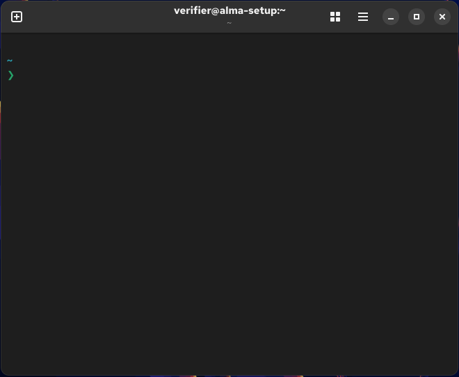
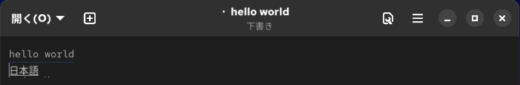
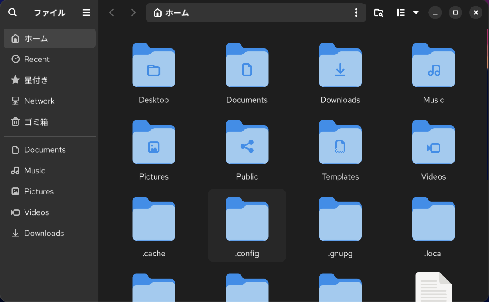

# AlmaLinux 10 の初期設定の手順（インストール直後の更新・sudo・SSH・導入元・日本語入力・GNOME・シェルのツール）の検証記録

[手順書](../almalinux-setup.md)・[ロールバックと注意点](../extra/almalinux-setup.md)

## 補足

### 対象と検証環境

- **目的**: AlmaLinux 10 の Workstation を入れた直後の PC で、更新・sudo・ファームウェア・SSH・journal・kdump、導入元（EPEL・RPM Fusion・Flathub・Homebrew）、日本語入力と GNOME の表示・入力、共通の bash 設定とシェルのツールを、1 本の手順で整える
- **方式**: 上から順に貼る 73 の手順と、任意節・更新・ロールバック。2026-10-08 に、13 本の手順書（epel・rpmfusion・bash-settings・homebrew・flatpak・japanese-input・gnome-power・starship・zoxide・fzf・eza・bat・tmux）をこの文書にまとめた
- **状態**: **2026-10-08 に、x86_64 の VirtualBox の VM（公式 ISO の Workstation のクリーンインストールから新しく作ったもの）で通した**（[付録](#付録-x86_64-の-virtualbox-の-vm-で通した記録2026-10-08)）
  - 通したもの: 実施手順 1〜73（手順 8・12 は条件に当たらず飛ばした）、任意節 11（12 のうち、Claude Code を tmux の中で動かす節を除く）と、starship・bat の設定ファイルの節、更新、ロールバック 1〜42（手順 14・27 は条件に当たらず飛ばした）。見つけて直したブロックは、同じ VM か、スナップショットに戻した VM で流し直した
  - 確認したこと: パスワードを聞くのが手順 3 の 1 回だけ、再起動の後も設定が残る（2 回）、GNOME の画面とキー（時計・ダークモード・ボタン・Ctrl+Alt+T・Alt+Tab・Caps Lock・拡大率・日本語入力・Files）、ロールバックの後に実施前の値へ戻る（最後に sudo がパスワードを聞く）
  - 確認していないこと: 実機・aarch64・Raspberry Pi・Server with GUI、JIS の物理キーボード、Wake on LAN の実際の起動と UEFI の設定、ファームウェアの実際の更新、Claude Code のログインが要る節、インターネットに出られないホスト
- **統合前の記録**: もとの 13 本の検証記録は、この文書の後ろの「統合前の記録」に、中身を変えずに移した（[EPEL](#統合前の記録-epelもとは-epelmd) から [tmux](#統合前の記録-tmuxもとは-tmuxmd) まで）。各節の冒頭に、当時の手順と今の手順の対応表を置いた

> [!NOTE]
> 出力の中の、この VM の値は `<USER>`（試験用のユーザー）・`<HOSTNAME>`（手順 10 で変えた名前）・`<OLD_HOSTNAME>`（変える前の名前）で書いた。画面の写真は、試験用の名前のまま撮った。パスワードは載せていない。

| 項目 | 内容 |
|---|---|
| ホスト | Windows 11 Pro、VirtualBox 7.2.20（Hyper-V の NEM のバックエンド） |
| VM | `clean-install` のスナップショット（AlmaLinux 10.2 の Workstation。[AlmaLinux 10 の環境構築の記録](../almalinux-vm-verification.md)と同じベース）からのリンククローン。EFI、2 vCPU、RAM 6 GiB、VMSVGA（1280×800）、NAT と SSH の転送 |
| ゲスト | AlmaLinux 10.2、kernel `6.12.0-211.61.1.el10_2.x86_64`、GNOME Shell 49.4、mutter 49.4、gdm 47.0、Nautilus 47.6、Ptyxis 47.13、fwupd 2.0.19、systemd 257、dnf 4.20.0、SELinux Enforcing、ロケール `ja_JP.UTF-8`、US キーボード |
| 入れたもの | `epel-release` 10-6（後で 10-8）、`rpmfusion-free-release` 10-1、Flatpak 1.16.0 と Flatseal 2.4.1、`gnome-shell-extension-appindicator` 61、Homebrew 7.0.8、starship 1.26.0・zoxide 0.10.0・fzf 0.74.4・eza 0.23.5・bat 0.26.1・tmux 3.7c、共通の bash 設定（`ryo-aoki-pc/bash` の `bdb64c2`） |
| 貼り方 | 文書から抜き出したブロックを、SSH の対話の bash（`xterm-256color`）にブラケットペーストで 1 つずつ貼った。画面の操作は VirtualBox のキーボード（途中から USB タブレットのポインタ）で行い、画面を撮って確かめた |

### 実施前の状態

| 項目 | 値 |
|---|---|
| sudo | `%wheel ALL=(ALL) ALL` だけ（GUI で入れたのと同じく、パスワードを聞く） |
| GNOME | まだ一度もログインしていない。`color-scheme 'default'`、`button-layout 'appmenu:close'`、時計の曜日・秒と電池の % は `false`、`enable-hot-corners true`、`xkb-options @as []`、Alt+Tab は `switch-applications`、`experimental-features @as []`、`favorite-apps` は既定の 7 つ |
| ホームのフォルダー | 無い（最初のログインで日本語の名前で作られた） |
| journal | `/var/log/journal` が無い（揮発） |
| kdump | `enabled`、`crashkernel=2G-64G:256M,64G-:512M`、予約 268435456 バイト、`auto_reset_crashkernel yes` |
| 導入元 | BaseOS・AppStream・extras・CRB。EPEL・RPM Fusion・Flathub・Homebrew は無い |
| パッケージ | `PackageKit-command-not-found`・`ibus-anthy`・`bash-completion`・`git`・`curl`・`unzip` は入っていた |

### 完了時点の状態

- 実施手順の後: 上の項目がすべて手順書の値になり、再起動の後も残った（[付録](#付録-x86_64-の-virtualbox-の-vm-で通した記録2026-10-08)の手順 68〜73）
- ロールバックの後: sudo はパスワードを聞き、GNOME の値・フォルダーの名前（日本語）・journal（揮発）・kdump（有効）・PC の名前は実施前に戻った
  - 戻らないもの（手順書のとおり）: OS の更新、dnf-automatic で上がった 2 つ（`btrfs-progs`・`epel-release`。EPEL を消しても、入れた `btrfs-progs` は残る）、`~/.bash_history.bak`、`~/.config/bash`（共通の bash 設定の控えに戻しただけ）

---

## 付録: x86_64 の VirtualBox の VM で通した記録（2026-10-08）

### 準備（手順書の外）

- `clean-install` からリンククローン `alma10-setup-20261008` を作り、次の 3 つを行ってからスナップショット `prepped` を取った
  - `/etc/sudoers.d/verifier`（ベースの VM で検証のために置いた NOPASSWD）を消した。GUI で入れたのと同じく、sudo がパスワードを聞く
  - 試験用のユーザーに、VM だけのパスワードを付けた
  - 起動の引数を、シリアルのコンソールの無い一般的な形（`rhgb quiet`）に戻した
- 手順 1・68 の GDM へのログインは、VirtualBox のキー入力で行った（Tab・Enter・パスワード・Enter）
- 手順 27〜41 の `gsettings` などのブロックは、画面にログインしたのと同じユーザーの SSH のシェルに貼った（同じユーザーの D-Bus を使うので、画面にすぐ効いた）。効いたことは画面で確かめた
- 手順 59〜63 のキーは、SSH の端末（`xterm-256color`）にキーの信号を送って確かめた（Ptyxis の窓には送っていない）。fzf の一覧は、端末の出力を pyte で画面に組み立てて読んだ
- **VM の止まり**: ホストの負荷が高いと、起動の途中で VM が 10〜18 分止まった（VirtualBox の `TM: Giving up catch-up attempt at a … lag`。カーネルは `rcu_preempt kthread starved` を出した）。VM を一時停止して再開する（`VBoxManage controlvm … pause` → `resume`）と、すぐに動き出した。手順書の内容とは関係しない

### 実施手順の結果

| 手順 | 結果 |
|---|---|
| 1・2 | 最初のログインで「ようこそ」が出て、ホームに日本語の名前のフォルダーができた |
| 3 | このユーザーで初めての `sudo` で、講習の文とパスワードの問いが出た。`正しく構文解析されました` が 3 行と `sudo はパスワードを聞かない`。以後、手順 47 の Homebrew のインストーラの `sudo -v` を含め、パスワードを聞かなかった（`verifypw=any` が効いた） |
| 4 | 34 パッケージの更新の後に、AlmaLinux の鍵（`0xC2A1E572`、fingerprint `EE6D B7B9 8F5B F5ED D9DA 0DE5 DEE5 C11C C2A1 E572`）の取り込みを聞かれた |
| 5・6 | `このリモートを有効にしますか? [Y\|n]:` に `Y`。`更新可能なデバイスはありません`、`No updatable devices`。スナップショットに戻した VM では、起動の直後の 1 回目が `デーモンへの接続に失敗しました: … タイムアウトしました` で、少し待って貼り直すと通った |
| 7 | `再起動な必要ありません。`（カーネルは更新されなかった）。手順 8 は飛ばした |
| 9・10 | `XKB_LAYOUT` は `us` が自動で入った。`変える前: <OLD_HOSTNAME>`・`変えた後: <HOSTNAME>` |
| 11 | `enabled`・`active`・`yes`・`yes`（Workstation の既定）。手順 12 は飛ばした |
| 13 | `drwxr-sr-x+ … root systemd-journal … /var/log/journal`。手順 69 で前の起動のログが読めた |
| 14・15 | `enabled`・`268435456`・`crashkernel=…` → 外した後の `args=` に `crashkernel=` が無く、`auto_reset_crashkernel no`。再起動の後の `kexec_crash_size` は `0` |
| 16 | `PackageKit-command-not-found` の 1 つだけを消した |
| 17 | `epel-release-10-6.el10` と、弱い依存の `selinux-policy-extra`・`selinux-policy-targeted-extra`（CRB） |
| 18〜21 | 鍵の fingerprint と uid が手順書と一致。`rpmfusion-free-release-10-1` の 1 つだけ。`rpmfusion-free-updates` が有効 |
| 22〜26 | Flatpak 1.16.0。Flathub の鍵 `6E5C 05D9 79C7 6DAF 93C0 8135 4184 DD4D 907A 7CAE`。Flatseal 2.4.1 は確認が 2 回（runtime と権限）で、ダウンロードは表示の上限の合計で 1.1 GB ほど |
| 27・28 | `ibus-anthy-1.5.17` は入っていた。入力ソースは `[('xkb', 'us')]` から `[('xkb', 'us'), ('ibus', 'anthy')]` へ |
| 29 | 8 つのフォルダーが英語の名前に移り、`user-dirs.dirs` と GTK のブックマークも書き換わった。再起動の後のログインで、名前を聞く窓は出なかった |
| 30〜37 | どの読み戻しも手順書の値。`experimental-features` は `['scale-monitor-framebuffer', 'xwayland-native-scaling']` |
| 38・39 | `gnome-shell-extension-appindicator-61` と依存 3 つ。この dnf で EPEL の鍵（`0xE37ED158`、fingerprint `7D8D 15CB FC4E 6268 8591 FB26 33D9 8517 E37E D158`）を聞かれた。再起動の後に `状態: ACTIVE` |
| 40・41 | カスタムのショートカットと `ptyxis --new-window`。Dash は 4 つ |
| 42〜45 | 共通の bash 設定の `install.sh` が `~/.bashrc.before-bash` に控えを取った。`. ~/.bashrc` で `__bash_config_loaded` が `1`。`bash-completion-2.11` は入っていた |
| 46〜48 | 依存の 4 つは入っていた。インストーラは `Press RETURN/ENTER` を 1 回聞き、パスワードは聞かなかった。Homebrew 7.0.8 |
| 49 | 6 つの依存の一覧の後に `==> Do you want to proceed with the installation? [y/n]` を 1 回聞いた |
| 50〜58 | 開き直したシェルで starship のプロンプト。各ツールの版と確認の出力は手順書のとおり（手順 53・56・57 は、この検証で直した） |
| 59〜63 | Tab の補完・大文字小文字の無視・↑ の履歴の検索・`autocd`・`cdspell`・`globstar`・Homebrew の補完、Ctrl+R（行が入るだけで実行しない）、Ctrl+T（bat のプレビュー付き）、`**`+Tab、Alt+C（`builtin cd --`） |
| 64〜66 | 緑のステータス行の `[work] 0:bash*`、`[detached (from session work)]`、`[exited]`、`no server running on /tmp/tmux-<UID>/default` |
| 67・68 | 再起動の後のログインで、時計の曜日と秒・電池の %・`en`・ダークモード・Dash の 4 つ。窓に 3 つのボタン |
| 69 | `journalctl --list-boots` に 2 つの起動、`0`、`<HOSTNAME>`、`/home/<USER>/Downloads`、`anthy - Anthy`（画面の端末で。SSH のシェルでは `IBus に接続できません。`）、`状態: ACTIVE`、2 つの実験的な機能 |
| 70 | 設定の「ディスプレイ」の「スケーリング」に 100 %・125 %・133 %（1280×800）。125 % を選び、「適用」→「この表示設定を保存しますか?」の「変更を保存」で、`~/.config/monitors.xml` に `<scale>1.25</scale>`。2 回目の再起動の後も 125 % のまま |
| 71 | テキストエディターで Caps Lock+A が全部を選んだ。Caps Lock だけでは大文字にならない。Alt+Tab は窓ごと。Ctrl+Alt+T は、ログインの直後の 1 回目は効かず（設定のデーモンがまだ動いていなかった）、数秒後には新しい窓を開いた |
| 72 | Super+Space で上部バーが `あ` に。`nihongo` → Space で「日本語」、Enter で確定 |
| 73 | ホームに英語の名前のフォルダーと隠しファイル、フォルダーが先。サイドバーの `Downloads` で `/home/<USER>/Downloads` が開いた |









### 任意節・更新・ロールバックの結果

| 節 | 結果 |
|---|---|
| SSH を公開鍵だけにする | 試験用の鍵（ホストで作った ed25519）を足し、鍵でログイン → `40-pubkey-only.conf` の後、パスワードは `Permission denied (publickey,gssapi-keyex,gssapi-with-mic).`、鍵は入れた → 戻して `passwordauthentication yes` |
| dnf-automatic | `dnf-automatic-install.timer` の `NEXT` が出た。`ExecStart` は `--installupdates` 付き、`automatic.conf` は `apply_updates = no`・`reboot = never`。手で 1 回動かすと、EPEL の 2 つ（`btrfs-progs`・`epel-release` 10-6 → 10-8）が上がった（鍵は聞かれなかった）。戻して `0 timers listed.` と `true` |
| 画面オフ・画面ロック・自動サスペンド | 手順 1〜5 と、戻す手順 6〜9 の読み戻しは手順書のとおり（`uint32 0`・`false`・`'nothing'`・`masked` が 5 つ・`s "ignore"` → `uint32 300`・`'suspend'`・`static`・`s "suspend"`） |
| Wake on LAN | `LAN_CON`・`LAN_IF` は `enp0s3`。接続の `802-3-ethernet.wake-on-lan` は `magic` になったが、VirtualBox の e1000 は `Supports Wake-on: umbg` なのに `Wake-on: d` のまま（`ethtool -s … wol g` も `netlink error: Operation not supported`）。`systemctl reboot --firmware-setup` で VirtualBox の UEFI の画面が開き、「Continue」で起動した。電源を切っての起動（手順 6・7）は VM ではできないので行っていない。戻して `default` |
| WezTerm と HackGen Console NF | 先に [hackgen.md](../hackgen.md) の手順 1〜5（2.10.0。`unzip` は入っていた）と [wezterm-nightly.md](../wezterm-nightly.md) の手順 1〜4（`20261005_054844_37254829`、COPR の鍵 `FD90 9B62 88A8 4250 AD58 020F A698 91C5 CEA2 757D`）を通した。Ctrl+Alt+T で WezTerm が開き、Dash の端末が WezTerm に。Ptyxis は `use-system-font true` で等幅のフォントに従った。戻して既定の値 |
| Homebrew を root のシェルでも使う | root にも共通の bash 設定を入れて（bash の README と同じ 2 行を root で）、`sudo -i` の PATH の先頭に Homebrew、`command -v brew` が出た。bash のロールバックで戻した |
| Homebrew を sudo でも使う | `正しく構文解析されました` の 3 行、`secure_path` の末尾に Homebrew、`sudo bash -c 'type -a bat'` が Homebrew の bat。戻して `/sbin:/bin:/usr/sbin:/usr/bin` |
| starship | プリセット `plain-text-symbols` で 335 行、プロンプトが `>` に。設定ファイルの節の `cat >` は、そのプリセットを置き換えた。常に表示する節で `[username]`・`[hostname]` が足された |
| fzf で fd と bat | fd 10.5.0 は `[y/n]` を聞かなかった。開き直したシェルで `FZF_*` の 4 つ。Ctrl+T の一覧から `.git` の中が消えた（bat のプレビューは、この節の前から出ていた） |
| bat の設定ファイル | 3 行と `/home/<USER>/.config/bat/config` |
| tmux の設定ファイル | 4 行、`mouse on`・`history-limit 50000` |
| Claude Code を tmux の中で動かす | 流していない（VM で Claude のアカウントにログインできない）。統合前の tmux.md の記録を参照 |
| 更新 | `Already up to date.`（bash）、`Already up-to-date.` と空の `brew outdated`（手順 3 は飛ばした）、`Nothing to do.`（Flatpak） |
| ロールバック 1〜13 | どの読み戻しも実施前の値（`'default'`・`'appmenu:close'`・`false`・`@as []`・既定の 7 つのお気に入り・`['background-logo@fedorahosted.org']`・`@a(ss) []`）。設定で 125 % を 100 % に戻してから手順 8 を行った |
| ロールバック 15 | 8 つのフォルダーが日本語の名前に戻り、ブックマークも戻った |
| ロールバック 16〜23 | `no server running`、履歴の控え。starship を消した後のシェルは、プロンプトのたびに `…/starship: そのようなファイルやディレクトリはありません` を出した（この検証で手順書に書いた）。bash リポジトリの quick-start.md のロールバックで `~/.bashrc` を控えに戻し、開き直したシェルは OS の既定のプロンプトと `HISTSIZE` 1000 |
| ロールバック 24〜26 | `brew leaves` は `fd`（任意節の fd。この検証で、その節に戻す手順を足した）。アンインストーラの後に `/home/linuxbrew` が 308K 残った（`etc/` の証明書・openssl・dbus の設定、`lib/ld.so`、`var/lib/dbus`）ので、手順 26 で消す形にした |
| ロールバック 28〜35 | Flatseal・runtime 5 つ・Flathub、`rpmfusion-free-release`・その鍵、`epel-release`・その鍵 |
| ロールバック 36〜42 | `PackageKit-command-not-found` を入れ直し、kdump は `auto_reset_crashkernel yes`・`crashkernel=…` が戻って再起動の後に `268435456`。journal は揮発、名前は `<OLD_HOSTNAME>`、`/home/<USER>/ダウンロード`。再起動の後は淡色・時計は時刻だけ・閉じるボタンだけ。最後に `sudo: パスワードが必要です` |

### 見つけて直したこと

- **手順 5・6**: `fwupdmgr refresh` は LVFS を有効にするかを聞き、`--assume-yes` を付けても聞いた。`refresh` と `update` を別の手順にした
- **手順 13**: 最初の版は `systemd-tmpfiles` を `journalctl --flush` の前に置いていた。新しい VM では `/var/log/journal` が `drwxr-xr-x. root root` のままだった（tmpfiles の `z`・`a+` は、すでにあるものだけを直す。ディレクトリは flush で作られる）。flush の後に移し、スナップショットに戻した VM で `drwxr-sr-x+ root systemd-journal` になることを確かめた
- **ロールバック 38**: 設定を消してから `/var/log/journal` を消すと、動いている journald がすぐに作り直し、再起動の後も `Storage=auto` のままディスクに書き続けた（2 回とも）。先に `journalctl --relinquish-var` を行う形にし、`/var/log/journal` が無くなることを確かめた
- **手順 53**: Alt+C の割り当ては `bind -X` ではなく、マクロとして `bind -s` に出る。`bind -s | grep -F '"\ec"'` を足した
- **手順 56・57**: `rpm -q` の日本語の文と、zoxide の版（0.10.0）
- **手順 61・62**: `bashrc` と打つと共通の bash 設定の `.config/bash/bashrc` が先頭に来るので `.bashrc` と打つ形に。bat のプレビューは手順 49 の後から出る。`doc/bash` の先頭は `/usr/share/doc/bash/`
- **手順 70**: GNOME 49 の設定の名前は「拡大率」ではなく「スケーリング」。確認の窓は「この表示設定を保存しますか?」と「変更を保存」
- **手順 73**: サイドバーのブックマークは英語の名前（`Documents`・`Downloads`）で出る
- **Wake on LAN の手順 2**: `Wake-on: d` のままのとき（アダプターが受け付けない）を足した
- **fzf の任意節**: bat のプレビューは共通の bash 設定が bat を見つけて入れるので、この節の前から出ている。fd を戻す手順が無かったので足した
- **starship の設定ファイルの節・Homebrew を sudo でも使う節**: 上書きと、root の共通設定が残すものの説明
- **ロールバック**: 8 の前に 100 % に戻すこと（リード）、18 の後のプロンプトの表示、24 の `brew` のフルパス（手順 22 の後は PATH に無い）、25・26 の残ったファイル、41 の `journalctl --list-boots` の見出しの行（`wc -l` は 2 になった。`--no-legend` は `unrecognized option`）
- **手順書の外のリンク**: README の見出しが参考資料へ移っていた bash（読む順番）・lazygit（主な設定内容）・yazi（独自キーバインド）へのリンクを、移った先に直した

### 確認していないこと

- 実機（ノート PC・デスクトップ）、aarch64・Raspberry Pi、Server with GUI、JIS の物理キーボード（半角/全角キー）
- ファームウェアの実際の更新（VM に更新できる機器が無い）、手順 8 の再起動（再起動が要る更新が無かった）、手順 12・27・44 と、ロールバック 14・27 の入れる・消す側（どれも既にあった）
- Wake on LAN の実際の起動と UEFI の設定の項目、拡大率を高い解像度の実際の画面で見ること
- dnf-automatic のタイマーが翌日に自分で動くこと（手で 1 回動かしただけ）、GNOME Software の設定の画面
- Claude Code を tmux の中で動かす節（アカウントへのログイン）、インターネットに出られないホスト
- 使い方の基本の表（Flatpak・Homebrew・fzf・tmux）と、eza の表示の表は、この検証では流していない（統合前の記録を参照）

### 静的な確認

- 文書から抜き出した 155 の bash のブロックに `bash -n` をかけ、誤りは 0
- `sudo` の後ろに行が続くブロック（`bash -n` が通る最小の単位で区切り、`sudo` の単位の後ろにコメント以外の単位が残るもの）は 0
- ShellCheck 0.11.0（公式の静的なバイナリを VM で使った）で、誤りは 0。警告は、変数だけのブロック（SC2034 が 12）・`. ~/.bashrc`（SC1090 が 2）・`cd`（SC2164 が 2）で、どれも 1 つずつ貼る形のため
- アラートは 5 つで、どれも本文の最上位。コードフェンスは閉じている
- docs の 7 つのサブモジュールの Markdown のリンク（相対と `github.com/ryo-aoki-pc/<リポジトリ>/blob/<ブランチ>/…`）とアンカーを、GitHub の見出しの規則で確かめた
- 共通の bash 設定（`ryo-aoki-pc/bash`）のコメントの直しの後に、VM で `bash -n bashrc install.sh` と `python3 -m unittest discover -s tests`（8 件）が通った

---

## 統合前の記録: EPEL（もとは epel.md）

もとの `epel.md` の検証記録を、内容を変えずに移したもの。見出しはこの文書の中で重ならないように、頭にツールの名前を付けて 1 段下げた。リンクは今の場所に直したが、本文の「手順 N」と、リンクの文字の文書名は、当時の手順書のまま。当時の手順と今の [AlmaLinux 10 の初期設定](../almalinux-setup.md)の手順の対応は次のとおり。

| 当時の手順 | 今の手順 |
|---|---|
| 実施手順 1〜3 | 実施手順 17 |
| 更新 1 | 更新のリード（OS は実施手順 4） |
| ロールバック 1・2 | ロールバック 34・35 |

以下は文書分離前から保存されている記録です。実施日・対象版・実行範囲は各記録に従います。

### EPEL: 補足

#### EPEL: 実施手順 / 手順 2: 補足: 一緒に入るものと、CRB の案内

素のコンテナでは、`epel-release` と、弱い依存の `dnf-plugins-core` の 2 つが入った:

```
Installing:
 epel-release            noarch        10-6.el10            extras         18 k
Installing weak dependencies:
 dnf-plugins-core        noarch        4.7.0-10.el10        baseos         37 k
```

- `dnf-plugins-core` は `dnf config-manager` のパッケージ。元から入っているホストでは入らない
- SELinux のポリシー（`selinux-policy`）が入っているホストでは、CRB の `selinux-policy-extra` と `selinux-policy-targeted-extra` も入る
  - `epel-release` の弱い依存 `(selinux-policy-epel if selinux-policy)` を満たすため
  - aarch64 の実機で、`epel-release` が [RPM Fusion](../almalinux-setup.md) の依存として入ったときの記録（[firefox.md の付録](firefox.md#付録-実機での本実行2026-09-28)）

最後に scriptlet がこのメッセージを出す:

```
Many EPEL packages require the CodeReady Builder (CRB) repository.
It is recommended that you run /usr/bin/crb enable to enable the CRB repository.
```

AlmaLinux 10 では CRB が既定で有効（素のコンテナでも `dnf repolist enabled` に `crb` がある）なので、`crb enable` は要らない。

extras の `epel-release` は `10-6.el10` で、EPEL 自身が出している `10-8.el10_2` より古い。**一度 EPEL が有効になれば、[更新](../almalinux-setup.md#更新)で EPEL の `epel-release` に上がる**ので、差は放っておいてよい。

#### EPEL: ロールバック / 手順 0: 本文中の記録

- この節の手順はコンテナと x86_64 の VM で本実行した

#### EPEL: ロールバック / 手順 1: 補足: --noautoremove を付ける理由

付けないと、手順 2 で弱い依存として入った `dnf-plugins-core` も「使われなくなった依存」として一緒に消える（コンテナでの実測）。`dnf config-manager` のパッケージで、[zoxide.md](../almalinux-setup.md) などでも使うので残す。

```
Removing:
 epel-release           noarch       10-6.el10              @extras        25 k
Removing unused dependencies:
 dnf-plugins-core       noarch       4.7.0-10.el10          @baseos        22 k
```

RPM Fusion が残っている状態では、`Removing dependent packages:` に `rpmfusion-free-release` が出た。

#### EPEL: 対象と検証環境

- **目的**: AlmaLinux 10 で EPEL（Extra Packages for Enterprise Linux。Fedora のプロジェクトが EL 向けに作る追加のパッケージ）を有効にし、AppStream / BaseOS に無い RPM を dnf で入れられるようにする
- **進め方**: AlmaLinux の `extras` にある `epel-release` を入れる。読者が編集する変数は無い
  - もとは [btop.md](../btop.md) などの手順の中にあった 3 つの手順を、共有の前提として 1 本にした
- **状態**: **手順 2 はコンテナと x86_64 の VM で検証済み（VM は 2026-10-06）。手順 1・3 は x86_64 の実機でも通した**
  - 手順 1〜3 のコマンドは、この文書に移す前に、EPEL を使う手順書の検証で通したもの
    - コンテナ: [btop.md](btop.md#付録-コンテナでの検証記録2026-09-22)（2026-09-22、aarch64）、[virtualbox.md](virtualbox.md#付録-コンテナでの検証記録2026-09-24)（2026-09-24）、[distrobox.md](distrobox.md#付録-コンテナでの検証記録2026-09-27)・[podman-compose.md](podman-compose.md#付録-コンテナでの検証記録2026-09-27)（2026-09-27）、[podman-tui.md](podman-tui.md#付録-コンテナでの検証記録2026-09-28)（2026-09-28）。aarch64 と明記したもの以外は x86_64
    - x86_64 の実機（[virtualbox.md の本実行](virtualbox.md#付録-実機での本実行2026-09-29)、2026-09-28）: EPEL が有効だったので、手順 1・3 だけ通した
  - 2026-09-29 に、この文書のブロックを x86_64 のコンテナでもう一度通した（[付録](#epel-付録-コンテナでの検証記録2026-09-29)）
    - 手順 1〜3、[更新](../almalinux-setup.md#更新)、[ロールバック](../extra/almalinux-setup.md#ロールバック)
    - [rpmfusion.md](../almalinux-setup.md) を続けて通し、そのロールバックの後にこの文書のロールバックを行った
  - **確認していないこと**: 実機での手順 2（`dnf install epel-release`）
    - aarch64 の実機では、`epel-release` は RPM Fusion の依存として入った（[firefox.md の付録](firefox.md#付録-実機での本実行2026-09-28)）

| 項目 | x86_64 の実機 | 検証コンテナ（2026-09-29） |
|---|---|---|
| 実施日 | 2026-09-28（[virtualbox.md](../virtualbox.md) の中で） | 2026-09-29 |
| OS | AlmaLinux 10.2 (Lavender Lion) / x86_64（AMD のノート PC） | 同左（`quay.io/almalinuxorg/almalinux:10`、Docker 29.3.1） |
| dnf | 4.20.0 | 4.20.0 |
| EPEL | **有効**（`epel-release-10-8.el10_2`。手順 2 は不要） | 未設定 → 手順 2 で `epel-release-10-6.el10` を導入 → [更新](../almalinux-setup.md#更新)で `10-8.el10_2` |

> [!NOTE]
> 出力例の値は `<USER>` / `<HOSTNAME>` のプレースホルダで書いてある。`epel-release` の版は実行日によって変わる。**鍵の fingerprint は公開情報なので本文に書いてある。**

手順書全体に関わる理由・実測・落とし穴と検証記録（手順ごとのものは各手順の末尾の「補足」にある）。手順を実行するだけなら読まなくてよい。

#### EPEL: 選択した方針

- **extras の `epel-release` を入れる**: AlmaLinux のリポジトリから入り（鍵の確認は出なかった）、URL を書かずに済む
  - EPEL の文書（Getting Started）は、EL10 向けに `dnf config-manager --set-enabled crb` の後、Fedora のサイトの `epel-release-latest-10.noarch.rpm` を URL で入れる方法を載せている
  - AlmaLinux では extras に `epel-release` があるので、URL の方法は使わない（試していない）
- **CRB は有効にしない**: AlmaLinux 10 では既定で有効（[導入元一覧](../tool-catalog.md#導入経路と-el10-での注意)）
- **鍵は先に取り込まない**: 最初に EPEL のパッケージを入れるときに、dnf がローカルのファイルから取り込む。確認は 1 回だけで、使う側の手順書の導入の手順にそう書いてある
- **独立した手順書にした**: EPEL を使う手順書が 5 本と [RPM Fusion](../almalinux-setup.md) になり、同じ 3 つの手順が各文書に重なっていたため

#### EPEL: 付録: コンテナでの検証記録（2026-09-29）

**環境**: Ubuntu 24.04 / x86_64 のクラウドホスト上の Docker 29.3.1 で、`quay.io/almalinuxorg/almalinux:10`（`sha256:8322019282c6f7d253888ec688d6b90675963f31c4692709177e25eb9301c4c8`、AlmaLinux 10.2）を非特権・`--network host` で立てた。実機で加えた変更は無い。

**手順書の外で行った準備**（検証環境の都合）:

- プロキシの CA を信頼ストアに足し、dnf にプロキシを設定した
- プロキシが平文の HTTP を通さないので、AlmaLinux のミラー一覧の URL に `?protocol=https`、EPEL の metalink に `&protocol=https` を足した（EPEL は手順 2 の直後）
- `sudo` と `gnupg2` を入れ、NOPASSWD の `sudo` を与えた非 root ユーザーを作った

**流し方**: 同じ作りのコンテナで 2 回通した。どちらも非 root ユーザーのログインシェルで実行し、`dnf install` / `dnf upgrade` / `dnf remove` には `-y` を付けた。

- 1 回目: 本文と同じコマンドを手で打った。手順書の外のコマンドも混ぜて、下の箇条書きのことを確かめた
- 2 回目: 新しいコンテナで、この文書と [rpmfusion.md](../almalinux-setup.md) の bash のブロックをファイルから抜き出して流した。順番は、手順 1〜3 → rpmfusion.md の手順 1〜4 → [更新](../almalinux-setup.md#更新) → rpmfusion.md のロールバック → [ロールバック](../extra/almalinux-setup.md#ロールバック)

2 回目の結果:

| 手順 | 結果 |
|---|---|
| 1. 確かめる | `EPEL は未設定`（有効なのは appstream / baseos / crb / extras の 4 つ） |
| 2. 導入 | `epel-release-10-6.el10`（extras）と、弱い依存の `dnf-plugins-core-4.7.0-10.el10`（baseos）の 2 つ。scriptlet が CRB の案内を出した |
| 3. 確かめる | `epel-release-10-6.el10.noarch` と `epel                 Extra Packages for Enterprise Linux 10 - x86_64` |
| 更新 | `epel-release` が `10-6.el10`（extras）から `10-8.el10_2`（epel）に上がった。EPEL の鍵が未登録だったので、ここで `Importing GPG key 0xE37ED158:` が出た（`-y` で取り込まれた） |
| ロールバック | 先に rpmfusion.md のロールバックを行った。手順 1 の `Removing:` は `epel-release`（`10-8.el10_2`、`@epel`）の 1 つだけで、`dnf-plugins-core` は残った。手順 2 で鍵（`gpg-pubkey-e37ed158-65785fa9`）が消え、`dnf repolist enabled` から `epel` の行が消えた |

- ロールバックで、`epel.repo` と `epel-testing.repo` が `.rpmsave` として残った。検証のために metalink を書き換えていたため（書き換えた設定ファイルを rpm が残す）

1 回目に確かめたこと:

- 手順 3 の補足の鍵の表示は、手順書の外で EPEL の btop を入れたときのもの
- `epel-release` を消した後も、EPEL から入れた btop は残った（[ロールバック](../extra/almalinux-setup.md#ロールバック)のアラート）
- `--noautoremove` を付けない `dnf remove --assumeno epel-release` では、`dnf-plugins-core` も消える表になった
- RPM Fusion を入れた状態の `dnf remove --assumeno epel-release` では、`rpmfusion-free-release` が `Removing dependent packages:` に出た

##### EPEL: 未確認事項

- 実機での手順 2 と、aarch64 での手順 2（aarch64 は、この文書に移す前の [btop.md の付録](btop.md#付録-コンテナでの検証記録2026-09-22)でコンテナでのみ通した）
- 実機での[更新](../almalinux-setup.md#更新)と[ロールバック](../extra/almalinux-setup.md#ロールバック)
- SELinux が有効なホストで、手順 2 が `selinux-policy-extra` を入れること（RPM Fusion の依存で入ったときの記録しか無い）

#### EPEL: 付録: クリーンインストールした VM での検証（2026-10-06）

AlmaLinux 10.2 Workstation を ISO から新規に入れた VirtualBox の VM（x86_64、1 vCPU、メモリ 6 GiB、SELinux Enforcing、日本語 UI、US 配列）で、検証用ユーザーの SSH PTY に現行のブロックを個別に貼った。利用者のアカウントは使っていない。

実施手順 1〜3、更新、ロールバック 1・2 を本実行した。未設定の状態から extras の `epel-release-10-6.el10` と CRB の `selinux-policy-extra`・`selinux-policy-targeted-extra`（ともに `42.1.18-4.el10_2.3`）の計 3 パッケージが入った。Workstation に `dnf-plugins-core` は既にあったため追加されなかった。CRB は既定で有効だった。別のクリーン VM でも同じ 3 パッケージが入った。

続けて Firefox の FFmpeg を入れるとき、EPEL 10 の署名鍵の fingerprint と uid を照合して取り込めた。更新の手順は `epel-release-10-8.el10_2` への 1 パッケージの upgrade になった。実機での手順 2 と aarch64 の今回の実行は確認していない。

ロールバックは RPM Fusion を先に外してから行い、`--noautoremove` で epel-release だけが消えた。EPEL の署名鍵も削除できた。SELinux の extra ポリシーは残した。

#### EPEL: 付録: 現行版の新規 VM での再検証（2026-10-06）

公式 ISO から新規導入した AlmaLinux 10.2 Workstation の x86_64 VM（kernel `6.12.0-211.61.1.el10_2.x86_64`、SELinux Enforcing、firewalld active）で、`5da3478` の本文を SSH 対話 PTY に渡した。試験専用のユーザー・鍵と設定値を使用し、利用者の実アカウントの資格情報は持ち込んでいない。

実施手順 1〜3 を通した。未設定の状態から extras の epel-release-10-6.el10 と、CRB の selinux-policy-extra / selinux-policy-targeted-extra が入り、epel が有効になった。CRB は OS の既定で有効で、追加の有効化は行っていない。この再検証では更新・ロールバックを実行していない。

#### EPEL: 手順中の実測・検証状況の記録

> **手順 2（`epel-release` の導入）は、コンテナとクリーンな x86_64 の VM で通した**（[対象と検証環境](#epel-対象と検証環境)）。

#### EPEL: 実施手順 / 手順 3: 補足: 出力例と、EPEL の鍵

コンテナでの出力:

```
$ rpm -q epel-release
epel-release-10-6.el10.noarch
$ dnf repolist enabled | grep -E '^epel'
epel                 Extra Packages for Enterprise Linux 10 - x86_64
```

dnf は鍵をこのローカルファイルから取り込む。**[gh.md](../gh.md) や [rpmfusion.md](../almalinux-setup.md) のように、公開鍵を HTTPS で取りに行く手順は要らない。** コンテナで、EPEL の btop を入れたときの途中の表示:

```
Importing GPG key 0xE37ED158:
 Userid     : "Fedora (epel10) <epel@fedoraproject.org>"
 Fingerprint: 7D8D 15CB FC4E 6268 8591 FB26 33D9 8517 E37E D158
 From       : /etc/pki/rpm-gpg/RPM-GPG-KEY-EPEL-10
Key imported successfully
```

#### EPEL: 手順内の実測・検証状況

> - x86_64 の実機は EPEL が有効だったので、手順 1・3 だけ通した

#### EPEL: 手順内の実測・検証状況

> - aarch64 の実機では、[RPM Fusion](../almalinux-setup.md) の依存として `epel-release` が入った

---

## 統合前の記録: RPM Fusion（もとは rpmfusion.md）

もとの `rpmfusion.md` の検証記録を、内容を変えずに移したもの。見出しはこの文書の中で重ならないように、頭にツールの名前を付けて 1 段下げた。リンクは今の場所に直したが、本文の「手順 N」と、リンクの文字の文書名は、当時の手順書のまま。当時の手順と今の [AlmaLinux 10 の初期設定](../almalinux-setup.md)の手順の対応は次のとおり。

| 当時の手順 | 今の手順 |
|---|---|
| 実施手順 1〜4 | 実施手順 18〜21 |
| ロールバック 1・2 | ロールバック 32・33 |

以下は文書分離前から保存されている記録です。実施日・対象版・実行範囲は各記録に従います。

### RPM Fusion: 補足

#### RPM Fusion: 実施手順 / 手順 1: 補足: 鍵の出所

鍵は RPM Fusion の [keys](https://rpmfusion.org/keys) ページの添付ファイル。同じページの「RPM Fusion free for EL 10」の fingerprint（`5FC4 AE73 FC2B 08B9 DFE7 EB99 0C84 89D8 DB85 DDD7`）と一致した:

```
pub   rsa4096 2025-02-07 [SC]
      5FC4AE73FC2B08B9DFE7EB990C8489D8DB85DDD7
uid                      RPM Fusion free repository for EL (10) <rpmfusion-gpg-key-el10-free@rpmfusion.org>
```

`gpg` は `gnupg2` のコマンド。素のコンテナには入っていなかったので、検証では先に入れた。

`gpg` を初めて使うユーザーでは、`pub` 行の前に `~/.gnupg` を作ったという行が出る。鍵の照合には関係ない。x86_64 の実機では次の 2 行、2026-09-29 のコンテナでは 1 行目だけが出た:

```
gpg: directory '/home/<USER>/.gnupg' created
gpg: /home/<USER>/.gnupg/trustdb.gpg: trustdb created
```

#### RPM Fusion: 実施手順 / 手順 3: 補足: 署名の確認と、EPEL を前提にした理由

**署名の確認**: dnf 4.20 の既定は `localpkg_gpgcheck = 0` で、URL やファイルで渡したパッケージの署名を確かめない。`--setopt=localpkg_gpgcheck=1` を付けると確かめる。手順 2 の鍵が無いコンテナでは、次のように止まって何も入らなかった:

```
Public key for rpmfusion-free-release-10.noarch.rpm is not installed
The downloaded packages were saved in cache until the next successful transaction.
You can remove cached packages by executing 'dnf clean packages'.
Error: GPG check FAILED
```

- RPM Fusion の [Configuration](https://rpmfusion.org/Configuration) は、EL 向けに `--nogpgcheck` で入れる例を載せている
- 一方 [keys](https://rpmfusion.org/keys) の「Verify GPG signatures on install」は、鍵を先に取り込んで `localpkg_gpgcheck=1` で入れる方法を案内しており、本書は後者にした
- `mirrors.rpmfusion.org` はミラーへリダイレクトする（2026-09-28 の aarch64 のコンテナでは `mirrors.ustc.edu.cn`）ので、署名で確かめる意味がある

**EPEL を前提にした理由**: `rpmfusion-free-release` は `epel-release >= 10` を要求する。RPM Fusion の Configuration も、EL では RPM Fusion より先に EPEL を有効にするよう書いている。

EPEL が有効なホストで入るのは、`rpmfusion-free-release` の 1 つだけだった（x86_64 の実機と、2026-09-29 のコンテナ）:

```
Installing:
 rpmfusion-free-release       noarch       10-1        @commandline        10 k
```

EPEL を有効にしていないホストでも、`epel-release` が依存として extras から一緒に入るので、この手順は通る。

- 素のコンテナ（2026-09-28）では、`rpmfusion-free-release`・`epel-release`・弱い依存の `dnf-plugins-core` の 3 つが入った
- aarch64 の実機（GNOME のデスクトップ、SELinux は Enforcing）では、`dnf-plugins-core` の代わりに CRB の `selinux-policy-extra` と `selinux-policy-targeted-extra` が入り、4 パッケージになった（[epel.md 手順 2 の補足](../almalinux-setup.md#実施手順)）

```
Packages Altered:
    Install selinux-policy-extra-42.1.18-4.el10_2.3.noarch          @crb
    Install selinux-policy-targeted-extra-42.1.18-4.el10_2.3.noarch @crb
    Install epel-release-10-6.el10.noarch                           @extras
    Install rpmfusion-free-release-10-1.noarch                      @@commandline
```

依存で入った `epel-release` は、[ロールバック](../extra/almalinux-setup.md#ロールバック)で一緒に消えやすい（その手順 1 の補足）。本書では EPEL を前提にして、[epel.md](../almalinux-setup.md) で先に入れる。

#### RPM Fusion: 実施手順 / 手順 4: 補足: 出力例と、置かれるファイル

2026-09-29 のコンテナでの出力:

```
$ rpm -q rpmfusion-free-release
rpmfusion-free-release-10-1.noarch
$ dnf repolist enabled | grep -E '^rpmfusion'
rpmfusion-free-updates      RPM Fusion for EL 10 - Free - Updates
```

- repo ファイルは `/etc/yum.repos.d/rpmfusion-free-updates.repo`（有効）と `rpmfusion-free-updates-testing.repo`（無効）
- 鍵のファイル `/etc/pki/rpm-gpg/RPM-GPG-KEY-rpmfusion-free-el-10` も置かれる
- 有効になった後は、例えば `dnf -q list --showduplicates ffmpeg-libs` に `rpmfusion-free-updates` の行が出る（[firefox.md 手順 8](../firefox.md#実施手順)）

#### RPM Fusion: ロールバック / 手順 0: 本文中の記録

- この節の手順はコンテナと x86_64 の VM で本実行した

#### RPM Fusion: ロールバック / 手順 1: 補足: --noautoremove を付ける理由

`epel-release` が[手順 3](../almalinux-setup.md#実施手順) の依存として入ったホスト（EPEL を先に有効にしていなかったホスト）では、付けないと `epel-release` と `dnf-plugins-core` も「使われなくなった依存」として一緒に消える（2026-09-28 のコンテナでの実測）。EPEL はほかの手順書でも使い、`dnf-plugins-core` は `dnf config-manager` のパッケージなので残す。

```
Removing:
 rpmfusion-free-release    noarch    10-1                @@commandline    3.8 k
Removing unused dependencies:
 dnf-plugins-core          noarch    4.7.0-10.el10       @baseos           22 k
 epel-release              noarch    10-6.el10           @extras           25 k
```

[epel.md](../almalinux-setup.md) で EPEL を先に入れたホストでは、付けなくても `rpmfusion-free-release` の 1 つだけだった（2026-09-29 のコンテナ）。

#### RPM Fusion: 対象と検証環境

- **目的**: AlmaLinux 10 で RPM Fusion の free のリポジトリを有効にし、FFmpeg など Fedora・EL の標準のリポジトリに無いパッケージを dnf で入れられるようにする
- **進め方**: 鍵を照合して取り込み、署名を確かめながら `rpmfusion-free-release` を入れる。前提は [EPEL](../almalinux-setup.md)。読者が編集する変数は無い
  - もとは [firefox.md](../firefox.md) の手順 8〜11 と、ロールバックの手順 2〜3 だった。Firefox の FFmpeg から、リポジトリの有効化を切り分けた
- **状態**: **手順 1〜3 は実機で本実行済み（2026-09-28）**。aarch64 と x86_64 の 2 台
  - 2026-10-06: 別の新規 VM で現行手順を再検証した。今回の実施・解除・未実施範囲は[新しい付録](#rpm-fusion-付録-現行版の新規-vm-での再検証2026-10-06)に記録した
  - 2026-10-06: クリーンな x86_64 の VM で実施手順 1〜4 とロールバック 1・2 を本実行し、Firefox の FFmpeg の導入も確認した（末尾の付録）。
  - aarch64 の実機（Raspberry Pi 5）: 利用者が手順どおりに入れた（[firefox.md の付録](firefox.md#付録-実機での本実行2026-09-28)）
    - 鍵（`gpg-pubkey-db85ddd7-67a63d8b`）が登録され、`dnf history` に手順 3 の実行（4 パッケージ）が残っている
    - EPEL は無かったので、手順 3 の依存で入った
  - x86_64 の実機（AMD のノート PC）: EPEL が入ったホストで手順 1〜3 のコマンドを実行した（[firefox.md の付録](firefox.md#付録-x86_64-の実機での本実行2026-09-28)）。手順 3 は `rpmfusion-free-release` の 1 つだけだった
  - コンテナ
    - 2026-09-28 の aarch64 のコンテナで、手順 1〜3 と[ロールバック](../extra/almalinux-setup.md#ロールバック)を通した（[firefox.md の付録](firefox.md#付録-動画が再生できなかった件の切り分け2026-09-28)）
    - 2026-09-29 の x86_64 のコンテナで、[epel.md](../almalinux-setup.md) の後にこの文書のブロックを通した（手順 1〜4 とロールバック。[付録](#rpm-fusion-付録-コンテナでの検証記録2026-09-29)）
  - **手順 4 とロールバックは、コンテナと新規 x86_64 VM で検証**
  - **確認していないこと**: nonfree のリポジトリ、`rpmfusion-free-updates-testing`
  - 2026-10-02: もとの手順 2・3 をつないで `{ … }` で囲んだ。当時は `bash -n` のみだったが、2026-10-06 の新規 VM では現行ブロックを貼って実行した

| 項目 | aarch64 の実機 | x86_64 の実機 | 検証コンテナ（2026-09-29） |
|---|---|---|---|
| 実施日 | 2026-09-28 | 2026-09-28 | 2026-09-29 |
| OS | AlmaLinux 10.2 (Lavender Lion) / aarch64（Raspberry Pi 5） | AlmaLinux 10.2 (Lavender Lion) / x86_64（AMD Strix Halo のノート PC） | AlmaLinux 10.2 (Lavender Lion) / x86_64（`quay.io/almalinuxorg/almalinux:10`、Docker 29.3.1） |
| dnf | 4.20.0 | 4.20.0 | 4.20.0 |
| SELinux | Enforcing | Enforcing | 無効（コンテナ） |
| 手順 3 の前の EPEL | 無し | 有効（鍵も登録済み） | [epel.md](../almalinux-setup.md) で有効にした |
| 手順 3 で入ったもの | `rpmfusion-free-release`・`epel-release`・`selinux-policy-extra`・`selinux-policy-targeted-extra` | `rpmfusion-free-release` だけ | `rpmfusion-free-release` だけ |

> [!NOTE]
> 出力例の値は `<USER>` / `<HOSTNAME>` のプレースホルダで書いてある。版（`10-1`）は実行日によって変わる。**鍵の fingerprint は公開情報なので本文に書いてある。**

手順書全体に関わる理由・実測・落とし穴と検証記録（手順ごとのものは各手順の末尾の「補足」にある）。手順を実行するだけなら読まなくてよい。

#### RPM Fusion: 付録: コンテナでの検証記録（2026-09-29）

**環境**: [epel.md の付録](#epel-付録-コンテナでの検証記録2026-09-29)と同じコンテナで、epel.md の手順 1〜3 の後に行った（2 回）。実機で加えた変更は無い。

**手順書の外で行った準備**: epel.md の付録の準備に加えて、手順 3 の直後に RPM Fusion の metalink を `https://` にし、`&protocol=https` を足した（repo ファイルの metalink は `http://mirrors.rpmfusion.org/...` で、プロキシが平文の HTTP を通さないため）。

**流し方**: epel.md の付録と同じ。1 回目は本文と同じコマンドを手で打ち、2 回目は本文の bash のブロックをファイルから抜き出して流した。どちらも非 root ユーザーのログインシェルで、`dnf install` / `dnf remove` には `-y` を付けた。下の表は 2 回目で、どちらも同じ結果だった。

| 手順 | 結果 |
|---|---|
| 1. 鍵の照合 | fingerprint と uid が本文の値と一致。このユーザーは `gpg` を初めて使ったので、`gpg: directory '/home/<USER>/.gnupg' created` の 1 行が先に出た |
| 2. 取り込み | 何も表示せずに終わった |
| 2. 確かめる | `gpg-pubkey-db85ddd7-67a63d8b RPM Fusion free repository for EL (10) <rpmfusion-gpg-key-el10-free@rpmfusion.org> public key` |
| 3. リポジトリ | EPEL が有効なので、`Installing:` は `rpmfusion-free-release 10-1 @commandline` の 1 つだけ |
| 4. 確かめる | `rpmfusion-free-release-10-1.noarch` と `rpmfusion-free-updates      RPM Fusion for EL 10 - Free - Updates` |
| ロールバック | epel.md の[更新](../almalinux-setup.md#更新)の後に行った。手順 1 の `Removing:` は `rpmfusion-free-release` の 1 つだけ。手順 2 で鍵が消えた。続けて [epel.md のロールバック](../extra/almalinux-setup.md#ロールバック)を行った |

- 1 回目は、手順 4 の後に手順書の外の `dnf -q list --showduplicates ffmpeg-libs` を実行し、`ffmpeg-libs.x86_64  7.1.5-1.el10  rpmfusion-free-updates` が出た
- 1 回目は、手順 3 の後の `dnf remove --assumeno rpmfusion-free-release`（`--noautoremove` 無し）も、`rpmfusion-free-release` の 1 つだけだった。`epel-release` を epel.md で入れたので、依存として入ったものではない
- ロールバックの後、metalink を書き換えた repo ファイルが `.rpmsave` として残った（[epel.md の付録](#epel-付録-コンテナでの検証記録2026-09-29)と同じ）

##### RPM Fusion: 未確認事項

- 実機での手順 4 とロールバック
- aarch64 での手順 4
- nonfree のリポジトリと、`rpmfusion-free-updates-testing`

#### RPM Fusion: 付録: クリーンインストールした VM での検証（2026-10-06）

AlmaLinux 10.2 Workstation を ISO から新規に入れた VirtualBox の VM（x86_64、1 vCPU、メモリ 6 GiB、SELinux Enforcing、日本語 UI、US 配列）で、検証用ユーザーの SSH PTY に現行のブロックを個別に貼った。利用者のアカウントは使っていない。

EPEL の実施手順 1〜3 の後、実施手順 1〜4 とロールバック 1・2 を本実行した。公式の鍵の fingerprint `5FC4AE73FC2B08B9DFE7EB990C8489D8DB85DDD7` と uid を照合し、rpm に取り込んでから `localpkg_gpgcheck=1` で `rpmfusion-free-release-10-1` を入れた。入ったのはこの 1 RPM だけで、有効な `rpmfusion-free-updates` から Firefox の `ffmpeg-libs-7.1.5-1.el10` を導入できた。nonfree と aarch64 の今回の実行は確認していない。

FFmpeg を外した後のロールバックは、`--noautoremove` で rpmfusion-free-release だけが消え、EPEL は残った。RPM Fusion の署名鍵も削除できた。

---

#### RPM Fusion: 付録: 現行版の新規 VM での再検証（2026-10-06）

**環境と流し方**: `5da3478` の現行手順を、別のクリーンな AlmaLinux 10.2 Workstation / x86_64 の VM（1 vCPU、SELinux Enforcing、firewalld 稼働、US 配列）で実行した。SSH の一般ユーザーの対話 PTY に折り畳みの外のブロックを手順ごとに貼り、応答とプロンプトを待った。GUI は GNOME 49.4 のヘッドレスセッションに仮想モニターを付け、操作後の PNG を目視した。既存の実機・資格情報は使っていない。

実施手順 1〜4 を本実行した。RPM Fusion free の鍵の指紋は `5FC4 AE73 FC2B 08B9 DFE7 EB99 0C84 89D8 DB85 DDD7`。取得した release RPM の署名を確認し、`rpmfusion-free-release-10-1` と EL10 の free / free-updates を導入した。Firefox の `ffmpeg-libs-7.1.5-1.el10` の取得にも使った。

Firefox と関連の codec を先に外してから、ロールバック 1・2 を実行した。`--noautoremove` で release パッケージだけを削除し、その repo とこの鍵が残らないことを確認した。nonfree、Windows、aarch64 は今回実施していない。

---

## 統合前の記録: bash の設定（もとは bash-settings.md）

もとの `bash-settings.md` の検証記録を、内容を変えずに移したもの。見出しはこの文書の中で重ならないように、頭にツールの名前を付けて 1 段下げた。リンクは今の場所に直したが、本文の「手順 N」と、リンクの文字の文書名は、当時の手順書のまま。当時の手順と今の [AlmaLinux 10 の初期設定](../almalinux-setup.md)の手順の対応は次のとおり。

| 当時の手順 | 今の手順 |
|---|---|
| 実施手順 1 | 実施手順 44 |
| 実施手順 2 | 実施手順 51（今のシェルへの読み込みはやめた） |
| 実施手順 3 | 実施手順 43・51 |
| 実施手順 4 | 実施手順 51 |
| 実施手順 5 | 実施手順 45 |
| 実施手順 6 | 実施手順 50 |
| 実施手順 7 | 実施手順 51 |
| 実施手順 8 | 実施手順 59 |
| ロールバック 1 | ロールバック 17 |
| ロールバック 2 | ロールバック 22 |
| ロールバック 3 | ロールバック 21 |
| ロールバック 4 | ロールバック 27 |
| ロールバック 5 | ロールバック 23 |

以下は文書分離前から保存されている記録です。実施日・対象版・実行範囲は各記録に従います。

### bash の設定: 補足

#### bash の設定: 実施手順: 検証状況の記録

> [!WARNING]
> **現行版 `5da3478` を、共通 bash を新規導入した別の x86_64 VM で再検証した**（末尾の再検証記録）。既存ホストの手動移行は実行していない。
>
> **x86_64 のクリーン VM で検証対象版の実施手順を本実行済み**（2026-10-06）で、実機では本書の手順を通していない（[対象と検証環境](#bash-の設定-対象と検証環境)）。GNOME 端末や WezTerm の画面での色と、Home / End / Ctrl+矢印のキーは確かめていない。

#### bash の設定: 実施手順 / 手順 1: 補足: bash-completion が無いとどうなるか

- bash 自身の補完は、コマンド名・ファイル名・変数名だけ。`systemctl star<Tab>` や `git checko<Tab>` のような、コマンドごとのサブコマンドやオプションの補完は bash-completion（と、各パッケージが `/usr/share/bash-completion/completions/` に置く定義）が行う
- AlmaLinux 10.2 の BaseOS の版は 2.11（2026-10-02）。コンテナの最小のイメージには入っていなかった
- 入れると `/etc/profile.d/bash_completion.sh` が置かれ、対話のシェルを開くときに `/etc/profile`（ログインシェル）か `/etc/bashrc`（それ以外）から読まれる

#### bash の設定: 実施手順 / 手順 2: 補足: . ~/.bashrc では読まれない理由

- `/etc/bashrc` は `/etc/profile.d/*.sh` を**ログインシェルでないとき**だけ読む（`if ! shopt -q login_shell`）。SSH でログインしたシェルで `. ~/.bashrc` を実行しても、`/etc/bashrc` 経由では `bash_completion.sh` に届かない
- `bash_completion.sh` 自身は、対話の bash で、まだ読んでいないとき（`BASH_COMPLETION_VERSINFO` が空）だけ本体を読む。2 回目は何もしない
- `complete -p -D` の `_completion_loader` は、コマンドの補完を最初の Tab のときに `/usr/share/bash-completion/completions/<コマンド>` から読む仕組み（遅延読み込み）。読む前の `complete -p git` は `bash: complete: git: no completion specification` になる
- AlmaLinux 10.2 Workstation のクリーン VM（2026-10-06）では、既存の `python3-argcomplete-3.2.2-4.el10` が既定の補完を `_python_argcomplete_global` にしていた。この関数は argcomplete の対象でなければ `_completion_loader` を呼ぶ。`systemctl star<Tab>` などの補完も通ったので、関数名だけで未読込とは判断しない

- 2026-10-05: シェル設定は bash リポジトリに統一し、直接追記とその削除の手順を確認手順に変更した。変更後のコードブロックは `bash -n` で確認し、共通設定の導入・移行は bash リポジトリの一時ホームのテストで確認した。パッケージ導入・削除やサービス操作は再実行していない。以下の過去の実測・出力例は、直接追記していた時点の記録を含む。現行手順では同じ行を `~/.bashrc` に書かない

#### bash の設定: 対象と検証環境

- **目的**: AlmaLinux 10 の bash で、履歴を多く残し、Tab の補完を広く・楽にし、↑ で打ちかけの行から履歴を探せるようにする。ツールを足すのではなく、bash と readline の設定と、bash-completion の RPM だけで行う
- **進め方**: ツール本体とサービスは本書で導入し、シェルの設定は bash リポジトリから読む。共通設定と別の設定ファイルは、それぞれの節で扱う
- **状態**: **`0dbb522` の直接追記版の実施手順 1〜8 を x86_64 のクリーン VM で本実行済み（2026-10-06）。コンテナでも検証済み（2026-10-02）**。現行版 `5da3478` は、共通 bash 新規導入後の別の VM でも再検証した（末尾の再検証記録）。既存ホストの手動移行は行っていない。
  - 通したこと: SSH でログインした対話の bash に、この文書の bash のブロックをそのまま貼り、実施手順と[ロールバック](../extra/almalinux-setup.md#ロールバック)を、ブラケットペーストの無しと有りで 1 回ずつ通した（[付録](#bash-の設定-付録-コンテナでの検証記録2026-10-02)）
  - 確認したこと
    - 手順 1〜7 の出力、手順 8 のキー操作（tmux のペインにキーを送って画面を読んだ）、[ロールバック](../extra/almalinux-setup.md#ロールバック)
    - `~/.inputrc` に `$include /etc/inputrc` が無いと `/etc/inputrc` の割り当てが消えること、`~/.bashrc` の行を消した後に閉じたシェルが履歴を 1,000 行に切り詰めること
    - [fzf.md](../almalinux-setup.md) の行との並び（手順 4 の補足）
  - **確認していないこと**
    - 実機（aarch64 の Raspberry Pi 5、x86_64 の PC）、GNOME 端末・WezTerm の画面での色と Home / End / Ctrl+矢印
    - 日本語入力との組み合わせ、`python3` など bash 以外の readline のコマンドでの `~/.inputrc`

| 項目 | 検証コンテナ |
|---|---|
| 実施日 | 2026-10-02 |
| OS | AlmaLinux 10.2 (Lavender Lion)（`quay.io/almalinuxorg/10-init`。パッケージは `x86_64_v2`） |
| コンテナ | クラウドのホストの Docker 29.6.2、`--privileged` と `--network host`。systemd を PID 1 にし、sshd と systemd-logind を動かした |
| bash | 5.2.26（BaseOS）。bash-completion は 2.11-16（BaseOS。最初は入っていない） |
| Homebrew | 7.0.7（`/home/linuxbrew/.linuxbrew`）。bat 0.26.1・eza 0.23.5・fd 10.5.0・fzf 0.74.4・starship 1.26.0・zoxide 0.10.0 を入れて補完を確かめた |
| 端末 | ホストの tmux 3.4 のペイン（160x45）から `docker exec -it` で `ssh -t` し、`TERM=xterm-256color` |

> [!NOTE]
> 出力例・ログの中の値は `<USER>` / `<HOSTNAME>` / `<PID>` のプレースホルダで書いてある。

手順書全体に関わる理由・実測・落とし穴と検証記録（手順ごとのものは各手順の末尾の「補足」にある）。手順を実行するだけなら読まなくてよい。

#### bash の設定: 実施前の状態

| 項目 | 状態 |
|---|---|
| bash-completion | 未導入（`rpm -q bash-completion` が `not installed`） |
| `~/.bashrc` | `/etc/skel` のもの（`/etc/bashrc` を読み、`~/.bashrc.d/` があれば読む）に、[homebrew.md 手順 3](../almalinux-setup.md#実施手順) の `brew shellenv` の 1 行 |
| `~/.inputrc` | 無し（`/etc/inputrc` が読まれている） |
| 履歴 | `HISTSIZE=1000`・`HISTFILESIZE=1000`・`HISTCONTROL=ignoredups`、`histappend` は on |

#### bash の設定: 完了時点の状態

実施手順の後（Homebrew のホスト）:

```
$ tail -n 5 ~/.bashrc
HISTSIZE=100000
HISTFILESIZE=100000
HISTCONTROL=ignoreboth
shopt -s autocd cdspell dirspell globstar
if [ -d "${HOMEBREW_PREFIX-}/etc/bash_completion.d" ]; then for __f in "${HOMEBREW_PREFIX}"/etc/bash_completion.d/*; do if [ -r "$__f" ]; then . "$__f"; fi; done; unset __f; fi
$ bind -q history-search-backward
history-search-backward can be invoked via "\eOA", "\e[5~", "\e[A".
$ complete -p -D brew
complete -F _completion_loader -D
complete -o bashdefault -o default -F _brew brew
```

- `~/.inputrc` は手順 5 の 13 行（コメント 3 行を含む）
- [fzf.md 手順 3](../almalinux-setup.md#実施手順) を通すと、`fzf --bash` の行が `bash_completion.d` の行の後ろに付く

#### bash の設定: 付録: コンテナでの検証記録（2026-10-02）

**環境**: [対象と検証環境](#bash-の設定-対象と検証環境)の表のとおり。コンテナには NOPASSWD の sudo を持つ一般ユーザーを作り、root から `ssh -p 2222 <USER>@127.0.0.1` でログインした。

**検証の準備**（本書の手順には含めない）:

- このホストの外向きの HTTPS はプロキシを通るので、プロキシの CA を `/etc/pki/ca-trust/source/anchors/` に置き、`/etc/dnf/dnf.conf` の `proxy=` と、ログインシェルの `HTTPS_PROXY` などを足した
- AlmaLinux の `mirrorlist=` を止めて、コメントの `baseurl=https://repo.almalinux.org/...` を有効にした
- Homebrew は `NONINTERACTIVE=1` 付きの公式インストーラで入れ、`brew install fzf fd bat eza zoxide starship` で補完の対象のコマンドを入れた

**先に調べたこと**（文書の内容を決めるため）:

- `/etc/profile` が `HISTSIZE=1000` と `HISTCONTROL=ignoredups` を、`/etc/bashrc` が `shopt -s histappend` を入れている。`/etc/bashrc` は `/etc/profile.d/*.sh` をログインシェルでないときだけ読む
- `dnf group info standard` の既定のパッケージに `bash-completion` がある。`workstation-product-environment` の必須のグループに `Standard` がある
- `brew shellenv bash` の出力は `HOMEBREW_PREFIX` / `HOMEBREW_CELLAR` / `HOMEBREW_REPOSITORY` / `PATH` / `MANPATH` / `INFOPATH` だけで、`XDG_DATA_DIRS` は無い
- `/home/linuxbrew/.linuxbrew/etc/bash_completion.d/` に `bat` `brew` `eza` `fd` `starship` `zoxide`。`bat` だけが bash-completion の `_init_completion` を使う
- `HISTTIMEFORMAT` を入れたシェルを閉じると履歴ファイルに `#1790939222` の行が付き、変数の無いシェルで `history` を見ても、その行はコマンドとして出なかった
- 2,000 行の履歴ファイルを持つシェルを既定の `HISTFILESIZE`（1000）で閉じると 1,000 行に、`100000` にして閉じると 2,001 行になった

**流し方**:

- ホストの tmux のペインで `docker exec -it … ssh -t` したログインシェルに、この文書の bash のブロック（折り畳みの外のもの）を抜き出して、手順ごとに `tmux paste-buffer` で書き込んだ
- 1 回目はブラケットペースト無しで、2 回目は `paste-buffer -p`（ブラケットペースト有り。貼った後に Enter を送った）で、実施手順から[ロールバック](../extra/almalinux-setup.md#ロールバック)まで通した。2 回の間に bash-completion を消し、`~/.bashrc` と `~/.inputrc` を実施前に戻した
- 手順 8 のキーは `tmux send-keys` で送り、`capture-pane -e` で色の制御文字ごと読んだ

| 手順 | 結果（2 回とも同じ） |
|---|---|
| 1 | `package bash-completion is not installed` に続けて dnf が `bash-completion-1:2.11-16.el10` と `pkgconf` 系 4 つを入れ、`Complete!` |
| 2 | `complete -F _completion_loader -D`、`2 11` |
| 3 | `100000` `100000` `ignoreboth`、`histappend` `autocd` `cdspell` `dirspell` `globstar` が `on` |
| 4 | `grep` は `26:eval "$(…brew shellenv bash)"` と `31:if [ -d "${HOMEBREW_PREFIX-}/etc/bash_completion.d" ]…`（fzf の行はまだ無い）。`complete -o bashdefault -o default -F _brew brew` |
| 5 | `set colored-completion-prefix on` / `set colored-stats on` / `set completion-ignore-case on` / `set show-all-if-ambiguous on`、`history-search-backward can be invoked via "\eOA", "\e[5~", "\e[A".`、`beginning-of-line can be invoked via "\C-a", "\eOH", "\e[1~", "\e[H".` |
| 6・7 | `exit` してログインし直した新しいシェルで、手順 3・5 と同じ値と `complete -F _completion_loader -D`。`complete -p brew` も同じ |
| 8 | `systemctl star<Tab>` → `systemctl start `。`ls /usr/s<Tab>` → 1 回で `sbin/  share/ src/`（`s` が紫の太字、残りが青）。`cd /usr/SH<Tab>` → `cd /usr/share/`。`printf` + ↑ → 手順 7 の `printf` の行。`/usr/share` + Enter → `cd -- /usr/share` と出てプロンプトが `share` に。`cd /usr/shaer` → `/usr/share` と出て移った。`ls /usr/share/doc/bash-completion/**/*.md` → `CONTRIBUTING.md` と `README.md`。`eza --gi<Tab>` → `--git  --git-ignore  --git-repos  --git-repos-no-status` の一覧の後に `eza --git` |
| ロールバック 1〜3 | 控えの行数（1 回目 56、2 回目 120）。`grep` は何も出さず、`rm -f ~/.inputrc` は何も出さない |
| ロールバック 4 | `Removing: bash-completion`、`Removing unused dependencies:` に `pkgconf` 系 4 つ、`Freed space: 1.2 M`、`Is this ok [y/N]:` に `y` で `Complete!` |
| ロールバック 5 | 新しいシェルで `HISTSIZE` / `HISTFILESIZE` が `1000`、`HISTCONTROL=ignoredups`、`autocd` `globstar` が `off`、`history-search-backward` は `"\e[5~"` だけ、`~/.inputrc` は無く、`~/.bashrc` の末尾は `brew shellenv` の行 |

##### bash の設定: 未確認事項

- 実機（aarch64 の Raspberry Pi 5、x86_64 の PC）での本実行
- GNOME 端末・WezTerm での色、Home / End / Ctrl+矢印、`\eOA`（アプリケーションモード）の ↑
- `python3` など bash 以外の readline のコマンドでの `~/.inputrc`
- 日本語入力との組み合わせ

---

#### bash の設定: 付録: クリーン VM での検証記録（2026-10-06）

**検証対象**: `0dbb522` の、各手順で `~/.bashrc` などへ設定を直接追記する版。以下の手順番号と「本文」はこの版を指す。検証後に共通 bash 設定へ統一された現行版（`0bc9970`）の設定リポジトリの新規導入・既存設定からの移行は、今回の VM では実行していない。

**環境**: AlmaLinux 10.2 Workstation の新規インストールを clone した x86_64 の VirtualBox VM。カーネルは `6.12.0-211.61.1.el10_2.x86_64`、SELinux は Enforcing、ロケールは `ja_JP.UTF-8`。一般ユーザーの SSH 対話 PTY（`TERM=xterm-256color`、120×40）に、検証対象版の折り畳みの外のブロックを手順ごとにブラケットペーストで送り、プロンプトに戻ってから次へ進めた。専用 SSH 鍵・sudo・LAN は検証補助として用意し、GDM は停止した。自分用の bash 設定は導入せず、OS 既定の `~/.bashrc` から始めた。実機の設定・資格情報は使っていない。

**通した手順（`0dbb522`）**: 実施手順 1〜8。

**結果**: Workstation に既存の bash-completion 2.11 を使い、OS 既定の `~/.bashrc` に本文の履歴・shopt・Homebrew 補完を足し、`~/.inputrc` を作った。SSH を切ってログインし直した後も値が残った。手順 8 の systemctl・パス・大小文字・eza の Tab、printf の履歴検索、autocd・cdspell・globstar を全て実操作で確認した。Workstation の `python3-argcomplete-3.2.2-4.el10` は既定の補完を `_python_argcomplete_global` にする。この関数の内容で `_completion_loader` へ戻す分岐を確認し、通常の Tab も成功したため、これを失敗とは扱わず期待出力の説明を直した。

**今回の未確認範囲**: GNOME 端末・WezTerm の色と物理キー、Home/End/Ctrl+矢印の実操作、ロールバックは今回確認していない。

#### bash の設定: 付録: 現行の共通 bash 設定での再検証（2026-10-06）

- `5da3478` の実施手順 1〜5・7 を、新規導入した AlmaLinux 10.2 Workstation の x86_64 VM（SELinux Enforcing）で実行した。先に公開 URL から共通 bash `3d5323e` を clone して `install.sh` を実行し、既存の OS 設定へ読み込み行を 1 個設定した
- bash-completion 2.11 は OS に導入済みだった。`complete -p` でシステムの補完を、Homebrew 7.0.8 の導入後には `_brew` の補完を確認した。対話 SSH を張り直しても同じ設定が読み込まれた
- 履歴は `100000` / `100000` / `ignoreboth`、`histappend` / `autocd` / `cdspell` / `dirspell` / `globstar` はすべて on。Readline の設定 4 個と、上矢印・下矢印への履歴検索の割り当てを `bind` の出力で確認した
- 後の SSH 対話 PTY で手順 8 の Tab・大小文字・曖昧候補の一覧・上矢印の履歴検索・autocd・cdspell・globstar・eza の補完を実キーで確認した。Home / End / Ctrl+矢印の実操作と GUI 端末の色・物理キーはこの CLI 検証には含まない

#### bash の設定: 操作上の注意と併記されていた記録

> **この節の手順 2 の後に閉じたシェルは、`~/.bash_history` を既定の 1,000 行に切り詰める**（コンテナで、2,000 行の履歴ファイルが `exit` の後に 1,000 行になった）。残したい履歴があれば、この節の手順 1 で控える。

#### bash の設定: 実施手順 / 手順 5: 補足: ~/.inputrc に書く理由と、各行の意味

- readline は `~/.inputrc` があるとそれを読み、無いときだけ `/etc/inputrc` を読む。`$include` を書かずに `~/.inputrc` を置くと、`/etc/inputrc` の Home / End（`\e[1~` / `\e[4~`）、Delete（`\e[3~`）、Ctrl+←→（`\e[5C` / `\e[1;5C`）、PageUp / PageDown の履歴の検索（`\e[5~` / `\e[6~`）が消える（コンテナで、`bind -q beginning-of-line` から `"\e[1~"` が消え、`$include` を足すと戻った）
- `~/.bashrc` に `bind` で書かない理由: `bind` は対話のシェル以外では `line editing not enabled` の警告になる。`~/.inputrc` は bash のほか、readline を使うコマンド（`python3`・`psql`・`gdb` など）にも効く。`INPUTRC` の環境変数も使わない（それらすべてに別のファイルを押し付けることになる）
- `completion-ignore-case`: `cd /ET<Tab>` が `/etc/` に、`cd /usr/SH<Tab>` が `/usr/share/` になる（打った大文字も直る）
- `show-all-if-ambiguous`: 候補が複数のとき、既定では 1 回目の Tab はベルだけで 2 回目で一覧が出る。1 回で出す
- `colored-stats` / `colored-completion-prefix`: 一覧のディレクトリや実行ファイルを `LS_COLORS` の色で、打った部分を別の色で出す（コンテナでは `ls /usr/s<Tab>` の `s` が紫、残りが青の太字で出た）
- `history-search-backward` は、カーソルより前の文字で始まる履歴を探す。`ec` と打って ↑ で `echo …` の行だけが出る。何も打っていなければ既定の ↑ と同じ。カーソルは打った文字の後ろに残る（行末へは End か Ctrl+E）。`/etc/inputrc` は同じ機能を PageUp / PageDown に付けている
- `\e[A` は端末の通常のモード、`\eOA` はアプリケーションモード（`tput smkx` の後）の ↑。bash の既定は両方を `previous-history` にしているので、両方を置き換える
- `bind -f` は今のシェルだけ。新しいシェルは起動のときに `~/.inputrc` を読む

### bash の設定: 参考資料から分離した記録

#### bash の設定: 参考資料: 選択した方針

- **bash-completion はシステムの RPM にした**: BaseOS の 2.11 で足りる。Homebrew にも `bash-completion@2`（2.16 系）があるが、RPM の各パッケージが置く `/usr/share/bash-completion/completions/` を読むのはシステムのものの方が素直で、`sudo` のシェルでも同じものが効く
- **Homebrew の補完は bash リポジトリから全部読む**: 遅延読み込みの対象のディレクトリに無いため（手順 4 の補足）。`~/.local/share/bash-completion/completions/` にシンボリックリンクを置けば遅延読み込みにできるが、入れるたびに足す手間があるので採らない
- **`~/.inputrc` を使い、`~/.bashrc` の `bind` にはしない**（手順 5 の補足）
- **採らなかった設定**
  - `HISTTIMEFORMAT`（`history` に時刻を出す）: 履歴ファイルに `#<epoch>` の行が増える。bash 5.2 では、変数を外した後もその行はコマンドとして出なかった（コンテナで確認）が、本書は履歴の見え方を変えない範囲にとどめた。欲しければ `HISTTIMEFORMAT='%F %T '` を手順 3 の行に足せばよい
  - `HISTCONTROL=…:erasedups`（同じ行を全部消して 1 つにする）: 覚えている一覧の中だけを直し、ファイルの古い重複は残る。効き目が分かりにくいので入れない
  - `PROMPT_COMMAND` に `history -a`（コマンドごとにファイルへ書き、別の端末ですぐ使う）: AlmaLinux 10 の `PROMPT_COMMAND` は配列で、starship・WezTerm のシェル統合・zoxide が順番に意味を持って触っている（[starship.md 手順 3](../almalinux-setup.md#実施手順) の補足）。そこへ足す形は本書では扱わない
  - `set bell-style none`（ベルを消す）、`menu-complete`（Tab で候補を順に入れる）: 好みの幅が大きいので入れない
  - `shopt -s histappend`: `/etc/bashrc` が対話のシェルで入れている（手順 3 の補足）
- **atuin（履歴を SQLite に持ち、同期もする）は使わない**: 履歴の検索は [fzf](../almalinux-setup.md) の Ctrl+R で足りる。[導入元一覧](../tool-catalog.md#cli-定番の置き換え)の行のまま

---

## 統合前の記録: Homebrew（もとは homebrew.md）

もとの `homebrew.md` の検証記録を、内容を変えずに移したもの。見出しはこの文書の中で重ならないように、頭にツールの名前を付けて 1 段下げた。リンクは今の場所に直したが、本文の「手順 N」と、リンクの文字の文書名は、当時の手順書のまま。当時の手順と今の [AlmaLinux 10 の初期設定](../almalinux-setup.md)の手順の対応は次のとおり。

| 当時の手順 | 今の手順 |
|---|---|
| 実施手順 1 | 実施手順 46 |
| 実施手順 2 | 実施手順 47 |
| 実施手順 3・4 | 実施手順 48 |
| 使い方の基本 | Homebrew の使い方の基本 |
| root のシェルでも使う（任意）の 1・2 | Homebrew を root のシェルでも使う（任意）の 1・2 |
| sudo でも使う（任意）の 1・2 | Homebrew を sudo でも使う（任意）の 1・2 |
| 更新 1・2 | 更新 2・3 |
| ロールバック 1〜3 | ロールバック 24〜26 |

以下は文書分離前から保存されている記録です。実施日・対象版・実行範囲は各記録に従います。

### Homebrew: 補足

#### Homebrew: 実施手順 / 手順 1: 補足: 依存パッケージの役割

| パッケージ | 用途 |
|---|---|
| `curl` | インストーラ自身と、ボトル・formula の取得 |
| `git` | `brew update` が Homebrew 本体と formula の索引を git で更新するため |
| `file` | インストーラと `brew` がバイナリの種別を判定するため |
| `procps-ng` | `pgrep` など。インストーラの事前チェックで使う |

コンテナでの実測では、`curl` は導入済みで `file` / `git` / `procps-ng` の 3 つが新規、依存を含めて 30 個ほどが入った（`git-core` / `openssh-clients` / `perl-*` など）。実機は最初から git が入っていた。

**`development-tools` グループは要らない。** インストーラの `Next steps` が勧めてくるが、あれは**ソースビルドをする場合**のもので、ボトルだけ使うなら入れなくてよい（手順 2 の補足）。

#### Homebrew: 実施手順 / 手順 2: 本文中の記録

   - 手順 3 は、その案内と同じ内容（この手順の補足に実測を載せた）

#### Homebrew: 実施手順 / 手順 2: 補足: 導入先を変えてはいけない

Homebrew の Linux 版がビルド済みのボトルを配っているのは **`/home/linuxbrew/.linuxbrew` に入っている場合だけ**。別の場所（`~/.homebrew` など）に入れると、`brew install` のたびに**すべてソースからビルドされる**。Raspberry Pi でこれをやると 1 つ入れるのに数十分かかる。

インストーラは `sudo` で `/home/linuxbrew` を作り、実行したユーザーの所有にする。したがって **root で実行してはいけないが、`sudo` できるユーザーである必要がある**。

コンテナでの実測（`NONINTERACTIVE=1` 付き。末尾の案内が本書の手順 3 の中身）:

```
==> Pouring portable-ruby-4.0.7.arm64_linux.bottle.tar.gz
Warning: /home/linuxbrew/.linuxbrew/bin is not in your PATH.
  Instructions on how to configure your shell for Homebrew
  can be found in the 'Next steps' section below.
==> Installation successful!
...
==> Next steps:
- Run these commands in your terminal to add Homebrew to your PATH:
    echo >> /home/<USER>/.bashrc
    echo 'eval "$(/home/linuxbrew/.linuxbrew/bin/brew shellenv bash)"' >> /home/<USER>/.bashrc
    eval "$(/home/linuxbrew/.linuxbrew/bin/brew shellenv bash)"
- Install Homebrew's dependencies if you have sudo access:
    sudo dnf group install development-tools
  For more information, see:
    https://docs.brew.sh/Homebrew-on-Linux
- Run brew help to get started
- Further documentation:
    https://docs.brew.sh
```

Homebrew は自前の Ruby（`portable-ruby`）を持ってくるので、システムの Ruby は要らない。

`NONINTERACTIVE=1` を付けると `RETURN` の確認を飛ばす。**スクリプトやコンテナから流すとき専用**で、手で入れるときは付けない（本書の検証でだけ使っている）。

#### Homebrew: 実施手順 / 手順 4: 補足: brew config の読み方

コンテナでの実測:

```
$ brew config | head -12
HOMEBREW_VERSION: 7.0.6
ORIGIN: https://github.com/Homebrew/brew
HEAD: 570982948a8a194f0f42f43f4a5bce2d1c9f64cb
Last commit: 29 hours ago
Branch: stable
Core tap: N/A
Core cask tap: N/A
HOMEBREW_PREFIX: /home/linuxbrew/.linuxbrew
Homebrew Ruby: 4.0.7 => /home/linuxbrew/.linuxbrew/Homebrew/Library/Homebrew/vendor/portable-ruby/4.0.7/bin/ruby
CPU: quad-core 64-bit arm
Clang: N/A
Git: 2.52.0 => /bin/git
```

見るところは 3 つ:

- **`HOMEBREW_PREFIX` が `/home/linuxbrew/.linuxbrew`**（ここが違うとボトルが使えない）
- **`Branch: stable`**
- **`CPU` が `arm`**（`arm64_linux` のボトルが降りる）

`Core tap: N/A` と `Clang: N/A` は異常ではない（formula は API 経由で取得し、ボトルだけ使うならコンパイラは要らない）。

パスだけ知りたいときは `brew --prefix` / `brew --cellar` / `brew --repository`。

#### Homebrew: sudo でも使う（任意）: 検証状況の記録

> [!WARNING]
> - `/home/linuxbrew/.linuxbrew` は Homebrew を入れたユーザーの所有。`sudo` で打ったコマンドが `/usr/bin` などに無いと、そのユーザーが書き換えられるプログラムを root の権限で動かすことになる（そのユーザーを乗っ取られると、root まで取られる）
> - sudo の設定はホスト全体にかかる。このホストで `sudo` を使う、ほかのユーザーにも効く
> - この節は **x86_64 のコンテナでのみ検証した**。実機では本実行していない（[付録](#homebrew-付録-sudo-でも使う節のコンテナでの検証記録2026-10-02)）

#### Homebrew: sudo でも使う（任意） / 手順 1: 補足: 置く 1 行と置き方、出力例

- `secure_path` は、sudo がコマンドを探す PATH で、動かすコマンドの `PATH` にもなる。AlmaLinux 10 の `/etc/sudoers` は `Defaults    secure_path = /sbin:/bin:/usr/sbin:/usr/bin`
- `secure_path` は 1 つの文字列の設定で、`+=` では足せない（`+=` は `env_keep` のような一覧の設定だけ）。既定の値を書き直し、その末尾に 2 つを足す
- 末尾に足すので、`/usr/bin` などにある RPM のコマンドが先に見つかる。`sudo git` や `sudo fdisk` が、Homebrew が依存として入れたものに置き換わらない
- `/etc/sudoers` の最後の行（`#includedir /etc/sudoers.d`）で、このディレクトリのファイルが後から読まれる。後から読まれた `secure_path` が勝つので、`/etc/sudoers` は書き換えない
- 先頭の `if` は、ほかで変えた `secure_path` を、この 1 行で消さないため。`sudo printenv PATH` は、sudo がコマンドに渡す PATH（`secure_path`）をそのまま出す
- ファイル名に `.` を入れない。sudo は `.` を含む名前のファイルを読まない（`homebrew.conf` は、警告も出ずに読まれなかった）
- `visudo -cf -` で 1 行の書式を確かめ、通ったときだけ置く。`"` を閉じない行は `stdin:1:35: unexpected line break in string` で止まり、ファイルは置かれなかった
- 書式を誤ったファイルを直接置いても、`sudo` は使えた。ただし、呼ぶたびに同じ誤りを表示し、その行を飛ばした
- `install -m 0440 /dev/stdin` は、root の所有でモードが 0440 の新しいファイルを作る
  - モードが 0644 だと、`sudo` は読むが、`visudo -c` が `bad permissions, should be mode 0440` で失敗した
  - 所有者が自分のユーザーだと、`sudo` は `is owned by uid <UID>, should be 0` と表示して読まなかった
- `fi` の前の `visudo -c` は、置いたファイルも含めて、書式・所有者・モードを確かめる。`/etc/sudoers.d` はモード 0750 で、自分のユーザーからは中を見られない

**出力例**: 最後の行の、コンテナでの実測（Homebrew のユーザーのシェルから）:

```
$ sudo bash -c 'printenv PATH; command -v brew'
/sbin:/bin:/usr/sbin:/usr/bin:/home/linuxbrew/.linuxbrew/bin:/home/linuxbrew/.linuxbrew/sbin
/home/linuxbrew/.linuxbrew/bin/brew
```

ファイルを置く前は、1 行目が `/sbin:/bin:/usr/sbin:/usr/bin` だけで、2 行目は出なかった（終了コード 1）。

#### Homebrew: ロールバック / 手順 0: 本文中の記録

- 本書ではロールバックは**本実行していない**（`--help` でオプションを確かめただけ。[付録](#homebrew-付録-コンテナでの検証記録2026-09-22)）

- 2026-10-05: シェル設定は bash リポジトリに統一し、直接追記とその削除の手順を確認手順に変更した。変更後のコードブロックは `bash -n` で確認し、共通設定の導入・移行は bash リポジトリの一時ホームのテストで確認した。パッケージ導入・削除やサービス操作は再実行していない。以下の過去の実測・出力例は、直接追記していた時点の記録を含む。現行手順では同じ行を `~/.bashrc` に書かない

#### Homebrew: 対象と検証環境

- **目的**: AlmaLinux 10 に [Homebrew](https://brew.sh/)（Linux 版。旧称 Linuxbrew）を入れて、**EPEL や AppStream に無い／古い CLI ツールを root 権限なしで新しい版のまま使える**ようにする
- **進め方**: ツール本体とサービスは本書で導入し、シェルの設定は bash リポジトリから読む。共通設定と別の設定ファイルは、それぞれの節で扱う
- **状態**: **実機で本実行済み（2026-09-20）。`0dbb522` の直接追記版の実施手順 1〜4 を x86_64 のクリーン VM でも本実行済み（2026-10-06）**。現行版 `5da3478` の共通 bash 新規導入・実施手順 1〜4・root 自身の共通設定を、新しい VM で再検証した（[現行版の再検証](#homebrew-付録-現行の共通-bash-設定での再検証2026-10-06)）。既存ホストからの手動移行は行っていない。
  - 下表のホストに公式インストーラで `Homebrew 7.0.6` を入れ、`~/.bashrc` に `brew shellenv` を書いて常用中
  - **このリポジトリの Homebrew 系 17 本の手順書は、すべてこれを前提にしている**（実機に入っているのはそのうちの一部で、記録時点の `brew leaves` は 15 件。下表）
  - 本書の手順 1〜4 と[使い方の基本](../almalinux-setup.md#homebrew-の使い方の基本)・[更新](../almalinux-setup.md#更新)は、2026-09-22 に同じ OS のコンテナで**この文書のコードブロックをそのまま貼って**通し直した
  - 確認したこと: `Homebrew 7.0.6` が同じ場所に入る、`brew config` の `HOMEBREW_PREFIX` が一致する、`brew install jq` がボトルで入る
  - **本実行していないこと**: ロールバック（`uninstall.sh` の本実行）。実機でもコンテナでも実行していない（`--help` を見ただけ）
  - **実機の `~/.bashrc` の 1 行は `brew shellenv`（引数なし）で、本書が書く `brew shellenv bash` と違う**（[手順 3 の補足](../almalinux-setup.md#実施手順)）
  - [root のシェルでも使う](../almalinux-setup.md#homebrew-を-root-のシェルでも使う任意)の節は、**x86_64 のコンテナでのみ検証した**（2026-09-30。[付録](#homebrew-付録-root-のシェルでも使う節のコンテナでの検証記録2026-09-30)）
    - 通したこと: その節の手順 1・2 を、この文書のコードブロックのまま流した。その節の手順 1 の `if … fi`（もとの手順 1）を重ねて実行し、その節の手順 2 の後に手順 1 をもう一度通した
    - 確認したこと: `su -`（root のパスワード）・`su`・ssh での root のログイン・`sudo -i`・`sudo -s` のどれでも Homebrew の `jq` と `nvim` が見つかる、`sudo jq` は見つからない、RPM の `jq` があると root では RPM が先、手順 2 で `/root/.bashrc` が元のファイルと同じ内容に戻る
    - 確認していないこと: 実機、aarch64、コンソールでの root のログイン、SELinux が Enforcing のホスト
    - 2026-10-02: その節のもとの手順 1・2 をつないで `{ … }` で囲んだ（つないだ形は貼っていない。`bash -n` だけ）
    - 2026-10-05: 自分用の bash の設定を root のシェルにも入れたホストの箇条書き（その節の手順 1）は、その設定の検証の中で、代わりのコマンドを x86_64 のコンテナで流して確かめた（[ryo-aoki-pc/bash の docs/install.md の付録](https://github.com/ryo-aoki-pc/bash/blob/main/docs/verification/install.md#付録-root-のシェルでも読む節の検証記録2026-10-05)）
  - [sudo でも使う](../almalinux-setup.md#homebrew-を-sudo-でも使う任意)の節は、**x86_64 のコンテナでのみ検証した**（2026-10-02。[付録](#homebrew-付録-sudo-でも使う節のコンテナでの検証記録2026-10-02)）
    - 通したこと: その節の手順 1・2 を、この文書のコードブロックのまま、`sudo` のユーザーの端末に、ブラケットペーストの無しと有りで 1 回ずつ貼った。その節の手順 1 の `if … fi`（もとの手順 1）を重ねて貼り、その節の手順 2 の後に手順 1 をもう一度通した
    - 確認したこと: `sudo jq`・`sudo nvim`・`sudo -u`・`sudo -s`・`sudo -i`・`sudo` で動かすスクリプトで Homebrew のコマンドが見つかる、ほかの wheel のユーザーの `sudo` にも効く、RPM の `jq` があると `sudo` では RPM が先、`su -` と ssh での root のログインは変わらない、`EDITOR=nvim` の `sudoedit` と `sudo EDITOR=nvim visudo` が Homebrew の `nvim` で開く、既定と違う `secure_path` と書式の誤りではファイルを置かない、root のシェルでも使う節と両方通しても PATH が重ならない
    - 確認していないこと: 実機、aarch64、SELinux が Enforcing のホスト（置いたファイルのラベル）、LDAP などから配る sudo の設定、sudo の RPM を更新した後
    - 2026-10-02: その節のもとの手順 1・2 をつないで `{ … }` で囲んだ（つないだ形は貼っていない。`bash -n` だけ）

| 項目 | 実機 | 検証コンテナ |
|---|---|---|
| 実施日 | 2026-09-20 | 2026-09-22 |
| OS | AlmaLinux 10.2 (Lavender Lion) / aarch64（Raspberry Pi 5） | 同左（`docker.io/library/almalinux:10`、podman 5.8.2 / rootless） |
| Homebrew | `7.0.6`（`/home/linuxbrew/.linuxbrew`、`Branch: stable`） | 同じ（`7.0.6`、同じ場所に新規導入） |
| `~/.bashrc` の行 | `eval "$(/home/linuxbrew/.linuxbrew/bin/brew shellenv)"`（**引数なし**） | `eval "$(/home/linuxbrew/.linuxbrew/bin/brew shellenv bash)"`（本書どおり） |
| 入れたもの | `brew leaves` が 15 件（`fd` / `ffmpeg-full` / `fzf` / `gdu` / `imagemagick-full` / `jq` / `lazygit` / `neovim` / `poppler` / `resvg` / `ripgrep` / `sevenzip` / `tree-sitter-cli` / `yazi` / `zoxide`）。その後 2026-09-23 に [ShellCheck / shfmt](../shellcheck.md) を足して 17 件 | `jq` 1 件のみ（動作確認用） |
| 占有サイズ | 2.8 GB | 216 MB |
| git | RPM の `git 2.52.0`（`/bin/git`） | 同じ |

> [!NOTE]
> 出力例の値は `<HOSTNAME>` / `<USER>` のプレースホルダで書いてある。バージョン（`7.0.6`）は実行日によって変わる。

手順書全体に関わる理由・実測・落とし穴と検証記録（手順ごとのものは各手順の末尾の「補足」にある）。手順を実行するだけなら読まなくてよい。

#### Homebrew: 実施前の状態

| 項目 | 状態 |
|---|---|
| Homebrew | 未導入（`command -v brew` が何も返さず、`/home/linuxbrew` も無い） |
| git | RPM の `git 2.52.0` が導入済み |
| EPEL | 有効（`epel-release 10-8.el10_2`） |
| `~/.bashrc` | AlmaLinux の既定のまま |

#### Homebrew: 選択した方針

AlmaLinux 10 aarch64 で「EPEL / AppStream に無い、または古い CLI ツール」を入れる経路を比べた（2026-09-22 時点）:

| 経路 | EL10 aarch64 での状況 | 採否 |
|---|---|---|
| **Homebrew** | `arm64_linux` のボトルが揃っていて**ソースビルドが要らない**。root 権限なしで upstream の最新版を追え、1 つの `brew upgrade` でまとめて上がる。占有は大きい（実機で 2.8 GB） | **採用** |
| EPEL / AppStream / CRB の RPM | root 権限で `dnf` に乗るのが利点。ただし目的のツールが**無い**（`eza` / `git-delta` / `starship` / `zoxide`）か、**古い**（`bat 0.24.0` / `neovim 0.10.1` / `fzf 0.58.0`）ことが多い。同版なら RPM を選ぶ（手順書では [btop.md](../btop.md) と、[image-tools.md](../image-tools.md) の Trivy が例。[ツール一覧](../tool-catalog.md)の fastfetch などもこの規則で RPM にした） | 併用（無い・古いときだけ Homebrew） |
| COPR | EL10 向けの chroot があるとは限らず、`epel-10-aarch64` の repomd が 403 になる例を実測している（[lazygit.md](../lazygit.md)）。zoxide の COPR（x86_64 だけ）も、Homebrew と同じ版なので 2026-10-03 に外した（[zoxide.md](#zoxide-選択した方針)）。WezTerm Nightly だけは、Homebrew の公式 tap の nightly が古く aarch64 に無いので、EL9 向けの COPR を流用している（[wezterm-nightly.md](../reference/wezterm-nightly.md#選択した方針)） | 不採用（ツールごとに当たり外れが大きい） |
| 各ツールの公式インストーラ / GitHub Releases | バイナリ 1 つで軽いが、**ツールごとに更新方法が違う**。17 本ぶん覚えることになる | 不採用（Homebrew に揃える） |
| `cargo install` / `go install` | toolchain が要り、Raspberry Pi ではビルドに時間がかかる | 不採用 |

#### Homebrew: 完了時点の状態

**検証コンテナでの出力**（動作確認に `jq` を 1 つだけ入れた状態）:

```
$ brew --version
Homebrew 7.0.6
$ command -v brew
/home/linuxbrew/.linuxbrew/bin/brew
$ brew list --versions
jq 1.8.2
oniguruma 6.9.10
$ brew leaves
jq
$ brew deps --tree jq
jq
└── oniguruma
$ grep -n 'brew shellenv' ~/.bashrc
26:eval "$(/home/linuxbrew/.linuxbrew/bin/brew shellenv bash)"
$ du -sh /home/linuxbrew/.linuxbrew
216M	/home/linuxbrew/.linuxbrew
```

実機は同じ `7.0.6` で、`brew leaves` が 15 件、占有は 2.8 GB（`ffmpeg-full` と `imagemagick-full` が大きい）。

#### Homebrew: root のシェルで使うときの補足

[root のシェルでも使う](../almalinux-setup.md#homebrew-を-root-のシェルでも使う任意)の節の補足。実測は x86_64 のコンテナで、その節の手順 1 の後のもの（[付録](#homebrew-付録-root-のシェルでも使う節のコンテナでの検証記録2026-09-30)）。

  root で Homebrew 版を使うときは、フルパス（`/home/linuxbrew/.linuxbrew/bin/<コマンド>`）で呼ぶ
- **`brew install` などは root では断られる**: PATH で見つかるが、通常のホストでは `Error: Running Homebrew as root is extremely dangerous and no longer supported.` で止まる（終了コード 1）
  - 断られなかったのは `brew --version`・`brew --prefix`・`brew help`・引数の無い `brew list` だけ。[使い方の基本](../almalinux-setup.md#homebrew-の使い方の基本)の表のコマンドは、どれも断られた
  - コンテナの中（`/.dockerenv` か `/run/.containerenv` がある、または `/proc/1/cgroup` に `docker` などがある）では断られない（`brew.sh` の `check-run-command-as-root`）。検証では、これらを外したコンテナで確かめた
- **設定ファイルは root のものを読む**: root で動かした Neovim の `stdpath("config")` は `/root/.config/nvim` だった。自分の `~/.config` の設定は使われない
- **シェルの初期化は `/root/.bashrc` に足さない**: [zoxide](../almalinux-setup.md) や [starship](../almalinux-setup.md) の `eval "$(… init bash)"` を書くと、root のシェルを開くたびに、Homebrew のユーザーが所有するコマンドが root で動く
  - 自分用の bash の設定を root のシェルにも入れると（[ryo-aoki-pc/bash](https://github.com/ryo-aoki-pc/bash) の [docs/install.md の「root のシェルでも読む」](https://github.com/ryo-aoki-pc/bash/blob/main/docs/install.md#root-のシェルでも読む任意)）、これらの初期化も root で動く。自分専用のマシンで、一般ユーザーを信用できるときだけにする
- **この節では sudo の `secure_path` を変えない**: [root のシェルでも使う](../almalinux-setup.md#homebrew-を-root-のシェルでも使う任意)の節は、root のシェルが対象。`sudo <コマンド>` で使うときは、[sudo でも使う](../almalinux-setup.md#homebrew-を-sudo-でも使う任意)の節を通すか、フルパスで渡す（`sudo /home/linuxbrew/.linuxbrew/bin/jq --version` は `jq-1.8.2` を返した）

#### Homebrew: sudo で使うときの補足

[sudo でも使う](../almalinux-setup.md#homebrew-を-sudo-でも使う任意)の節の補足。実測は x86_64 のコンテナで、その節の手順 1 の後のもの（[付録](#homebrew-付録-sudo-でも使う節のコンテナでの検証記録2026-10-02)）。

#### Homebrew: 注意点 / 手順 0: 本文中の記録

  - 入れるものの一覧の後に `==> Do you want to proceed with the installation? [y/n]` と聞き、答えは Enter を待たずに 1 文字で読む（[homebrew-offline.md 手順 4](../homebrew-offline.md#実施手順) の補足の実測）

#### Homebrew: 注意点 / 手順 0: 本文中の記録

  - 7.0.7 のソースで確かめた仕様。過去の付録の「依存が残った」という実測は、そのときの版と条件での記録として残している

#### Homebrew: 参照

- [Homebrew on Linux](https://docs.brew.sh/Homebrew-on-Linux) — `/home/linuxbrew/.linuxbrew` に入れる理由、ボトルの条件、要件
- [brew.sh](https://brew.sh/) — インストーラのワンライナーと概要
- [Homebrew — FAQ](https://docs.brew.sh/FAQ) — 更新・掃除・アンインストールのよくある質問
- [Homebrew/install](https://github.com/Homebrew/install) — `install.sh` と `uninstall.sh` の中身
- [Homebrew 7.0.7 の leaves](https://github.com/Homebrew/brew/blob/7.0.7/Library/Homebrew/cmd/leaves.rb) — `brew leaves` のヘルプと実装（2026-10-05 に照合）
- [Homebrew 7.0.7 の install](https://github.com/Homebrew/brew/blob/7.0.7/Library/Homebrew/cmd/install.rb)・[upgrade](https://github.com/Homebrew/brew/blob/7.0.7/Library/Homebrew/cmd/upgrade.rb)・[uninstall](https://github.com/Homebrew/brew/blob/7.0.7/Library/Homebrew/cmd/uninstall.rb)・[cleanup](https://github.com/Homebrew/brew/blob/7.0.7/Library/Homebrew/cleanup.rb) — 確認を聞く条件と、不要な依存の自動削除（2026-10-05 に照合）
- `man sudoers`（`secure_path`、`#includedir` で読まれないファイル名、`Defaults` の上書き）・`man visudo`（`-c`、`-f`） — [sudo でも使う](../almalinux-setup.md#homebrew-を-sudo-でも使う任意)の節の 1 行と確かめ方
- `brew help` / `man brew` / `brew config` — サブコマンドと環境の確認

#### Homebrew: 付録: コンテナでの検証記録（2026-09-22）

`podman run -d docker.io/library/almalinux:10 sleep infinity` で立てた使い捨てコンテナに非 root ユーザーを作り、`podman exec` で手順 1〜4 と[使い方の基本](../almalinux-setup.md#homebrew-の使い方の基本)・[更新](../almalinux-setup.md#更新)を通した。実機で加えた変更は無い（`podman` は以前から導入済み）。 実行したのは**この文書のコードブロックをそのまま抜き出したもの**で、`sudo` はそのまま（コンテナ内のユーザーに NOPASSWD の sudo を与えた）、インストーラだけ `NONINTERACTIVE=1` を付けている。

| 手順 | 結果 |
|---|---|
| 実施前 | `command -v brew` は無出力、`/home/linuxbrew` も無い |
| 1. 依存パッケージ | `curl` は導入済み。`file` / `git` / `procps-ng` が新規で、依存込み 30 個ほど（`git-core` / `openssh-clients` / `perl-*` / `groff-base` など）。`curl` と `openssl-libs` は `Upgrading` に解決された |
| 2. インストーラ | `portable-ruby-4.0.7.arm64_linux` を `Pouring` して `==> Installation successful!`。所要 1 分弱。`Warning: /home/linuxbrew/.linuxbrew/bin is not in your PATH.` と `==> Next steps:`（本文に全文を引用）が出た |
| 3. PATH | `~/.bashrc` の 26 行目に `eval "$(... brew shellenv bash)"` が入り、同じシェルで `brew --version` → `Homebrew 7.0.6` |
| 4. 検証 | `command -v brew` → `/home/linuxbrew/.linuxbrew/bin/brew`。`brew config` の `HOMEBREW_PREFIX` / `Branch: stable` / `CPU: quad-core 64-bit arm` を確認。`brew --prefix` / `--cellar` / `--repository` も期待どおり |
| 使い方の基本 | 導入直後は `brew list --versions` / `brew leaves` / `brew outdated` がいずれも無出力。`brew install jq` で `oniguruma` → `jq` の順にボトルが降り（`Pouring jq--1.8.2.arm64_linux.bottle.1.tar.gz`）、`brew leaves` は `jq` だけを返した。`brew deps --tree jq` は `jq └── oniguruma`。`brew autoremove --dry-run` は無出力 |
| 更新 | `brew update` → `Already up-to-date.`、`brew outdated` は無出力（導入直後なので当然） |
| ロールバック | **本実行していない。** `uninstall.sh` を落として `--help` だけ見た。`-n, --dry-run` / `-f, --force` / `-p, --path=PATH` / `--skip-cache-and-logs` があり、`NONINTERACTIVE` が非空なら `--force` 相当になることを確認 |
| 占有 | `jq` を 1 つ入れた状態で 216 MB |

実機側は読み取りだけで次を確認した: `brew --version` → `7.0.6`、`brew config` がコンテナと同じ `HEAD` / `Branch: stable`、`~/.bashrc:26` が**引数なしの `brew shellenv`**、`brew leaves` が 15 件、`brew outdated` が無出力、占有 2.8 GB、`/home/linuxbrew/.linuxbrew/Homebrew` の作成が 2026-09-20 17:26。

##### Homebrew: 未確認事項

- `--dry-run` の実出力（`uninstall.sh --help` に記載があることだけ確認した）
- `brew cleanup` の効果と、掃除後の占有
- 導入先を `/home/linuxbrew/.linuxbrew` 以外にした場合に本当にソースビルドになるか
- 複数ユーザーで共有する場合の権限
- `brew analytics off` の挙動
- bash 以外のシェル（zsh / fish）での `brew shellenv`
- **[ロールバック](../extra/almalinux-setup.md#ロールバック)の本実行**（`uninstall.sh` は `--help` を見ただけで、実機でもコンテナでも走らせていない）

#### Homebrew: 付録: root のシェルでも使う節のコンテナでの検証記録（2026-09-30）

[root のシェルでも使う（任意）](../almalinux-setup.md#homebrew-を-root-のシェルでも使う任意)を足したときの記録。x86_64 のクラウドホスト上の Docker 29.3.1（cgroup v1）で、使い捨てのコンテナを立てて行った。実機で加えた変更は無い。

**環境**:

- `quay.io/almalinuxorg/almalinux:10`（AlmaLinux 10.2）を `--network host` で立て、プロキシの CA、dnf の `proxy=`、`almalinux-*.repo` の `baseurl=` を入れた
- `sudo`・`passwd`・`openssh-server` などを dnf で入れ、NOPASSWD の `sudo` を持つ非 root ユーザー（`<USER>`）を作った。root には、検証のためだけにパスワードを付けた
- Homebrew は[実施手順](../almalinux-setup.md#実施手順)の手順 1〜3 を、インストーラだけ `NONINTERACTIVE=1` を付けて通した（`Homebrew 7.0.7`）。`brew install jq` と `brew install neovim` で、`jq 1.8.2` と `neovim 0.12.5_1` を入れた
- 版: `sudo-1.9.17-10.p2.el10_2.6`、`rootfiles-8.1-54.el10`、`bash-5.2.26-6.el10`、`util-linux-2.40.2-18.el10`、`openssh-server-9.9p1-27.el10_2.alma.1`
- `/etc/sudoers` の `secure_path` は `/sbin:/bin:/usr/sbin:/usr/bin`。`/root/.bash_profile` は `~/.bashrc` を読む
- `/root/.bashrc` は `/etc/bashrc` を読み、`$HOME/.local/bin:$HOME/bin` を PATH の先頭に足し、`rm`・`cp`・`mv` の alias を置く。非対話のシェルで途中で抜ける行は無い

**流し方**: 節のコードブロックを文書から抜き出し、`<USER>` の `bash -i` の標準入力に 1 手順ずつ流した。対話のシェル（`su -`・`su`・`sudo -i`・`sudo -s`・`ssh -tt`）は Python の `pty` で開き、パスワードと `printenv PATH`・`type -a jq`・`exit` を送った。

| 手順・確認 | 結果 |
|---|---|
| 節の手順 1 の前 | `sudo -i bash -c 'printenv PATH; command -v brew'` は `/root/.local/bin:/root/bin:/usr/local/sbin:/sbin:/bin:/usr/sbin:/usr/bin` だけで、終了コード 1。`sudo su - -c 'printenv PATH'` は `/root/.local/bin:/root/bin:/usr/local/sbin:/usr/local/bin:/usr/sbin:/usr/bin`。`sudo jq --version` は `sudo: jq: command not found` |
| 節の手順 1 の `if … fi`（もとの手順 1） | `/root/.bashrc` の末尾に 1 行入り（22 行から 23 行）、その行が表示された |
| 節の手順 1 の確かめの行（もとの手順 2） | その手順の補足の出力例のとおり |
| 節の手順 1 の `if … fi`（もとの手順 1）をもう一度 | `中断: /root/.bashrc に既にある`。ファイルは変わらない |
| `su -`（`<USER>` から、root のパスワード） | PATH は `/root/.local/bin:/root/bin:/usr/local/sbin:/usr/local/bin:/usr/sbin:/usr/bin:/home/linuxbrew/.linuxbrew/bin:/home/linuxbrew/.linuxbrew/sbin`。`type -a jq` は `jq is /home/linuxbrew/.linuxbrew/bin/jq` |
| `su`（`-` 無し） | PATH は `/root/.local/bin:/root/bin:/usr/local/sbin:/usr/local/bin:/usr/sbin:/usr/bin:/sbin:/bin` の後ろに 2 つ（`<USER>` の PATH は引き継がない）。`jq` は Homebrew 版 |
| `sudo -i`（対話） | 節の手順 1 の確かめの行（もとの手順 2）と同じ PATH。`jq` は Homebrew 版 |
| `sudo -s`（対話） | `HOME=/root`。PATH は `/root/.local/bin:/root/bin:/sbin:/bin:/usr/sbin:/usr/bin` の後ろに 2 つ。`jq` は Homebrew 版 |
| ssh での root のログイン | 公開鍵で `127.0.0.1:2222` の sshd に入った。コマンドを渡した `ssh root@… 'printenv PATH; command -v jq'` も、`ssh -tt` のログインシェルも、PATH の末尾に 2 つが付き、`jq` は Homebrew 版 |
| root の `su - -c`・`bash -l -c` | どちらも PATH の末尾に 2 つが付き、`command -v jq` は Homebrew 版 |
| `sudo jq`・`sudo nvim` | どちらも `command not found`（対象外のまま）。`sudo /home/linuxbrew/.linuxbrew/bin/jq --version` は `jq-1.8.2` |
| 入れ子のシェル | `sudo -i bash -ic 'printenv PATH'` でも 2 つは 1 回ずつ。同じシェルで `. ~/.bashrc` を 2 回読んでも、PATH の `linuxbrew` を含む要素は 2 つのまま |
| RPM の jq | AppStream の `jq-1.7.1-11.el10_2.2` を入れると、root の `type -a jq` は `/bin/jq` → `/usr/bin/jq` → Homebrew の順、`<USER>` は Homebrew → `/usr/bin/jq` → `/bin/jq` の順。RPM の `jq --version` は `jq-` とだけ出した（Homebrew 版は `jq-1.8.2`） |
| Neovim | root の `command -v nvim` は `/home/linuxbrew/.linuxbrew/bin/nvim`、`nvim --version` は `NVIM v0.12.5`、`stdpath("config")` は `/root/.config/nvim`（`<USER>` では `/home/<USER>/.config/nvim`） |
| root の `brew` | 同じ中身のコンテナを `--cgroupns=private` で立て直し、`/.dockerenv` を消して確かめた。`brew config`・`brew install tree`・`brew list --versions`・`brew leaves`・`brew info jq`・`brew deps --tree jq`・`brew outdated`・`brew autoremove --dry-run`・`brew uninstall jq`・`brew update` は `Error: Running Homebrew as root is extremely dangerous and no longer supported.`（終了コード 1）。`brew --version`・`brew --prefix`・`brew help`・引数の無い `brew list` は動いた。目印を外す前のコンテナでは、root の `brew` は断られない |
| 節の手順 2 | `0` と出た。`/root/.bashrc` の SHA-256 が、節の手順 1 の前に写したものと一致した。`sudo -i` の PATH から 2 つが消え、`command -v brew` は終了コード 1 |
| 節の手順 2 の後に手順 1 | 1 回目と同じ結果 |

##### Homebrew: 未確認事項（root の節）

- 実機（aarch64 の Raspberry Pi 5）での実行
- コンソール（仮想端末や GNOME のログイン画面）での root のログイン。検証では root の `bash -l -c` を代わりにした
- SELinux が Enforcing のホスト（検証のコンテナには SELinux が無い）
- 端末への貼り付け（検証は標準入力に流しただけ。ブラケットペーストの有無も見ていない）
- bash 以外の root のシェル（zsh など）

#### Homebrew: 付録: sudo でも使う節のコンテナでの検証記録（2026-10-02）

[sudo でも使う（任意）](../almalinux-setup.md#homebrew-を-sudo-でも使う任意)を足したときの記録。x86_64 のクラウドホスト上の Docker 29.6.2（cgroup v1）で、使い捨てのコンテナを立てて行った。実機で加えた変更は無い。

**環境**:

- `quay.io/almalinuxorg/10-init`（AlmaLinux 10.2、`sha256:a91c1066…fd73`）を `--privileged --cgroupns=private --network host` で立て、systemd を PID 1 にして、sshd（ポート 2222）と systemd-logind を動かした
- プロキシの CA、dnf の `proxy=`、`almalinux-*.repo` の `baseurl=`、ログインシェルの `HTTPS_PROXY` を入れた
- wheel の一般ユーザーを 2 人（`<USER>`・`<USER2>`）作った。どちらの `sudo` も、既定の `%wheel ALL=(ALL) ALL` のまま。root には、検証のためだけにパスワードを付けた
- Homebrew は、`<USER>` の ssh のログインシェル（umask 0022）で[実施手順](../almalinux-setup.md#実施手順)の手順 1〜3 を通した
  - インストーラだけ `NONINTERACTIVE=1` を付け、そのときだけ NOPASSWD の `sudo` の設定を置いた（終わったら消した）
  - `Homebrew 7.0.7`。`brew install jq neovim gdu glib` で `jq 1.8.2`・`neovim 0.12.5_1`・`gdu 5.37.0`・`glib 2.90.0` を入れた
  - `docker exec` は umask が 0000 で、そこから入れた 1 回目は `/home/linuxbrew/.linuxbrew/bin` などが 0777 になった。コンテナを作り直し、ssh から入れ直した
- Homebrew の root の断り（`brew.sh` の `check-run-command-as-root`）が効くように、`/.dockerenv` を消し、`/proc/1/cgroup` に `docker` が出ないようにした（`--cgroupns=private`）
- 版: `sudo-1.9.17-10.p2.el10_2.6`、`bash-5.2.26-6.el10`、`coreutils-single-9.5-8.el10_2`、`vim-minimal-9.1.083-9.el10_2.20`、`glib2-2.80.4-12.el10_2.22`、`openssh-server-9.9p1-28.el10_2.alma.1`、`systemd-257-23.el10_2.2.alma.1`
- `/etc/sudoers` の 88 行目は `Defaults    secure_path = /sbin:/bin:/usr/sbin:/usr/bin`、最後の 120 行目は `#includedir /etc/sudoers.d`。`/etc/sudoers.d` は `root:root` の 0750 で、空
- `/home/linuxbrew` は `root:root` の 0755、`/home/linuxbrew/.linuxbrew/bin` と `sbin` は `<USER>` の所有の 0775

**流し方**:

- ホストの tmux 3.4 のペイン（200x50）から `docker exec -it … ssh -t -p 2222 <USER>@127.0.0.1` でログインした
- この文書から節のブロック（折り畳みの外のもの）を抜き出し、手順ごとに `tmux paste-buffer` で貼った（[tmux.md の付録](#tmux-付録-コンテナでの検証記録2026-10-01)と同じ形）
  - 1 回目はブラケットペースト無し、2 回目は `paste-buffer -p`（ブラケットペースト有り。貼った後に Enter を送った）
- 画面は `tmux capture-pane` で読んだ。エディタは、別の `docker exec` から `/proc/<PID>/exe` と `/proc/<PID>/environ` で、実体・ユーザー・`HOME`・`PATH` を見た
- `<USER2>` と、開いたままの `sudo -s` は、別の tmux のペインから同じように ssh でログインして確かめた

| 手順・確認 | 結果 |
|---|---|
| 節の手順 1 の前 | `sudo printenv PATH` は `/sbin:/bin:/usr/sbin:/usr/bin`。`sudo jq --version` と `sudo brew --version` は `sudo: …: command not found`（終了コード 1）。節の手順 1 の確かめの行（もとの手順 2）は 1 行目だけを出し、終了コード 1 |
| 節の手順 1 の前のエディタ | `EDITOR=nvim VISUAL=nvim sudoedit /etc/motd` は `/usr/bin/vi` を `<USER>` で動かした（`HOME` と `PATH` は `<USER>` のもの）。`sudo EDITOR=nvim visudo` と `sudo visudo` は `/usr/bin/vi` を root で動かした |
| 同（フルパス） | `SUDO_EDITOR=/home/linuxbrew/.linuxbrew/bin/nvim sudoedit /etc/motd` は Homebrew の `nvim` を `<USER>` で動かし、`stdpath("config")` は `/home/<USER>/.config/nvim`。`sudo EDITOR=/home/linuxbrew/.linuxbrew/bin/nvim visudo` は Homebrew の `nvim` を root で動かし、`stdpath("config")` は `/root/.config/nvim` |
| 節の手順 1 の `if … fi`（もとの手順 1） | `stdin: parsed OK`・`/etc/sudoers: parsed OK`・`/etc/sudoers.d/homebrew: parsed OK`。置いたファイルは `root:root` の 0440（116 バイト）で、中身はその手順の `line` の 1 行 |
| 節の手順 1 の確かめの行（もとの手順 2） | その手順の補足の出力例のとおり |
| 節の手順 1 の `if … fi`（もとの手順 1）をもう一度 | `中断: sudo の PATH に Homebrew が既にある`。ファイルの SHA-256 は変わらない |
| 各入口 | [sudo で使うときの補足](../reference/almalinux-setup.md#homebrew-sudo-で使うときの補足)の表のとおり。`sudo -s` は `HOME=/root`。`sudo -u nobody jq --version` は `jq-1.8.2`。`sudo su - -c 'printenv PATH'`・`su -`（root のパスワード）・ssh での root のログインは `/root/.local/bin:/root/bin:/usr/local/sbin:/usr/local/bin:/usr/sbin:/usr/bin` で、`jq` は見つからない |
| `<USER2>` | 自分の PATH に Homebrew は無く、`command -v jq` は終了コード 1。`sudo jq --version` は `jq-1.8.2` |
| エディタ（節の後） | `EDITOR=nvim VISUAL=nvim sudoedit /etc/motd` は Homebrew の `nvim` を `<USER>` で動かし、`stdpath("config")` は `/home/<USER>/.config/nvim`。`sudo EDITOR=nvim visudo` は Homebrew の `nvim` を root で動かし、`stdpath("config")` は `/root/.config/nvim` |
| `EDITOR` を export したとき | `export EDITOR=nvim VISUAL=nvim` の後の `sudo visudo` は、節の前も後も `/usr/bin/vi`。節の後の `sudoedit /etc/motd` は Homebrew の `nvim` |
| `sudo nvim` | `NVIM v0.12.5`。`stdpath("config")` は `/root/.config/nvim` |
| RPM の jq | AppStream の `jq-1.7.1-11.el10_2.2` を入れると、`sudo jq --version` は `jq-`、`sudo bash -c 'type -a jq'` は `/bin/jq` → `/usr/bin/jq` → Homebrew の順。`sudo env PATH="$PATH" jq --version` は `jq-1.8.2`。消した後の `sudo jq --version` は `jq-1.8.2` |
| コマンドの数 | Homebrew の `bin` と `sbin` に 231 個。`/usr/bin`・`/usr/sbin` と同じ名前が 135 個、無いものが 96 個 |
| gdu と gsettings | `sudo gdu-go --version` は `v5.37.0`。`~/.local/bin/gdu` のリンクは `<USER>` では動き、`sudo gdu --version` は `sudo: gdu: command not found`。`sudo sh -c 'command -v gsettings'` と `sudo -u <USER2> env sh -c 'command -v gsettings'` は `/bin/gsettings`（`<USER>` の `command -v gsettings` は Homebrew の `glib` のもの） |
| root の brew | `sudo brew --version` は `Homebrew 7.0.7`。`sudo brew install tree` は `Error: Running Homebrew as root is extremely dangerous and no longer supported.`（終了コード 1）。`sudo brew services list` と `sudo brew services start jq` は `Error: Need to download https://formulae.brew.sh/api/internal/packages.x86_64_linux.jws.json but cannot as root!`（終了コード 1。`<USER>` で `brew update` した後も同じ）。`/home/linuxbrew` の下に root の所有のファイルはできなかった |
| root の節との組み合わせ | root の節の手順 1 の後、`sudo -i` と `sudo -s` の PATH で 2 つは 1 回ずつ。この節の手順 2 の後も、`sudo -i` と `sudo -s` には root の節の 2 つが残り、`sudo jq` は `command not found` |
| 同（この節だけ） | root の節の手順 1 の確かめの行（もとの手順 2）は、`/root/.bashrc` に書く前から 2 つと `brew` を出した。root の節の手順 2 の後も `sudo -i` に 2 つが残った。`sudo su - -c 'printenv PATH; command -v brew'` は、root の節の行があるときだけ `brew` を出した |
| 節の手順 2 | `/sbin:/bin:/usr/sbin:/usr/bin`。`/etc/sudoers.d` は空に戻った。この後の `sudo -E printenv PATH` は `/sbin:/bin:/usr/sbin:/usr/bin` |
| 節の手順 2 の後に手順 1 | 1 回目と同じ結果。ファイルの SHA-256 も同じ |
| 開いたままのシェル | 別のペインで開いていた `sudo -s` は、節の手順 1 の後も 2 つが無く、開き直すと付いた。節の手順 2 の後も 2 つが残り、開き直すと消えた |
| 既定と違うホスト | root で `/etc/sudoers.d/site`（`Defaults secure_path = /usr/local/sbin:/usr/local/bin:/sbin:/bin:/usr/sbin:/usr/bin`、0440）を置くと、節の手順 1 の `if … fi`（もとの手順 1）は `中断: sudo の PATH が AlmaLinux 10 の既定（/sbin:/bin:/usr/sbin:/usr/bin）と違う` で止まり、`homebrew` は作られなかった |
| 書式の誤り | 節の手順 1 の `line` を `'Defaults secure_path = "/sbin:/bin'` に変えた写しは、`stdin:1:35: unexpected line break in string` を出し、`homebrew` を置かなかった。同じ行のファイルを root で直接置くと、`sudo` は呼ぶたびに同じ誤りを表示したが、終了コードは 0 で、PATH は既定のままだった（`visudo -c` は終了コード 1） |
| 所有者・モード・名前 | `<USER>` の所有のファイルは `sudo: /etc/sudoers.d/zzowner is owned by uid <UID>, should be 0` と出て読まれなかった。root の所有で 0644 のファイルは読まれたが、`visudo -c` が `bad permissions, should be mode 0440`。`homebrew.conf` という名前のファイルは、何も出ずに読まれなかった |
| 日本語のロケール | コンテナのイメージは訳を入れない（`%_install_langs C.utf8`）ので、それを外して `sudo` を入れ直した。`LANG=ja_JP.UTF-8` では、`visudo -c` は `/etc/sudoers: 正しく構文解析されました`、節の前の `sudo jq --version` は `sudo: jq: コマンドが見つかりません` |
| 2 回目（ブラケットペースト有り） | 節の手順 1、手順 1 の `if … fi`（もう一度）、手順 2、手順 1、手順 2 が、1 回目と同じ結果 |

##### Homebrew: 未確認事項（sudo の節）

- 実機（aarch64 の Raspberry Pi 5、x86_64 の PC）での実行
- SELinux が Enforcing のホスト（`install` で置いたファイルのラベル。検証のコンテナには SELinux が無い）
- LDAP や SSSD から配る sudo の設定
- `sudo` の RPM を更新して、`/etc/sudoers` の既定の `secure_path` が変わったとき
- root の Homebrew の API のキャッシュがあるときの `sudo brew services`（検証では、どれも API の取得で止まった）
- bash 以外のシェル

---

#### Homebrew: 付録: クリーン VM での検証記録（2026-10-06）

**検証対象**: `0dbb522` の、各手順で `~/.bashrc` などへ設定を直接追記する版。以下の手順番号と「本文」はこの版を指す。検証後に共通 bash 設定へ統一された現行版（`0bc9970`）の設定リポジトリの新規導入・既存設定からの移行は、今回の VM では実行していない。

**環境**: AlmaLinux 10.2 Workstation の新規インストールを clone した x86_64 の VirtualBox VM。カーネルは `6.12.0-211.61.1.el10_2.x86_64`、SELinux は Enforcing、ロケールは `ja_JP.UTF-8`。一般ユーザーの SSH 対話 PTY（`TERM=xterm-256color`、120×40）に、検証対象版の折り畳みの外のブロックを手順ごとにブラケットペーストで送り、プロンプトに戻ってから次へ進めた。専用 SSH 鍵・sudo・LAN は検証補助として用意し、GDM は停止した。自分用の bash 設定は導入せず、OS 既定の `~/.bashrc` から始めた。実機の設定・資格情報は使っていない。

**通した手順（`0dbb522`）**: 実施手順 1〜4。

**結果**: 公式インストーラーの sudo のパスワード確認と RETURN の確認に答え、Homebrew 7.0.8 が `/home/linuxbrew/.linuxbrew` に入った。本文どおり `brew shellenv bash` を `~/.bashrc` に足し、`brew --version`・`brew config`・PATH を確認した。検証用 sudo は通常のコマンドを NOPASSWD にしていたが、インストーラーの `sudo -v` はパスワードを要求した。パスワードを入力して進め、sudoers は変更しなかった。

ボトルの取得中には `Landlock ABI 10 or later is required to deny all network access; found ABI 6` という警告が出た。Homebrew は、このカーネルが対応する制限を適用すると表示し、導入は続行して成功した。警告だけで導入失敗とは扱わない。

**今回の未確認範囲**: root・sudo で Homebrew を使う任意節、更新・ロールバックは今回流していない。

#### Homebrew: 付録: 現行の共通 bash 設定での再検証（2026-10-06）

`5da3478` の実施手順 1〜4 を、公式 ISO から新規導入した AlmaLinux 10.2 Workstation の x86_64 VM（kernel `6.12.0-211.61.1.el10_2.x86_64`、SELinux Enforcing）で通した。先に README の共通 bash の clone と `install.sh` を実行し、OS 既定の `~/.bashrc` に読み込み口だけを設定した。SSH の対話 PTY でインストーラの VM 専用パスワードと RETURN に答えた。

Homebrew 7.0.8 が標準 prefix に入り、手順 3 の `. ~/.bashrc` で `/home/linuxbrew/.linuxbrew/bin/brew` が見つかった。インストーラの案内する `brew shellenv` の行は追加していない。`brew config` の prefix と stable branch も一致した。依存 RPM は Workstation に既にあり、追加は無かった。

一般ユーザーの共通設定の再実行で、`~/.bashrc`・元の控え・`~/.bash_profile` の SHA256 は変わらず、読み込み口は 1 行、控えは 0600 だった。root 自身にも共通 bash を新規導入し、root の対話シェルで Homebrew の PATH と版を確認した。sudo の `secure_path` を変更する任意節、Homebrew の更新・削除はこの再検証では行っていない。

#### Homebrew: 手順中の実測・検証状況の記録

- `brew upgrade` も 7.0.7 では ask mode が既定。名前を指定した場合はその名前以外も更新する計画、名前を省略した場合は更新対象があるときに、TTY で確認する（公式ソースで確認。更新対象がある状態での表示は未確認）

#### Homebrew: 手順中の実測・検証状況の記録

- **占有が大きい**: 実機で 2.8 GB。`brew cleanup` で古い版とキャッシュを掃除できる

#### Homebrew: sudo で使うときの補足

- **RPM と同じ名前のコマンドは、`sudo` でも RPM が先**: AppStream の `jq-1.7.1` も入れると、`sudo jq --version` は RPM の `jq-` を返した。`sudo bash -c 'type -a jq'` は `/bin/jq` → `/usr/bin/jq` → Homebrew の順。`sudo` で Homebrew 版を使うときは、フルパスで呼ぶ
- **依存として入ったコマンドも `sudo` で動く**: 検証では `jq`・`neovim`・`gdu`・`glib` と依存で 231 個のコマンドが入った
  - RPM と同じ名前の 135 個（`glib` の依存の util-linux の `fdisk` など）は、RPM が先
  - 残りの 96 個（`python3.14`・`sqlite3` など）が、`sudo` で動くようになった
- **`sudo` を使う、ほかのユーザーにも効く**: 自分の PATH に Homebrew の無い、別の wheel のユーザーでも、`sudo jq --version` は `jq-1.8.2` を返した
- **設定ファイルは root のものを読む**: `sudo nvim` の `stdpath("config")` は `/root/.config/nvim` だった（root のシェルと同じ）
- **`sudoedit` と `visudo` は、この節の前は黙って `vi` で開いた**: エディタを `secure_path` で探し、見つからないと `/usr/bin/vi` を使う。`EDITOR=nvim` の `sudoedit /etc/motd` も `sudo EDITOR=nvim visudo` も、エラーを出さずに `/usr/bin/vi` だった
  - `sudo visudo` は、`EDITOR` を export していても、この節の後も `/usr/bin/vi` だった（sudo が `EDITOR` を渡さない）。`nvim` で開くなら `sudo EDITOR=nvim visudo` と打つ
- **`sudoedit` だけなら、この節は要らない**: `SUDO_EDITOR=/home/linuxbrew/.linuxbrew/bin/nvim sudoedit <ファイル>` は、この節の前でも Homebrew の `nvim` を自分のユーザーで開き、`stdpath("config")` は自分の `~/.config/nvim` だった
- **`brew install` などは root では断られる**: `sudo brew install tree` は `Error: Running Homebrew as root is extremely dangerous and no longer supported.`（終了コード 1）。`sudo brew --version` は動いた
  - `brew services` は root の断りから外されている（`brew.sh` の `check-run-command-as-root`）。ただし `sudo brew services list` は `Error: Need to download https://formulae.brew.sh/api/internal/packages.x86_64_linux.jws.json but cannot as root!` で止まった（自分のユーザーで `brew update` した後も同じ）
- **[root のシェルでも使う](../almalinux-setup.md#homebrew-を-root-のシェルでも使う任意)の節と両方通してもよい**: `/root/.bashrc` の `case` が足さないので、`sudo -i`・`sudo -s` の PATH で 2 つは重ならなかった。片方を戻しても、もう一方の 2 つは残る
- **採らなかった形**
  - `sudo -E`: PATH は `secure_path` に置き換わる（`sudo -E printenv PATH` は、この節の前は `/sbin:/bin:/usr/sbin:/usr/bin`）
  - `alias sudo='sudo env PATH="$PATH"'`: 自分の PATH を丸ごと渡すので、Homebrew が先頭になる。RPM の `jq` があっても、`sudo env PATH="$PATH" jq --version` は Homebrew の `jq-1.8.2` を返した
  - `/usr/local/bin` や `~/.local/bin` にリンクを張る: どちらも AlmaLinux 10 の `secure_path` に無い。`~/.local/bin/gdu` のリンク（[gdu.md の「gdu の名前で呼ぶ」](../gdu.md#gdu-の名前で呼ぶ任意)）は、この節を通しても `sudo gdu` で `command not found` だった
- **Homebrew を消す前に、この節を戻す**: 公式のアンインストーラ（`uninstall.sh`）は `/etc/sudoers.d` に触れない（中に `sudoers` の文字が無い）。残すと、`secure_path` に `/home/linuxbrew/.linuxbrew/bin` が残る

### Homebrew: 本文から分離した確認範囲と実測

以下は文書分離前の本文に記載されていた記録です。新たな検証結果ではありません。

#### Homebrew: 補足

  - 7.0.7 のヘルプでは、指定した formula / cask だけを入れる計画と、TTY が無い実行では確認を省く。コンテナで確認が出なかった記録だけでは、端末でも出ないとは判断できない

---

## 統合前の記録: Flatpak（もとは flatpak.md）

もとの `flatpak.md` の検証記録を、内容を変えずに移したもの。見出しはこの文書の中で重ならないように、頭にツールの名前を付けて 1 段下げた。リンクは今の場所に直したが、本文の「手順 N」と、リンクの文字の文書名は、当時の手順書のまま。当時の手順と今の [AlmaLinux 10 の初期設定](../almalinux-setup.md)の手順の対応は次のとおり。

| 当時の手順 | 今の手順 |
|---|---|
| 実施手順 1〜3 | 実施手順 22 |
| 実施手順 4〜7 | 実施手順 23〜26 |
| 使い方の基本 | Flatpak の使い方の基本 |
| 更新 1 | 更新 4 |
| ロールバック 1〜4 | ロールバック 28〜31 |

以下は文書分離前から保存されている記録です。実施日・対象版・実行範囲は各記録に従います。

### Flatpak: 補足

#### Flatpak: 操作上の注意と併記されていた記録

     - `6E5C 05D9 79C7 6DAF 93C0 8135 4184 DD4D 907A 7CAE`（Flathub Repo Signing Key &lt;flathub@flathub.org&gt;、有効期限 2027-06-14）

#### Flatpak: 実施手順: 検証状況の記録

> [!WARNING]
> **x86_64 のコンテナと VM で検証した手順書**で、実機と aarch64 では通していない。VM ではメニューと Flatseal の実画面を確認したが、GNOME Software の検索には出なかった（[対象と検証環境](#flatpak-対象と検証環境)）。

#### Flatpak: 実施手順 / 手順 2: 補足: AlmaLinux 10 の flatpak にはリモートが無い

AlmaLinux の `flatpak` パッケージは**リモートを 1 つも登録しない**。素のコンテナに入れた直後の実測（`/var/lib/flatpak/repo` は最初のリモートを足したときに作られる）:

```
$ rpm -q flatpak
flatpak-1.16.0-9.el10_2.1.x86_64
$ flatpak --version
Flatpak 1.16.0
$ flatpak remotes --show-details
error: While opening repository /var/lib/flatpak/repo: opening repo: opendir(/var/lib/flatpak/repo): No such file or directory
```

素のコンテナでは `dnf install flatpak` が依存込みで 138 パッケージ（ダウンロード 92 MB、展開後 323 MB）を入れた。

- サンドボックスの `bubblewrap`、`ostree-libs`、`polkit`、`xdg-desktop-portal`、`gnupg2`（手順 4 で使う `gpg`）などが含まれる
- デスクトップのあるホストでは依存の多くが既に入っているので、数はこれより少ないはず（未確認）

GNOME の `gnome-software` パッケージは `flatpak` に依存し、Flatpak 用のプラグイン（`/usr/lib64/gnome-software/plugins-21/libgs_plugin_flatpak.so`）を含む（`dnf repoquery` で確認）。したがって GNOME のデスクトップには flatpak が最初から入っていることが多い（このリポジトリの 2 台とも入っていた。[実施前の状態](#flatpak-実施前の状態)）。

#### Flatpak: 実施手順 / 手順 6: 補足: 一緒に入る runtime

Flatpak のアプリは**runtime**（共通ライブラリの束）の上で動く。Flatseal は GNOME 50 の runtime（`org.gnome.Platform`）を使うので、**初回はアプリ本体（1 MB 弱）よりも runtime のほうがずっと大きい**。コンテナでの実測（プロンプトに答えた後の表示）:

```
Required runtime for com.github.tchx84.Flatseal/x86_64/stable (runtime/org.gnome.Platform/x86_64/50) found in remote flathub
Do you want to install it? [Y/n]: y

com.github.tchx84.Flatseal permissions:
    ipc       fallback-x11         wayland              x11
    dri       file access [1]      dbus access [2]

    [1] /var/lib/flatpak/app:ro, xdg-data/flatpak/app:ro,
        xdg-data/flatpak/overrides:create
    [2] org.freedesktop.impl.portal.PermissionStore, org.gnome.Software

        ID                                    Branch      Op Remote  Download
 1.     org.freedesktop.Platform.GL.default   25.08       i  flathub < 148.0 MB
 2.     org.freedesktop.Platform.GL.default   25.08-extra i  flathub < 148.1 MB
 3.     org.freedesktop.Platform.codecs-extra 25.08-extra i  flathub  < 14.6 MB
 4.     org.gnome.Platform.Locale             50          i  flathub < 386.4 MB
 5.     org.gnome.Platform                    50          i  flathub < 419.7 MB
 6.     com.github.tchx84.Flatseal            stable      i  flathub < 930.5 kB

Proceed with these changes to the system installation? [Y/n]: y
```

GL ドライバ（`GL.default`）とコーデック（`codecs-extra`）の拡張も一緒に入る。入れ終わった時点で `/var/lib/flatpak` は 2.5 GB になった。

確認用に別のアプリを入れてもよい（この手順・手順 7・[ロールバック](../extra/almalinux-setup.md#ロールバック)の手順 1 の ID を置き換える）が、Flatseal より大きいアプリは runtime と合わせて数百 MB を落とす（[注意点](../extra/almalinux-setup.md#注意点)）。

同じ runtime を使うアプリを 2 本目以降に入れるときは、runtime の取得は起きない。[ツール一覧](../tool-catalog.md#gui)の Flathub の行には、アプリごとの runtime（GNOME 50 / FDO 25.08 / FDO 26.08）を書いてある。

#### Flatpak: 実施手順 / 手順 7: 補足: メニューに出るまで

`flatpak` パッケージは `/etc/profile.d/flatpak.sh` を置き、ログインシェルの `XDG_DATA_DIRS` に `/var/lib/flatpak/exports/share` と `~/.local/share/flatpak/exports/share` を足す。

- デスクトップはこの変数からアプリの `.desktop` を探すので、**flatpak を入れる前から続いているセッションには、この 2 つが入っていない**
- flatpak を新しく入れたときは、1 度ログアウトしてログインし直す

ログインシェルで足されることは次で確かめられる。

```bash
bash -lc 'echo "$XDG_DATA_DIRS"'
```

コンテナでの実測は `/home/<USER>/.local/share/flatpak/exports/share:/var/lib/flatpak/exports/share:/usr/local/share:/usr/share`。コンテナに画面は無かった。2026-10-06 の Workstation VM では flatpak が既にあり、追加した Flatseal は同じセッションの Activities 検索に出た。

`--command=true` は、アプリの中身の代わりに `true` をサンドボックスの中で実行する。**画面を出さずにサンドボックス（bubblewrap）が立ち上がるかだけを確かめる**ためで、アプリそのものの動作確認ではない。

#### Flatpak: ロールバック / 手順 1: 本文中の記録

   - コンテナでの実測では、Flatseal 1 つが消えた

#### Flatpak: ロールバック / 手順 2: 本文中の記録

   - コンテナでの実測では、runtime と拡張の 5 つ（`GL.default` の 2 つ・`org.gnome.Platform`・その `Locale`・`codecs-extra`）が消えた

#### Flatpak: 対象と検証環境

- **目的**: GUI アプリの主な配布元である [Flathub](https://flathub.org/) を AlmaLinux 10 で使えるようにする。[ツール一覧](../tool-catalog.md#gui)で「Flathub」を推奨にしたアプリの前提になる（CLI にとっての [Homebrew](../almalinux-setup.md) と同じ位置づけ）
- **進め方**: AppStream の `flatpak` に Flathub をシステム全体で登録し、小さいアプリを 1 つ入れて確かめる。**読者が書き換える変数は無い**
- **状態**: **コンテナ（2026-09-24）と x86_64 の VM（2026-10-06）で検証済み。実機には入れていない**
  - 2026-10-06: 別の新規 VM で現行手順を再検証した。今回の実施・解除・未実施範囲は[新しい付録](#flatpak-付録-現行版の新規-vm-での再検証2026-10-06)に記録した
  - 下表の検証コンテナで、**この文書のコードブロックをそのまま貼って**手順 1〜7・[更新](../almalinux-setup.md#更新)・[ロールバック](../extra/almalinux-setup.md#ロールバック)を通した
  - 確認の問い合わせ（手順 6 とロールバックの `[Y/n]`）には、端末（pty）越しに `y` を送って答えた。コマンドに `-y` は足していない
  - 確認したこと: Flathub の追加、鍵の fingerprint、Flatseal の導入、サンドボックスの起動（`--command=true`）、`.desktop` の書き出し、ロールバックで元に戻ること
  - **確認していないこと**: デスクトップのメニューへの表示、アプリの画面、GNOME Software での表示。コンテナに画面が無いため
  - 検証は x86_64 だけで、aarch64 では通していない（aarch64 向けに出ているアプリは[ツール一覧](../tool-catalog.md#aarch64-で使えないもの)を参照）
  - **これまでの手順書のコンテナ検証（実機の上の podman）と違い、x86_64 のクラウドホスト上の Docker で行った**
  - 2026-09-28: [ロールバック](../extra/almalinux-setup.md#ロールバック)の手順 4のブロックを `{ … }` で囲んだ
    - ブラケットペーストが効かない端末で貼っても、`sudo` の後ろの行が失われないようにするため（[README の記法](../../README.md#記法)）
    - 中のコマンドは変えていない。囲んだ形は構文の検査だけで、流していない
  - 2026-10-02: もとの手順 5・6 をつないで `{ … }` で囲んだ（つないだ形は貼っていない。`bash -n` だけ）

| 項目 | 実機（Raspberry Pi 5） | 実機（x86_64 PC） | 検証コンテナ |
|---|---|---|---|
| 実施日 | —（未実施） | —（未実施） | 2026-09-24 |
| OS | AlmaLinux 10.2 (Lavender Lion) / aarch64 | AlmaLinux 10.2 (Lavender Lion) / x86_64 | AlmaLinux 10.2 (Lavender Lion) / x86_64（`quay.io/almalinuxorg/almalinux:10`、Docker 29.3.1、`--privileged`） |
| flatpak | `flatpak-1.16.0` 導入済み、リモート無し（[firefox.md](../firefox.md) の 2026-09-22 の記録） | 導入済み、flathub あり（[wezterm-nightly.md](../wezterm-nightly.md) の 2026-09-21 の記録） | 未導入 → `flatpak-1.16.0-9.el10_2.1` |
| 確認用アプリ | — | — | Flatseal 2.4.1（GNOME 50 の runtime） |

- 実機の 2 列は**この手順を適用した結果ではなく、ほかの手順書が記録した時点の状態**
- Raspberry Pi 5 はその後 2026-09-24 にクリーンインストールしている（[syncthing.md](../syncthing.md)）ので、今の状態は確かめていない

> [!NOTE]
> 出力例の値は `<USER>` のプレースホルダで書いてある。バージョン（`1.16.0` / `2.4.1`）と容量は実行日によって変わる。

手順書全体に関わる理由・実測・落とし穴と検証記録（手順ごとのものは各手順の末尾の「補足」にある）。手順を実行するだけなら読まなくてよい。

#### Flatpak: 実施前の状態

検証コンテナ（AlmaLinux 10 の素のイメージ）の状態:

| 項目 | 状態 |
|---|---|
| flatpak | 未導入（`rpm -q flatpak` → `package flatpak is not installed`） |
| gnupg2 | 未導入（`flatpak` の依存として入る） |
| `/etc/flatpak` / `/var/lib/flatpak` | 無し |

#### Flatpak: 完了時点の状態

**検証コンテナでの出力**（手順 7 の直後。ロールバック前）:

```
$ flatpak list --app --columns=application,version,branch,installation
Application ID                    Version        Branch       Installation
com.github.tchx84.Flatseal        2.4.1          stable       system
$ flatpak info com.github.tchx84.Flatseal

Flatseal - Manage Flatpak permissions

          ID: com.github.tchx84.Flatseal
         Ref: app/com.github.tchx84.Flatseal/x86_64/stable
        Arch: x86_64
      Branch: stable
     Version: 2.4.1
     License: GPL-3.0-or-later
      Origin: flathub
  Collection: org.flathub.Stable
Installation: system
   Installed: 1.4 MB
     Runtime: org.gnome.Platform/x86_64/50
         Sdk: org.gnome.Sdk/x86_64/50

      Commit: ef9fe38e9cb96c170ea579fe1bbf8c76011255d4962d7fc4b3aa4e0a6063f8ae
      Parent: 14ba14f237835365b3b5f2c8f6eee2dcaf7f248d92f3eaf51e00ab28cfe523b1
     Subject: Update to v2.4.1 (9c3eef527c28)
        Date: 2026-05-20 18:12:58 +0000
$ ls /var/lib/flatpak/exports/share/applications/
com.github.tchx84.Flatseal.desktop
```

この状態で `/var/lib/flatpak` は 2.5 GB だった（`sudo du -sh` で計測。ロールバックの後、同じコンテナで Flathub を登録し直して Flatseal だけを入れ直した時点の値）。

#### Flatpak: 操作上の注意と併記されていた記録

- **権限はアプリごとに違う**: 手順 6 の実測のように、入れる前に権限の一覧が出る

#### Flatpak: 操作上の注意と併記されていた記録

- **公開元が検証済みかを見る**: Flathub のアプリには次の 2 種類がある。[ツール一覧](../tool-catalog.md#gui)の表に書き分けてある

#### Flatpak: 操作上の注意と併記されていた記録

  - 検証済み: 公開元がアプリの作者本人だと確認されたもの

#### Flatpak: 参照

- [Flathub — Setup](https://flathub.org/setup) — ディストリごとの Flathub の登録手順
- [Flatpak documentation — Using Flatpak](https://docs.flatpak.org/en/latest/using-flatpak.html) — `install` / `update` / `uninstall` / `remote-add` などの基本操作と、system と user のインストール先
- [Flathub — Verified apps](https://docs.flathub.org/docs/for-users/verification) — 検証済みの公開元の意味
- `man flatpak` / `man flatpak-remote-add` / `man flatpak-install` — サブコマンドとオプション
- [ツール一覧](../tool-catalog.md) — Flathub で入れる GUI アプリと、RPM との比較

#### Flatpak: 付録: コンテナでの検証記録（2026-09-24）

`quay.io/almalinuxorg/almalinux:10` を `docker run --privileged` で立てた使い捨てコンテナに非 root ユーザーを作り、`docker exec` で手順 1〜7・[更新](../almalinux-setup.md#更新)・[ロールバック](../extra/almalinux-setup.md#ロールバック)を通した。実機で加えた変更は無い。実行したのは**この文書のコードブロックをそのまま抜き出したもの**で、`sudo` はそのまま（コンテナ内のユーザーに NOPASSWD の sudo を与えた）。確認の問い合わせに答えるため、全体を `script` で作った pty の中で流し、15 秒おきに `y` を送った。`--privileged` を付けたのは、サンドボックス（bubblewrap）がコンテナの中で名前空間を作れるようにするため。同じホストの非特権コンテナでは、試したアプリが `CanCreateUserNamespace() clone() failure: EPERM` を出して名前空間を作れなかった。flatpak を非特権のコンテナで試してはいない。

| 手順 | 結果 |
|---|---|
| 変数（当時の手順 1。今は無い） | 2 つとも既定の値が表示された |
| 1〜3. flatpak | `flatpak は未導入` → `dnf install -y flatpak` で 138 パッケージ → `Flatpak 1.16.0`。直後の `flatpak remotes --show-details` は `error: While opening repository /var/lib/flatpak/repo: ...` |
| 4. 鍵 | `gpg: directory '/home/<USER>/.gnupg' created` の後に `6E5C 05D9 79C7 6DAF 93C0  8135 4184 DD4D 907A 7CAE`（`Flathub Repo Signing Key <flathub@flathub.org>`、`expires: 2027-06-14`） |
| 5. Flathub | `remote-add` は無出力。`flatpak remotes --show-details` に `flathub` の行（`Options` が `system`） |
| 6. 確認用アプリ | runtime の確認と最終確認の 2 回に `y`。GL ドライバ 2・コーデック 1・GNOME 50 の runtime と翻訳・Flatseal の 6 つが入った |
| 7. 検証 | `flatpak list` に Flatseal 2.4.1（system）、`flatpak info` の `Origin: flathub`、`sandbox OK`、`com.github.tchx84.Flatseal.desktop`。ログインシェルの `XDG_DATA_DIRS` に 2 つの `exports/share` が入った |
| 更新 | `Looking for updates…` → `Nothing to do.` |
| ロールバック | `uninstall` で Flatseal、`--unused` で 5 つが消えた。`flatpak list --app` と、`remote-delete` 後の `flatpak remotes --show-details` はどちらも無出力 |

最初の試行では、pty を使わずに標準入力から `y` を流した。**このときは flatpak が問い合わせに自動で `n` と答えて中断した**（`Do you want to install it? [Y/n]: n`）。スクリプトから流すなら `-y` を付けるか、pty を用意する必要がある。

同じ日に、別の手順（`-y --noninteractive` 付き）で [ツール一覧](../tool-catalog.md#gui) の Flathub のアプリを含む 13 本を同じコンテナに入れた。記録は一覧の付録にある。[使い方の基本](../almalinux-setup.md#flatpak-の使い方の基本)の表のうち、`search`（と、その前に要る `update --appstream`）・`info --show-permissions`・`override --filesystem` / `--reset` はその状態で確かめた。`search` が登録直後に何も返さないことは、別の新しいコンテナで `dnf install` → `remote-add` → `search` の順に流して再現した。

##### Flatpak: 未確認事項

- 実機（Raspberry Pi 5 / x86_64 PC）での本実行
- aarch64 での導入（Flathub 自体は aarch64 のアプリを配っている）
- デスクトップのメニューへの表示と、ログインし直す必要があるか
- アプリの画面の表示（Wayland / XWayland、GPU の利用）
- GNOME Software での Flathub のアプリの表示と、そこからの導入・更新
- `sudo` を付けない操作での polkit の問い合わせ
- `--user` でのインストール
- RPM 版と Flatpak 版を両方入れた場合のメニュー表示
- Raspberry Pi 5 のカーネルのページサイズ（`getconf PAGESIZE`）と、Flatpak のアプリの動作への影響

#### Flatpak: 付録: クリーンインストールした VM での検証（2026-10-06）

AlmaLinux 10.2 Workstation を ISO から新規に入れた VirtualBox の VM（x86_64、1 vCPU、メモリ 6 GiB、SELinux Enforcing、日本語 UI、US 配列）で、検証用ユーザーの SSH PTY に現行のブロックを個別に貼った。利用者のアカウントは使っていない。

実施手順 1・3〜7、更新、ロールバック 1〜4 を本実行した。`flatpak-1.16.0-9.el10` は Workstation に既にあったため手順 2 は省略した。Flathub の署名鍵を照合し、system に Flatseal 2.4.1 と GNOME 50 の runtime・拡張の計 6 ref を入れた。`sandbox OK` と desktop エントリを確認し、ヘッドレス GNOME の実画面で Flatseal が日本語で開き、Activities の検索にも出た。このセッションは flatpak が既に入っている状態から開始したため、アプリを入れた後のログインし直しは不要だった。

`sudo flatpak update` は `Nothing to do.`。`update --appstream` 後の CLI の検索は Flatseal を返した。一方、GNOME Software 47.5 の検索は、起動し直した後も `No App Found` だった（Flatpak のプラグインは同梱）。GNOME Software で表示・導入・更新が通るとはしない。ロールバックでは Flatseal 1 ref → 使われなくなった runtime と拡張の 5 ref → flathub の登録の順に消え、アプリ一覧とリモート一覧は空になった。RPM の flatpak 本体は残した。実機、aarch64、`--user`、キーリング、GPU は今回も確認していない。

---

#### Flatpak: 付録: 現行版の新規 VM での再検証（2026-10-06）

**環境と流し方**: `5da3478` の現行手順を、別のクリーンな AlmaLinux 10.2 Workstation / x86_64 の VM（1 vCPU、SELinux Enforcing、firewalld 稼働、US 配列）で実行した。SSH の一般ユーザーの対話 PTY に折り畳みの外のブロックを手順ごとに貼り、応答とプロンプトを待った。GUI は GNOME 49.4 のヘッドレスセッションに仮想モニターを付け、操作後の PNG を目視した。既存の実機・資格情報は使っていない。

実施手順 1・3〜6 を本実行した。Flatpak `1.16.0` は OS に既存だったため導入分岐 2 は不要だった。署名鍵の指紋と有効期限を確認し、system の Flathub を追加した。Flatseal `2.4.1` と GNOME 50 の runtime / 拡張を導入し、実際の GUI で権限の画面を確認した。更新は変更なしで成功した。手順 7 の `--command=true` による独立した sandbox 確認は今回実行せず、実アプリの GUI 起動を確認した。

ロールバック 1〜4 を実行した。Flatseal と 5 つの未使用 runtime / 拡張を削除し、アプリ一覧が空になった後、Flathub を削除して remote 一覧も空になった。今回のアプリ起動は desktop ID を使ったため、Activities のメニュー掲載と GNOME Software の検索は今回の確定結果に含めていない。aarch64 と物理実機は未実施。

#### Flatpak: 操作上の注意と併記されていた記録

- Flathub を登録しただけの状態では、`flatpak search flatseal` が `No matches found` を返した（`/var/lib/flatpak/appstream/` がまだ無い）

#### Flatpak: 実施手順 / 手順 5: 補足: system に入れる理由と、出力例

**system に入れる理由**: `sudo` を付けて**システム全体のインストール先**（`/var/lib/flatpak`）に登録している。以後のアプリも同じ場所に入り、ホストの全ユーザーから使える。

自分のユーザーだけに入れたいなら、`sudo` を外して `--user` を付ける（`flatpak remote-add --user --if-not-exists flathub ...`）。

- この場合の置き場所は `~/.local/share/flatpak` で、以降の `install` / `update` / `uninstall` にも `--user` を付ける
- **system と user に同じアプリを入れると、どちらが起動されるか分かりにくくなる**ので、どちらかに揃える
- 本書は system だけを検証している

**出力例**

```
Name    Title   URL                          Collection ID Subset Filter Priority Options … … Homepage             Icon
flathub Flathub https://dl.flathub.org/repo/ -             -      -      1        system  … … https://flathub.org/ https://dl.flathub.org/repo/logo.svg
```

#### Flatpak: 選択した方針

| 選択肢 | 採否 |
|---|---|
| **system に入れる（`sudo flatpak ...`）** | **採用。** ホストの全ユーザーで共有できる。dnf と同じく `sudo` で操作する |
| user に入れる（`--user`） | 不採用。自分のユーザーだけで閉じるが、以降のすべてのコマンドに `--user` を付ける必要がある（手順 5 の補足） |
| `sudo` を付けずに system に入れる | 不採用。flatpak は polkit で認証を求めるが、端末からの操作は `sudo` に揃えた。polkit の問い合わせ（デスクトップのダイアログや端末のパスワード入力）は確かめていない |

### Flatpak: 本文から分離した確認範囲と実測

以下は文書分離前の本文に記載されていた記録です。新たな検証結果ではありません。

#### Flatpak: 使い方の基本

検索の挙動（どちらもコンテナで確認）:

- `sudo flatpak update --appstream` の後は、`Flatseal  Manage Flatpak permissions  com.github.tchx84.Flatseal  2.4.1  stable  flathub` が出た

#### Flatpak: 補足

- **容量が大きい**: アプリ 1 つ（1 MB 弱）でも、初回は runtime・翻訳・GL ドライバ・コーデックの拡張で 2.5 GB になる

  - [ツール一覧](../tool-catalog.md#gui)の Flathub のアプリを全部入れると、runtime は GNOME 50・FDO 25.08・FDO 26.08 の 3 系統になる

  - 調査時は、ほかのアプリも合わせた 13 本で 8.1 GB になった

- **RPM と Flatpak で同じアプリを二重に入れない**: [Firefox](../firefox.md) のように RPM で入れたものを Flathub からも入れると、メニューに同じ名前が 2 つ並ぶと見込まれる（未確認。[firefox.md](../firefox.md) の未確認事項と同じ）

---

## 統合前の記録: 日本語入力（もとは japanese-input.md）

もとの `japanese-input.md` の検証記録を、内容を変えずに移したもの。見出しはこの文書の中で重ならないように、頭にツールの名前を付けて 1 段下げた。リンクは今の場所に直したが、本文の「手順 N」と、リンクの文字の文書名は、当時の手順書のまま。当時の手順と今の [AlmaLinux 10 の初期設定](../almalinux-setup.md)の手順の対応は次のとおり。

| 当時の手順 | 今の手順 |
|---|---|
| 実施手順 1（変数） | 実施手順 9 |
| 実施手順 2・3 | 実施手順 27 |
| 実施手順 4 | 実施手順 28 |
| 実施手順 5（ログインし直す） | 実施手順 67（再起動） |
| 実施手順 6 | 実施手順 69 |
| 実施手順 7 | 実施手順 72 |
| ロールバック 1・2 | ロールバック 13・14 |

以下は文書分離前から保存されている記録です。実施日・対象版・実行範囲は各記録に従います。

### 日本語入力: 補足

#### 日本語入力: 実施手順: 検証状況の記録

> [!WARNING]
> **x86_64 のコンテナと VM で検証した手順書**で、実機では本実行していない。クリーンインストールの VM では、入力ソースの切り替え・上部バーの表示・WezTerm での「日本語」の確定を画面で確かめた。自動キー入力の経路による違いは[VM の検証記録](#日本語入力-付録-クリーンインストールした-vm-での検証2026-10-06)にある。

#### 日本語入力: 実施手順 / 手順 1: 補足: 配列の取り出し方

`localectl status` の `X11 Layout:` の行から、英字で始まる最初の配列の名前だけを取る。コンテナ（systemd を PID 1 にしたもの）での実測:

| `localectl status` の表示 | `XKB_LAYOUT` |
|---|---|
| `X11 Layout: (unset)` | 空 |
| `X11 Layout: jp` | `jp` |
| `X11 Layout: us,jp` | `us`（最初の 1 つ） |
| `X11 Layout: jp` と `X11 Variant: OADG109A` | `jp`（変種は取らない） |

- `localectl` が動かないとき（systemd の無い環境）は、エラーを捨てて空になる
- 変種も指定するときは、手順 1 の読み戻しの後に `XKB_LAYOUT=jp+OADG109A` のように `+` でつないだ名前を設定する（GNOME の配列の一覧で、この形の名前があることをコンテナで確かめた）

#### 日本語入力: 実施手順 / 手順 2: 補足: インストールの種類による違い

AlmaLinux 10 のパッケージのグループ（`dnf group info` とリポジトリのメタデータで確かめた）:

- **Workstation** は `workstation-product` グループで `ibus-anthy` を入れる
- **Server with GUI** は `ibus-anthy` を入れない。`ibus` 本体は GNOME の依存で入る（コンテナで、`gdm` と `gnome-control-center` を入れただけで `ibus-1.5.32-1.el10` が入った）
- 日本語のフォント `default-fonts-cjk-sans`（中身は `google-noto-sans-cjk-vf-fonts`）は、どちらも「Fonts」グループの既定のパッケージとして入る
- GNOME をパッケージを選んで入れた場合は、フォントが無いことがある（コンテナがこの状態だった）

#### 日本語入力: 実施手順 / 手順 3: 補足: 入るパッケージ

コンテナ（ibus-anthy もフォントも無い状態）での実測。8 パッケージ、ダウンロード 35 MB、導入後 96 MB:

```
Installing:
 default-fonts-cjk-sans           noarch 4.1-3.el10             appstream  13 k
 ibus-anthy                       x86_64 1.5.17-1.el10          appstream 876 k
Installing dependencies:
 anthy-unicode                    x86_64 1.0.0.20240502-12.el10 appstream 5.7 M
 google-noto-sans-cjk-vf-fonts    noarch 1:2.004-9.el10         appstream  14 M
 ibus-anthy-python                noarch 1.5.17-1.el10          appstream 179 k
 kasumi-common                    noarch 2.5-47.el10            appstream  14 k
 kasumi-unicode                   x86_64 2.5-47.el10            appstream  71 k
Installing weak dependencies:
 google-noto-sans-mono-cjk-vf-fonts
                                  noarch 1:2.004-9.el10         appstream  14 M
```

- フォントが入っている PC では、ibus-anthy と依存を合わせた 5 パッケージ（ダウンロード 6.8 MB、導入後 35 MB）だけになる（フォントを先に入れたコンテナで確認）
- 導入後の `fc-list :lang=ja family` は `Noto Sans CJK JP` と `Noto Sans Mono CJK JP` だった
- `langpacks-ja` は入れない。中身は日本語のフォントの詰め合わせで、入力のエンジンは入らない（リポジトリのメタデータで確認）

#### 日本語入力: 実施手順 / 手順 4: 補足: 並べ方

キーボードの配列を先に、Anthy を後に置く。RHEL を日本語で入れたときも、GNOME は配列と Anthy の 2 つを入力ソースにする（ibus-anthy の RHEL のパッチの説明文から）。

- 設定アプリの「キーボード」→「入力ソース」と同じキー
- Anthy のエンジンは配列を `default`（入力ソースで選ばれている配列に従う）で登録している（`/usr/share/ibus-anthy/engine/default.xml`）。JIS 配列でも US 配列でも同じ `anthy` でよい
- 配列の短い表示名は `jp` が `ja`、Anthy は `あ`（エンジンの定義の `symbol`）。VM の US 配列では、上部バーが `en` と `あ` に切り替わることを画面で確かめた（JIS 配列の画面は未確認）

#### 日本語入力: ロールバック / 手順 0: 本文中の記録

- ロールバックも、コンテナでのみ本実行した

#### 日本語入力: 対象と検証環境

- **目的**: AlmaLinux 10 の GNOME で、日本語を入力できるようにする。入力のエンジンは、RHEL 10 の文書が日本語用に挙げている Anthy（IBus）を使う
- **進め方**: AppStream の `ibus-anthy` を入れ、`gsettings` で入力ソースを「キーボードの配列 + Anthy」にして、Super+Space で切り替える。**読者が書き換える必要のある変数は無い**
- **状態**: **x86_64 のコンテナとクリーンインストールの VM で検証済み。実機では本実行していない**（コンテナ 2026-09-27、VM 2026-10-06。VM は手順 1・2・4・6・7 とロールバックの手順 1。導入済みだったので手順 3・5 は省略）
  - 2026-10-06: 別の新規 VM で現行手順を再検証した。今回の実施・解除・未実施範囲は[新しい付録](#日本語入力-付録-現行版の新規-vm-での再検証2026-10-06)に記録した
  - GNOME の一式を入れたコンテナで、`dbus-run-session` のセッションバスの中に ibus-daemon を GNOME と同じ引数（`--panel disable`）で起動し、**この文書のコードブロックをそのまま貼って**手順 1〜4・6 と[ロールバック](../extra/almalinux-setup.md#ロールバック)を通した
  - 手順 1 の `localectl` は、systemd を PID 1 にした別のコンテナで確かめた（手順 1 の補足）
  - [flatpak.md](../almalinux-setup.md) と同じ、x86_64 のクラウドホスト上の Docker で行った
  - 確認したこと:
    - `dnf install` で入るもの
    - ibus-daemon を起動し直すと `ibus list-engine` に `anthy` が出る
    - 入力ソースが `[('xkb', 'jp'), ('ibus', 'anthy')]` になり、既定値に戻せる
    - IBus の API で `nihongo` と Space と Return を送ると「日本語」が確定し、半角/全角キーで直接入力とひらがなが切り替わる（手順 7 の補足）
  - **確認していないこと**: 候補の一覧、物理キーボードからの入力、JIS 配列の画面、GTK・XWayland・VS Code での日本語入力。VM では Super+Space、上部バー、Ctrl+Space、WezTerm の入力を確認した
  - aarch64（Raspberry Pi 5）では通していない。パッケージは同じ版が aarch64 にもある（リポジトリのメタデータで確認）
  - 2026-10-05: 手順 4 とロールバックの `gsettings` を `/usr/bin/gsettings` に揃えた。変更後は構文の検査だけで、実機・コンテナでは流していない

| 項目 | 実機 | コンテナ |
|---|---|---|
| 実施日 | —（未実施） | 2026-09-27 |
| OS | AlmaLinux 10.2 (Lavender Lion) / aarch64（Raspberry Pi 5）・x86_64 PC | AlmaLinux 10.2 (Lavender Lion) / x86_64（`quay.io/almalinuxorg/almalinux:10.2`、Docker 29.3.1） |
| GNOME | 未確認 | `gdm-47.0-24.el10_2`、`gnome-shell-49.4-9.el10_2.alma.1`、`gsettings-desktop-schemas-47.1-4.el10`（`gdm` と `gnome-control-center` を入れて依存で揃えた） |
| IBus / Anthy | 未確認 | `ibus-1.5.32-1.el10`（GNOME の依存で入っていた）、`ibus-anthy-1.5.17-1.el10`、`anthy-unicode-1.0.0.20240502-12.el10` |
| セッションバス | — | `dbus-run-session`（GNOME のセッションの代わり） |

> [!NOTE]
> 環境固有の値は**シェル変数**で書いてある。[手順 1](../almalinux-setup.md#実施手順) で 1 度だけ設定すれば、以降のコマンドはそのまま貼って実行できる。
>
> | 変数 | 意味 | 例 |
> |---|---|---|
> | `${XKB_LAYOUT}` | キーボードの配列（`localectl status` から自動で入る） | `jp`（JIS 配列）/ `us`（US 配列） |
>
> 出力例の値は `<USER>` のプレースホルダで書いてある。ロールバックの `<控えた値>` は、手順 4 で控えた値に置き換える。

手順書全体に関わる理由・実測・落とし穴と検証記録（手順ごとのものは各手順の末尾の「補足」にある）。手順を実行するだけなら読まなくてよい。

#### 日本語入力: 実施前の状態

コンテナで、手順 1 の前に確かめた状態:

| 項目 | 状態 |
|---|---|
| `ibus` | `ibus-1.5.32-1.el10`（GNOME の依存で入っていた） |
| `ibus-anthy` | 未導入 |
| 日本語のフォント | 無い（`default-fonts-cjk-sans` は未導入で、`fc-list :lang=ja` は何も出さない） |
| 入力ソース | `@a(ss) []`（既定値） |
| 切り替えのキー | `['<Super>space', 'XF86Keyboard']` |

#### 日本語入力: 選択した方針

| 経路 | 状況（2026-09-27 時点） | 採否 |
|---|---|---|
| **IBus + Anthy**（AppStream の `ibus-anthy`） | RHEL 10 の文書が日本語用に挙げているエンジン。GNOME は IBus を組み込んでいて、入力ソースに足すだけで使える。x86_64・aarch64 の両方にある | **採用** |
| IBus + Mozc | Mozc の RPM が EL10 に無い（EPEL 10 にも、COPR の EL10 向けにも無い） | — |
| Fcitx5 + Mozc（Flathub の `org.fcitx.Fcitx5` と `org.fcitx.Fcitx5.Addon.Mozc`） | 変換は Mozc のほうが賢いが、GNOME（Wayland）には IBus の代わりに組み込む作業が要る。Mozc のアドオンは公開元が未検証 | 不採用 |
| Anthy だけを入力ソースにして、半角/全角キーでオンとオフを切り替える | Windows に近い使い方。ログイン直後からひらがなで始まる | 不採用（GNOME の標準の、配列と Anthy を Super+Space で切り替える形にした） |

#### 日本語入力: 完了時点の状態

コンテナでの出力（手順 6 の直後）:

```
$ gsettings get org.gnome.desktop.input-sources sources
[('xkb', 'jp'), ('ibus', 'anthy')]
$ ibus list-engine | grep -w anthy
  anthy - Anthy
$ rpm -q ibus ibus-anthy default-fonts-cjk-sans
ibus-1.5.32-1.el10.x86_64
ibus-anthy-1.5.17-1.el10.x86_64
default-fonts-cjk-sans-4.1-3.el10.noarch
```

#### 日本語入力: 付録: コンテナでの検証記録（2026-09-27）

x86_64 のクラウドホスト上の Docker で、使い捨てのコンテナを使った。実機で加えた変更は無い。

- `quay.io/almalinuxorg/almalinux:10.2` に `sudo`・`gdm`・`gnome-control-center` を `dnf install` で入れ、GNOME の一式を依存で揃えた（488 パッケージ）
- 非 root ユーザーを作り、NOPASSWD の sudo を与えた

実行したのは**この文書のコードブロックをそのまま抜き出したもの**で、次の点だけ置き換えている。

- GNOME のセッションの代わりに、`dbus-run-session -- bash` の中で実行し、ibus-daemon を GNOME のユニットと同じ `ibus-daemon --panel disable` で起動した
- コンテナに `/etc/machine-id` が無く、IBus がつながらなかったので、`systemd-machine-id-setup` で作った
- 手順 1 の `localectl` はこのコンテナでは動かず `XKB_LAYOUT` が空になったので、手順 1 の案内のとおり `XKB_LAYOUT=jp` を貼った
- `dnf install` と `dnf remove` に `-y` を付けた
- 手順 5 のログインし直しの代わりに、ibus-daemon を止めて起動し直した

| 手順 | 結果 |
|---|---|
| 1. 変数 | `USER = <USER>`、`XKB_LAYOUT` は空。`XKB_LAYOUT=jp` を貼った |
| 2. 確認 | `ibus-1.5.32-1.el10` と、`ibus-anthy` / `default-fonts-cjk-sans` の `is not installed`、`未導入のものがある` |
| 3. 導入 | 8 パッケージ（手順 3 の補足）。直後の `ibus list-engine` に `anthy` は出なかった |
| 4. 入力ソース | `@a(ss) []` → `[('xkb', 'jp'), ('ibus', 'anthy')]`、切り替えのキーは `['<Super>space', 'XF86Keyboard']` |
| 6. 確認 | ibus-daemon を起動し直した後、`anthy - Anthy`。IBus の API での入力は手順 7 の補足のとおり |
| ロールバック 1 | `@a(ss) []` |
| ロールバック 2 | `ibus-anthy` と依存の 4 パッケージが消えた。`ibus` とフォントは残った |
| 比較. フォントが入っている PC | `default-fonts-cjk-sans` を先に入れた別のコンテナで手順 2・3: 手順 2 は `ibus-anthy` だけが `is not installed`。手順 3 は `Package default-fonts-cjk-sans-4.1-3.el10.noarch is already installed.` と出て、5 パッケージが入った |

##### 日本語入力: 未確認事項

- 実機（Raspberry Pi 5 / x86_64 PC）での実行と、aarch64 での実行
- Super+Space での切り替えと、上部バーの表示
- 候補の一覧の表示と、変換の操作（候補の選び直し、文節の区切り直し）
- アプリでの入力（GNOME のテキストエディタ・端末、Firefox、VS Code、WezTerm）
- `ibus restart` で、ログインし直さずに Anthy が使えるようになるか
- `ibus-setup-anthy` と `kasumi-unicode` の画面

#### 日本語入力: 付録: クリーンインストールした VM での検証（2026-10-06）

AlmaLinux 10.2 Workstation を新規に入れた x86_64 の VirtualBox VM（1 vCPU、メモリ 6 GiB、SELinux Enforcing、日本語 UI、US 配列）で確認した。シェルのブロックは手順書から抜き出して、検証用ユーザーの SSH の対話シェルへ個別に貼った。GUI はヘッドレスの GNOME に 1920x1080 の仮想モニターを付け、既存の `scripts/gnome-gui.py` を変更せずコピーして、操作の後に撮った PNG を見た。利用者のアカウントは使っていない。

Workstation には `ibus-1.5.32-1.el10`・`ibus-anthy-1.5.17-1.el10`・`default-fonts-cjk-sans-4.1-3.el10` が入っていたので、手順 3・5 は省略した。手順 1・2・4、デスクトップの Ptyxis 端末での手順 6、手順 7 とロールバック 1 → 再設定を確認した。入力ソースは `[('xkb', 'us'), ('ibus', 'anthy')]`、Super+Space で上部バーが `en` と `あ` に切り替わり、Ctrl+Space で Anthy の直接入力（`_A`）とひらがな（`あ`）を切り替えられた。

`gnome-gui.py` の `NotifyKeyboardKeysym` では、英字の直接入力は届いたが、Anthy のひらがなモードでは `nihongo` が本文に入らなかった。入力間隔を 0.3 秒、前後を 1 秒に広げた検証用プローブでも同じだった。原本を変更せず読み込む別のプローブで、Mutter の `NotifyKeyboardKeycode` に evdev の `n i h o n g o Space Enter` を送ると、WezTerm の実ウィンドウに「日本語」が確定した。設定と変換の成立は VM で確認できたが、既存スクリプトの keysym 経路で日本語を打てるとはしない。物理キーボード・JIS 配列・候補一覧・GTK と VS Code の日本語入力は未確認。

---

#### 日本語入力: 付録: 現行版の新規 VM での再検証（2026-10-06）

**環境と流し方**: `5da3478` の現行手順を、別のクリーンな AlmaLinux 10.2 Workstation / x86_64 の VM（1 vCPU、SELinux Enforcing、firewalld 稼働、US 配列）で実行した。SSH の一般ユーザーの対話 PTY に折り畳みの外のブロックを手順ごとに貼り、応答とプロンプトを待った。GUI は GNOME 49.4 のヘッドレスセッションに仮想モニターを付け、操作後の PNG を目視した。既存の実機・資格情報は使っていない。

実施手順 1・2・4・6・7 を確認した。IBus / Anthy は OS に既存だったため、追加導入の分岐は不要だった。入力ソースは US と Anthy、切替は Super+Space で、上部バーの `en` と `あ` を確認した。手順 6 は SSH ではセッションの IBus に届かなかったので、実際の WezTerm タブで実行し `anthy - Anthy` を確認した。

変更していない `gnome-gui.py` の keysym 経路では、Anthy に `nihongo` が揃って届かなかった。別の検証プローブで Mutter の `NotifyKeyboardKeycode` に evdev のキー押下・解放を送り、`nihongo Space Enter` で実際の WezTerm に「日本語」が確定し、保存したファイルにも同じ文字列が入った。入力経路の問題を設定の不具合とは扱っていない。LazyVim の Insert / Search の IBus 切替も別途実キー経路で確認した。

ロールバック 1 の入力ソース reset を実行し、`@a(ss) []` を読み戻した。既存の Anthy パッケージは削除していない。物理キーボード、JIS 配列、候補一覧の網羅、GTK / VS Code の日本語入力は今回実施していない。

#### 日本語入力: 実施手順 / 手順 7: 補足: コンテナでの確かめ方

画面が無いので、IBus の Python の API（`gi.repository.IBus`）で入力コンテキストを作り、GNOME Shell が入力ソースを切り替えるときと同じく全体のエンジンを `anthy` にして、キーを送った。

| 送ったキー | 結果 |
|---|---|
| `a` | 前編集の文字列が `あ`（ひらがなで始まる） |
| `n` `i` `h` `o` `n` `g` `o` | `にほんご` |
| Space | `日本語` |
| Return | `日本語` が確定した |
| 半角/全角 → `a` | Anthy が受け取らず、そのままアプリに渡る（直接入力） |
| もう一度 半角/全角 → `a` | `あ`（ひらがなに戻る） |

- ひらがなで始まるのは、RHEL の ibus-anthy のパッチで、入力モードの既定（`org.freedesktop.ibus.engine.anthy.common` の `input-mode`）が `0`（ひらがな）になっているため
- 直接入力とひらがなを切り替えるキーは、Anthy の設定（`org.freedesktop.ibus.engine.anthy.shortcut` の `on_off`）で `['Zenkaku_Hankaku', 'Ctrl+space', 'Ctrl+J']`

#### 日本語入力: 実施手順 / 手順 5: 補足: ログインし直す理由

動いている ibus-daemon は、起動した後に入れたエンジンを知らない。

- コンテナで、`dnf install` の直後の `ibus list-engine` には `anthy` が出ず、ibus-daemon を起動し直すと出た
- `ibus restart` でも起動し直せるはず。GNOME では、systemd のユーザーのユニット `org.freedesktop.IBus.session.GNOME.service` を再起動する作り（ibus 1.5.32 のソース）で、コンテナではこの経路を確かめられないので、本書はログインし直す形にした
- systemd のユーザーのインスタンスが無いコンテナでは、`ibus restart` は `error: XDG_RUNTIME_DIR is invalid or not set in the environment.` と出したうえで daemon を起動し直し、`anthy` が出るようになった

### 日本語入力: 本文から分離した確認範囲と実測

以下は文書分離前の本文に記載されていた記録です。新たな検証結果ではありません。

#### 日本語入力: 補足

- **アプリによる違い**: GTK のアプリ・XWayland で動くアプリ・VS Code・WezTerm での入力は確かめていない

---

## 統合前の記録: 画面オフ・ロック・サスペンド（もとは gnome-power.md）

もとの `gnome-power.md` の検証記録を、内容を変えずに移したもの。見出しはこの文書の中で重ならないように、頭にツールの名前を付けて 1 段下げた。リンクは今の場所に直したが、本文の「手順 N」と、リンクの文字の文書名は、当時の手順書のまま。当時の手順と今の [AlmaLinux 10 の初期設定](../almalinux-setup.md)の手順の対応は次のとおり。

| 当時の手順 | 今の手順 |
|---|---|
| 実施手順 1〜5 | 画面オフ・画面ロック・自動サスペンドを止める（任意）の 1〜5 |
| ロールバック 1〜4 | 同じ節の 6〜9 |

以下は文書分離前から保存されている記録です。実施日・対象版・実行範囲は各記録に従います。

### 画面オフ・ロック・サスペンド: 補足

#### 画面オフ・ロック・サスペンド: 操作上の注意と併記されていた記録

   - GNOME のメニュー・蓋・電源ボタンなど、どこから頼まれてもサスペンドが始まらなくなる（確かめたのは logind の答えだけ。この手順の補足）

#### 画面オフ・ロック・サスペンド: 実施手順: 検証状況の記録

> [!WARNING]
> **手順 1〜5 とロールバックは、x86_64 のコンテナとクリーンインストールの VM で本実行した**。手順 1・2 は aarch64 の実機（Raspberry Pi 5）でも本実行し、ヘッドレスの画面・ロックとサスペンド要求を 16 分余り観測した。物理モニター、サスペンドできる PC、ログイン画面・蓋・電源ボタンの実際の動きは未確認（[対象と検証環境](#画面オフロックサスペンド-対象と検証環境)）。

#### 画面オフ・ロック・サスペンド: 実施手順 / 手順 2: 補足: 変える前の値、0 にしても暗くなる理由、設定アプリの項目

**変える前の値**（コンテナの実測。`gnome-settings-daemon-server-defaults` が無い、Workstation と同じ条件）:

```
$ gsettings get org.gnome.desktop.session idle-delay
uint32 300
$ gsettings get org.gnome.desktop.screensaver lock-enabled
true
$ gsettings list-recursively org.gnome.settings-daemon.plugins.power | grep -E 'idle-dim|sleep-inactive|power-button-action'
org.gnome.settings-daemon.plugins.power idle-dim true
org.gnome.settings-daemon.plugins.power power-button-action 'suspend'
org.gnome.settings-daemon.plugins.power sleep-inactive-ac-timeout 900
org.gnome.settings-daemon.plugins.power sleep-inactive-ac-type 'suspend'
org.gnome.settings-daemon.plugins.power sleep-inactive-battery-timeout 900
org.gnome.settings-daemon.plugins.power sleep-inactive-battery-type 'suspend'
```

- 既定では、5 分で画面が消えてすぐロックし、電源につないでいても 15 分（900 秒）で眠る
- Server with GUI で入れた PC は、`gnome-settings-daemon-server-defaults` が `sleep-inactive-ac-timeout` を `0`（眠らない）にしている。電源ボタンは既定の `'suspend'` のまま（[注意点](../extra/almalinux-setup.md#注意点)）
- タイムアウトではなく方式（`sleep-inactive-*-type`）を `nothing` にするのは、設定アプリ（gnome-control-center 47.7）が「自動サスペンド」を切った状態をこの形で表すため（ソースの `cc-power-panel.c` から）

**`idle-dim` も切る理由**: gnome-settings-daemon 47.2 は、`idle-dim` が true のとき、`idle-delay` が 0 でも 60 秒の無操作で画面を暗くする（ソースの `IDLE_DIM_BLANK_DISABLED_MIN`）。

- 電源モードが省電力のときは、`idle-dim` にかかわらず 30 秒で暗くする（同じソースから。画面では確かめていない）

**設定アプリの項目**（EL10 の gnome-control-center 47.7 に入っている日本語の翻訳から）:

| キー | 設定アプリの項目 |
|---|---|
| `idle-delay` | 「電源」→「省電力」→「空白のスクリーン」、「プライバシーとセキュリティー」→「スクリーンロック」→「空白スクリーンの遅延」。0 は「なし」 |
| `idle-dim` | 「電源」→「省電力」→「スクリーンを暗くする」 |
| `sleep-inactive-ac-type` / `sleep-inactive-battery-type` | 「電源」→「省電力」→「自動サスペンド」の「プラグイン時」/「バッテリー動作時」 |
| `power-button-action` | 「電源」→「電源ボタンの挙動」（サスペンド / 電源オフ / ハイバネート / なにもしない。電源オフが `interactive`） |
| `lock-enabled` | 「プライバシーとセキュリティー」→「スクリーンロック」→「自動スクリーンロック」 |

- SSH のシェルから変えた値が、ログインし直さずヘッドレスのセッションに届くことは、2026-10-01 に時計の秒表示と放置時のサスペンド要求で確かめた（[付録](#画面オフロックサスペンド-付録-実機での検証記録2026-10-01)）。物理モニターの画面では未確認

**`gsettings` が書けなかったとき**: セッションバスに届かないシェルでは、警告を出して値を変えず、**終了コードは 0** になる。コンテナで、セッションバスを用意せずに実行したときの実測:

```
$ gsettings set org.gnome.desktop.session idle-delay 0; echo "rc=$?"

(process:2195): dconf-WARNING **: 08:33:08.265: failed to commit changes to dconf: Cannot spawn a message bus without a machine-id: Invalid machine ID in /var/lib/dbus/machine-id or /etc/machine-id
rc=0
$ gsettings get org.gnome.desktop.session idle-delay
uint32 300
```

- 警告の文面は環境で変わる。`failed to commit changes to dconf` が出たら、書けていない
- 範囲の外の値（`POWER_BUTTON=poweroff` など）は `The provided value is outside of the valid range` で失敗し、終了コードは 1 になる。値は変わらない

**Homebrew の `gsettings` のとき**: Homebrew の `gsettings` は、GNOME に効かないのに、読み戻しでは変わったように見える。

- Homebrew の glib は dconf のモジュールを持たないので、`gsettings` は dconf ではなく `~/.config/glib-2.0/settings/keyfile` に書き、同じファイルから読み戻す。警告は出ず、終了コードも 0
- Homebrew の formula の多く（cairo・ffmpeg・imagemagick など）が glib に依存するので、[homebrew.md](../almalinux-setup.md) を通したホストでは PATH の先頭の `gsettings` がこれになりやすい
- 2026-10-01 に Raspberry Pi 5 の実機で確かめた
  - `command -v gsettings` が `/home/linuxbrew/.linuxbrew/bin/gsettings`（glib 2.90.0）のホスト
  - `G_MESSAGES_DEBUG=all` を付けると `Found default implementation keyfile (GKeyfileSettingsBackend)` と出た
  - `gsettings get org.gnome.desktop.session idle-delay` が `uint32 300` を返し、`/usr/bin/gsettings` は dconf の `uint32 0` を返した
  - Homebrew の `gsettings set` で書いた値は、Homebrew の `gsettings get` では変わって見え、`/usr/bin/gsettings get` では変わっていなかった
- そのため、この手順と[ロールバック](../almalinux-setup.md#画面オフ画面ロック自動サスペンドを止める任意)の手順 1 は `/usr/bin/gsettings` で書いてある（2026-10-01 に直した。それまでのコンテナの検証は、Homebrew の無い環境で `gsettings` のまま流した）

#### 画面オフ・ロック・サスペンド: 実施手順 / 手順 3: 補足: ログイン画面の設定の置き場所と、gdm ユーザーで読む理由

**Workstation で入れた PC のログイン画面は、既定では 15 分で眠る。** GDM 47 は、ログイン画面の電源のキーを何も設定していない（上流の `data/dconf/defaults/00-upstream-settings`）。

- そのため gnome-settings-daemon の既定（電源につないでいても 900 秒でサスペンド）がそのまま効く
- Server with GUI で入れた PC は、手順 2 の補足の override がログイン画面にも効くので、電源につないでいる間は眠らない
- コンテナで、ログイン画面から見える値（この手順の `sudo -u gdm` の行と同じ読み方）がそうなっていることを確かめた。実機で眠るところは確かめていない
- 再起動した後や、GNOME Remote Desktop のリモートログインを待っている間は、ログイン画面のまま置かれる

**置き場所**: ログイン画面は `gdm` ユーザーで動き、dconf のプロファイル `/usr/share/dconf/profile/gdm` を読む。

```
user-db:user
system-db:gdm
system-db:local
system-db:site
system-db:distro
file-db:/usr/share/gdm/greeter-dconf-defaults
```

- RHEL の gdm は `system-db:gdm` などの行を足してある（CentOS Stream 10 の gdm のパッチ `0001-data-add-system-dconf-databases-to-gdm-profile.patch`）
- そのため `/etc/dconf/db/gdm.d/` に置いたファイルは、ログイン画面にだけ効く
- ファイル名の `90-` は、同じキーを書いたファイルが複数あると名前の順で後ろが勝つため、後ろに置いた（GDM の既定のファイルのコメントも、数字の大きい名前を勧めている）

**書かなかったキー**: 画面を消す（`idle-delay`）とロックのキーは書いていない。

- ログイン画面はもともとロックしない（GDM の既定で `disable-lock-screen=true`）
- 画面は 5 分で消える。消したくないなら、`[org/gnome/desktop/session]` の節に `idle-delay=uint32 0` を、電源の節に `idle-dim=false` を足す
- **`uint32` を付けずに `idle-delay=0` と書くと、エラーにならずに無視される**（コンテナで、ログイン画面から見える値が `uint32 300` のままだった）

**引用符を付けなかったとき**（コンテナの実測。`91-test` は確かめるために置いたファイル）:

```
$ sudo dconf update
/etc/dconf/db/gdm.d: 91-test: [org/gnome/settings-daemon/plugins/power]: sleep-inactive-ac-type: invalid value: nothing: 0-7:unable to infer type
error: failed to update at least one of the databases
```

- 終了コードは 1 で、`/etc/dconf/db/gdm` は作り直されず、前の内容のまま残った

**gdm ユーザーで読む理由**: `sudo -u gdm env DCONF_PROFILE=gdm` は、ログイン画面と同じユーザー・同じプロファイルで読む。

- 自分のユーザーのまま `DCONF_PROFILE=gdm` で読むと、プロファイルの先頭の `user-db:user` が自分の設定を指すので、手順 2 で変えた自分の値が見えてしまう
- コンテナで、自分の `power-button-action` を `'nothing'`、ログイン画面用のファイルを `'interactive'` にして比べると、自分で読むと `'nothing'`、`gdm` ユーザーで読むと `'interactive'` だった
- 読むと `/var/lib/gdm/.cache/dconf/user`（2 バイトの目印のファイル）が作られる。消さなくてよい
- 動いているログイン画面に、いつから効くかは確かめていない。次にログイン画面が出たとき（ログアウトか再起動の後）には読まれるはず

**`POWER_BUTTON` が空のときに `if` で止める理由**: ヒアドキュメントの中の `${POWER_BUTTON:?…}` は、空のときに `sudo tee` だけを失敗させ、`{ … }` で囲んでも後ろの行は動いた。

- 2026-10-02 に、スタブの `sudo` を置いた対話の bash（5.2、擬似端末、ブラケットペースト無し）に貼って確かめた
- `if` の形では、空のときは `中断:` だけが出て、`sudo` の行はどれも動かなかった

#### 画面オフ・ロック・サスペンド: 実施手順 / 手順 4: 補足: mask で止まるもの

`mask` は、unit のファイルを `/dev/null` へのシンボリックリンクで覆って、起動できなくする。

- logind は、mask された target を使うサスペンドを「できない」と答える
- コンテナで、logind の `CanSuspend` が mask の前の `"yes"` から、後で `"no"` に変わった
  - コンテナの `/sys/power` は、中身を偽物にした tmpfs に差し替えてある。本当には眠れない状態で確かめた（[付録](#画面オフロックサスペンド-付録-コンテナでの検証記録2026-09-27)）
- 設定アプリ（gnome-control-center 47.7）は、`CanSuspend` が `"yes"` のときだけ「自動サスペンド」の行と電源ボタンの「サスペンド」を出す
  - ハイバネートもできないときは、「電源ボタンの挙動」の行ごと出さない
  - どちらもソースから読んだもので、画面では確かめていない
- `suspend-then-hibernate.target` も systemd 257 にあるので、一緒に止める

#### 画面オフ・ロック・サスペンド: 実施手順 / 手順 5: 補足: mask とは別に蓋の設定を置く理由

手順 4 の後は、蓋を閉じても、logind は mask された target を使えないので眠らないはず（蓋のイベントは確かめていない）。それでも設定を置くのは、次の 2 つのため。

- 「蓋を閉じても何もしない」ことを設定として残す。手順 4 の mask を外したときも、蓋では眠らない
- 眠れないサスペンドを logind が試みることが無くなる

**既定の値**（コンテナの実測）:

- `HandleLidSwitchExternalPower`（電源につないでいるとき）は空で、`HandleLidSwitch` に従う
- `HandleLidSwitchDocked`（外部ディスプレイをつないでいるときなど）は `"ignore"`
- `/etc/systemd/logind.conf.d` は最初は無いので、`mkdir -p` で作る

**`systemctl reload systemd-logind` で読み直す**: systemd 257 の logind は `Type=notify-reload` で、reload すると設定ファイルを読み直す。

- journal に `Config file reloaded.` が出る

**電源ボタンの `HandlePowerKey` は変えない**: GNOME が動いている間（ログイン画面を含む）は、手順 2・3 の `power-button-action` が効く。

- `HandlePowerKey` は、GNOME が動いていないときの設定（RHEL 10 の文書の 13.1 節）

#### 画面オフ・ロック・サスペンド: ロールバック / 手順 0: 本文中の記録

- ロールバックも、コンテナとクリーンインストールの x86_64 VM で本実行した

#### 画面オフ・ロック・サスペンド: 対象と検証環境

- **目的**: 常時動かしておく PC で、GNOME が画面を消したり、ロックしたり、放置で眠ったりしないようにする。ログイン画面・蓋・OS のサスペンドも止める
  - [WireGuard](../wireguard.md)・[Samba](../samba.md)・[Syncthing](../syncthing.md)・[Dropbox](../dropbox.md)・[Dropbox（rclone）](../dropbox-rclone.md)・[GNOME Remote Desktop](../gnome-remote-desktop.md) のホストは、眠るとサービスが止まる
  - [GNOME のヘッドレスのセッション](../gnome-headless-session.md)は、手順 1・2（サスペンドできる PC では手順 3・4 も）を前提にしている。ヘッドレスのセッションでも gsd-power は、既定では 15 分の無操作でサスペンドしようとする
  - [Claude Code で GUI を確かめる](../claude-code-gui.md)は、手順 1・2 を前提にしている。ロックされると、画面の前にいない Claude Code には解けない
- **進め方**: 自分のセッションは `gsettings`、ログイン画面は dconf の `gdm.d`、OS 全体は `systemctl mask`、蓋は logind のドロップインで変える。**読者が書き換える必要のある変数は無い**
- **状態**: **x86_64 のコンテナ（2026-09-27）とクリーンインストールの VM（2026-10-06）で、手順 1〜5・ロールバックを本実行済み。手順 1・2 は aarch64 の実機（Raspberry Pi 5）でも本実行した（2026-10-01）**
  - 2026-10-06: 別の新規 VM で現行手順を再検証した。今回の実施・解除・未実施範囲は[新しい付録](#画面オフロックサスペンド-付録-現行版の新規-vm-での再検証2026-10-06)に記録した
  - 下表の 2 つのコンテナで、**この文書のコードブロックをそのまま貼って**、手順 1〜5 と[ロールバック](../almalinux-setup.md#画面オフ画面ロック自動サスペンドを止める任意)を通した
    - 手順 1〜3 とロールバックの 1・2: GNOME の一式を入れたコンテナで、`dbus-run-session` のセッションバスの中で実行
    - 手順 4・5 とロールバックの 3・4: systemd を PID 1 にしたコンテナで実行
  - [flatpak.md](../almalinux-setup.md) と同じ、x86_64 のクラウドホスト上の Docker で行った
  - 確認したこと:
    - `gsettings` で 6 つのキーが変わり、`reset` で既定値に戻る
    - ログイン画面から見える値（`gdm` ユーザーと `gdm` のプロファイルで読んだ値）が、`gdm.d` のファイルで変わり、消すと戻る
    - mask で、logind の `CanSuspend` が `"yes"` から `"no"` に変わる（本当には眠れないコンテナで）
    - logind の `HandleLidSwitch` が `"ignore"` になり、戻せる
  - **確認していないこと**: 物理モニターの画面が消えない・暗くならない・ロックしないこと、サスペンドできる PC が実際に眠らないこと、ログイン画面・蓋・電源ボタンの実際の動き、GNOME のメニューと設定アプリの表示
  - 2026-09-28: もとの手順 4〜6（今の手順 3 の `dconf update` から後と、手順 4・5）と、[ロールバック](../almalinux-setup.md#画面オフ画面ロック自動サスペンドを止める任意)のもとの手順 3〜5（今の手順 2 の `dconf update` から後と、手順 3・4）のブロックを `{ … }` で囲んだ
    - ブラケットペーストが効かない端末で貼っても、`sudo` の後ろの行が失われないようにするため（[README の記法](../../README.md#記法)）
    - 中のコマンドは変えていない。囲んだ形は構文の検査だけで、流していない
  - 2026-10-01: 手順 2 と[ロールバック](../almalinux-setup.md#画面オフ画面ロック自動サスペンドを止める任意)の手順 1 の `gsettings` を `/usr/bin/gsettings` にした（Homebrew の `gsettings` は GNOME に効かないため。手順 2 の補足）
    - ロールバックの手順 1 の、`/usr/bin/gsettings` にした形は流していない
  - 2026-10-01: 手順 1・2 を aarch64 の実機（Raspberry Pi 5）で本実行した（[付録](#画面オフロックサスペンド-付録-実機での検証記録2026-10-01)）
    - GNOME のヘッドレスのセッションの手順書（今の [gnome-headless-session.md](../gnome-headless-session.md) と [claude-code-gui.md](../claude-code-gui.md) に分ける前の版）の前提として、SSH でログインしたシェルに貼った（ブラケットペーストの無しと有り）
    - 読み戻しは[完了時点の状態](#画面オフロックサスペンド-完了時点の状態)と同じ。SSH のシェルから変えた値は、動いているヘッドレスのセッションにすぐ効いた
    - 手順 2 の後は、ヘッドレスのセッションを 16 分余り放置しても、サスペンドしようとせず、画面は消えず、ロックもされなかった（`LockedHint=no`。[claude-code-gui.md の付録](claude-code-gui.md#付録-実機での検証記録2026-10-01)）。物理モニターでの観測ではない
    - 手順 3〜5 とロールバックは、実機では流していない
  - 2026-10-02: もとの手順 3・4 と、[ロールバック](../almalinux-setup.md#画面オフ画面ロック自動サスペンドを止める任意)のもとの手順 2・3 をつないだ（手順 3 は `if … fi`、ロールバックの手順 2 は `{ … }` で囲んだ）
    - 手順 3 は、スタブの `sudo` を置いた対話の bash に貼り、`POWER_BUTTON` が空なら何も動かず、値があればすべての行が動くことだけ確かめた（手順 3 の補足）
    - ロールバックの手順 2 は貼っていない。`bash -n` だけ
  - 2026-10-05: 手順 3 とロールバックの手順 2 も `/usr/bin/gsettings` に統一した。変更後は構文の検査だけで、本実行していない

| 項目 | 実機 | コンテナ（GNOME の一式） | コンテナ（systemd） |
|---|---|---|---|
| 実施日 | 2026-10-01（手順 1・2 だけ） | 2026-09-27 | 2026-09-27 |
| OS | AlmaLinux 10.2 (Lavender Lion) / aarch64（Raspberry Pi 5） | AlmaLinux 10.2 (Lavender Lion) / x86_64（`quay.io/almalinuxorg/almalinux:10.2`、Docker 29.3.1） | AlmaLinux 10.2 (Lavender Lion) / x86_64（`quay.io/almalinuxorg/10-init:10.2`） |
| GNOME | `gnome-shell-49.4-9.el10_2.alma.1`、`gnome-settings-daemon-47.2-10.el10_2.alma.1`、`glib2-2.80.4-12.el10_2.22`（ヘッドレスのセッション） | `gdm-47.0-24.el10_2`、`gnome-shell-49.4-9.el10_2.alma.1`、`gnome-settings-daemon-47.2-10.el10_2.alma.1`、`gsettings-desktop-schemas-47.1-4.el10`、`dconf-0.40.0-17.el10`（`gdm` と `gnome-control-center` を入れて依存で揃えた） | 無し |
| systemd | `systemd-257-23.el10_2.2.alma.1` | PID 1 ではない | `systemd-257-23.el10_2.2.alma.1`（`systemd-udev` も入れた） |
| セッションバス | ユーザーの systemd のセッションバス（SSH でログインしたシェルから） | `dbus-run-session`（GNOME のセッションの代わり） | — |

> [!NOTE]
> 環境固有の値は**シェル変数**で書いてある。[手順 1](../almalinux-setup.md#画面オフ画面ロック自動サスペンドを止める任意) で 1 度だけ設定すれば、以降のコマンドはそのまま貼って実行できる。
>
> | 変数 | 意味 | 例 |
> |---|---|---|
> | `${IDLE_DELAY}` | 無操作で画面を消すまでの秒数（`0` は消さない） | `0`（既定）/ `300` |
> | `${LOCK_ENABLED}` | 画面が消えたときにロックするか | `false`（既定）/ `true` |
> | `${POWER_BUTTON}` | 電源ボタンを押したときの動作 | `interactive`（既定）/ `nothing` |
>
> 変数を使わない値（`nothing`、ファイル名の `90-power` / `90-lid.conf`）はコマンドに直接書いてある。

手順書全体に関わる理由・実測・落とし穴と検証記録（手順ごとのものは各手順の末尾の「補足」にある）。手順を実行するだけなら読まなくてよい。

#### 画面オフ・ロック・サスペンド: 実施前の状態

コンテナで、手順 1 の前に確かめた状態:

| 項目 | 状態 |
|---|---|
| 自分のセッション | `idle-delay` が `uint32 300`、`lock-enabled` が `true`、`idle-dim` が `true`、`sleep-inactive-ac-type` / `sleep-inactive-battery-type` が `'suspend'`（タイムアウトはどちらも 900 秒）、`power-button-action` が `'suspend'` |
| ログイン画面から見える値 | 自分のセッションと同じ |
| `/etc/dconf/db/gdm.d` | 空の `locks` ディレクトリだけ |
| `gnome-settings-daemon-server-defaults` | 未導入（Workstation と同じ） |
| sleep 系の target | 5 つとも `static` |
| logind | `HandleLidSwitch` が `"suspend"`、`HandlePowerKey` が `"poweroff"`。`/etc/systemd/logind.conf.d` は無い |

#### 画面オフ・ロック・サスペンド: 選択した方針

| 変えるもの | 方法 | 採否 |
|---|---|---|
| 自分のセッション | `gsettings`（自分の dconf の `~/.config/dconf/user` に書く） | **採用**。設定アプリと同じキーで、自分にだけ効く |
| 自分のセッション | dconf の `local.d` にファイルを置いて `dconf update`（RHEL 10 の文書が電源ボタンの例で使う方法） | 不採用。自分で変えた値（`gsettings` や設定アプリ）が優先されて効かないことがあるうえ、RHEL の gdm のプロファイルは `system-db:local` も読むので、ログイン画面にもかかる |
| ログイン画面 | dconf の `gdm.d` | **採用**。ログイン画面のプロファイルだけが読む |
| ログイン画面 | `gdm` ユーザーとして `gsettings set` し、`gdm` ユーザー自身の設定に書く | 不採用。値が `/var/lib/gdm` の中に隠れ、`/etc` を見ても分からない |
| OS 全体 | sleep 系の target を `systemctl mask` | **採用**。`systemctl is-enabled` で状態を確かめられ、`unmask` で戻せる |
| OS 全体 | `/etc/systemd/sleep.conf.d/` で `AllowSuspend=no` などにする | 試していない（mask で `CanSuspend` が `"no"` になることを確かめたので足りた） |
| 電源ボタン | logind の `HandlePowerKey` | 変えない。GNOME が動いている間は `power-button-action` が効く（手順 5 の補足） |
| 蓋 | logind の `HandleLidSwitch=ignore`（ドロップイン） | **採用**。RHEL 10 の文書は `/etc/systemd/logind.conf` を直接書き換えるが、ドロップインなら消すだけで戻せる |

#### 画面オフ・ロック・サスペンド: 完了時点の状態

**GNOME の一式のコンテナ**（手順 3 の直後）:

```
$ gsettings get org.gnome.desktop.session idle-delay
uint32 0
$ gsettings get org.gnome.desktop.screensaver lock-enabled
false
$ gsettings list-recursively org.gnome.settings-daemon.plugins.power | grep -E 'idle-dim|sleep-inactive-(ac|battery)-type|power-button-action'
org.gnome.settings-daemon.plugins.power idle-dim false
org.gnome.settings-daemon.plugins.power power-button-action 'interactive'
org.gnome.settings-daemon.plugins.power sleep-inactive-ac-type 'nothing'
org.gnome.settings-daemon.plugins.power sleep-inactive-battery-type 'nothing'
$ cat /etc/dconf/db/gdm.d/90-power
[org/gnome/settings-daemon/plugins/power]
sleep-inactive-ac-type='nothing'
sleep-inactive-battery-type='nothing'
power-button-action='interactive'
$ sudo -u gdm env DCONF_PROFILE=gdm gsettings list-recursively org.gnome.settings-daemon.plugins.power | grep -E 'sleep-inactive-(ac|battery)-type|power-button-action'
org.gnome.settings-daemon.plugins.power power-button-action 'interactive'
org.gnome.settings-daemon.plugins.power sleep-inactive-ac-type 'nothing'
org.gnome.settings-daemon.plugins.power sleep-inactive-battery-type 'nothing'
```

**systemd のコンテナ**（手順 5 の直後）:

```
$ systemctl is-enabled sleep.target suspend.target hibernate.target hybrid-sleep.target suspend-then-hibernate.target
masked
masked
masked
masked
masked
$ cat /etc/systemd/logind.conf.d/90-lid.conf
[Login]
HandleLidSwitch=ignore
$ busctl get-property org.freedesktop.login1 /org/freedesktop/login1 org.freedesktop.login1.Manager HandleLidSwitch
s "ignore"
```

#### 画面オフ・ロック・サスペンド: 操作上の注意と併記されていた記録

  - `sudo -u gdm` の行（手順 3 と[ロールバック](../almalinux-setup.md#画面オフ画面ロック自動サスペンドを止める任意)の手順 2）も `/usr/bin/gsettings` を明示する。以前の無修飾の形も、検証した `secure_path` では RPM のものが選ばれた

#### 画面オフ・ロック・サスペンド: 操作上の注意と併記されていた記録

    - [homebrew.md の sudo でも使う](../almalinux-setup.md#homebrew-を-sudo-でも使う任意)の節を通しても、Homebrew は `secure_path` の末尾なので、`/bin/gsettings` が先に見つかる（同じ形のコマンドを、その節を通したコンテナで確かめた。[homebrew.md の付録](#homebrew-付録-sudo-でも使う節のコンテナでの検証記録2026-10-02)）

#### 画面オフ・ロック・サスペンド: 付録: コンテナでの検証記録（2026-09-27）

x86_64 のクラウドホスト上の Docker で、使い捨てのコンテナを 2 つ使った。どちらも非 root ユーザーを作り、NOPASSWD の sudo を与えている。実行したのは**この文書のコードブロックをそのまま抜き出したもの**で、実機で加えた変更は無い。

- **GNOME の一式のコンテナ**: `quay.io/almalinuxorg/almalinux:10.2` に `sudo`・`gdm`・`gnome-control-center` を `dnf install` で入れ、GNOME の一式を依存で揃えた（488 パッケージ）
  - GNOME のセッションの代わりに、`dbus-run-session -- bash` の中でコードブロックを実行した
  - 落とし穴の再現（引用符・`uint32`・セッションバスの無いシェル・自分のユーザーで読んだとき）と、Server with GUI との比較は、同じ構成の別のコンテナで行った
- **systemd のコンテナ**: `quay.io/almalinuxorg/10-init:10.2` に `systemd-udev`（sleep 系の target を含む）を入れ、イメージが mask している `systemd-logind` を戻して、systemd を PID 1 で動かした
  - ホストに触れないように、udev・sysctl・モジュールの読み込みなどの unit は mask した
  - `/sys/power` は、中身（`state` に `freeze mem disk` など）を書いた tmpfs に差し替えた。logind はサスペンドできると判断するが、本当には眠れない。サスペンドを呼ぶ操作は一度もしていない

| 手順 | 結果 |
|---|---|
| 1. 変数 | `USER = <USER>`、`IDLE_DELAY = 0`、`LOCK_ENABLED = false`、`POWER_BUTTON = interactive` |
| 2. 自分のセッション | 読み戻しは [完了時点の状態](#画面オフロックサスペンド-完了時点の状態) のとおり。`~/.config/dconf/user`（748 バイト）ができた。セッションバスを用意しないと `failed to commit changes to dconf` で値が変わらず、終了コードは 0 だった |
| 3. ログイン画面 | `dconf update` は無出力で終了コード 0。`gdm` ユーザーで読んだ値が `'nothing'` 2 つと `'interactive'` になった。引用符を外したファイルでは `invalid value` で終了コード 1、`idle-delay=0` は無視されて `uint32 300` のまま（手順 3 の補足） |
| 4. mask | `Created symlink` が 5 行、`masked` が 5 行。logind の `CanSuspend` は mask の前が `"yes"`、後が `"no"` |
| 5. 蓋 | reload で journal に `Config file reloaded.`。`HandleLidSwitch` は `"suspend"` から `"ignore"` に |
| ロールバック 1 | `uint32 300`・`true`・`idle-dim true`・`'suspend'` が 3 つ |
| ロールバック 2 | `gdm` ユーザーで読んだ値が 3 つとも `'suspend'` に戻った。`gdm.d` には `locks` だけが残った |
| ロールバック 3 | `Removed` が 5 行、`static` が 5 行。`CanSuspend` は `"yes"` に戻った |
| ロールバック 4 | `s "suspend"`。空の `/etc/systemd/logind.conf.d` が残った |
| 比較. Server with GUI | `gnome-settings-daemon-server-defaults` を入れると、自分のセッションとログイン画面の両方で `sleep-inactive-ac-timeout` が `0` になり、`power-button-action` は `'suspend'` のままだった（[注意点](../extra/almalinux-setup.md#注意点)）。確かめた後に消した |

##### 画面オフ・ロック・サスペンド: 未確認事項

- 実機（Raspberry Pi 5 / x86_64 PC）での実行と、aarch64 での実行
- 画面が消えない・暗くならない・ロックしないこと（GNOME のセッションで）
- 放置しても、ログイン画面のままでも眠らないこと
- 蓋を閉じたとき・電源ボタンを押したときの動き
- GNOME のメニューと設定アプリで、サスペンドの項目が消えること
- SSH で入ったシェルから `gsettings` で変えた値が、動いている GNOME のセッションに届くか
- 動いているログイン画面に、`dconf update` の後いつから効くか
- GNOME Remote Desktop のリモートログインのセッションを放置したときの動き

---

#### 画面オフ・ロック・サスペンド: 付録: 実機での検証記録（2026-10-01）

**環境**: Raspberry Pi 5（aarch64）の AlmaLinux 10.2。モニターはつながっておらず、[gnome-headless-session.md](../gnome-headless-session.md) のヘッドレスのセッションを動かした（表の「実機」の列）。PATH の先頭は Homebrew で、`command -v gsettings` は `/home/linuxbrew/.linuxbrew/bin/gsettings`（glib 2.90.0）だった。

**流し方**: GNOME のヘッドレスのセッションの手順書（分ける前の版）の検証の中で、この文書の手順 1・2 のブロックを、SSH でログインしたユーザーの `bash -i`（擬似端末）にそのまま書き込んだ。1 回目はブラケットペースト無し、2 回目はブラケットペーストで貼った（その記録は、今の [claude-code-gui.md の付録](claude-code-gui.md#付録-実機での検証記録2026-10-01)）。

| 手順 | 結果 |
|---|---|
| 1. 変数 | `USER = <USER>`、`IDLE_DELAY = 0`、`LOCK_ENABLED = false`、`POWER_BUTTON = interactive` |
| 2. 自分のセッション | `uint32 0`・`false`・`idle-dim false`・`power-button-action 'interactive'`・`sleep-inactive-ac-type 'nothing'`・`sleep-inactive-battery-type 'nothing'`（2 回とも） |

- **実施前**: dconf には前から `idle-delay` の `uint32 0` と `lock-enabled` の `false` があり、電源のキーは既定値だった
- **Homebrew の `gsettings`**: 直す前の手順 2 の形（`gsettings`）では、この PC の PATH で Homebrew の `gsettings` が動く。Homebrew の `gsettings get org.gnome.desktop.session idle-delay` は `uint32 300` を返し（dconf の値は `uint32 0`）、Homebrew の `gsettings set` の値は `~/.config/glib-2.0/settings/keyfile` に入った（手順 2 の補足）
- **動いているセッションに効くか**: ヘッドレスのセッションが動いている間に、SSH のシェルから `/usr/bin/gsettings set org.gnome.desktop.interface clock-show-seconds true` を実行すると、上部バーの時計にすぐ秒が出た（画面を撮って確かめた。`reset` で消えた）
- **放置によるサスペンド**: 手順 2 の前（`sleep-inactive-ac-type` が `'suspend'`）は、ヘッドレスのセッションを無操作で 15 分置くと、gsd-power が `Error calling suspend action: … SleepVerbNotSupported …` を出した（サスペンドしようとした。この Pi はサスペンドできない）
  - 手順 2 の後（`'nothing'`）は、同じヘッドレスのセッションを 16 分余り放置しても、`Error calling suspend action` も「Suspending soon」の通知も出ず、画面も消えなかった。SSH のシェルから変えた値が、動いているセッションに効いた

##### 画面オフ・ロック・サスペンド: 未確認事項

- 実機での手順 3〜5 とロールバック
- 画面が消えない・暗くならないこと（モニターのある PC で）
- x86_64 の PC

#### 画面オフ・ロック・サスペンド: 付録: クリーンインストールした VM での検証（2026-10-06）

AlmaLinux 10.2 Workstation を新規に入れた x86_64 の VirtualBox VM（1 vCPU、メモリ 6 GiB、SELinux Enforcing、日本語 UI、US 配列）で確認した。シェルのブロックは手順書から抜き出して、検証用ユーザーの SSH の対話シェルへ個別に貼った。GUI はヘッドレスの GNOME に 1920x1080 の仮想モニターを付け、既存の `scripts/gnome-gui.py` を変更せずコピーして、操作の後に撮った PNG を見た。利用者のアカウントは使っていない。

手順 1〜5 → ロールバック 1〜4 → 手順 1〜5 を通した。自分の 6 キー、GDM から見える 3 キー、5 target の mask、logind の `HandleLidSwitch` が設定値になり、戻してから再適用できた。`systemctl is-enabled` は 5 行とも `masked` で終了コード 1（期待どおり）、unmask 後は 5 行とも `static` だった。物理モニター、蓋、実際のサスペンド、電源ボタンはこの VM では確認できない。

この設定を残した VM を RDP の標準構成で 1 回、GUI の仮想モニター構成で 1 回再起動し、2 回ともヘッドレスのセッションが自動起動した。最後に `idle-delay=0`、`lock-enabled=false`、sleep / suspend / hibernate / hybrid-sleep / suspend-then-hibernate の 5 target が masked のまま残ることを読み戻した。実際の蓋・電源ボタン・サスペンド復帰は VM では測っていない。

---

#### 画面オフ・ロック・サスペンド: 付録: 現行版の新規 VM での再検証（2026-10-06）

**環境と流し方**: `5da3478` の現行手順を、別のクリーンな AlmaLinux 10.2 Workstation / x86_64 の VM（1 vCPU、SELinux Enforcing、firewalld 稼働、US 配列）で実行した。SSH の一般ユーザーの対話 PTY に折り畳みの外のブロックを手順ごとに貼り、応答とプロンプトを待った。GUI は GNOME 49.4 のヘッドレスセッションに仮想モニターを付け、操作後の PNG を目視した。既存の実機・資格情報は使っていない。

実施手順 1〜5、ロールバック 1〜4 を本実行した。画面オフ `0`、ロック `false`、自動サスペンド `nothing`、GDM の電源設定、logind の蓋設定と 5 つの sleep target の mask を読み戻した。解除後は `idle-delay=300`、ロック `true`、サスペンド `suspend`、target は `static`、蓋設定の drop-in は削除された。

今回は設定の適用・読み戻しと解除の確認であり、長時間放置による省電力動作、物理モニター、実際のサスペンド、蓋・電源ボタンの操作は実施していない。

#### 画面オフ・ロック・サスペンド: 操作上の注意と併記されていた記録

    - Raspberry Pi 5 で、`sudo -u gdm env sh -c 'command -v gsettings'` が `/bin/gsettings` を返した（手順 3 そのものは実機で流していない）

### 画面オフ・ロック・サスペンド: 本文から分離した確認範囲と実測

以下は文書分離前の本文に記載されていた記録です。新たな検証結果ではありません。

#### 画面オフ・ロック・サスペンド: 補足

  - `power-button-action=nothing` は引用符が無いので、スキーマのコンパイルで読み飛ばされ、電源ボタンは既定の `'suspend'` のまま（コンテナで確認。同じ内容を `glib-compile-schemas --strict` に通すと `can not parse as value of type 's'` で止まる）

---

## 統合前の記録: starship（もとは starship.md）

もとの `starship.md` の検証記録を、内容を変えずに移したもの。見出しはこの文書の中で重ならないように、頭にツールの名前を付けて 1 段下げた。リンクは今の場所に直したが、本文の「手順 N」と、リンクの文字の文書名は、当時の手順書のまま。当時の手順と今の [AlmaLinux 10 の初期設定](../almalinux-setup.md)の手順の対応は次のとおり。

| 当時の手順 | 今の手順 |
|---|---|
| 実施手順 1（変数） | starship のプリセットを当てる（任意）の 2 |
| 実施手順 2 | 実施手順 49 |
| 実施手順 3・5 | 実施手順 52 |
| 実施手順 4 | 実施手順 50 |
| プリセットを当てる（任意）の 1・2 | starship のプリセットを当てる（任意）の 1・2 |
| 設定ファイルの 1 | starship の設定ファイルの 1 |
| ユーザー名とホスト名を常に表示するの 1 | starship でユーザー名とホスト名を常に表示する（任意）の 1 |
| 更新 1 | 更新 3 |
| ロールバック 1 | ロールバック 18 |
| ロールバック 2・3 | ロールバック 20 |

以下は文書分離前から保存されている記録です。実施日・対象版・実行範囲は各記録に従います。

### starship: 補足

#### starship: 実施手順: 検証状況の記録

> [!WARNING]
> **直接追記していた旧版の導入・プロンプト・プリセットは、コンテナと x86_64 のクリーン VM で検証済み**。現行の共通 bash 設定の新規導入・常時表示も別の新規 VM で再検証した（末尾の記録）。既存ホストの移行は今回は未実施。ユーザー切り替え時の表示条件と常時表示の設定は、aarch64 の実機で確認した（[対象と検証環境](#starship-対象と検証環境)）。

#### starship: 実施手順 / 手順 5: 補足: 端末が無くても確かめられる

starship は「プロンプト文字列を標準出力に出す」だけのコマンドなので、**pty が無い環境でも動作確認ができる**。コンテナでの実測（ANSI エスケープは除いてある）:

```
$ starship prompt

~
⬢ [podman] ❯
$ starship module directory
~
$ starship explain

 Here's a breakdown of your prompt:
 ~                     -  The current working directory
 container  [podman]   -  The container indicator, if inside a container.
 >                     -  A character (usually an arrow) beside where the text is entered in your terminal
$ starship timings

 Here are the timings of modules in your prompt (>=1ms or output):
 directory   -  <1ms  -   "~ "
 line_break  -  <1ms  -   "\n"
 container   -  <1ms  -   "\n"
 character   -  <1ms  -   "> "
```

- `container [podman]` はコンテナの中で実行したから出ているモジュールで、実機では出ない
- `explain` の 3 行目が `>` になっているのは、`plain-text-symbols` プリセットを当てた後だから（既定は `❯`）

**確かめられるのはここまで**で、`PS1` として実際に描画されたときの見た目、色、Nerd Font のグリフは端末が要る。

#### starship: ユーザー名とホスト名を常に表示する / 手順 1: 補足: ユーザーを切り替えると表示が消える理由

- 既定の `username.show_always = false` では、root・ログイン名と異なるユーザー・SSH 接続などの条件でユーザー名を出す。`hostname.ssh_only = true` では、`SSH_CONNECTION` があるときだけホスト名を出す
- `sudo` の `env_reset` と `su -` は SSH 関連の環境変数を消す。`sudo su -` → `su - 自分のユーザー` と切り替えると、一般ユーザーで `LOGNAME` も自分の名前になり、既定の表示条件を満たさなくなる
- `su - 自分のユーザー` は新しいシェルを起動する。元のシェルへ戻るには root で `exit` する。既に一般ユーザーのシェルを重ねた場合は `exit` を 2 回実行する
- この節の設定は SSH 判定に依存せず名前を出す。環境変数が消える動作自体は変えない（[実測](#starship-付録-ユーザー切り替えと常時表示の確認2026-10-06)、[公式の username 設定](https://starship.rs/config/#username)、[hostname 設定](https://starship.rs/config/#hostname)）

#### starship: ロールバック / 手順 0: 本文中の記録

- 本書ではロールバックは**本実行していない**

- 2026-10-05: シェル設定は bash リポジトリに統一し、直接追記とその削除の手順を確認手順に変更した。変更後のコードブロックは `bash -n` で確認し、共通設定の導入・移行は bash リポジトリの一時ホームのテストで確認した。パッケージ導入・削除やサービス操作は再実行していない。以下の過去の実測・出力例は、直接追記していた時点の記録を含む。現行手順では同じ行を `~/.bashrc` に書かない

#### starship: 対象と検証環境

- **目的**: AlmaLinux 10 のシェルプロンプトを [starship](https://starship.rs/)（git の状態・言語バージョン・終了コードなどを自動で出すプロンプト）に置き換える。**EPEL にも AppStream にも RPM が無い**
- **進め方**: ツール本体とサービスは本書で導入し、シェルの設定は bash リポジトリから読む。共通設定と別の設定ファイルは、それぞれの節で扱う
- **状態**:
  - **直接追記していた旧版の導入手順はコンテナで検証済み**（2026-09-22、並びを直した当時の手順 3〜7 とプリセットの節の手順 2 は 2026-09-30）
  - **x86_64 のクリーン VM では `0dbb522` 版の導入・プロンプト・プリセットを本実行済み**（2026-10-06）。共通 bash の新規導入・常時表示は別の新規 VM で再検証した（末尾の記録）。既存ホストの移行は今回は未実施（[今回の付録](#starship-付録-クリーン-vm-での検証記録2026-10-06)）
  - **ユーザー切り替え時の表示条件と常時表示の設定は aarch64 の実機で確認済み**（2026-10-06）
  - 下表の検証コンテナで、**この文書のコードブロックをそのまま貼って**[Homebrew の導入](../almalinux-setup.md)と手順 2・4・7、[プリセットを当てる（任意）](../almalinux-setup.md#starship-のプリセットを当てる任意)・[設定ファイル](../almalinux-setup.md#starship-の設定ファイル)を通した
  - 2026-09-30 に、並びを直した手順 3〜7 とプリセットの節の手順 2 を、x86_64 のコンテナで流し直した（[付録](#starship-付録-並びを直した版の検証2026-09-30)）。WezTerm のシェル統合と zoxide と一緒に読んだ対話のシェルを、`script` の擬似端末で動かして生の出力を見た
  - 確認したこと: `arm64_linux` のボトルが降りる、`starship 1.26.0` が入る、`starship prompt` / `module` / `explain` / `timings` が端末なしでも文字列を返す、`~/.bashrc` への追記と差し込み（前の版の並びからの移動と、後ろにあった `brew shellenv` の行の移動も）、WezTerm のシェル統合の OSC 133 の `C` / `D`（終了コード）と、zoxide の警告が出ないこと
  - SSH の PTY での実際のプロンプト表示と `plain-text-symbols` プリセットは、2026-10-06 に `0dbb522` 版をクリーン VM で確認した。GNOME 端末・WezTerm の画面での色・グリフと、WezTerm でのプロンプトへのジャンプ・出力のコピーは未確認
  - 実機では導入済みの starship 1.26.0 を使い、SSH 関連の環境変数による表示の変化と、一般ユーザーの常時表示設定を確認した。導入・更新・削除は再実行していない（[付録](#starship-付録-ユーザー切り替えと常時表示の確認2026-10-06)）
  - 下表の実機列は **2026-09-22 時点の状態**で、本書の導入手順を適用した結果ではない。2026-10-06 の実機の状態は付録に記録した

| 項目 | 実機 | 検証コンテナ |
|---|---|---|
| 実施日 | —（未実施） | 2026-09-22 |
| OS | AlmaLinux 10.2 (Lavender Lion) / aarch64（Raspberry Pi 5） | 同左（`docker.io/library/almalinux:10`、podman 5.8.2 / rootless） |
| Homebrew | 7.0.6（`/home/linuxbrew/.linuxbrew`） | 7.0.6（同じ場所に新規導入） |
| starship | **未導入** | `starship 1.26.0`（`arm64_linux` ボトル） |
| 一緒に入る依存 | — | `expat` / `dbus` / `zlib-ng-compat` |
| `~/.bashrc` | 38 行。26 行 `brew shellenv` / 27-33 行 yazi の `y()` / 34 行 `zoxide init` / 36-38 行 WezTerm シェル統合 | 手順 4 で `starship init` を末尾に追記 |
| Nerd Font | `font-symbols-only-nerd-font 3.5.1`（Homebrew、[yazi.md](../yazi.md)） | 無し |
| 端末 | WezTerm nightly（[wezterm-nightly.md](../wezterm-nightly.md)。OSC 133 のシェル統合あり） | 無し（pty を与えずに実行） |

> [!NOTE]
> 環境固有の値は**シェル変数**で書いてある。[手順 1](../almalinux-setup.md#実施手順) で 1 度だけ設定すれば、以降のコマンドはそのまま貼って実行できる。
>
> | 変数 | 意味 | 例 |
> |---|---|---|
> | `${STARSHIP_PRESET}` | [プリセットを当てる（任意）](../almalinux-setup.md#starship-のプリセットを当てる任意)で使う名前 | `plain-text-symbols`（既定）/ `no-nerd-font` / `tokyo-night` |
>
> 出力例の値は `<HOSTNAME>` / `<USER>` のプレースホルダで書いてある。バージョン（`1.26.0`）は実行日によって変わる。

手順書全体に関わる理由・実測・落とし穴と検証記録（手順ごとのものは各手順の末尾の「補足」にある）。手順を実行するだけなら読まなくてよい。

#### starship: 実施前の状態

| 項目 | 状態 |
|---|---|
| starship | 未導入 |
| Homebrew | 7.0.6 導入済み |
| プロンプト | bash の既定（`/etc/bashrc` が組み立てた `PS1`）に、WezTerm のシェル統合が OSC 133 の印を前後に足したもの |
| `~/.bashrc` | 38 行。末尾に zoxide の初期化と WezTerm シェル統合の読み込みがある |
| EPEL | 有効。ただし `starship` は無い |

#### starship: 選択した方針

AlmaLinux 10 aarch64 で starship を入れる経路を比べた（2026-09-22 時点）:

#### starship: 完了時点の状態

**検証コンテナでの出力**（実機では本実行していない）:

```
$ starship --version
starship 1.26.0
branch:
commit_hash:
build_time:2026-06-28 17:02:30 +00:00
build_env:rustc 1.96.0 (ac68faa20 2026-05-25) (Homebrew),
$ brew list --versions starship
starship 1.26.0
$ command -v starship
/home/linuxbrew/.linuxbrew/bin/starship
$ grep -n 'starship init' ~/.bashrc
28:eval "$(starship init bash)"
$ wc -l ~/.config/starship.toml
335 /home/<USER>/.config/starship.toml
```

実体は `/home/linuxbrew/.linuxbrew/Cellar/starship/1.26.0/`（12 ファイル、11 MB）。

#### starship: 操作上の注意と併記されていた記録

- **starship の初期化は、`brew shellenv` の行より後ろ、zoxide の初期化と WezTerm のシェル統合より前に置く**: zoxide・WezTerm より後ろにあると、この設定の WezTerm のシェル統合が働くとき（COPR の公式の統合が無いとき）は、WezTerm に送る終了コード（OSC 133 の `D`）がいつも 0 になる（[bash の読む順番](https://github.com/ryo-aoki-pc/bash/blob/main/docs/reference/readme.md#読む順番)の実測）。`brew shellenv` より前にあると、`starship: command not found` になる

#### starship: 付録: コンテナでの検証記録（2026-09-22）

`podman run -d docker.io/library/almalinux:10 sleep infinity` で立てた使い捨てコンテナに非 root ユーザーを作り、`podman exec` で[Homebrew の導入](../almalinux-setup.md)と手順 2・4・7、[プリセットを当てる（任意）](../almalinux-setup.md#starship-のプリセットを当てる任意)・[設定ファイル](../almalinux-setup.md#starship-の設定ファイル)を通した。実機で加えた変更は無い（`podman` は以前から導入済み）。 実行したのは**この文書のコードブロックをそのまま抜き出したもの**で、`sudo` はそのまま（コンテナ内のユーザーに NOPASSWD の sudo を与えた）、Homebrew のインストーラだけ `NONINTERACTIVE=1` を付けている。[bat](../almalinux-setup.md) / [git-delta](../git-delta.md) / [eza](../almalinux-setup.md) / [gdu](../gdu.md) を先に入れた同じコンテナで続けている。

| 手順 | 結果 |
|---|---|
| 前提. Homebrew | `NONINTERACTIVE=1` 付きの公式インストーラ → `Homebrew 7.0.6`（[homebrew.md](../almalinux-setup.md)） |
| 2. starship | `Pouring expat--2.8.5` → `dbus--1.16.2_1` → `starship--1.26.0.arm64_linux.bottle.tar.gz` の順に降り、`12 files, 11MB`。ソースビルドは発生しない |
| 4. 初期化 | `~/.bashrc` に `eval "$(starship init bash)"` を追記して読み込み直し、エラーなく通った（非対話シェルなのでプロンプト自体は描画されない） |
| 7. 検証 | `starship --version` → `1.26.0`（`build_env` に `rustc 1.96.0 ... (Homebrew)`）。`starship prompt` / `module directory` / `explain` / `timings` がいずれも文字列を返した |
| プリセット | `starship preset --list` で 12 個（`bracketed-segments` / `catppuccin-powerline` / `gruvbox-rainbow` / `jetpack` / `nerd-font-symbols` / `no-empty-icons` / `no-nerd-font` / `no-runtime-versions` / `pastel-powerline` / `plain-text-symbols` / `pure-preset` / `tokyo-night`）。`plain-text-symbols` を `-o` で書き出して 335 行の `starship.toml` が生成され、`starship explain` のプロンプト記号が `❯` から `>` に変わることを確認 |
| 初期化の中身 | `starship init bash --print-full-init` を読み、`PS1` を毎回組み立て直すこと・既存の `PROMPT_COMMAND` を `STARSHIP_PROMPT_COMMAND` に退避して呼ぶこと・`PS0` には前置きすることを確認（[手順 3 の補足](../almalinux-setup.md#実施手順)の根拠） |
| RPM 経路 | `dnf list --available starship` → `Error: No matching Packages to list`（EPEL を有効にした状態で） |

##### starship: 未確認事項

- 実機での本実行（本書は実機に適用していない。検証はコンテナのみ）
- 端末での実際のプロンプト表示（色、記号、git 情報、Nerd Font のグリフ）
- **WezTerm のシェル統合との相性**（OSC 133 の `A` / `B` が失われるという推定の実地確認。`C` / `D` が残るかも未確認）
- zoxide の `PROMPT_COMMAND` フックとの共存
- Raspberry Pi 5 の microSD 上の大きなリポジトリでのプロンプト遅延
- `plain-text-symbols` 以外のプリセット
- `~/.bashrc` で `export STARSHIP_CONFIG=...` して場所を変える方法
- bash 以外のシェル（zsh / fish）での `starship init`
- ロールバック（`brew uninstall` と `~/.bashrc` の行削除）の本実行

#### starship: 付録: 並びを直した版の検証（2026-09-30）

手順 3〜5 を「starship を zoxide の初期化と WezTerm のシェル統合より前に置く」に直した版を、x86_64 のクラウドホストの Docker で立てた `almalinux:10`（AlmaLinux 10.2、bash 5.2.26）で流した。Homebrew 7.0.7 で starship 1.26.0 と zoxide 0.10.0 を入れた。WezTerm と COPR の公式の統合は入れず、ryo-aoki-pc/wezterm の設定を `~/.config/wezterm` に clone した（`shell/wezterm.sh` は、印を BEL で終える直しの入ったもの）。**この文書のコードブロックを抜き出したもの**を、そのユーザーの `bash -s` に流した。

| ユーザー（実施前の `~/.bashrc` の末尾） | 流した手順 | 結果 |
|---|---|---|
| st1（実機と同じ並び: 26 行目 `brew shellenv`、27〜33 行目 `y()`、34 行目 `zoxide init bash`、36〜38 行目 WezTerm の `if [ -n "$WEZTERM_SHELL_INTEGRATION" ]; then` の 3 行） | 手順 3・5（当時の、`brew shellenv` の行を動かさない版）・7 | 手順 3 は `34:eval "$(zoxide init bash)"` と WezTerm の 2 行。手順 5 の後は `34:eval "$(starship init bash)"`・`35:eval "$(zoxide init bash)"`・`37:if [ -n "$WEZTERM_SHELL_INTEGRATION" ]; then`。手順 7 は `starship 1.26.0` などを出した |
| st2（`/etc/skel` の後ろに `brew shellenv` だけ） | 手順 3・4、手順 1 とプリセットの節の手順 2 | 手順 3 は何も出さず、手順 4 は `eval "$(starship init bash)"`。プリセットは `335 /home/<USER>/.config/starship.toml` と `starship prompt` の出力 |
| st3（前の版のこの文書の並び: `zoxide init bash --cmd z` → WezTerm の 1 行 → starship が最後） | 手順 3・5（当時の版） | 手順 3 は 27〜29 行目の 3 行。手順 5 の後は starship が 27 行目に移り、zoxide と WezTerm の行が 28・29 行目。starship の行は 1 つだけ |

- st1 と st3 で、`TERM_PROGRAM=WezTerm` と WezTerm が渡す `WEZTERM_SHELL_INTEGRATION` を付けて `script` の擬似端末の `bash -il` を開き、`false`・`sleep 3`・`cd /usr/share`・`z share` などを打ち込んで、生の出力を見た
  - OSC 133 は、コマンドごとに `C`、`false` の後は `D;1`（ほかは `D;0`）。`A` / `B` は出なかった（starship が `PS1` を作り直すため）
  - `zoxide: detected a possible configuration issue.` は出ず、`sleep 3` の後のプロンプトに `took 3s` が出た。`${STARSHIP_START_TIME:0:0}` の文字は出なかった
  - `PROMPT_COMMAND` は `([0]="__wezterm_prompt_command;__wz_mouse_off;starship_precmd" [1]="__zoxide_hook")`。環境変数で文字列の `PROMPT_COMMAND=:` を渡して開いたシェル（Git Bash と同じ形）でも、`D;1` で警告は出なかった
- 前の版の並び（starship が最後）は、同じ方法で `D` がいつも `D;0` で、文字列の `PROMPT_COMMAND` では `z` が警告を出した（自分用の bash の設定 ryo-aoki-pc/bash の README の「読む順番」）
- `. ~/.bashrc` で読み直すと、配列の `PROMPT_COMMAND` に zoxide のフックが 2 つ入った（zoxide は配列の先頭しか見ない。並びとは関係が無い）

##### starship: 手順 5 に `brew shellenv` の行の移動を足した後（2026-09-30 の夜）

手順 5 を、`brew shellenv` の行が zoxide か WezTerm の行より後ろにあれば starship の行と一緒に前へ移す形に、手順 6 を端末を開き直す手順に直した後、同じコンテナで、この文書のコードブロックを抜き出し直して流した。どのユーザーも、`/etc/skel` の `~/.bashrc` の後ろに下の行を置いてから始めた。

| ユーザー（実施前の並び） | 流した手順 | 結果（手順 5 の後の並び） |
|---|---|---|
| sa（`brew shellenv` → `zoxide init bash --cmd z` → WezTerm の 1 行） | 手順 3・5 | 26 行目 `brew shellenv` → starship → zoxide → WezTerm |
| sb（WezTerm の 1 行 → `brew shellenv` → zoxide） | 手順 3・5・5 | `brew shellenv` が WezTerm の行の上に移り、26 行目 `brew shellenv` → starship → WezTerm → zoxide。2 回目の手順 5 では変わらなかった |
| sc（前の版のこの文書の並び: `brew shellenv` → zoxide → WezTerm → starship） | 手順 5 | 26 行目 `brew shellenv` → starship → zoxide → WezTerm。starship の行は 1 つだけ |
| sd（WezTerm の 1 行 → `brew shellenv` → starship） | 手順 3・5 | 26 行目 `brew shellenv` → starship → WezTerm |
| se（`brew shellenv` → starship） | 手順 3・5 | 変わらなかった |
| sf（`brew shellenv` → WezTerm → starship → zoxide） | 手順 3・5 | 26 行目 `brew shellenv` → starship → WezTerm → zoxide |
| sg（`brew shellenv` だけ） | 手順 3・4、手順 1 とプリセットの節の手順 2 | 手順 3 は 26 行目の `brew shellenv` だけを出し、手順 4 で末尾に starship。プリセットは `335 /home/<USER>/.config/starship.toml` |

- どのユーザーも、手順の後に `su -` で開いた新しいログインシェルは何も出さなかった（`command not found` が無い）
- sa と sf で、手順 1 と手順 7 を流すと、`starship 1.26.0` と `starship prompt` の出力が出た
- 手順 6 の代わりに、`script` の擬似端末で `bash -il` を開き直し、上の表の st1・st3 と同じコマンドを打ち込んだ（sa・sb・sc・sf・sg）
  - sa・sb・sc・sf: `false` の後だけ `D;1`（ほかは `D;0`）、zoxide の警告は 0 回、`sleep 3` の後に `took` が出た。`PROMPT_COMMAND` はどれも `([0]="__wezterm_prompt_command;__wz_mouse_off;starship_precmd" [1]="__zoxide_hook")`
  - sg（WezTerm の行が無い）: OSC 133 の印は出ず、`PROMPT_COMMAND` は `([0]="starship_precmd")`
  - `. ~/.bashrc` で読み直すと、zoxide のフックが 2 つになるのは上と同じ

##### starship: 未確認事項（並びを直した版）

- 端末の画面でのプロンプトの見た目、WezTerm でのプロンプトへのジャンプ・出力のコピー
- 実機（Raspberry Pi 5）での本実行
- COPR の WezTerm の公式の統合がある実機での、この並び

#### starship: 付録: ユーザー切り替えと常時表示の確認（2026-10-06）

- **環境**: AlmaLinux 10.2 / aarch64 の実機（Raspberry Pi 5）、導入済みの starship 1.26.0、util-linux の su 2.40.2。一般ユーザーは bash の共通設定を導入済み
- **再現**: 設定ファイルが無い既定の状態で、`sudo su -` → `su - 自分のユーザー` を `-c` の子シェルで再現し、環境変数の有無と `starship module username` / `hostname` の出力を確認した

| 状態 | SSH_CONNECTION / SSH_CLIENT | USER / LOGNAME | username の出力 | hostname の出力 |
|---|---|---|---|---|
| 最初の一般ユーザー | あり / あり | 自分 / 自分 | `<USER> in ` | `🌐 <HOSTNAME> in ` |
| root へ切り替えた後 | なし / なし | root / root | `root in ` | 空 |
| 一般ユーザーのシェルを起動した後 | なし / なし | 自分 / 自分 | 空 | 空 |
| 子シェルを終了して元のシェルに戻った後 | あり / あり | 自分 / 自分 | `<USER> in ` | `🌐 <HOSTNAME> in ` |

- `SSH_TTY` は最初から未設定だった。`sudo` だけでも SSH 関連の変数が消え、対象の 3 変数を `sudo --preserve-env` で渡しても、続く `su -` で消えた
- `SSH_CONNECTION` だけを与えると両方が出た。`SSH_CLIENT` または `SSH_TTY` だけではユーザー名だけが出た
- 一般ユーザーの `~/.config/starship.toml` に `username.show_always = true` と `hostname.ssh_only = false` を設定した。`sudo su -` → `su - 自分のユーザー` を再実行し、SSH 関連の 3 変数がなくても両方のモジュールが出ることを確認した
- [常時表示の手順](../almalinux-setup.md#starship-でユーザー名とホスト名を常に表示する任意)の `starship config` は、一時設定ファイルで新規作成と更新を確認した。既存の directory・character の設定とコメントを保ち、再実行しても TOML のセクションが重複しなかった
- 確認対象はモジュールの生成文字列。端末の画面での色・記号、root の設定変更、パッケージの導入・更新・削除は今回の検証対象に含めていない

---

#### starship: 付録: クリーン VM での検証記録（2026-10-06）

**検証した版**: `0dbb522` 版（`~/.bashrc` に直接追記していた版）を検証した。後から入った共通 bash 設定の導入・移行と、[ユーザー名とホスト名を常に表示する](../almalinux-setup.md#starship-でユーザー名とホスト名を常に表示する任意)任意節は今回の VM で未実施。以下の手順番号は、現行手順ではなく、検証した `0dbb522` 版の番号を示す。

**環境**: AlmaLinux 10.2 Workstation の新規インストールを clone した x86_64 の VirtualBox VM。カーネルは `6.12.0-211.61.1.el10_2.x86_64`、SELinux は Enforcing、ロケールは `ja_JP.UTF-8`。一般ユーザーの SSH 対話 PTY（`TERM=xterm-256color`、120×40）に、検証した旧版の折り畳みの外のブロックを手順ごとにブラケットペーストで送り、プロンプトに戻ってから次へ進めた。専用 SSH 鍵・sudo・LAN は検証補助として用意し、GDM は停止した。自分用の bash 設定は導入せず、OS 既定の `~/.bashrc` から始めた。実機の設定・資格情報は使っていない。

**通した手順**: `0dbb522` 版の実施手順 1・2・3・5・6・7、プリセットの任意節 1・2（zoxide が既存のため、当時の手順 4 は条件外）。

**結果**: Homebrew の starship 1.26.0 を導入した。既存の zoxide 初期化の前へ、検証した旧版の手順 5 で差し込み、`brew shellenv` → starship → zoxide の順を確認した。今のシェルでは読み直さず SSH を切り、再ログインしたシェルで実際のプロンプトと `prompt`・`module directory`・`explain` を確認した。`plain-text-symbols` プリセットを適用すると、335 行の設定が作られ、次のプロンプトから ASCII の `>` と `ssh` の表示に変わった。

**今回の未確認範囲**: 現行の共通 bash 設定の導入・移行、ユーザー名とホスト名の常時表示、WezTerm のシェル統合と OSC 133、別の並びからの移動、別のプリセット・手動設定、更新・ロールバックは今回の VM で確認していない。常時表示を確認した aarch64 の実機の記録は、前の付録に分けて残した。

#### starship: 付録: 現行版の新規 VM での再検証（2026-10-06）

- `5da3478` の実施手順 1〜5 と「ユーザー名とホスト名を常に表示する」を、新規導入した AlmaLinux 10.2 Workstation の x86_64 VM で共通 bash `3d5323e` の導入後に実行した。starship 1.26.0 を導入した後は対話 SSH を張り直し、init とプロンプト・`starship explain` を確認した
- 既存の `add_newline = false` を残して `[username] show_always = true` / `[hostname] ssh_only = false` を設定した。SSH 環境変数を外したシェルでも名前・ホスト名が出た。共通設定を読み直しても `PS0` と `PROMPT_COMMAND` は増えなかった
- 任意のプリセット節と設定ファイル例も通した。既存設定への `preset -o` は上書きを拒否し、後続の `wc` / `prompt` で成功に見えたため、本文に `--force` を足し、成功時だけ後続確認へ進む `&&` でつないだ。事前に設定を控え、335 行の `plain-text-symbols` と `>` のプロンプトを確認した後、元の設定を SHA-256 の一致まで戻した
- 実際の別ユーザーへの切り替え、GUI 端末、更新・削除はこの再検証には含まない

#### starship: 操作上の注意と併記されていた記録

   - 今のシェルで `. ~/.bashrc` を読み直さない（starship が、そのシェルで既に読んだ WezTerm のシェル統合より後ろで初期化され、WezTerm のフックが 2 回ずつ動く。失敗したコマンドの後に `D;1` と `D;0` が続けて送られた）

### starship: 参考資料から分離した記録

#### starship: 参考資料: 実施手順 / 手順 2: 補足: 降ってくるボトル

aarch64 で降ってくるボトルは `starship--1.26.0.arm64_linux.bottle.tar.gz`。

#### starship: 参考資料: 選択した方針

| 経路 | EL10 aarch64 での状況 | 採否 |
|---|---|---|
| **Homebrew** | `starship 1.26.0` の `arm64_linux` ボトルがある。upstream の最新と一致 | **採用** |
| EPEL / AppStream / CRB | **`starship` というパッケージが無い**（`dnf list --available starship` → `Error: No matching Packages to list`） | 使えない |
| 公式 install.sh（`sh -c "$(curl -sS https://starship.rs/install.sh)"`） | `/usr/local/bin` にバイナリを 1 つ置く。`sudo` が要り、更新は自分で再実行する | 不採用（Homebrew に揃える） |
| GitHub Releases のバイナリ | `aarch64-unknown-linux-musl` のビルドがある。更新は手作業 | 不採用 |
| `cargo install starship` | Rust toolchain が要り、Raspberry Pi ではビルドに時間がかかる | 不採用 |

---

## 統合前の記録: zoxide（もとは zoxide.md）

もとの `zoxide.md` の検証記録を、内容を変えずに移したもの。見出しはこの文書の中で重ならないように、頭にツールの名前を付けて 1 段下げた。リンクは今の場所に直したが、本文の「手順 N」と、リンクの文字の文書名は、当時の手順書のまま。当時の手順と今の [AlmaLinux 10 の初期設定](../almalinux-setup.md)の手順の対応は次のとおり。

| 当時の手順 | 今の手順 |
|---|---|
| 実施手順 1 | 実施手順 43 |
| 実施手順 2 | 実施手順 49 |
| 実施手順 3・4 | 実施手順 57 |
| 実施手順 5 | 実施手順 58 |
| 更新 1 | 更新 3 |
| ロールバック 1 | ロールバック 18 |
| ロールバック 2 | ロールバック 23 |
| ロールバック 3 | ロールバック 20 |

以下は文書分離前から保存されている記録です。実施日・対象版・実行範囲は各記録に従います。

### zoxide: 補足

#### zoxide: 実施手順 / 手順 4: 補足: データベース / 記録されるタイミング

学習結果は `~/.local/share/zoxide/db.zo`（バイナリ）に入る。中身は `zoxide query --list`（パスの一覧）や `zoxide query --list --score`（スコア付き）で読める。実機は 5 エントリ、287 バイト:

```
$ ls -l ~/.local/share/zoxide/
-rw-r--r--. 1 <USER> <USER> 287 Sep 22 18:31 db.zo
$ zoxide query --list | wc -l
5
```

特定のパスを忘れさせるには `zoxide remove`（引数はパス）。

**記録されるのは、対話シェルがプロンプトを出すときだけ**。`zoxide init` が仕込むのは `PROMPT_COMMAND` のフックで、プロンプトを出すときの今のディレクトリを 1 つ記録する。

- 非対話シェル（スクリプトや `bash -c`）で `cd` しても、データベースは増えない
- 2026-09-22 の検証コンテナで、当時の確認のブロック（`cd /tmp && cd /usr/share && cd ~` を含む）をスクリプトとして流したときは、`zoxide query --list` の出力が空になった
- 対話シェルでも、プロンプトが出るまでの間の `cd` は最後の 1 つしか記録されない。ホーム（`$HOME`）は既定で記録しない（`_ZO_EXCLUDE_DIRS` の既定値）
- ブラケットペーストで貼ると、複数行の貼り付けは 1 つの入力として実行され、プロンプトは最後に 1 回しか出ない
- そのため、`cd ~` で終わる当時のブロックは、ブラケットペーストの有無にかかわらず何も残さなかった（2026-09-29 に、当時あった dnf の経路の検証コンテナで確認）。確認を手順 4 と手順 5 に分けたのはこのため

#### zoxide: ロールバック / 手順 0: 本文中の記録

- この節の手順 1（`brew uninstall`）は**本実行していない**

#### zoxide: ロールバック / 手順 0: 本文中の記録

- この節の手順 2・3 は、x86_64 のコンテナで通した（2026-09-29。当時あった dnf の経路の検証の中で）

- 2026-10-05: シェル設定は bash リポジトリに統一し、直接追記とその削除の手順を確認手順に変更した。変更後のコードブロックは `bash -n` で確認し、共通設定の導入・移行は bash リポジトリの一時ホームのテストで確認した。パッケージ導入・削除やサービス操作は再実行していない。以下の過去の実測・出力例は、直接追記していた時点の記録を含む。現行手順では同じ行を `~/.bashrc` に書かない

#### zoxide: 対象と検証環境

- **目的**: AlmaLinux 10 に [zoxide](https://github.com/ajeetdsouza/zoxide)（よく行くディレクトリを覚えて短い入力で移動するツール）の最新版を入れる。**EPEL にも AppStream にも RPM が無い**（EL10 向けの RPM は COPR にしか無い）
- **進め方**: ツール本体とサービスは本書で導入し、シェルの設定は bash リポジトリから読む。共通設定と別の設定ファイルは、それぞれの節で扱う
- **状態**: **実機で本実行済み（2026-09-21）。`0dbb522` の直接追記版の実施手順 1〜5 を x86_64 のクリーン VM でも本実行済み（2026-10-06）**。現行版 `5da3478` は、共通 bash 新規導入後の別の VM でも再検証した（末尾の再検証記録）。既存ホストの手動移行は行っていない。
  - 下表のホストで `brew install zoxide` を実行し、`~/.bashrc` に `eval "$(zoxide init bash)"` を書いて常用中（データベースに 5 エントリ）
  - **実機の初期化は `--cmd` 無し（コマンド名 `z`）で入れてある**
  - [Homebrew の導入](../almalinux-setup.md)と手順 2・3、それに当時の確認のブロック（今の手順 4・5 の元。`brew list --versions zoxide` と `cd /tmp && cd /usr/share && cd ~` を含む 1 つのブロック）は、2026-09-22 に同じ OS のコンテナで**この文書のコードブロックをそのまま貼って**通し直した
  - 確認したこと: ボトルが降りる、`~/.bashrc` に書いた初期化で `z` 関数が定義される（`type -t z` → `function`）
  - ただし**非対話シェルでは `cd` が記録されない**ため、そのときの `zoxide query --list` は空だった（[手順 4 の補足](../almalinux-setup.md#実施手順)）
  - 2026-09-29〜10-02 の版には、x86_64 だけの dnf（COPR `kray74/cli-tools`）の経路があった（2026-10-03 に外した。[選択した方針](#zoxide-選択した方針)）
    - 当時の手順 1・3〜8（3〜5 が dnf の手順で、6〜8 は今の手順 3〜5）、当時の[更新](../almalinux-setup.md#更新)の手順 2、当時の[ロールバック](../extra/almalinux-setup.md#ロールバック)の手順 2〜5（4・5 は今の手順 2・3）を、x86_64 のコンテナで**その版のコードブロックのまま**、擬似端末の対話シェルに貼って通した（[付録](#zoxide-付録-dnf-の経路のコンテナでの検証記録2026-09-29)）
    - 今の手順 3〜5 と同じブロックで、`type -t z` → `function`、手順 5 で `/usr/share` が出る、`zi share` で `/usr/share` に移る、を確かめた（zoxide は dnf の `/usr/bin/zoxide`）
  - **確認していないこと**: `ZOXIDE_CMD=cd` の形、Homebrew の zoxide での `zi`（fzf 連携）

| 項目 | 実機 | 検証コンテナ | dnf の検証コンテナ（外した経路） |
|---|---|---|---|
| 実施日 | 2026-09-21 | 2026-09-22 | 2026-09-29 |
| OS | AlmaLinux 10.2 (Lavender Lion) / aarch64（Raspberry Pi 5） | 同左（`docker.io/library/almalinux:10`、podman 5.8.2 / rootless） | AlmaLinux 10.2 (Lavender Lion) / x86_64（`docker.io/library/almalinux:10`、クラウドホスト上の Docker 29.3.1） |
| Homebrew | 7.0.6（`/home/linuxbrew/.linuxbrew`） | 7.0.6（同じ場所に新規導入） | 使わない |
| 入った zoxide | `zoxide 0.10.0`（`arm64_linux` ボトル） | 同じ（`0.10.0`） | `zoxide-0.10.0-1.el10.x86_64`（COPR `kray74/cli-tools`） |
| fzf | `fzf 0.74.4`（Homebrew） | 未導入 | `fzf-0.74.4-1.el10.x86_64`（同じ COPR） |
| シェル | bash（`~/.bashrc` に `eval "$(zoxide init bash)"`） | bash（初期化は未設定） | bash（`~/.bashrc` に `eval "$(zoxide init bash --cmd z)"`） |

> [!NOTE]
> シェルのエイリアス・初期化は bash リポジトリの値を使う。本書で設定するシェル変数は無い。

手順書全体に関わる理由・実測・落とし穴と検証記録（手順ごとのものは各手順の末尾の「補足」にある）。手順を実行するだけなら読まなくてよい。

#### zoxide: 実施前の状態

| 項目 | 状態 |
|---|---|
| zoxide | 未導入 |
| Homebrew | 7.0.6 導入済み |
| fzf | `brew install yazi ...` の一部として同時に導入（[yazi.md](../yazi.md)） |
| EPEL | 有効。ただし `zoxide` は無い |

#### zoxide: 選択した方針

AlmaLinux 10 aarch64 で zoxide を入れる経路を比べた（2026-09-22 時点）:

| 経路 | EL10 aarch64 での状況 | 採否 |
|---|---|---|
| **Homebrew** | `zoxide 0.10.0` の `arm64_linux` ボトルがある。upstream の最新リリース（v0.10.0、2026-07-04）と一致 | **採用** |
| EPEL / AppStream / CRB | **`zoxide` というパッケージが無い**（`dnf list --available zoxide` → `Error: No matching Packages to list`） | 使えない |
| 公式 install.sh | `~/.local/bin` にバイナリを 1 つ置く。root 不要で軽いが、更新は自分で再実行する | 不採用（Homebrew に揃える） |
| GitHub Releases のバイナリ | `aarch64-unknown-linux-musl` のビルドがある。展開して PATH に置くだけだが、更新は手作業 | 不採用 |
| `cargo install zoxide` | Rust toolchain（appstream に `rust 1.92.0` あり）が要り、Raspberry Pi ではビルドに時間がかかる | 不採用 |

dnf で入れる経路は、2026-09-29 に x86_64 も含めて探し直した（EPEL はミラーのディレクトリ一覧とコンテナの `dnf list`、COPR は API とリポジトリのメタデータ）:

| 経路 | x86_64 | aarch64 | 採否 |
|---|---|---|---|
| COPR `kray74/cli-tools` | `zoxide-0.10.0-1.el10`（`epel-10-x86_64`）。spec は GitHub で公開、上流の tarball から cargo でビルド。man と補完も入る。同じ COPR の fzf は 0.74.4 | chroot が無い | 不採用（2026-09-29 に dnf の経路として採り、2026-10-03 に外した。下の箇条書き） |
| COPR `shdwchn10/AllTheTools` | `zoxide-0.10.0-1.el10` | `zoxide-0.10.0-1.el10` | 不採用（RPM に補完が無い。同じ COPR の fzf は 0.74.3） |
| COPR `faramirza/epel10` | `zoxide-0.10.0-2.el10` | `zoxide-0.10.0-2.el10` | 不採用（説明が無く、71 本の中に vim・tmux・jq・nano など BaseOS / AppStream と同じ名前のパッケージがある） |
| COPR `ldivizio/tools` | EL10 向けのビルドが無い（`fedora-44-x86_64` だけ） | 無い | 使えない |
| EPEL 10（10.0〜10.4・10z、testing も） | 無い（コンテナで EPEL を有効にしても `No matching Packages to list`） | 無い | 使えない |
| EPEL 9 | `zoxide-0.9.8-2.el9` | 調べていない | 不採用（EL9 向けで、版も古い） |
| Terra（`terrael10`） | 無い | 無い | 使えない |

- **Homebrew だけにした**（2026-10-03）。2026-09-29〜10-02 の版は、x86_64 だけの dnf の経路として `kray74/cli-tools` を載せていたが、外した
  - 版は Homebrew と同じ（zoxide 0.10.0、fzf 0.74.4。2026-10-03 の Homebrew の API）
  - x86_64 にしか無く、実機（Raspberry Pi 5）は aarch64
  - dnf の利点だった「`/usr/bin` に入り、`sudo` や root のシェルからも見える」は、homebrew.md の[root のシェルでも使う](../almalinux-setup.md#homebrew-を-root-のシェルでも使う任意)・[sudo でも使う](../almalinux-setup.md#homebrew-を-sudo-でも使う任意)の節で足りる
  - COPR は個人のリポジトリで、Fedora は中身を審査しない（`dnf copr enable` の警告）。同じ COPR の chezmoi などが EPEL の同じ名前のパッケージを置き換えないよう、`includepkgs` で絞る手間も要った
- [tool-catalog.md の選び方](../tool-catalog.md#選び方)（RPM が Homebrew と同版以上なら RPM）は COPR を RPM に数えないので、一覧の推奨も Homebrew

#### zoxide: 完了時点の状態

実機:

```
$ brew list --versions zoxide
zoxide 0.10.0
$ zoxide --version
zoxide 0.10.0
$ command -v zoxide
/home/linuxbrew/.linuxbrew/bin/zoxide
$ type -t z
function
$ grep -n 'zoxide init' ~/.bashrc
34:eval "$(zoxide init bash)"
```

実体は `/home/linuxbrew/.linuxbrew/Cellar/zoxide/0.10.0/`。データベースは `~/.local/share/zoxide/db.zo`。

#### zoxide: 付録: コンテナでの検証記録（2026-09-22）

`podman run --rm docker.io/library/almalinux:10` の使い捨てコンテナで、非 root ユーザーを作って[Homebrew の導入](../almalinux-setup.md)と手順 2・3・4 を通した（手順 4 は当時の確認のブロックで、今の手順 4・5 の元）。実機で加えた変更は `dnf install podman` だけ。 実行したのは**この文書のコードブロックをそのまま抜き出したスクリプト**で、`sudo` はそのまま（コンテナ内のユーザーに NOPASSWD の sudo を与えた）、Homebrew のインストーラだけ `NONINTERACTIVE=1` を付けている。

| 手順 | 結果 |
|---|---|
| 前提. Homebrew | `dnf install -y procps-ng curl file git sudo` のうえで `NONINTERACTIVE=1` 付きの公式インストーラ → `Homebrew 7.0.6`（[homebrew.md](../almalinux-setup.md)） |
| 2. zoxide | `Pouring zoxide--0.10.0.arm64_linux.bottle.tar.gz`。ソースビルドは発生しない |
| 3. 初期化 | `~/.bashrc` に `eval "$(zoxide init bash --cmd z)"` を追記して読み込み直し、`type -t z` → `function` |
| 4. 検証 | `zoxide --version` → `zoxide 0.10.0`。`cd` を 3 回してからの `zoxide query --list` は**空**（非対話シェルでは `PROMPT_COMMAND` のフックが走らないため） |
| fzf | `brew install zoxide fzf` で `fzf 0.74.4` と依存の `ncurses 6.6` も入った |
| RPM 経路 | EPEL を有効にしても `dnf list --available zoxide` は `Error: No matching Packages to list` |

実機側では `type -t z` が `function` を返し、`~/.bashrc` の 34 行目に `eval "$(zoxide init bash)"` があり、データベースに 5 エントリ溜まっていることを確認した（対話シェルでは記録される）。

##### zoxide: 未確認事項

- `ZOXIDE_CMD=cd`（`--cmd cd`）での動作。実機は `--cmd` 無しで入れてある
- `zi`（fzf 連携）の実動作
- bash 以外のシェル（zsh / fish）での `zoxide init`
- `_ZO_DATA_DIR` などの環境変数による挙動の変更
- ロールバック（`brew uninstall` と `~/.bashrc` の行削除）の本実行

#### zoxide: 付録: dnf の経路のコンテナでの検証記録（2026-09-29）

`docker.io/library/almalinux:10`（AlmaLinux 10.2、x86_64）のコンテナに NOPASSWD の sudo を与えた一般ユーザーを作り、**この文書のコードブロックをそのまま**、擬似端末（pty）で開いた対話の bash に貼って通した。

- 手順の番号は今の文書のものに付け替えた。「当時の」と付けたものは、2026-10-03 に外した dnf の経路の手順
- `[y/N]` には、プロンプトが出てから `y` を返した
- 通しは、ブロックを 1 行ずつ Enter で送る形（ブラケットペースト無し）で行った。手順 4・5 は、ブロックをブラケットペーストの開始と終了の制御文字で囲んで 1 回で送る形でも通した
- ブラケットペーストの有無の比較（この付録の最後）は、文書を書く前に同じコマンドで zoxide を入れた 1 つ目のコンテナで行った。ブラケットペースト有りは `TERM=xterm-256color`（`bind -v` が `enable-bracketed-paste on`）
- 検証環境だけの変更:
  - ホストの外向きの通信がプロキシ経由なので、dnf にプロキシ（`/etc/dnf/dnf.conf` の `proxy=`）とプロキシの CA を設定した
  - AlmaLinux の repo ファイルは `mirrorlist=` を止め、コメントにある `baseurl=`（`https://repo.almalinux.org/...`）を使った（ミラーリストが返す http のミラーを、プロキシが通さないため）
  - `sudo` と `procps-ng` は先に入れた（コンテナのイメージに無い）

| 手順 | 結果 |
|---|---|
| 前提 | `dnf-4.20.0-22.el10_2.alma.1` と `python3-dnf-plugins-core-4.7.0-10.el10`（`dnf copr` と `dnf config-manager` の本体）は最初から入っていた。`dnf-plugins-core` というパッケージは無いが、要らなかった |
| 当時の 3. COPR | 警告文の後の `[y/N]` に `y` → `Repository successfully enabled.`。repo ファイルの `baseurl` は `.../kray74/cli-tools/epel-10-$basearch/` |
| 当時の 4. 絞り込み | `11:includepkgs=zoxide,fzf`。COPR から見えるのは zoxide と fzf（と各 `.src`）だけ |
| 当時の 5. 導入 | `fzf-0.74.4-1.el10` と `zoxide-0.10.0-1.el10` の 2 つ（2.3 MB）。トランザクションの後に鍵 `0x405678BB` の取り込みを聞かれ、`Key imported successfully` |
| 3. 初期化 | `type -t z` → `function` |
| 4・5. 確認 | `zoxide 0.10.0`、`/usr/bin/zoxide`。手順 5 の `zoxide query --list` → `/usr/share`（ブラケットペーストの有りと無しの両方） |
| `zi` | 1 つ目のコンテナで、`zi share` で fzf が開き、Enter で `/usr/share` に移った |
| 当時の更新の手順 2 | `Nothing to do.`（COPR の最新が 0.10.0 のため） |
| ロールバックの当時の手順 2・3 と、手順 2・3（当時の 4・5） | `dnf remove` で消えたのは zoxide と fzf の 2 つだけ。`dnf copr remove` で repo ファイルが消え、鍵 `gpg-pubkey-405678bb-69063860` は残った。`sed` で `~/.bashrc` の行が消え、`~/.local/share/zoxide` も消えた |
| aarch64 | 別のコンテナで、`dnf --forcearch aarch64 copr enable kray74/cli-tools` は `Repository 'epel-10-aarch64' does not exist in project 'kray74/cli-tools'.` で止まり、repo ファイルは作られなかった |
| `includepkgs` | 別のコンテナで EPEL の fzf 0.58.0 と chezmoi 2.72.0 を入れてから COPR を有効にすると、`dnf upgrade --assumeno` の候補は、絞る前は chezmoi 2.72.2 と fzf 0.74.4（どちらも COPR）、絞った後は fzf 0.74.4 だけ |
| EPEL 10 | 別のコンテナで `epel-release` を入れても、`dnf list --available zoxide` は `Error: No matching Packages to list`（fzf 0.58.0・chezmoi 2.72.0 は EPEL にある）。検証環境だけ、EPEL の repo ファイルも `metalink=` を止めて `dl.fedoraproject.org` を直接指した |

**当時の確認のブロックが空になる理由**は、1 つ目のコンテナで確かめた。

- ブラケットペースト無し: `cd /tmp && cd /usr/share && cd ~` は 1 行なので、プロンプトは `~` に戻ってから 1 回だけ出る。ホームは既定で記録しないので、`zoxide query --list` は空
- `cd /tmp`・`cd /usr/share`・`cd ~` を別々の行で入れると、`/tmp` と `/usr/share` が記録された（行ごとにプロンプトが出る）
- ブラケットペースト有り: `cd` を別々の行に書いても、1 回の貼り付けは 1 つの入力として実行され、プロンプトは最後に 1 回しか出ないので空
- 手順 4 と手順 5 に分けて貼ると、手順 4 の後のプロンプトで `/usr/share` が記録された

##### zoxide: 未確認事項（dnf の経路）

- 実機（x86_64 の PC）での本実行
- aarch64（COPR に chroot が無い）
- `ZOXIDE_CMD=cd` の形
- COPR が次の版を出したときの `dnf upgrade`（検証の時点では 0.10.0 が最新）

---

#### zoxide: 付録: クリーン VM での検証記録（2026-10-06）

**検証対象**: `0dbb522` の、各手順で `~/.bashrc` などへ設定を直接追記する版。以下の手順番号と「本文」はこの版を指す。検証後に共通 bash 設定へ統一された現行版（`0bc9970`）の設定リポジトリの新規導入・既存設定からの移行は、今回の VM では実行していない。

**環境**: AlmaLinux 10.2 Workstation の新規インストールを clone した x86_64 の VirtualBox VM。カーネルは `6.12.0-211.61.1.el10_2.x86_64`、SELinux は Enforcing、ロケールは `ja_JP.UTF-8`。一般ユーザーの SSH 対話 PTY（`TERM=xterm-256color`、120×40）に、検証対象版の折り畳みの外のブロックを手順ごとにブラケットペーストで送り、プロンプトに戻ってから次へ進めた。専用 SSH 鍵・sudo・LAN は検証補助として用意し、GDM は停止した。自分用の bash 設定は導入せず、OS 既定の `~/.bashrc` から始めた。実機の設定・資格情報は使っていない。

**通した手順（`0dbb522`）**: 実施手順 1〜5。

**結果**: Homebrew の zoxide 0.10.0 と fzf 0.74.4 を導入した。`~/.bashrc` に `--cmd z` の初期化を書いて読み込み、`z` が function になった。手順 4 の `cd /usr/share` の後は一度プロンプトに戻り、手順 5 でデータベースの `/usr/share` を確認した。

**今回の未確認範囲**: 別のコマンド名での初期化、更新・ロールバックは今回流していない。

#### zoxide: 付録: 現行の共通 bash 設定での再検証（2026-10-06）

- `5da3478` の 実施手順 1〜5を、新規導入した AlmaLinux 10.2 Workstation の x86_64 VM で実行した。先に共通 bash `3d5323e` を新規導入した
- zoxide 0.10.0 と fzf 0.74.4 を bottle で導入した。読み直し後の z / zi は関数で、`cd /usr/share` の後に query の一覧へ /usr/share が記録された
- 任意の設定変更、更新、削除は、この再検証では実行していない

---

## 統合前の記録: fzf（もとは fzf.md）

もとの `fzf.md` の検証記録を、内容を変えずに移したもの。見出しはこの文書の中で重ならないように、頭にツールの名前を付けて 1 段下げた。リンクは今の場所に直したが、本文の「手順 N」と、リンクの文字の文書名は、当時の手順書のまま。当時の手順と今の [AlmaLinux 10 の初期設定](../almalinux-setup.md)の手順の対応は次のとおり。

| 当時の手順 | 今の手順 |
|---|---|
| 実施手順 1 | 実施手順 49 |
| 実施手順 2・3 | 実施手順 53 |
| 実施手順 4〜7 | 実施手順 60〜63 |
| 使い方の基本 | fzf の使い方の基本 |
| fd と bat を候補とプレビューに使う（任意）の 1・2 | fzf で fd と bat を候補とプレビューに使う（任意）の 3・4（fd を入れる 1 と、開き直す 2 を足した） |
| 更新 1 | 更新 3 |
| ロールバック 1 | ロールバック 19 |
| ロールバック 2 | ロールバック 23 |

以下は文書分離前から保存されている記録です。実施日・対象版・実行範囲は各記録に従います。

### fzf: 補足

#### fzf: 実施手順: 検証状況の記録

> [!WARNING]
> **現行版 `5da3478` を、共通 bash 設定を新規導入した別の x86_64 VM でも再検証した**（末尾の再検証記録）。既存ホストの手動移行は今回は実行していない。
>
> **x86_64 のクリーン VM で検証対象版の実施手順を本実行済み**（2026-10-06）。コンテナでも検証したが、実機では本書の手順を通していない（[対象と検証環境](#fzf-対象と検証環境)）。VM のキーは SSH の PTY に、以前のコンテナでは tmux のペインに送って確かめたもので、GNOME 端末や WezTerm で Alt+C が届くかは確かめていない。

#### fzf: 使い方の基本 / 手順 0: 本文中の記録

- シェルのキーと環境変数、fzf の画面の中のキー、検索の書き方。どれもコンテナの fzf 0.74.4 で確かめた（[付録](#fzf-付録-コンテナでの検証記録2026-10-02)）

- 2026-10-05: シェル設定は bash リポジトリに統一し、直接追記とその削除の手順を確認手順に変更した。変更後のコードブロックは `bash -n` で確認し、共通設定の導入・移行は bash リポジトリの一時ホームのテストで確認した。パッケージ導入・削除やサービス操作は再実行していない。以下の過去の実測・出力例は、直接追記していた時点の記録を含む。現行手順では同じ行を `~/.bashrc` に書かない

#### fzf: 対象と検証環境

- **目的**: AlmaLinux 10 の bash に [fzf](https://github.com/junegunn/fzf)（一覧から曖昧検索で選ぶコマンド）のキー操作と補完を組み込み、履歴・パス・ディレクトリを打ちかけの文字から選べるようにする
- **進め方**: ツール本体とサービスは本書で導入し、シェルの設定は bash リポジトリから読む。共通設定と別の設定ファイルは、それぞれの節で扱う
- **状態**: **`0dbb522` の直接追記版の実施手順 1〜7・fd と bat の任意節を x86_64 のクリーン VM で本実行済み（2026-10-06）。コンテナでも検証済み（2026-10-02）**。現行版 `5da3478` の共通 bash 新規導入後の再検証も、末尾に記録した。既存ホストの手動移行は今回は実行していない。
  - 通したこと: SSH でログインした対話の bash に、この文書の bash のブロックをそのまま貼り、実施手順・任意節・[更新](../almalinux-setup.md#更新)・[ロールバック](../extra/almalinux-setup.md#ロールバック)を、ブラケットペーストの無しと有りで 1 回ずつ通した（[付録](#fzf-付録-コンテナでの検証記録2026-10-02)）
  - 確認したこと
    - 手順 1〜3 の出力、手順 4〜7 のキー（tmux のペインに `C-r` / `C-t` / `M-c` / Tab を送って画面を読んだ）、[使い方の基本](../almalinux-setup.md#fzf-の使い方の基本)の表、任意節のプレビュー、[ロールバック](../extra/almalinux-setup.md#ロールバック)
    - `fzf --bash` が `PROMPT_COMMAND` などに触らないこと、非対話のシェルで何も出さないこと、2 回読んでも二重にならないこと
    - bash-completion の遅延読み込み（`git checko<Tab>`）と、[bash-settings.md 手順 4](../almalinux-setup.md#実施手順) の Homebrew の補完の行との並び
  - **確認していないこと**
    - 実機（aarch64 の Raspberry Pi 5、x86_64 の PC）、GNOME 端末・WezTerm から送る Alt+C
    - `kill -9 <Tab>` の fzf の一覧（コンテナでは fzf でなく通常の PID の一覧が出た。理由は追っていない）
    - Homebrew の版が上がる[更新](../almalinux-setup.md#更新)

| 項目 | 検証コンテナ |
|---|---|
| 実施日 | 2026-10-02 |
| OS | AlmaLinux 10.2 (Lavender Lion)（`quay.io/almalinuxorg/10-init`。パッケージは `x86_64_v2`） |
| コンテナ | クラウドのホストの Docker 29.6.2、`--privileged` と `--network host`。systemd を PID 1 にし、sshd と systemd-logind を動かした |
| bash | 5.2.26（BaseOS）。bash-completion 2.11-16（BaseOS）を入れた状態 |
| Homebrew | 7.0.7（`/home/linuxbrew/.linuxbrew`） |
| fzf | 0.74.4（Homebrew）。依存は `ncurses` |
| ほか | fd 10.5.0・bat 0.26.1・eza 0.23.5・zoxide 0.10.0・starship 1.26.0（Homebrew。任意節と補完の確認用） |
| 端末 | ホストの tmux 3.4 のペイン（160x45）から `docker exec -it` で `ssh -t` し、`TERM=xterm-256color` |

> [!NOTE]
> 出力例・ログの中の値は `<USER>` / `<HOSTNAME>` / `<PID>` のプレースホルダで書いてある。

手順書全体に関わる理由・実測・落とし穴と検証記録（手順ごとのものは各手順の末尾の「補足」にある）。手順を実行するだけなら読まなくてよい。

#### fzf: 実施前の状態

| 項目 | 状態 |
|---|---|
| fzf | 未導入（検証では、先に入れた fzf を `brew uninstall fzf` と `brew autoremove` で `ncurses` ごと消してから始めた） |
| Homebrew | 7.0.7 導入済み。fd・bat・eza・zoxide・starship が入っている |
| `~/.bashrc` | `brew shellenv` の行と、[bash-settings.md](../almalinux-setup.md) の 5 行 |

#### fzf: 選択した方針

- **Homebrew の 0.74.4 にした**（[導入元一覧](../tool-catalog.md)の規則。EPEL は 0.58.0）
  - `fzf --bash` は 0.48.0 からあるので EPEL の版でも同じ手順で動くはずだが、確かめていない。yazi・zoxide の依存ですでに Homebrew の fzf が入っているホストが多いので、揃える
- **`fzf --bash` で組み込む**: formula の caveat の案内で、fzf の `install` スクリプト（`~/.fzf.bash` と `~/.bashrc` への追記）は使わない。bash リポジトリの初期化がインストール済みの版に追従する
- **atuin は採らない**: 履歴を SQLite に持ち、別のホストと同期もできる履歴の検索ツール。Ctrl+R を取り合うので、どちらか 1 つにする。fzf は依存ですでに入っていて、履歴のほかにパスとディレクトリにも使えるので、こちらにした。atuin は[導入元一覧](../tool-catalog.md#cli-定番の置き換え)の行のまま（試していない）
- **ble.sh・mcfly も採らない**: ble.sh は行の編集そのものを置き換える大きなもの、mcfly は履歴だけ。どちらも RPM が無い。試していない
- **`kill` の補完は書かない**: コンテナでは fzf の一覧にならなかった（[対象と検証環境](#fzf-対象と検証環境)）

#### fzf: 完了時点の状態

実施手順の後:

```
$ tail -n 1 ~/.bashrc
eval "$(fzf --bash)"
$ bind -X
"\C-r": "__fzf_history__"
"\C-t": "fzf-file-widget"
$ complete -p cd vi ssh
complete -o nospace -F _fzf_dir_completion cd
complete -o bashdefault -o default -F _fzf_path_completion vi
complete -o bashdefault -o default -F _fzf_complete_ssh ssh
```

- 入るファイルは `/home/linuxbrew/.linuxbrew/Cellar/fzf/0.74.4/` の実行ファイル・man・`shell/` のスクリプトと、依存の `ncurses`
- 任意節を通すと、`~/.bashrc` に `export FZF_…` の 4 行が付く

#### fzf: 付録: コンテナでの検証記録（2026-10-02）

**環境**: [対象と検証環境](#fzf-対象と検証環境)の表のとおり。コンテナには NOPASSWD の sudo を持つ一般ユーザーを作り、root から `ssh -p 2222 <USER>@127.0.0.1` でログインした。準備（プロキシ・リポジトリ・Homebrew）は [bash-settings.md の付録](#bash-の設定-付録-コンテナでの検証記録2026-10-02)と同じ。

**先に調べたこと**（文書の内容を決めるため）:

- `fzf --bash` の出力（939 行）に `PROMPT_COMMAND` / `PS0` / `PS1` は無く、`if [[ $- =~ i ]]` が 2 か所。`bash -c 'eval "$(fzf --bash)"'` の出力は 0 バイト
- `brew deps fzf` は `ncurses`。`brew uses --installed fzf` は空（zoxide・yazi は formula の依存に fzf を持たない）
- `complete -p` は、読んだ直後に `cd` が `_fzf_dir_completion`、`cat` `vi` `git` が `_fzf_path_completion`、`ssh` が `_fzf_complete_ssh`、`kill` が `_fzf_proc_completion`。`git checko<Tab>` は `checkout` に補完され、その後の `complete -p git` に `-o nospace` が足されていた（bash-completion の遅延読み込みが `git` を読み、fzf がそれを包み直した）
- 検索の書き方の表は `printf '%s\n' apple banana cherry grape pineapple apple-pie | fzf -f '<書き方>'` の結果
- Homebrew の補完の行（bash-settings.md 手順 4）を fzf の後ろに読むと、`complete -p bat` が `_bat` に戻り `bat **<Tab>` が fzf にならなかった。前に読むと `_fzf_path_completion` のままで、`bat --the<Tab>` も `--theme` に補完された

**流し方**:

- ホストの tmux のペインで `docker exec -it … ssh -t` したログインシェルに、この文書の bash のブロック（折り畳みの外のもの）を抜き出して、手順ごとに `tmux paste-buffer` で書き込んだ（bash-settings.md を通した後の `~/.bashrc` から）
- 1 回目はブラケットペースト無しで、2 回目は `paste-buffer -p`（ブラケットペースト有り。貼った後に Enter を送った）で、実施手順から[ロールバック](../extra/almalinux-setup.md#ロールバック)まで通した。2 回の間に `brew uninstall fzf` と `brew autoremove` で実施前に戻した
- キーは `tmux send-keys` で `C-r` / `C-t` / `M-c` / Tab / Escape を送り、`capture-pane` で画面を読んだ

| 手順 | 結果（2 回とも同じ） |
|---|---|
| 1 | `Would install 1 formula: fzf 0.74.4`、`Would install 1 dependency for fzf: ncurses`、`[y/n]`。`y` で `ncurses 6.6` と `fzf 0.74.4` のボトルが入り、caveat に `To set up shell integration, see: https://github.com/junegunn/fzf#setting-up-shell-integration` |
| 2 | `0.74.4 (Homebrew)`、`/home/linuxbrew/.linuxbrew/bin/fzf`、`fzf 0.74.4` |
| 3 | `bind -X` に `"\C-r": "__fzf_history__"` と `"\C-t": "fzf-file-widget"`。`complete -p` に `_fzf_dir_completion cd`・`_fzf_path_completion vi`・`_fzf_complete_ssh ssh` |
| 4 | Ctrl+R で履歴の一覧（右上に `68/68 (0) +S`）。`fzf --v` で 5 件に絞られ、Enter で `brew list --versions fzf` がプロンプトに入った（実行されない）。もう一度 Enter で `fzf 0.74.4` |
| 5 | `cat ` の後の Ctrl+T でホームの下の一覧（1,222 件。`.cache/Homebrew/` の中も）。`bashrc` で `.bashrc` だけになり、Enter で `cat .bashrc`。Enter で中身が出た |
| 6 | `ls /usr/share/**` + Tab で 6,943 件。`doc/bash` で 24 件、Enter で `ls /usr/share/doc/bash-completion/`。`ssh **<Tab>` は `known_hosts` の 4 件、`export **<Tab>` は 32 の変数名 |
| 7 | Alt+C で 272 のディレクトリ（行には `` `__fzf_cd__` `` と表示される）。`proj-b` で 1 件、Enter で `builtin cd -- /home/<USER>/work/proj-b` と出てプロンプトが `proj-b` に。`cd -` でホーム |
| 任意節 1・2 | 4 行が読み戻された。Ctrl+T の一覧が 917 件（`fd` の結果。`.git` の中は無い）になり、右側に `bat` の行番号付きの中身が出た。`bashrc` で `.bashrc` に絞ると、プレビューも `.bashrc` の中身になった |
| 更新 | `Warning: fzf 0.74.4 already installed` |
| ロールバック 1〜3 | `grep -c` はどちらも `0`。`brew uninstall fzf` は `Uninstalling …/Cellar/fzf/0.74.4... (19 files, 6.0MB)` に続けて `==> Autoremoving 1 unneeded formula: ncurses` と出し、`ncurses` も消した。新しいシェルの `zi` は `zoxide: could not find fzf, is it installed?`、`bind -X` は何も出さず、`complete -p vi` は `no completion specification` |

##### fzf: 未確認事項

- 実機（aarch64 の Raspberry Pi 5、x86_64 の PC）での本実行
- GNOME 端末・WezTerm から送る Alt+C、Shift+Tab
- COPR の fzf（dnf の zoxide の PC）での `fzf --bash`
- `kill -9 <Tab>` が fzf の一覧にならなかった理由
- Homebrew の版が上がる `brew upgrade fzf`
- `**<Tab>` の候補を fd に変える `_fzf_compgen_path()`

---

#### fzf: 付録: クリーン VM での検証記録（2026-10-06）

**検証対象**: `0dbb522` の、各手順で `~/.bashrc` などへ設定を直接追記する版。以下の手順番号と「本文」はこの版を指す。検証後に共通 bash 設定へ統一された現行版（`0bc9970`）の設定リポジトリの新規導入・既存設定からの移行は、今回の VM では実行していない。

**環境**: AlmaLinux 10.2 Workstation の新規インストールを clone した x86_64 の VirtualBox VM。カーネルは `6.12.0-211.61.1.el10_2.x86_64`、SELinux は Enforcing、ロケールは `ja_JP.UTF-8`。一般ユーザーの SSH 対話 PTY（`TERM=xterm-256color`、120×40）に、検証対象版の折り畳みの外のブロックを手順ごとにブラケットペーストで送り、プロンプトに戻ってから次へ進めた。専用 SSH 鍵・sudo・LAN は検証補助として用意し、GDM は停止した。自分用の bash 設定は導入せず、OS 既定の `~/.bashrc` から始めた。実機の設定・資格情報は使っていない。

**通した手順（`0dbb522`）**: 実施手順 1〜7、fd と bat を候補とプレビューに使う任意節の手順 1・2。

**結果**: zoxide の手順で入った fzf 0.74.4 は再導入不要だった。`~/.bashrc` に初期化を書き、`bind -X` と補完を読み戻した。Ctrl+R で `fzf --version` を選び、入力行への挿入と、再 Enter での実行を確認した。Ctrl+T で `.bashrc` を選び `cat`、`ls /usr/share/**` と Tab で `/usr/share/doc/bash/` を選んで `ls`、Alt+C で検証用ディレクトリへ移って `cd -` で戻った。任意節の 4 行も読み込み、Ctrl+T の候補が fd の一覧になって `.git` を除くことと、右側に bat の行番号付きプレビューが出ることを確認した。

**今回の未確認範囲**: GNOME 端末・WezTerm からのキー、更新・ロールバックは今回流していない。

#### fzf: 付録: 現行版の新規 VM での再検証（2026-10-06）

- `5da3478` の実施手順 1〜3 と「fd と bat」の任意節を、新規導入した AlmaLinux 10.2 Workstation の x86_64 VM で共通 bash `3d5323e` の導入後に実行した。fzf 0.74.4、fd 10.4.2、bat 0.26.1 を使った
- SSH 対話 PTY にキーを送り、Ctrl+R で履歴の `fzf --version` を選んで実行、Ctrl+T でファイル候補と bat の本文プレビューを表示して選択、Alt+C で空白を含む `sub directory` へ移動した。共通設定の `FZF_*`、バインドと SSH ホスト候補の補完も確認した
- 実施手順 6 の `ls /usr/share/**<Tab>` も実キーで候補を開き、`doc/bash` へ絞って選択した。Enter の後に `/usr/share/doc/bash/` が入力行へ入った
- GUI 端末の物理キー、既存ホストの設定移行、更新・削除は今回は実行していない

#### fzf: 手順中の検証状況

- 端末が Alt を ESC の前置きとして送る設定のときに届く（tmux のペインでは `M-c` で届いた。GNOME 端末・WezTerm では確かめていない）

#### fzf: 実施手順 / 手順 1: 補足: 依存と、入れてあるホストで貼る意味

- fzf の依存は `ncurses` だけ（`brew deps fzf`）。コンテナで `brew install fzf fd bat eza zoxide starship` をまとめて入れたときは、fzf のボトルの前に `ncurses` が入った

- 入れてあるホストの出力:

```
Warning: fzf 0.74.4 is already installed and up-to-date.
To reinstall 0.74.4, run:
  brew reinstall fzf
```

---

## 統合前の記録: eza（もとは eza.md）

もとの `eza.md` の検証記録を、内容を変えずに移したもの。見出しはこの文書の中で重ならないように、頭にツールの名前を付けて 1 段下げた。リンクは今の場所に直したが、本文の「手順 N」と、リンクの文字の文書名は、当時の手順書のまま。当時の手順と今の [AlmaLinux 10 の初期設定](../almalinux-setup.md)の手順の対応は次のとおり。

| 当時の手順 | 今の手順 |
|---|---|
| 実施手順 1 | 実施手順 43 |
| 実施手順 2 | 実施手順 49 |
| 実施手順 3 | 実施手順 54 |
| エイリアスを足す（任意）の 1 | 実施手順 54 |
| 表示を調整する | eza の表示を調整する |
| 更新 1 | 更新 3 |
| ロールバック 1 | ロールバック 18 |
| ロールバック 2 | ロールバック 23 |

以下は文書分離前から保存されている記録です。実施日・対象版・実行範囲は各記録に従います。

### eza: 補足

#### eza: 実施手順: 検証状況の記録

> [!WARNING]
> **現行版 `5da3478` を、共通 bash 設定を新規導入した別の x86_64 VM でも再検証した**（末尾の再検証記録）。既存ホストの手動移行は今回は実行していない。
>
> **x86_64 のクリーン VM で検証対象版の実施手順を本実行済み**（2026-10-06）。コンテナでも検証したが、実機では本実行していない（[対象と検証環境](#eza-対象と検証環境)）。

#### eza: 実施手順 / 手順 3: 補足: Git 列の読み方

`--git` は **git 管理下のディレクトリでしか列を出さない**。コンテナで使い捨てのリポジトリを作って確かめた実測:

```
$ eza -l --git --header .
Permissions Size User   Date Modified Git Name
.rw-r--r--@    8 <USER> 22 Sep 20:47   -M f.txt
$ eza -la --git --group-directories-first .
drwxr-xr-x@ - <USER> 22 Sep 20:47  -I .git
.rw-r--r--@ 8 <USER> 22 Sep 20:47  -M f.txt
```

- `Git` 列は 2 文字で、左がインデックスの状態、右が作業ツリーの状態
- `-M` は「インデックスは変更なし・作業ツリーで変更あり」、`-I` は ignore されているもの

git 管理下でない `/etc` では列自体が出ない:

```
$ eza -l --git /etc | head -3
.rw-r--r--@   16 root  2 Sep 10:54 adjtime
.rw-r--r--@   12 root 15 Jan 00:00 adjtime.rpmnew
.rw-r--r--@ 1.5k root 29 Nov  2023 aliases
```

パーミッション欄の末尾に付く `@` は拡張属性があることを示す（`-@` / `--extended` で中身が見られる）。SELinux を使う AlmaLinux では多くのファイルに付く。

#### eza: ロールバック / 手順 0: 本文中の記録

- 本書ではロールバックは**本実行していない**

- 2026-10-05: シェル設定は bash リポジトリに統一し、直接追記とその削除の手順を確認手順に変更した。変更後のコードブロックは `bash -n` で確認し、共通設定の導入・移行は bash リポジトリの一時ホームのテストで確認した。パッケージ導入・削除やサービス操作は再実行していない。以下の過去の実測・出力例は、直接追記していた時点の記録を含む。現行手順では同じ行を `~/.bashrc` に書かない

#### eza: 対象と検証環境

- **目的**: AlmaLinux 10 に [eza](https://github.com/eza-community/eza)（`ls` の代わりになる一覧表示。git 連携・ツリー表示・色分けが付く）を入れる。**EPEL にも AppStream にも RPM が無い**
- **進め方**: ツール本体とサービスは本書で導入し、シェルの設定は bash リポジトリから読む。共通設定と別の設定ファイルは、それぞれの節で扱う
- **状態**: **`0dbb522` の直接追記版の実施手順 1〜3 を x86_64 のクリーン VM で本実行済み（2026-10-06）。コンテナでも検証済み（2026-09-22）。実機には入れていない**。現行版 `5da3478` の共通 bash 新規導入後の再検証も、末尾に記録した。既存ホストの手動移行は今回は実行していない。
  - 下表の検証コンテナで、**この文書のコードブロックをそのまま貼って**[Homebrew の導入](../almalinux-setup.md)と手順 2〜3 を通した
  - 確認したこと: `arm64_linux` のボトルが降りる、`v0.23.5 [+git]` が出る、git リポジトリで `Git` 列に `-M` / `-I` が付く
  - **確認していないこと**: 色分けの見え方とアイコン（`--icons`）。コンテナには端末が無いため
  - **実機（Raspberry Pi 5）では本実行していない**ので、下表の実機列は「この手順を適用した結果」ではなく**現時点の状態**を書いてある

| 項目 | 実機 | 検証コンテナ |
|---|---|---|
| 実施日 | —（未実施） | 2026-09-22 |
| OS | AlmaLinux 10.2 (Lavender Lion) / aarch64（Raspberry Pi 5） | 同左（`docker.io/library/almalinux:10`、podman 5.8.2 / rootless） |
| Homebrew | 7.0.6（`/home/linuxbrew/.linuxbrew`） | 7.0.6（同じ場所に新規導入） |
| eza | **未導入** | `eza 0.23.5`（`arm64_linux` ボトル） |
| 一緒に入る依存 | — | `libgit2` とその先 7 つ |
| Nerd Font | `font-symbols-only-nerd-font 3.5.1`（Homebrew、[yazi.md](../yazi.md)） | 無し |
| 端末 | WezTerm nightly（[wezterm-nightly.md](../wezterm-nightly.md)） | 無し（pty を与えずに実行） |

> [!NOTE]
> シェルのエイリアス・初期化は bash リポジトリの値を使う。本書で設定するシェル変数は無い。

手順書全体に関わる理由・実測・落とし穴と検証記録（手順ごとのものは各手順の末尾の「補足」にある）。手順を実行するだけなら読まなくてよい。

#### eza: 実施前の状態

| 項目 | 状態 |
|---|---|
| eza | 未導入 |
| Homebrew | 7.0.6 導入済み |
| EPEL | 有効。ただし `eza` も `exa` も無い |
| `ls` | `coreutils` の GNU `ls`（RPM）。置き換えない |

#### eza: 選択した方針

AlmaLinux 10 aarch64 で eza を入れる経路を比べた（2026-09-22 時点）:

コンテナで取った RPM 側の実測:

- この 1 回の実行で、eza / exa / delta / git-delta / starship のどれも無いことを確かめている
- [git-delta.md](../git-delta.md) と [starship.md](../almalinux-setup.md) でも同じ出力を使っている

#### eza: 完了時点の状態

**検証コンテナでの出力**（実機では本実行していない）:

```
$ eza --version
eza - A modern, maintained replacement for ls
v0.23.5 [+git]
https://github.com/eza-community/eza
$ brew list --versions eza
eza 0.23.5
$ command -v eza
/home/linuxbrew/.linuxbrew/bin/eza
$ alias ll la lt
alias ll='eza -l --git --group-directories-first'
alias la='eza -la --git --group-directories-first'
alias lt='eza --tree --level=2'
```

実体は `/home/linuxbrew/.linuxbrew/Cellar/eza/0.23.5/`（15 ファイル、2.0 MB）。man ページ（`share/man/man1/eza.1`）とシェル補完も同梱される。

#### eza: 付録: コンテナでの検証記録（2026-09-22）

`podman run -d docker.io/library/almalinux:10 sleep infinity` で立てた使い捨てコンテナに非 root ユーザーを作り、`podman exec` で[Homebrew の導入](../almalinux-setup.md)と手順 2〜3、[エイリアスを足す（任意）](../almalinux-setup.md#実施手順)を通した。実機で加えた変更は無い（`podman` は以前から導入済み）。 実行したのは**この文書のコードブロックをそのまま抜き出したもの**で、`sudo` はそのまま（コンテナ内のユーザーに NOPASSWD の sudo を与えた）、Homebrew のインストーラだけ `NONINTERACTIVE=1` を付けている。[bat](../almalinux-setup.md) を先に入れた同じコンテナなので、依存の `libgit2` は取得済みだった。

| 手順 | 結果 |
|---|---|
| 前提. Homebrew | `NONINTERACTIVE=1` 付きの公式インストーラ → `Homebrew 7.0.6`（[homebrew.md](../almalinux-setup.md)） |
| 2. eza | `Pouring eza--0.23.5.arm64_linux.bottle.tar.gz` → `15 files, 2MB`。**依存は取得されなかった**（`libgit2` は bat で導入済みのため）。単独で入れた場合の依存は `brew deps --tree eza` で `libgit2` とその先 7 つ |
| 3. 検証 | `eza --version` → `v0.23.5 [+git]`。`eza -l --git --header` で `Git` 列が出て、変更ファイルに `-M`、`.git` に `-I` が付いた。`/etc`（git 管理外）では `Git` 列が出ないことも確認 |
| エイリアス | `~/.bashrc` に 3 行追記して読み込み直し、`alias ll la lt` で 3 つとも展開されることを確認。**`type -t ll` は非対話シェルでは失敗する**ことも確認した |
| 表示オプション | `--header` / `--octal-permissions` / `--tree --level=2` / `--icons=always` が動作。`EZA_COLORS=... eza -l --color=always` もエラーなく実行できたが、**色の正しさは判定していない** |
| RPM 経路 | `dnf list --available eza exa` → `Error: No matching Packages to list`（EPEL を有効にした状態で） |

##### eza: 未確認事項

- 実機での本実行（本書は実機に適用していない。検証はコンテナのみ）
- 端末での色分けの見え方（`LS_COLORS` / `EZA_COLORS` の効き方）
- アイコン表示（`--icons=always` と Nerd Font の組み合わせ）
- `--git-repos` / `--git-repos-no-status`、`--loc`、`--total-size` などの重い機能
- 大きなリポジトリでの `--git` の速度
- ロールバック（`brew uninstall` と `~/.bashrc` の行削除）の本実行

---

#### eza: 付録: クリーン VM での検証記録（2026-10-06）

**検証対象**: `0dbb522` の、各手順で `~/.bashrc` などへ設定を直接追記する版。以下の手順番号と「本文」はこの版を指す。検証後に共通 bash 設定へ統一された現行版（`0bc9970`）の設定リポジトリの新規導入・既存設定からの移行は、今回の VM では実行していない。

**環境**: AlmaLinux 10.2 Workstation の新規インストールを clone した x86_64 の VirtualBox VM。カーネルは `6.12.0-211.61.1.el10_2.x86_64`、SELinux は Enforcing、ロケールは `ja_JP.UTF-8`。一般ユーザーの SSH 対話 PTY（`TERM=xterm-256color`、120×40）に、検証対象版の折り畳みの外のブロックを手順ごとにブラケットペーストで送り、プロンプトに戻ってから次へ進めた。専用 SSH 鍵・sudo・LAN は検証補助として用意し、GDM は停止した。自分用の bash 設定は導入せず、OS 既定の `~/.bashrc` から始めた。実機の設定・資格情報は使っていない。

**通した手順（`0dbb522`）**: 実施手順 1〜3。

**結果**: Homebrew の eza 0.23.5 を導入し、パスと版、検証用 Git リポジトリの一覧を確認した。変更したファイルの Git 列は `-M` だった。

**今回の未確認範囲**: エイリアス・アイコン、更新・ロールバックは今回流していない。

#### eza: 付録: 現行版の新規 VM での再検証（2026-10-06）

- `5da3478` の実施手順 1〜3 を、新規導入した AlmaLinux 10.2 Workstation の x86_64 VM で実行した。先に共通 bash `3d5323e` を新規導入した
- eza 0.23.5 の bottle・版・PATH を確認し、共通設定の `ll` / `la` / `lt` を読み直した。使い捨ての Git リポジトリで `ll` の変更記号 `-M`、隠しファイル一覧と深さ 2 の木を確認した
- 更新・削除、任意の色設定、既存ホストの設定移行は今回は実行していない

#### eza: 選択した方針

```
$ dnf list --available eza exa delta git-delta starship
Last metadata expiration check: 0:00:08 ago on Tue Sep 22 20:46:27 2026.
Error: No matching Packages to list
```

#### eza: 手順内の実測・検証状況

- 実機には `font-symbols-only-nerd-font` が入っている（[yazi.md](../yazi.md)）が、本書では見え方を確認していない

---

## 統合前の記録: bat（もとは bat.md）

もとの `bat.md` の検証記録を、内容を変えずに移したもの。見出しはこの文書の中で重ならないように、頭にツールの名前を付けて 1 段下げた。リンクは今の場所に直したが、本文の「手順 N」と、リンクの文字の文書名は、当時の手順書のまま。当時の手順と今の [AlmaLinux 10 の初期設定](../almalinux-setup.md)の手順の対応は次のとおり。

| 当時の手順 | 今の手順 |
|---|---|
| 実施手順 1（変数） | bat の設定ファイルの 1 |
| 実施手順 2 | 実施手順 49 |
| 実施手順 3 | 実施手順 55 |
| ページャに使う（任意）の 1 | 実施手順 55 |
| ページャに使う（任意）の 2 | fzf で fd と bat を候補とプレビューに使う（任意）の 4 の箇条書き |
| 設定ファイルの 1 | bat の設定ファイルの 1 |
| 更新 1 | 更新 3 |
| ロールバック 1 | ロールバック 18 |
| ロールバック 2 | ロールバック 20 |
| ロールバック 3 | ロールバック 23 |

以下は文書分離前から保存されている記録です。実施日・対象版・実行範囲は各記録に従います。

### bat: 補足

#### bat: 操作上の注意と併記されていた記録

- `MANPAGER` は端末が要る。2026-10-06 の新規 VM の SSH 対話 PTY で `man bash` の表示と `q` での終了を確認した（末尾の再検証記録）。`fzf` のプレビューも Ctrl+T の実操作で確認した

#### bat: 実施手順: 検証状況の記録

> [!WARNING]
> **現行版 `5da3478` は、共通 bash を新規導入した別の x86_64 VM でも再検証した**（末尾の再検証記録）。既存ホストの手動移行は実行していない。
>
> **x86_64 のクリーン VM で検証対象版の実施手順を本実行済み**（2026-10-06）。コンテナでも検証したが、実機では本実行していない（[対象と検証環境](#bat-対象と検証環境)）。

#### bat: 実施手順 / 手順 3: 補足: TTY かどうかで出力が変わる

bat は出力先が端末かどうかで既定の挙動を変える。**パイプやリダイレクトに繋ぐと、色も行番号もページャも自動的に切れて素の `cat` と同じになる**。コンテナ（端末なし）での実測:

```
$ bat /etc/os-release | head -3
NAME="AlmaLinux"
VERSION="10.2 (Lavender Lion)"
RELEASE_TYPE=stable
$ bat --color=always --style=numbers /etc/os-release | head -2
   1 NAME="AlmaLinux"
   2 VERSION="10.2 (Lavender Lion)"
```

- この切り替えのおかげで、`bat` をスクリプトの中で `cat` の代わりに使っても壊れにくい
- 強制したいときは `--color=always` と `--paging=never`（または `-p`）を明示する

#### bat: ロールバック / 手順 0: 本文中の記録

- 本書ではロールバックは**本実行していない**

- 2026-10-05: シェル設定は bash リポジトリに統一し、直接追記とその削除の手順を確認手順に変更した。変更後のコードブロックは `bash -n` で確認し、共通設定の導入・移行は bash リポジトリの一時ホームのテストで確認した。パッケージ導入・削除やサービス操作は再実行していない。以下の過去の実測・出力例は、直接追記していた時点の記録を含む。現行手順では同じ行を `~/.bashrc` に書かない

#### bat: 対象と検証環境

- **目的**: AlmaLinux 10 に [bat](https://github.com/sharkdp/bat)（シンタックスハイライトと git 連携が付いた `cat`）の最新版を入れる。**EPEL には 0.24.0 があるが 2 マイナー古い**
- **進め方**: ツール本体とサービスは本書で導入し、シェルの設定は bash リポジトリから読む。共通設定と別の設定ファイルは、それぞれの節で扱う
- **状態**: **`0dbb522` の直接追記版の実施手順 1〜3 を x86_64 のクリーン VM で本実行済み（2026-10-06）。コンテナでも検証済み（2026-09-22）。実機には入れていない**。現行版 `5da3478` は、共通 bash 新規導入後の別の VM でも再検証した（末尾の再検証記録）。既存ホストの手動移行は行っていない。
  - 下表の検証コンテナで、**この文書のコードブロックをそのまま貼って**[Homebrew の導入](../almalinux-setup.md)と手順 2〜3、[設定ファイル](../almalinux-setup.md#bat-の設定ファイル)の節を通した
  - 確認したこと: `arm64_linux` のボトルが降りる、`bat 0.26.1` が入る、`--color=always --style=numbers` で行番号と色が付く
  - fzf の Ctrl+T の bat プレビューは 2026-10-06 のクリーン VM で確認した（[fzf.md の付録](#fzf-付録-クリーン-vm-での検証記録2026-10-06)）。共通 bash の man ページャも別の新規 VM の実 PTY で表示・終了を確認し、SGR の断片が出る旧パイプを直接 bat の形へ修正した（末尾の再検証記録）
  - **実機（Raspberry Pi 5）では本実行していない**ので、下表の実機列は「この手順を適用した結果」ではなく**現時点の状態**を書いてある
  - 2026-10-02: [設定ファイル](../almalinux-setup.md#bat-の設定ファイル)の手順 1 を、`BAT_THEME_NAME` が空なら何もせずに止める `if … fi` にした
    - それまでは、ヒアドキュメントの中の `${BAT_THEME_NAME:?…}` が `cat` しか止めず（[gnome-power.md 手順 3](../almalinux-setup.md#画面オフ画面ロック自動サスペンドを止める任意) の補足）、先に効く `>` が既にある設定ファイルを空にし、後ろの `bat --config-file` も動いた
    - 直した形は、擬似端末の対話の bash にブラケットペースト無しで、変数を空にしたときと値を入れたときの 1 回ずつ貼って確かめた（`HOME` は使い捨てのディレクトリ、`bat` はスタブ）

| 項目 | 実機 | 検証コンテナ |
|---|---|---|
| 実施日 | —（未実施） | 2026-09-22 |
| OS | AlmaLinux 10.2 (Lavender Lion) / aarch64（Raspberry Pi 5） | 同左（`docker.io/library/almalinux:10`、podman 5.8.2 / rootless） |
| Homebrew | 7.0.6（`/home/linuxbrew/.linuxbrew`） | 7.0.6（同じ場所に新規導入） |
| bat | **未導入**（EPEL の `bat 0.24.0-13.el10_2` も入れていない） | `bat 0.26.1`（`arm64_linux` ボトル） |
| 一緒に入る依存 | — | `libgit2` / `oniguruma` とその先 7 つ |
| 端末 | WezTerm nightly（[wezterm-nightly.md](../wezterm-nightly.md)） | 無し（pty を与えずに実行） |

> [!NOTE]
> 環境固有の値は**シェル変数**で書いてある。[手順 1](../almalinux-setup.md#実施手順) で 1 度だけ設定すれば、以降のコマンドはそのまま貼って実行できる。
>
> | 変数 | 意味 | 例 |
> |---|---|---|
> | `${BAT_THEME_NAME}` | 設定ファイルに書く `--theme` の値 | `ansi`（既定）/ `Nord` / `Dracula` |
>
> 出力例の値は `<HOSTNAME>` / `<USER>` のプレースホルダで書いてある。バージョン（`0.26.1`）は実行日によって変わる。

手順書全体に関わる理由・実測・落とし穴と検証記録（手順ごとのものは各手順の末尾の「補足」にある）。手順を実行するだけなら読まなくてよい。

#### bat: 実施前の状態

| 項目 | 状態 |
|---|---|
| bat | 未導入（Homebrew・EPEL とも） |
| Homebrew | 7.0.6 導入済み |
| EPEL | 有効（`epel-release 10-8.el10_2`）。`bat 0.24.0-13.el10_2` が入手できる状態 |
| 関連ツール | `fzf 0.74.4` / `ripgrep 15.2.0` / `fd 10.5.0` が Homebrew で導入済み（[yazi.md](../yazi.md)） |

#### bat: 選択した方針

AlmaLinux 10 aarch64 で bat を入れる経路を比べた（2026-09-22 時点）:

コンテナで取った EPEL 側の実測:

#### bat: 完了時点の状態

**検証コンテナでの出力**（実機では本実行していない）:

```
$ bat --version
bat 0.26.1
$ brew list --versions bat
bat 0.26.1
$ command -v bat
/home/linuxbrew/.linuxbrew/bin/bat
$ bat --config-file
/home/<USER>/.config/bat/config
$ bat --config-dir
/home/<USER>/.config/bat
$ bat --cache-dir
/home/<USER>/.cache/bat
$ cat ~/.config/bat/config
--theme="ansi"
--style="numbers,changes,header"
--paging=never
```

実体は `/home/linuxbrew/.linuxbrew/Cellar/bat/0.26.1/`（15 ファイル、5.4 MB）。

#### bat: 付録: コンテナでの検証記録（2026-09-22）

`podman run -d docker.io/library/almalinux:10 sleep infinity` で立てた使い捨てコンテナに非 root ユーザーを作り、`podman exec` で[Homebrew の導入](../almalinux-setup.md)と手順 2〜3、[設定ファイル](../almalinux-setup.md#bat-の設定ファイル)の節を通した。実機で加えた変更は無い（`podman` は以前から導入済み）。 実行したのは**この文書のコードブロックをそのまま抜き出したもの**で、`sudo` はそのまま（コンテナ内のユーザーに NOPASSWD の sudo を与えた）、Homebrew のインストーラだけ `NONINTERACTIVE=1` を付けている。同じコンテナで [eza](../almalinux-setup.md) / [git-delta](../git-delta.md) / [gdu](../gdu.md) / [starship](../almalinux-setup.md) も続けて入れている。

| 手順 | 結果 |
|---|---|
| 前提. Homebrew | `dnf install -y procps-ng curl file git` のうえで `NONINTERACTIVE=1` 付きの公式インストーラ → `Homebrew 7.0.6`（[homebrew.md](../almalinux-setup.md)） |
| 2. bat | `Pouring bat--0.26.1.arm64_linux.bottle.tar.gz` → `15 files, 5.4MB`。依存 9 つ（`ca-certificates` / `openssl@3` / `zlib-ng-compat` / `libssh2` / `llhttp` / `bzip2` / `pcre2` / `libgit2` / `oniguruma`）もすべてボトル。ソースビルドは発生しない |
| 3. 検証 | `bat --version` → `bat 0.26.1`。`bat --color=always --style=numbers /etc/os-release` は行番号と ANSI エスケープ付きで出た。`--color` を外してパイプに繋ぐと素の出力になることも確認 |
| 設定ファイル | `~/.config/bat/config` を置いて `bat --config-file` が同じパスを返し、`--style=numbers` が効くことを確認 |
| `MANPAGER` | **確認できず**。コンテナに `man ls` のページが無く（`coreutils-common` 未導入）、`man-db` を入れて `man man` を試しても**パイプ越しでは man 自体がページャを呼ばない**ため、色が付くかは判定できなかった |
| RPM 経路 | `dnf -q list --showduplicates bat` → `0.24.0-13.el10_2 epel`。`dnf -q repoquery -l bat \| grep bin/` → `/usr/bin/bat` |

##### bat: 未確認事項

- 実機での本実行（本書は実機に適用していない）
- 端末での実際の見え方（テーマ、true color、ページャ `less` の起動）
- `MANPAGER` を設定した `man` の表示
- `bat cache --build`（自前のシンタックス・テーマの追加）
- EPEL 版（0.24.0）と併用した場合の挙動
- ロールバック（`brew uninstall` と `~/.config/bat` の削除）の本実行

---

#### bat: 付録: クリーン VM での検証記録（2026-10-06）

**検証対象**: `0dbb522` の、各手順で `~/.bashrc` などへ設定を直接追記する版。以下の手順番号と「本文」はこの版を指す。検証後に共通 bash 設定へ統一された現行版（`0bc9970`）の設定リポジトリの新規導入・既存設定からの移行は、今回の VM では実行していない。

**環境**: AlmaLinux 10.2 Workstation の新規インストールを clone した x86_64 の VirtualBox VM。カーネルは `6.12.0-211.61.1.el10_2.x86_64`、SELinux は Enforcing、ロケールは `ja_JP.UTF-8`。一般ユーザーの SSH 対話 PTY（`TERM=xterm-256color`、120×40）に、検証対象版の折り畳みの外のブロックを手順ごとにブラケットペーストで送り、プロンプトに戻ってから次へ進めた。専用 SSH 鍵・sudo・LAN は検証補助として用意し、GDM は停止した。自分用の bash 設定は導入せず、OS 既定の `~/.bashrc` から始めた。実機の設定・資格情報は使っていない。

**通した手順（`0dbb522`）**: 実施手順 1〜3。

**結果**: Homebrew の bat 0.26.1 を導入し、パスと版、`/etc/os-release` の行番号・ANSI 色指定付き出力を確認した。

**今回の未確認範囲**: 設定ファイル・エイリアス・ページャ、更新・ロールバックは今回流していない。

#### bat: 付録: 現行の共通 bash 設定での再検証（2026-10-06）

- `5da3478` の 実施手順 1〜3 と「ページャに使う」手順 1を、新規導入した AlmaLinux 10.2 Workstation の x86_64 VM で実行した。先に共通 bash `3d5323e` を新規導入した
- bat 0.26.1 の bottle・版・PATH と `/etc/os-release` の先頭 5 行の表示を確認した。共通設定の読み直しで `MANPAGER` は文書どおりになった
- 実 PTY の `man bash` では、共通 bash `3d5323e` の旧 `col -bx` パイプが SGR の断片を `1mNAME0m` 等の文字として出した。共通 bash と本文を `MANPAGER="bat -plman"` に修正し、見出し・本文が正常に表示され、`q` で終了することを確認した。旧パイプに `MANROFFOPT=-c` を付ける比較も通ったが、追加変数の要らない直接 bat を採用した
- 更新、削除、テーマ用設定ファイルの任意節は、この再検証では実行していない

#### bat: 実施手順 / 手順 2: 補足: ボトルと、一緒に入る依存

aarch64 で降ってくるボトルは `bat--0.26.1.arm64_linux.bottle.tar.gz`。

bat が直接要求するのは `libgit2`（変更行の `changes` 表示に使う）と `oniguruma`（正規表現）の 2 つだが、`libgit2` がさらに 6 つを引く。コンテナでの `brew deps --tree bat`:

```
bat
├── libgit2
│   ├── libssh2
│   │   ├── openssl@3
│   │   │   └── ca-certificates
│   │   └── zlib-ng-compat
│   ├── llhttp
│   ├── openssl@3
│   │   └── ca-certificates
│   ├── pcre2
│   │   ├── zlib-ng-compat
│   │   └── bzip2
│   └── zlib-ng-compat
└── oniguruma
```

この依存は [eza](../almalinux-setup.md)（`libgit2`）と [git-delta](../git-delta.md)（`libgit2` / `oniguruma`）と共通なので、3 つとも入れる場合は 2 本目以降の取得がほとんど無くなる。

#### bat: 選択した方針

| 経路 | EL10 aarch64 での状況 | 採否 |
|---|---|---|
| **Homebrew** | `bat 0.26.1` の `arm64_linux` ボトルがある。upstream の最新と一致 | **採用** |
| EPEL | `bat.aarch64 0.24.0-13.el10_2`。実行ファイルは `/usr/bin/bat`（Debian 系と違って `batcat` にはならない）。root でも使え `dnf upgrade` に乗るが、**2 マイナー古い** | 不採用（[neovim.md](../neovim.md) と同じ判断） |
| 公式のバイナリ配布 | GitHub Releases に `aarch64-unknown-linux-gnu` / `musl` のビルドがある。展開して PATH に置くだけだが、更新は手作業 | 不採用（Homebrew に揃える） |
| `cargo install bat` | Rust toolchain が要り、Raspberry Pi ではビルドに時間がかかる | 不採用 |

```
$ dnf -q list --showduplicates bat
Available Packages
bat.aarch64                        0.24.0-13.el10_2                         epel
$ dnf -q repoquery -l bat | grep bin/
/usr/bin/bat
```

**名前が `bat` で衝突するので、EPEL 版と Homebrew 版を両方入れてはいけない。**

- 両方入っていると、PATH の先頭にある Homebrew 版が勝つ
- `dnf upgrade` で上がるのは、使われないほうになる

---

## 統合前の記録: tmux（もとは tmux.md）

もとの `tmux.md` の検証記録を、内容を変えずに移したもの。見出しはこの文書の中で重ならないように、頭にツールの名前を付けて 1 段下げた。リンクは今の場所に直したが、本文の「手順 N」と、リンクの文字の文書名は、当時の手順書のまま。当時の手順と今の [AlmaLinux 10 の初期設定](../almalinux-setup.md)の手順の対応は次のとおり。

| 当時の手順 | 今の手順 |
|---|---|
| 実施手順 1 | 実施手順 49 |
| 実施手順 2 | 実施手順 56 |
| 実施手順 3〜5 | 実施手順 64〜66 |
| 使い方の基本 | tmux の使い方の基本 |
| 設定ファイル（任意）の 1・2 | tmux の設定ファイル（任意）の 1・2 |
| Claude Code を tmux の中で動かす（任意）の 1〜8 | 同じ節の 1〜8 |
| 更新 1 | 更新 3 |
| ロールバック 1 | ロールバック 16 |
| ロールバック 2 | ロールバック 18 |
| ロールバック 3 | ロールバック 20 |

以下は文書分離前から保存されている記録です。実施日・対象版・実行範囲は各記録に従います。

### tmux: 補足

#### tmux: 操作上の注意と併記されていた記録

   - この節の手順 4 は、tmux の中で確認した作業ディレクトリの名前を Remote Control のセッション名にする

#### tmux: 操作上の注意と併記されていた記録

   - 前の版のサーバーへ新しい版のクライアントからつなぐと、つなげないことがある（[手順 2](../almalinux-setup.md#実施手順) の補足の BaseOS の tmux と同じ。Homebrew の版が上がる更新は試していない）

#### tmux: 実施手順: 検証状況の記録

> [!WARNING]
> **x86_64 のクリーン VM で実施手順を本実行済み**（2026-10-06）。コンテナでも検証したが、実機では本書の手順を通していない（[対象と検証環境](#tmux-対象と検証環境)）。[Claude Code を tmux の中で動かす（任意）](../almalinux-setup.md#claude-code-を-tmux-の中で動かす任意)の Remote Control の接続は、確かめていない。

#### tmux: 実施手順 / 手順 2: 補足: BaseOS の tmux と並べたとき

BaseOS の `tmux-3.3a-13.20230918gitb202a2f.el10` を一緒に入れて試した（コンテナ）。

- `/usr/bin/tmux -V` は `tmux next-3.4` と出る（RPM の版は 3.3a だが、中身は 3.4 の前の git の版）
- PATH では `/home/linuxbrew/.linuxbrew/bin` が先なので、`tmux` と打つと Homebrew の 3.7c が動く。`/usr/bin/tmux` と打てば BaseOS のものが動く
- 2 つは同じソケット（`/tmp/tmux-<UID>/default`）を使う。版の違うクライアントとサーバーは、うまくつながらなかった

| サーバー（セッションを始めた方） | クライアント | 結果 |
|---|---|---|
| BaseOS（3.3a） | Homebrew（3.7c） | `tmux ls` は動くが、`tmux attach` は `open terminal failed: not a terminal` |
| Homebrew（3.7c） | BaseOS（3.3a） | `ls` も `attach` も `server exited unexpectedly`（サーバーは止まらずに残った） |

- BaseOS のサーバーのセッションを閉じるときは、`/usr/bin/tmux attach` で入って中で `exit` する（全部閉じてよければ `/usr/bin/tmux kill-server`）
- BaseOS の tmux は、`/usr/bin/tmux capture-pane -p` でサーバーごと落ちた（`server exited unexpectedly`。[podman-tui.md の付録](podman-tui.md#付録-コンテナでの検証記録2026-09-28)の実機の記録と同じ）。Homebrew の 3.7c では落ちなかった

#### tmux: 使い方の基本 / 手順 0: 本文中の記録

- 表のキーとコマンドは、コンテナの tmux 3.7c で確かめた（[付録](#tmux-付録-コンテナでの検証記録2026-10-01)）

#### tmux: Claude Code を tmux の中で動かす（任意）: 検証状況の記録

> [!WARNING]
> **この節の Remote Control の接続は確かめていない**。コンテナでは claude.ai にログインできず、`claude remote-control` が `You must be logged in to use Remote Control.` で終わるところまでを確かめた（`--name` と `--spawn same-dir` での接続は、[Windows の実機](windows-claude-remote-control.md#対象と検証環境)でだけ確かめてある）。Remote Control をつなぐと、この claude.ai のアカウントで入れる人が、スマートフォンやブラウザからこのホストで、このユーザーとして Claude Code を動かせる（ファイルの読み書きとコマンドの実行）。

#### tmux: Claude Code を tmux の中で動かす（任意） / 手順 4: 補足: tmux の中のシェルで始める理由

- `tmux new-session -s claude claude remote-control …` のように、tmux に直接 `claude` を起動させると、`claude` が終わった時点でセッションも消える。コンテナ（未ログイン）では `[exited]` だけが出て、エラーの文が読めなかった
- tmux の中のシェルから起動すれば、`claude` が終わってもシェルとその表示が残り、`tmux attach -t claude` で理由を読める
- `--spawn same-dir` を付けないと、`Choose [1/2]`（`same-dir` か `worktree` か）を聞かれる（Windows の実機の実測）。本書は Windows の手順書と同じ `same-dir`（1 つのディレクトリを共有）にする
- 信頼のダイアログ・`Enable Remote Control?`・URL の表示は、Windows の実機の記録（[Windows の手順書](../windows-claude-remote-control.md#実施手順)の手順 4）。この手順書では見ていない
- セッション名を `claude` にしたのは、ステータス行の左端が既定で 10 文字までのため（`claude-rc` は `[claude-rc` で切れた）
- 対話の `claude` の中で `/remote-control` と打っても、そのセッションを Remote Control につなげる（公式ドキュメント。本書では試していない）

#### tmux: 対象と検証環境

- **目的**: AlmaLinux 10 に [tmux](https://github.com/tmux/tmux)（端末の多重化。1 つの端末の中に複数のシェルを持ち、SSH を切ってもシェルとその中のコマンドを動かし続ける）を入れ、基本の使い方と、Claude Code を SSH の切断後も動かし続ける使い方をまとめる
- **進め方**: Homebrew で入れる。**読者が書き換える変数は無い**
- **状態**: **x86_64 のクリーン VM で実施手順 1〜5 と任意設定を本実行済み（2026-10-06）。コンテナでも検証済み（2026-10-01）**
  - 通したこと: SSH でログインした対話の bash に、この文書の bash のブロックをそのまま貼り、実施手順・任意節・[更新](../almalinux-setup.md#更新)・[ロールバック](../extra/almalinux-setup.md#ロールバック)を、ブラケットペーストの無しと有りで 1 回ずつ通した（[付録](#tmux-付録-コンテナでの検証記録2026-10-01)）
  - 確認したこと
    - 実施手順 1〜5、[使い方の基本](../almalinux-setup.md#tmux-の使い方の基本)の表のキーとコマンド、[設定ファイル（任意）](../almalinux-setup.md#tmux-の設定ファイル任意)（ホイール・クリック・境界のドラッグは、マウスの信号を端末に送って確かめた）、[ロールバック](../extra/almalinux-setup.md#ロールバック)
    - SSH のクライアントを落としても tmux のセッションとその中のコマンドが残り、ログインし直して戻れること
    - BaseOS の tmux と並べたときの挙動（[手順 2](../almalinux-setup.md#実施手順) の補足）
    - [Claude Code を tmux の中で動かす（任意）](../almalinux-setup.md#claude-code-を-tmux-の中で動かす任意)のうち、ログインしていない `claude` で通るところ（その節の手順 1〜3・5、手順 4 のエラー。手順 4 の代わりに対話の `claude` を動かして、手順 6 で SSH を切った後も残り、手順 8 で戻れること）
  - **確認していないこと**
    - 実機（aarch64 の Raspberry Pi 5 を含む）
    - Remote Control の接続と、スマートフォン・ブラウザからの操作（claude.ai のアカウントでのログインが要る）
    - 端末（WezTerm など）から送るマウスと Shift+Enter、[更新](../almalinux-setup.md#更新)で Homebrew の版が上がるとき
  - 実機の Raspberry Pi 5 では、tmux の中で `claude remote-control` を動かしている（[claude-code-gui.md の付録](claude-code-gui.md#付録-実機での検証記録2026-10-01)）。この手順書の手順どおりには通しておらず、その tmux が BaseOS と Homebrew のどちらかも確かめていない
  - 2026-10-05: 設定の読み込みを両パスに対応させ、確認用セッションの作成に失敗した場合は後続を止めた。一時ファイルとスタブで、旧パスのみ・新パスのみ・両方・作成失敗の 4 通りを確認した
  - 同日の変更で、`-A` で既存セッションへ戻る場合は作業場所と実行中コマンドを確認する説明を追加した。変更後の TUI と Remote Control は実機で実行していない

| 項目 | 検証コンテナ |
|---|---|
| 実施日 | 2026-10-01 |
| OS | AlmaLinux 10.2 (Lavender Lion)（`quay.io/almalinuxorg/10-init`。パッケージは `x86_64_v2`） |
| コンテナ | クラウドのホストの Docker 29.6.2、`--privileged`。systemd を PID 1 にし、sshd と systemd-logind を動かした |
| Homebrew | 7.0.7（`/home/linuxbrew/.linuxbrew`） |
| tmux | 3.7c（Homebrew）。比べるために BaseOS の `tmux-3.3a-13.20230918gitb202a2f.el10` も入れて消した |
| Claude Code | `claude-code-2.1.287-1`（[claude-code.md](../claude-code.md) の `latest`）。ログインしていない |
| 端末 | ホストの tmux 3.4 のペイン（160x45）から `docker exec -it` で `ssh -t` し、`TERM=xterm-256color` |

> [!NOTE]
> 出力例・ログの中の値は `<USER>` / `<HOSTNAME>` / `<UID>` / `<PID>` / `<名前>`（tmux のセッションや Remote Control のセッションの名前）/ `<PROJECT_DIR>` / `<SESSION_ID>` のプレースホルダで書いてある。Claude のアカウント、Remote Control の URL と QR コードは載せない。

手順書全体に関わる理由・実測・落とし穴と検証記録（手順ごとのものは各手順の末尾の「補足」にある）。手順を実行するだけなら読まなくてよい。

#### tmux: 実施前の状態

| 項目 | 状態 |
|---|---|
| tmux | 未導入（`rpm -q tmux` も `brew list tmux` も無し） |
| Homebrew | 7.0.7 導入済み。formula は無し |
| systemd-logind | `KillUserProcesses` は既定のまま（`no`） |

#### tmux: 選択した方針

- **Homebrew の 3.7c にした**（[導入元一覧](../tool-catalog.md)の規則。RPM が Homebrew より古いので Homebrew）
  - BaseOS の RPM は 3.3a（中身は `next-3.4`）。`capture-pane -p` でサーバーが落ちるのを、実機（[podman-tui.md の付録](podman-tui.md#付録-コンテナでの検証記録2026-09-28)）とコンテナの両方で見た
  - Homebrew で入れると、そのままでは `sudo tmux` では見えないが、tmux は自分のユーザーで使うものなので困らない
- **screen は使わない**: AlmaLinux 10 の BaseOS・AppStream に無い（コンテナの `dnf list --available screen` は `No matching Packages`）。EPEL は調べていない
- **zellij は手順書にしない**: [導入元一覧](../tool-catalog.md#cli-定番の置き換え)の 1 行のまま。Windows では zellij のペインで Claude Code が動かなかった（[Windows の手順書の選択した方針](windows-claude-remote-control.md#選択した方針)）。Linux では試していない
- **Claude Code の Remote Control は、tmux の中のシェルから始める**: tmux に直接起動させると、終わったときに表示が残らない（[Claude Code を tmux の中で動かす（任意）](../almalinux-setup.md#claude-code-を-tmux-の中で動かす任意)の手順 4 の補足）
- **Claude Code 自身の裏で動かす機能は試していない**: `claude --help` には、セッションを裏で始める `--bg` と、それに入る `claude attach` がある。SSH の切断後も残るかは確かめていない

#### tmux: 完了時点の状態

実施手順の後（セッションは残っていない）:

```
$ tmux -V
tmux 3.7c
$ command -v tmux
/home/linuxbrew/.linuxbrew/bin/tmux
$ brew list --versions tmux
tmux 3.7c
$ tmux ls
no server running on /tmp/tmux-<UID>/default
```

- 入るファイルは `/home/linuxbrew/.linuxbrew/Cellar/tmux/3.7c/` の 9 ファイル（実行ファイル・man・`example_tmux.conf` など）と依存の 5 つ
- [設定ファイル（任意）](../almalinux-setup.md#tmux-の設定ファイル任意)を通すと `~/.config/tmux/tmux.conf` ができる
- tmux のソケットは `/tmp/tmux-<UID>/default`

#### tmux: 操作上の注意と併記されていた記録

- **Claude Code の `Ctrl+B` は、tmux の中では 2 回押す**: Claude Code は `Ctrl+B` で動いているコマンドを裏へ回すが、tmux の中では 1 回目を tmux が取る（公式ドキュメント）。`Ctrl+b` → `Ctrl+b` で中のアプリに `Ctrl+b` が届くことは、tmux の側で確かめた（`bind-key -T prefix C-b send-prefix`）

#### tmux: 付録: コンテナでの検証記録（2026-10-01）

**環境**: [対象と検証環境](#tmux-対象と検証環境)の表のとおり。コンテナには NOPASSWD の sudo を持つ一般ユーザーを作り、root から `ssh -p 2222 <USER>@127.0.0.1` でログインした（systemd-logind は、イメージで mask されていたのを外して起動した）。

**検証の準備**（本書の手順には含めない）:

- このホストの外向きの HTTPS はプロキシを通るので、プロキシの CA を `/etc/pki/ca-trust/source/anchors/` に置き、`/etc/dnf/dnf.conf` の `proxy=` と、ログインシェルの `HTTPS_PROXY` などを足した
- AlmaLinux の `mirrorlist=` を止めて、コメントの `baseurl=https://repo.almalinux.org/...` を有効にした（[claude-code.md の付録](claude-code.md#付録-latest-チャンネルの検証記録2026-09-26)と同じ）
- Homebrew は `NONINTERACTIVE=1` 付きの公式インストーラで入れた（[homebrew.md](../almalinux-setup.md)）

**流し方**:

- ホストの tmux のペインで `docker exec -it … ssh -t` したログインシェルに、この文書の bash のブロック（折り畳みの外のもの）を抜き出して、手順ごとに `tmux paste-buffer` で書き込んだ（npm-offline.md の付録と同じ形）
- 1 回目はブラケットペースト無しで、2 回目は `paste-buffer -p`（ブラケットペースト有り。貼った後に Enter を送った）で、実施手順から[ロールバック](../extra/almalinux-setup.md#ロールバック)まで通した。2 回の間に、1 回目で見つけたことを直した（下の表）
- 画面は `tmux capture-pane` で読み、`y`・`Ctrl+b d`・`exit` はキーとして送った
- 中の tmux の状態は、`tmux list-windows` / `list-panes` / `show -g` を同じユーザーで別に呼んで読んだ
- 表の「設定ファイル」と「Claude Code」は、[設定ファイル（任意）](../almalinux-setup.md#tmux-の設定ファイル任意)と[Claude Code を tmux の中で動かす（任意）](../almalinux-setup.md#claude-code-を-tmux-の中で動かす任意)の手順

| 手順 | 結果（2 回とも同じ。違ったものは書き分けた） |
|---|---|
| 1 | `Would install 5 dependencies for tmux` の後に `[y/n]`。`y` で 6 つのボトルが入り、caveat が出た |
| 2 | `tmux 3.7c`、`/home/linuxbrew/.linuxbrew/bin/tmux`、`tmux 3.7c`、`package tmux is not installed` |
| 3 | ステータス行に `[work] 0:bash*`。`Ctrl+b d` で `[detached (from session work)]` |
| 4 | `work: 1 windows (created …)`。`attach` で戻り、`exit` で `[exited]` |
| 5 | `no server running on /tmp/tmux-<UID>/default` |
| 設定ファイル 1・2 | 4 行が出た。`mouse on`、`history-limit 50000`。設定ファイルがあるときにもう一度貼ると `中断:` が出た |
| Claude Code 1 | `2.1.287 (Claude Code)`、`tmux 3.7c`、`Not logged in. Run claude auth login to authenticate.`。直す前は `claude auth status --text` が 2 行目で、1 回目は後ろの `tmux -V` が実行されなかった（この手順の補足） |
| Claude Code 2・3・4 | `cd` の後、`[claude] 0:bash*` で、プロンプトは手順 2 のディレクトリ。`claude remote-control` は `Error: You must be logged in to use Remote Control.` で終わり、tmux の中のシェルに戻った。`exit` で `[exited]` |
| Claude Code 3・5（1 回目、もう一度） | 手順 4 の代わりに対話の `claude` を起動してデタッチした。`claude: 1 windows (created …)`。`pgrep -af 'claude remote-control'` は何も出さなかった（Remote Control は動いていない） |
| Claude Code 6・8（1 回目） | `exit` で SSH が切れた後も、tmux と `claude` のプロセスは残った。ログインし直して `tmux attach -t claude` で `claude` の画面に戻った。最初の設定の画面は `Ctrl+C` では終わらなかったので、ロールバックの手順 1 で止めた |
| 更新 | `Warning: tmux 3.7c already installed`（上がる版が無かった） |
| ロールバック | `kill-server` は何も出さないか、`no server running on …`。`brew uninstall tmux` が依存の 5 つも消し（`Autoremoving 5 unneeded formulae:`）、`openssl@3` と `ca-certificates` の設定ファイルを残したという警告が出た。直す前は `brew autoremove` も並べていたが、消すものが残っていなかった。`hash -r` の後の `command -v tmux` は何も返さなかった |

**追加の確認**（手順書の外）:

- 使い方の基本のキー: `Ctrl+b` の後の `c`・`p`・`n`・`0`・`%`・`"`・`o`・`←`・`z`（2 回）・`x`→`y`・`[`→`q` を送るたびに、ウィンドウとペインの数・大きさ・選ばれているものが表のとおりに変わった。`w`・`s`・`?` の一覧、`$`・`,` の名前の変更、`:` で打った `display-message hello` も確かめた。コピーモードの PageUp・PageDown・`q` と、プレフィックスの後の `Ctrl+b`（`send-prefix`）は `tmux list-keys` で確かめた
- 使い方の基本のコマンド: `new-session -d -s bg top -d 5`・`ls`・`kill-session -t bg`・`kill-server`。2 つ目の SSH から `new-session -A -s work` で同じセッションに入り（`tmux ls` に `(attached)`）、`attach -d -t work` で 1 つ目の端末が `[detached (from session work)]` になった
- マウス: 設定ファイルの後に、SGR のマウスの信号を端末に送った。ホイールで `[5/258]` のコピーモードに入り、クリックで左のペインが選ばれ、境界のドラッグで左のペインの幅が 80 から 69 になった
- `man tmux`: コンテナに `man-db` を足すと、`man -w tmux` は `/home/linuxbrew/.linuxbrew/Cellar/tmux/3.7c/share/man/man1/tmux.1` を返した
- `history-limit`: 設定ファイルを読む前に作ったペインでも、`source-file` の後に 5000 行を出すと 4973 行をさかのぼれた
- SSH の切断: tmux の中で `top` を動かしたまま SSH のクライアントを `kill -KILL` した。tmux と `top` は残り（`loginctl` のセッションは `closing`）、ログインし直して `tmux attach -t work` で `top` の画面に戻った
- 対話の `claude`（ログインしていない）を tmux の中で起動すると、テーマを選ぶ最初の画面が出た。`pgrep -af` には起動したときの引数のまま出た（`claude --name pgtest`）
- `tmux new-session -s claude-rc claude remote-control …` と tmux に直接起動させると、`[exited]` だけが出てエラーの文が読めなかった。ステータス行の左端は `[claude-rc` で切れた

##### tmux: 未確認事項

- 実機（aarch64 の Raspberry Pi 5、x86_64 の PC）での本実行
- Remote Control の接続、スマートフォン・ブラウザからの操作、約 10 分のネットワーク断での終了と、4 時間以内の再開
- 端末（WezTerm など）からのマウスの操作と、Shift を押しながらの文字の選択
- Claude Code の `Ctrl+B` を tmux の中で 2 回押したときの動き、Shift+Enter
- Homebrew の版が上がる `brew upgrade tmux` と、前の版のサーバーへのつなぎ直し
- `claude --bg` と `claude attach`

---

#### tmux: 付録: クリーン VM での検証記録（2026-10-06）

**環境**: AlmaLinux 10.2 Workstation の新規インストールを clone した x86_64 の VirtualBox VM。カーネルは `6.12.0-211.61.1.el10_2.x86_64`、SELinux は Enforcing、ロケールは `ja_JP.UTF-8`。一般ユーザーの SSH 対話 PTY（`TERM=xterm-256color`、120×40）に、この文書の折り畳みの外のブロックを手順ごとにブラケットペーストで送り、プロンプトに戻ってから次へ進めた。専用 SSH 鍵・sudo・LAN は検証補助として用意し、GDM は停止した。自分用の bash 設定は導入せず、OS 既定の `~/.bashrc` から始めた。実機の設定・資格情報は使っていない。

**通した手順**: 実施手順 1〜5、設定ファイル（任意）の手順 1・2。

**結果**: Homebrew の tmux 3.7c を導入した。`work` の TUI に入り、`Ctrl+b d` でデタッチ、`tmux attach -t work` で復帰し、`exit` で終了した。手順 5 は `no server running`。設定ファイルを置いた後の確認用セッションで `mouse on` と `history-limit 50000` を読み戻した。端末捕捉用ライブラリの private DSR 対応不足で初回の画面読み取りが止まったため、検証補助だけを直して同じセッションに入り直し、手順 3〜5 の操作を再確認した。

**今回の未確認範囲**: マウス・Shift+Enter・Claude Code と Remote Control の任意節、更新・ロールバックは今回確認していない。

#### tmux: 付録: 現行版の別の新規 VM での再検証（2026-10-06）

- `5da3478` の実施手順 1〜5 と設定ファイル（任意）の手順 1・2 を、新規導入した AlmaLinux 10.2 Workstation の x86_64 VM で共通 bash の導入後に確認した。Homebrew の tmux 3.7c の bottle・版・PATH が揃った
- 利用者のセッションを巻き込まない専用ソケットで `work` を作り、Ctrl+b d でデタッチ、一覧、attach、実キーの `exit`、`no server running` を確認した。任意設定は本文どおり新規作成し、専用の確認用セッションで `mouse on` / `history-limit 50000` を読み戻した
- マウス・Shift+Enter・Claude Code / Remote Control の任意節、SSH の切断後の維持、更新・削除はこの再検証には含めない

#### tmux: 操作上の注意と併記されていた記録

- 本書のロールバックは、x86_64 のコンテナで通した

#### tmux: 実施手順 / 手順 1: 補足: 依存と出力

コンテナ（Homebrew 7.0.7、ほかの formula が無い状態）での出力の抜粋:

```
==> Would install 1 formula:
tmux 3.7c
==> Would install 5 dependencies for tmux:
ca-certificates
openssl@3
libevent
ncurses
utf8proc
==> Do you want to proceed with the installation? [y/n]
...
==> Installing tmux
==> Pouring tmux--3.7c.x86_64_linux.bottle.1.tar.gz
🍺  /home/linuxbrew/.linuxbrew/Cellar/tmux/3.7c: 9 files, 1.8MB
==> Caveats
==> tmux
Example configuration has been installed to:
  /home/linuxbrew/.linuxbrew/opt/tmux/share/tmux
```

- 依存がすでに入っていれば、一覧は短くなる。全部入っていれば聞かれない
- `[y/n]` を聞くのは Homebrew 7.0.7 の ask mode（[homebrew.md の注意点](../extra/almalinux-setup.md#注意点)）
- `example_tmux.conf` は、プレフィックスを `Ctrl+a` に変えるなど好みの強い例なので、本書は読み込まない

#### tmux: 実施手順 / 手順 3: 補足: SSH が切れたとき

- コンテナで、SSH でログインしたシェルから tmux のセッションを作り、中で `top` を動かしたまま SSH のクライアントを `kill -KILL` で落とした。tmux のサーバーと `top` は残り、ログインし直して `tmux attach -t work` で `top` の画面に戻れた
- 残るのは、systemd-logind の `KillUserProcesses` が既定で `no` のため（`/usr/lib/systemd/logind.conf` に `#KillUserProcesses=no`、`busctl` で読んだ値も `false`）。SSH のセッション（`loginctl`）は `closing` のまま残る
- [linger](../linger.md) は要らない（tmux は systemd のユーザーのサービスではない）

### tmux: 参考資料から分離した記録

#### tmux: 参考資料: 設定ファイル（任意） / 手順 1: 補足: 読み込む場所と、足さなかった行

- 両方のファイルを置いて試すと、両方の設定が効いた（`~/.tmux.conf` の `mouse on` と `~/.config/tmux/tmux.conf` の `history-limit`）
- Homebrew の tmux のシステムの設定ファイルは `/home/linuxbrew/.linuxbrew/etc/tmux.conf`（`man tmux`）。`/etc/tmux.conf` は読まない
- `escape-time`（Esc の後に待つ時間）は、3.7c の既定ですでに 10 ミリ秒なので足さない。Neovim などのために 0〜10 にする例は、古い版の既定の 500 ミリ秒を縮めるためのもの
- Claude Code の公式ドキュメントには、tmux の設定の推奨は無かった（Shift+Enter のための `extended-keys` なども）。本書では足していない

#### tmux: 参考資料: Claude Code を tmux の中で動かす（任意） / 手順 1: 補足: claude auth status を最後に置く理由

- ブラケットペースト無しで貼ると、`claude auth status --text` は、端末に残っていた後ろの行を読んで捨てた（後ろの `tmux -V` や `echo` が実行されなかった）
- `claude --version` と `claude doctor` では、後ろの行も実行された

### tmux: 本文から分離した確認範囲と実測

以下は文書分離前の本文に記載されていた記録です。新たな検証結果ではありません。

#### tmux: 設定ファイル（任意）

- マウスを on にすると、マウスでの文字の選択は tmux が受け取る。端末の選択を使うときは、端末の決まりに従う（WezTerm などは Shift を押しながら。本書では確かめていない）

#### tmux: 補足

- **ログアウトしてもセッションが残るのは、`KillUserProcesses=no` のとき**: AlmaLinux 10 の既定。`yes` にしたホストでは、ログアウトでセッションも止まるはず（確かめていない）
