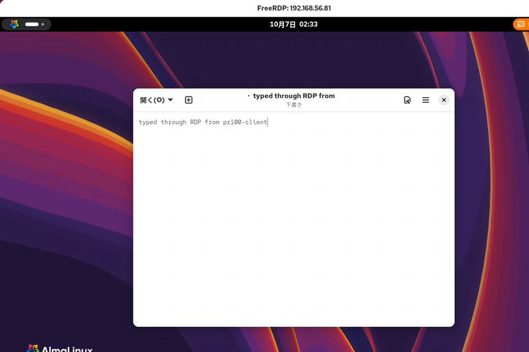
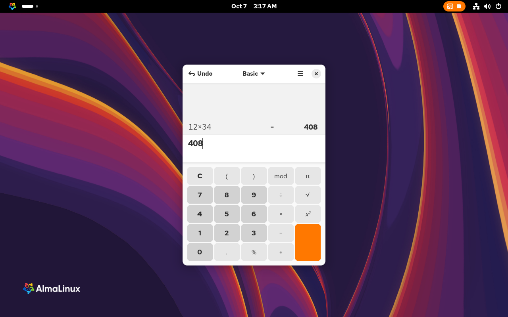
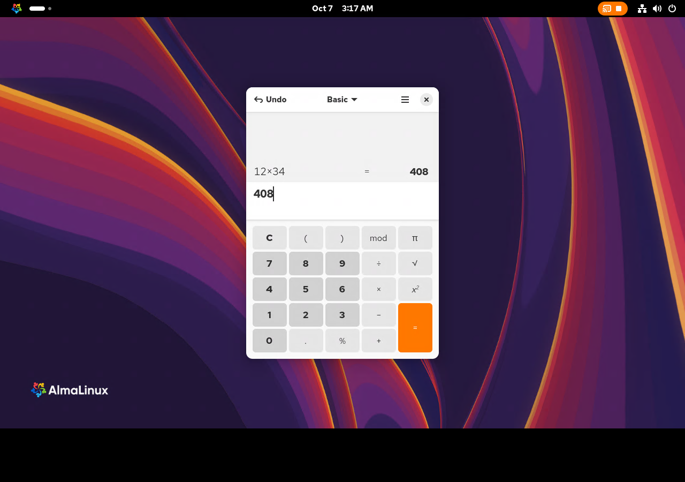
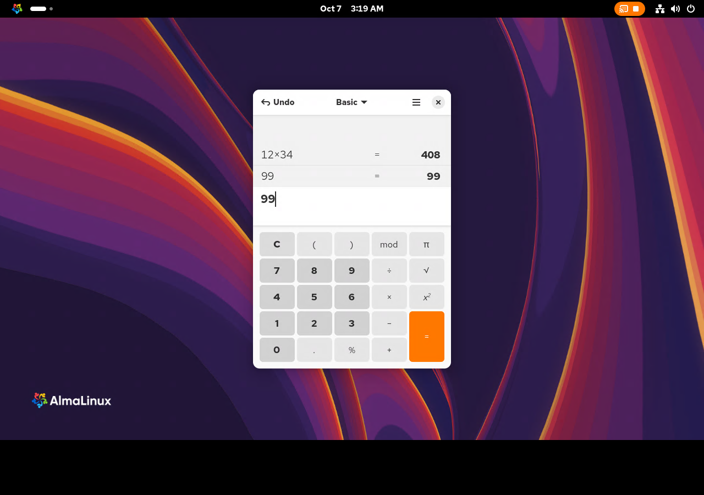
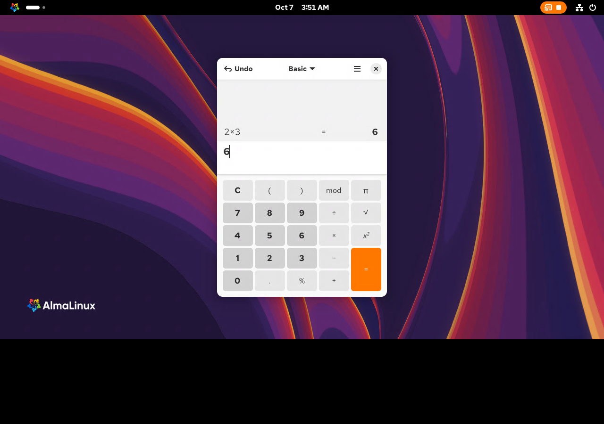
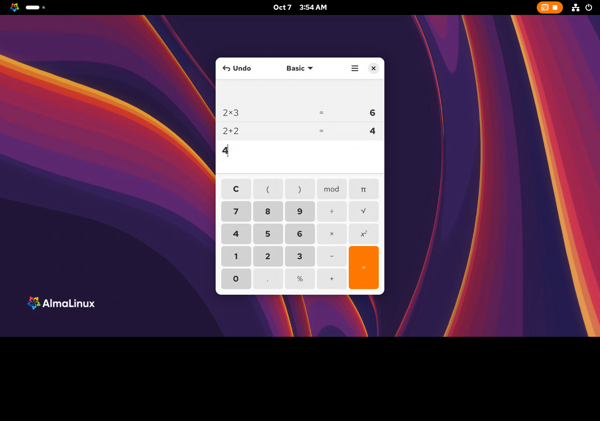
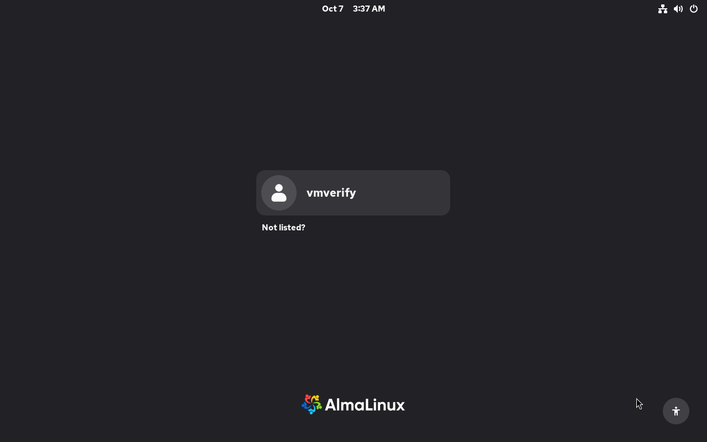

# GNOME のデスクトップ共有の手順（PC の画面のデスクトップに RDP でつなぐ。CLI だけで設定する）の検証記録

[手順書](../gnome-desktop-sharing.md)

## 補足

### 対象と検証環境

- **目的**: PC の画面で GNOME にログインしているユーザーのデスクトップを、別のマシンの RDP クライアントから共有して使う。設定は、そのユーザーの SSH のシェルから CLI だけで行う
- **方式**: ユーザーのモードの gnome-remote-desktop（オプション無しの `grdctl`、ユーザーの `gnome-remote-desktop.service`）。RHEL 10 の文書の「1.1 Enabling desktop sharing on the server by using GNOME」と同じ仕組みを、設定アプリの代わりに `grdctl` で設定する
- **状態**: **2026-10-07 に x86_64 の VirtualBox VM、aarch64 の実機、公式 ISO から新規インストールした aarch64 VM で、それぞれ検証した**
  - [VirtualBox の記録](#付録-virtualbox-の-vm-での本実行2026-10-07): AlmaLinux 10.2 Workstation と、別の VM の FreeRDP 3.10.3・Windows 11 の mstsc。PR #100 の初版・レビュー修正版・この検証で直したブロックを実行した
  - [実機の記録](#付録-このホストでの検証2026-10-07): Raspberry Pi 5 aarch64 で設定・RDP の画面と入力・任意節・ロールバック。HDMI 未接続のため、seat0 に仮想モニターを付けた
  - [aarch64 クリーン VM の記録](#付録-公式-iso-から新規インストールした-aarch64-vm-での検証2026-10-07): Server with GUI の通常の仮想 GPU と、別の Debian VM の FreeRDP 3.15.0。実際のゲスト OS 再起動後の最初の認証と、無操作での切断も確認した
  - 各検証の実行対象、結果、未確認の範囲は、それぞれの付録に残す。物理モニターへの表示、Raspberry Pi ホスト自体の OS 再起動、別の実機・実 LAN、Android は未確認
  - [2026-10-06 の資料・コンテナの記録](#付録-資料とブロックの確認2026-10-06)も、作成時と PR #100 更新版の記録を区別して残す

VirtualBox の付録は PR #100 の更新版 `18c1ddd` に残された検証履歴で、対象の `81012d3`・`f3450e6` と、同検証で直して流し直したブロックを記載する。aarch64 の実機と VM は `81012d3` に今回の検証で見つかった修正を加えた手順を実行した。両 aarch64 付録の自動ログインの手順番号 4・5・6・7 は、その実行対象の番号である。

現行手順では Plymouth 停止が手順 4 に入り、再起動は 5、接続前確認は 6、初回 RDP 接続は 7、ロールバックは 8。統合後の手順全体を aarch64 で再実行した記録ではない。各付録のブロック数や構文確認結果も、記載した時点の結果である。

> [!NOTE]
> 環境固有の値は**シェル変数**で書いてある。[手順 1](../gnome-desktop-sharing.md#実施手順) で 1 度だけ設定すれば、以降のコマンドはそのまま貼って実行できる。
>
> | 変数 | 意味 | 例 |
> |---|---|---|
> | `${SERVER_IP}` | クライアントが接続に使う PC の IP アドレス | `192.168.10.100` |
> | `${SERVER_NAME}` / `${SERVER_FQDN}` | PC のホスト名 / FQDN（`hostname` / `hostname -f` から自動で入る） | `my-pc` / `my-pc.lan` |
> | `${RDP_PORT}` | RDP で待ち受けるポート（リモートログインのデーモンが有効なら 3390、無ければ 3389。自動で入る） | `3389` |
> | `${LAN_SUBNET}` | LAN のサブネット。[接続元を LAN に絞る](../gnome-desktop-sharing.md#接続元を-lan-に絞る任意)ときだけ、その節で設定する | `192.168.10.0/24` |
>
> 出力例・ログの中の値は `<HOSTNAME>` / `<SERVER_IP>` / `<RDP_PORT>` / `<USER>` / `<UID>` / `<SESSION_ID>` / `<N>` のプレースホルダで書いてある。`<...>` を含むコマンドは bash のコードブロックには置かない。

### 実施前の状態

- 2026-10-06 の作成時には実機・VM の記録は無かった。2026-10-07 の状態は [VirtualBox](#実施前の状態virtualbox)、[実機](#実施前の状態2026-10-07実施手順-12)、[aarch64 クリーン VM](#実施前の状態と設定tls)を参照

### 完了時点の状態

- [VirtualBox の復元結果](#完了時点の状態virtualbox)、[実機の復元結果](#ロールバック完了時点の状態2026-10-07)、[aarch64 クリーン VM の復元と後片付け](#ロールバックと後片付け)を参照
- 2026-10-06 に書いた確認の出力は上流のソースに基づくものだった。各 2026-10-07 の付録には実測した出力を残す

---

## 付録: 資料とブロックの確認（2026-10-06）

### 作成時点の対象と検証環境

- **状態**: **実機でも VM でも流していない（未検証。2026-10-06 に書いた）**
  - 書いた環境は、KVM の無いクラウドの Linux のコンテナ（Ubuntu 24.04、x86_64）。QEMU の TCG で AlmaLinux 10.2 の GenericCloud に Workstation のパッケージを入れる VM を用意し始めたが、`dnf upgrade` の途中で、利用者の判断で VM での検証を見送った。VM では手順書のブロックを 1 つも貼っていない
  - 確かめたこと（[付録](#付録-資料とブロックの確認2026-10-06)）
    - 上流の gnome-remote-desktop 49.3 のソース・README と、AlmaLinux の `gnome-remote-desktop-49.3-4.el10_2` の spec（パッチがデスクトップ共有のふるまいを変えないこと）
    - gnome-shell 49.4（ロック画面で画面の共有を止めること）、gnome-control-center 47.7（同じキーリングの項目と証明書のパスを使うこと）、libsecret 0.21.2・gnome-keyring 42.1 のソース
    - RHEL 10 の文書の 1.1・1.3・1.4
    - 手順書の bash のブロック 24 個が `bash -n` を通ること
    - [自動ログインで使う（任意）](../gnome-desktop-sharing.md#自動ログインで使う任意)の手順 1・2 と、同節の手順 7 の `busctl` の行を、AlmaLinux 10.2 のコンテナの gnome-keyring と grdctl で模擬したこと（PC の画面も GDM も無い）
  - 確かめていないこと
    - 実施手順のすべて（PC の画面のセッションでの `grdctl` の設定・資格情報の保存・有効化・ファイアウォール・待ち受け・TLS のプローブ・クライアントからの接続）
    - 任意節（見るだけにする・接続元を LAN に絞る・自動ログイン）を GNOME のセッションで流すこと。自動ログインの後に、PC の画面にキーリングの窓が出ずにつながること
    - ロールバック
    - ロックと無操作で接続が切れること、再起動とログインの後の自動起動、リモートログインやほかのユーザーのヘッドレスのセッションとの併用、Windows などのクライアント
- 下表は、手順書が対象にする版（AlmaLinux 10.2 の AppStream と BaseOS にある 2026-10-06 の最新。コンテナの `dnf repoquery` と `rpm -q` で確かめた）

| 項目 | 値 |
|---|---|
| OS | AlmaLinux 10.2 (Lavender Lion)、GNOME の Workstation |
| GNOME | `gnome-remote-desktop-49.3-4.el10_2`、`gnome-shell-49.4-9.el10_2.alma.1`、`mutter-49.4-4.el10_2`、`gdm-47.0-24.el10_2`、`gnome-session-46.0-11.el10`、`gnome-control-center-47.7-7.el10` |
| キーリング | `gnome-keyring-42.1-20.el10`、`libsecret-0.21.2-8.el10`、`glib2-2.80.4-12.el10_2.22`、`python3-gobject-base-3.46.0-7.el10` |
| そのほか | `firewalld-2.4.3-4.el10_2`、`openssl-3.5.8-1.el10_2.alma.1` |
| クライアント | 想定は AppStream の `freerdp-3.10.3-12.el10_2.13`（`xfreerdp`）と、Windows の「リモート デスクトップ接続」 |

### 検証開始時の記録（81012d3）

**ソースと文書**:

- 上流 49.3 の `src/grd-ctl.c`: オプション無しの `grdctl` は `GRD_RUNTIME_MODE_SCREEN_SHARE`。`rdp enable` は `/usr/libexec/gnome-remote-desktop-enable-service <PID> user true` を動かし、セッションの systemd に `gnome-remote-desktop.service` の StartUnit と EnableUnitFiles を頼む。`status` の `View-only:` はこのモードだけに出る
- 上流 49.3 の `src/org.gnome.desktop.remote-desktop.gschema.xml.in`: `view-only` の既定は true、`negotiate-port` は true、`port` は 3389、`screen-share-mode` は `mirror-primary`。ヘッドレスの schema（`rdp/headless/`）にあるのは `port`・`negotiate-port`・`enable` だけで、`tls-cert`・`tls-key` は共用
- 上流 49.3 の `src/grd-settings.c` と `src/grd-credentials-libsecret.c`: デスクトップ共有の資格情報は libsecret の既定のコレクションに、schema `org.gnome.RemoteDesktop.RdpCredentials` で置く
- 上流 49.3 の `data/gnome-remote-desktop.service.in`（`WantedBy=gnome-session.target`）と `data/gnome-remote-desktop-headless.service.in`（`Conflicts=gnome-remote-desktop.service`）
- gnome-shell 49.4 の `js/ui/main.js`・`js/ui/sessionMode.js`・`js/ui/screenShield.js` と mutter 49.4 の `meta-dbus-session-manager.c`: ロック画面のモードでは `inhibit_remote_access` が呼ばれ、リモートのセッションが閉じられる。無操作のシールドも同じモードに入る
- AlmaLinux の `gnome-remote-desktop.spec`（`imports/c10/gnome-remote-desktop-49.3-4.el10_2`）のパッチは、VNC の暗号化・接続の数の制限・マルチタッチ・ヘッドレスとリモートログインの受け渡しで、デスクトップ共有の設定と資格情報の置き場所は変えない
- RHEL 10 の文書の 1.1 は設定アプリでの操作だけで、CLI の手順は無い。リモートログインと併用するとポートが 3390 になることは書いてある

**ブロックの構文と、部品の確かめ**:

- 手順書の `bash` のブロック 24 個を抜き出し、ホスト（Ubuntu 24.04 の bash 5.2）の `bash -n` にかけた。どれも通った
- `gdm-47.0-24.el10_2` の RPM の `/etc/gdm/custom.conf` には `[daemon]` の行がある。その写しに、[自動ログインで使う（任意）](../gnome-desktop-sharing.md#自動ログインで使う任意)の手順 3 と同節の手順 7 の `sed` をかけ、`[daemon]` の直後に 2 行が入り、消すと元に戻ることを確かめた（コンテナの GNU sed）
- コンテナの dconf 0.40.0 で、`grdctl rdp set-port 3390` の後の `dconf read …/rdp/port` が `uint16 3390` になり、その文字列を `dconf write` で書き戻せ、`dconf reset` で読み出しが空に戻ることを確かめた（[ロールバック](../gnome-desktop-sharing.md#ロールバック)の手順 3 の戻し方）。`/usr/bin/gsettings list-recursively org.gnome.desktop.remote-desktop.rdp` は `port uint16 3389` の形で出す

**自動ログインの節のキーリングの操作の模擬**:

- 環境: `quay.io/almalinuxorg/almalinux:10.2` のコンテナに、`gnome-keyring-42.1-20.el10`・`libsecret-0.21.2-8.el10`・`python3-gobject-base-3.46.0-7.el10`・`gnome-remote-desktop-49.3-4.el10_2` を入れた。一般ユーザーで `dbus-run-session` の中に gnome-keyring-daemon（secrets）を立てた。systemd・GNOME のセッション・GDM・gcr の窓は無い
- 用意: `gnome-keyring-daemon --unlock` で、パスワード付きのログインのキーリングを作って開き、`secret-tool store` で、`grdctl rdp set-credentials` と同じ形の項目（schema・ラベル・GVariant の値）を置いた
- 手順書の初めの版（ログインのキーリングの項目を残して、パスワードの無いキーリングへ写すだけ）では、デーモンを立て直してパスワード無しで起こすと、写したキーリングも `Locked` が `b true` で、`secret-tool lookup` は何も返さなかった
  - 写したキーリングのファイルは、暗号化されない文字のファイル（`~/.local/share/keyrings/rdp.keyring`）だった
  - 写したキーリングだけを `Unlock` すると、窓（prompt）無しで `b false` になり、`secret-tool lookup` が値を返した
  - ログインのキーリングのパスワードを空にした場合も、起こした直後は `b true` で、`Unlock` は窓無しで通った
  - libsecret は、同じ属性の項目が閉じたキーリングにしか無いと、それらを開こうとする。ログインのキーリングの項目が残っていると、そのキーリングを開く窓が要る、と判断した
- 直した版（写した後に、ログインのキーリングの項目を消す）で、次を確かめた
  - 手順 1 で `移した先: /org/freedesktop/secrets/collection/rdp/1`、貼り直すと `すでに移してある:`
  - 手順 2 で `aoao 1 "/org/freedesktop/secrets/collection/rdp/1" 0` と `b false`
  - デーモンを立て直してパスワード無しで起こした後に、`grdctl status` が `Username: (hidden)`・`Password: (hidden)` を出した（grdctl 自身の libsecret の読み出し）。続けて、ログインのキーリングは `b true`、移したキーリングは `b false`
  - 同節の手順 7 の `Collection.Delete` で `o "/"` が出て、`rdp.keyring` が消えた
- この模擬で確かめていないこと: GDM の自動ログイン、GNOME のセッションの中の gnome-keyring（PAM の `pam_gnome_keyring` が起こすもの）、gnome-remote-desktop のデーモンが接続のときに読み出すこと、PC の画面に窓が出ないこと

---

### PR #100 更新版の記録（18c1ddd）

- 書いた環境は、KVM の無いクラウドの Linux のコンテナ（Ubuntu 24.04、x86_64）。QEMU の TCG で AlmaLinux 10.2 の GenericCloud に Workstation のパッケージを入れる VM を用意し始めたが、`dnf upgrade` の途中で、利用者の判断で VM での検証を見送った。このときは VM で手順書のブロックを 1 つも貼っていない
- 手順書の確認の箇条書きにある出力（`grdctl status` の行、`ss` の `users:(("gnome-remote-de",…))` など）は、このときは上流のソースから書いたもので、実物の出力ではなかった

**ソースと文書**:

- 上流 49.3 の `src/grd-ctl.c`: オプション無しの `grdctl` は `GRD_RUNTIME_MODE_SCREEN_SHARE`。`rdp enable` は `/usr/libexec/gnome-remote-desktop-enable-service <PID> user true` を動かし、セッションの systemd に `gnome-remote-desktop.service` の StartUnit と EnableUnitFiles を頼む。`status` の `View-only:` はこのモードだけに出る
- 上流 49.3 の `src/org.gnome.desktop.remote-desktop.gschema.xml.in`: `view-only` の既定は true、`negotiate-port` は true、`port` は 3389、`screen-share-mode` は `mirror-primary`。ヘッドレスの schema（`rdp/headless/`）にあるのは `port`・`negotiate-port`・`enable` だけで、`tls-cert`・`tls-key` は共用
- 上流 49.3 の `src/grd-settings.c` と `src/grd-credentials-libsecret.c`: デスクトップ共有の資格情報は libsecret の既定のコレクションに、schema `org.gnome.RemoteDesktop.RdpCredentials` で置く
- 上流 49.3 の `data/gnome-remote-desktop.service.in`（`WantedBy=gnome-session.target`）と `data/gnome-remote-desktop-headless.service.in`（`Conflicts=gnome-remote-desktop.service`）
- gnome-shell 49.4 の `js/ui/main.js`・`js/ui/sessionMode.js`・`js/ui/screenShield.js` と mutter 49.4 の `meta-dbus-session-manager.c`: ロック画面のモードでは `inhibit_remote_access` が呼ばれ、リモートのセッションが閉じられる。無操作のシールドも同じモードに入る
- AlmaLinux の `gnome-remote-desktop.spec`（`imports/c10/gnome-remote-desktop-49.3-4.el10_2`）のパッチは、VNC の暗号化・接続の数の制限・マルチタッチ・ヘッドレスとリモートログインの受け渡しで、デスクトップ共有の設定と資格情報の置き場所は変えない
- RHEL 10 の文書の 1.1 は設定アプリでの操作だけで、CLI の手順は無い。リモートログインと併用するとポートが 3390 になることは書いてある

**ブロックの構文と、部品の確かめ**:

- 手順書の `bash` のブロック 24 個を抜き出し、ホスト（Ubuntu 24.04 の bash 5.2）の `bash -n` と ShellCheck 0.9.0（`-s bash`。変数のブロックのために SC2034・SC2154 は外した）にかけた。どれも通った
- `gdm-47.0-24.el10_2` の RPM の `/etc/gdm/custom.conf` には `[daemon]` の行がある。その写しに、[自動ログインで使う（任意）](../gnome-desktop-sharing.md#自動ログインで使う任意)の手順 3 と同節の手順 8 の `sed` をかけ、`[daemon]` の直後に 2 行が入り、消すと元に戻ることを確かめた（コンテナの GNU sed）
- コンテナの dconf 0.40.0 で、`grdctl rdp set-port 3390` の後の `dconf read …/rdp/port` が `uint16 3390` になり、その文字列を `dconf write` で書き戻せ、`dconf reset` で読み出しが空に戻ることを確かめた（[ロールバック](../gnome-desktop-sharing.md#ロールバック)の手順 3 の戻し方）。`/usr/bin/gsettings list-recursively org.gnome.desktop.remote-desktop.rdp` は `port uint16 3389` の形で出す

**自動ログインの節のキーリングの操作の模擬**:

- 環境: `quay.io/almalinuxorg/almalinux:10.2` のコンテナに、`gnome-keyring-42.1-20.el10`・`libsecret-0.21.2-8.el10`・`python3-gobject-base-3.46.0-7.el10`・`gnome-remote-desktop-49.3-4.el10_2` を入れた。一般ユーザーで `dbus-run-session` の中に gnome-keyring-daemon（secrets）を立てた。systemd・GNOME のセッション・GDM・gcr の窓は無い
- 用意: `gnome-keyring-daemon --unlock` で、パスワード付きのログインのキーリングを作って開き、`secret-tool store` で、`grdctl rdp set-credentials` と同じ形の項目（schema・ラベル・GVariant の値）を置いた
- 手順書の初めの版（ログインのキーリングの項目を残して、パスワードの無いキーリングへ写すだけ）では、デーモンを立て直してパスワード無しで起こすと、写したキーリングも `Locked` が `b true` で、`secret-tool lookup` は何も返さなかった
  - 写したキーリングのファイルは、暗号化されない文字のファイル（`~/.local/share/keyrings/rdp.keyring`）だった
  - 写したキーリングだけを `Unlock` すると、窓（prompt）無しで `b false` になり、`secret-tool lookup` が値を返した
  - ログインのキーリングのパスワードを空にした場合も、起こした直後は `b true` で、`Unlock` は窓無しで通った
  - libsecret 0.21.2 の読み出しは、同じ属性の項目が閉じたキーリングにしか無いと、最初に見つかった 1 つ（`locked[0]`）を開こうとする（ソースで確かめた）。ログインのキーリングの項目が先に返ると、そのキーリングを開く窓が要るはず、と判断した
- 直した版（写した後に、ログインのキーリングの項目を消す。同節の手順 1 の始めに、`rdp` のキーリングを `Unlock` する）を、手順書のブロックのまま流して、次を確かめた
  - パスワードで開いたデーモンで、同節の手順 1 が `移した先: /org/freedesktop/secrets/collection/rdp/1`（終了コード 0）、貼り直すと `すでに移してある: /org/freedesktop/secrets/collection/rdp/1`（終了コード 0）
  - 同節の手順 2 が `aoao 1 "/org/freedesktop/secrets/collection/rdp/1" 0` と `b false`
  - デーモンを立て直し、パスワードで開き直した直後は、`rdp` のキーリングが `b true` だった。そこで同節の手順 1 を貼り直すと、窓無しで開いて `すでに移してある:`（終了コード 0）、同節の手順 2 も同じ 2 行
  - デーモンを立て直してパスワード無しで起こした後（自動ログインの代わり）に、同節の手順 6 の `grdctl status` が `Username: (hidden)`・`Password: (hidden)` を出した（grdctl 自身の libsecret の読み出し）。続く `Locked` の行は、ログインのキーリングが `b true`、移したキーリングが `b false`
    - このコンテナでは証明書を設定していないので、`grdctl status` は `[x509_utils_from_pem]: BIO_new failed for certificate` と `RDP server certificate is invalid.` も出した
  - 同節の手順 8 の `busctl` の行で `o "/"` が出て、`rdp.keyring` が消えた。貼り直すと `rdp のキーリングは無い（消し済み）`
- この模擬で確かめていないこと: GDM の自動ログイン、GNOME のセッションの中の gnome-keyring（PAM の `pam_gnome_keyring` が起こすもの）、gnome-remote-desktop のデーモンが接続のときに読み出すこと、PC の画面に窓が出ないこと、同節の手順 6 の `loginctl` と `ss` の行

---

## 付録: VirtualBox の VM での本実行（2026-10-07）

以下は PR #100 の更新版 `18c1ddd` に残された x86_64 検証の記録。手順番号・ブロック数・未確認の範囲は、その記録の対象に対応する。

### 対象と検証環境（VirtualBox）

- **状態**: **x86_64 の VirtualBox の VM（AlmaLinux 10.2 の Workstation のクリーンインストール）で本実行した（2026-10-07。[付録](#付録-virtualbox-の-vm-での本実行2026-10-07)）。実機では流していない**
  - 通したもの: この文書のブロックを、SSH でログインした共有するユーザーの対話の bash に、ブラケットペーストで貼った。書き換えたのは手順 1 の `SERVER_IP` と、任意節の `LAN_SUBNET` だけ
    - PR の最初の版（`81012d3`）: 前提の gnome-power.md 手順 1〜4 → 実施手順 1〜10 → [見るだけにする（任意）](../gnome-desktop-sharing.md#見るだけにする任意) → [ロールバック](../gnome-desktop-sharing.md#ロールバック)の手順 1・3・4
    - レビューで直した版（`f3450e6`）: 実施手順 1〜10 → [接続元を LAN に絞る（任意）](../gnome-desktop-sharing.md#接続元を-lan-に絞る任意) → [自動ログインで使う（任意）](../gnome-desktop-sharing.md#自動ログインで使う任意)
    - この検証で直した版: 直した 5 つのブロック（実施手順 9、自動ログインで使うの手順 4・5・6・8）を流し直し、続けて PC を再起動して PC の画面でパスワードでログインし、ロールバックの手順 2〜4
  - 確認したこと
    - 実施手順 2・6〜9 と各任意節の確認の箇条書きの出力が、手順書の記載どおりに出る（手順 2 の 8 行、`grdctl status` の各行、`ss` の 1 行、TLS のプローブの 3 つ）
    - FreeRDP 3.10.3 で、`Thumbprint:` が `TLS fingerprint` と一致し、PC の画面のデスクトップが PC の解像度（1280x800）のまま出る。クライアントのクリックと文字の入力が PC の画面に出て、PC の上部バーに共有中の印が出る
    - Windows 11 の「リモート デスクトップ接続」（mstsc 10.0.26100.8875）で、ホストオンリーのネットワーク越しに NLA で接続でき、キーの入力が PC に届き、画面の更新が送られる。証明書の「拇印」は SHA-1 で、手順 9 の `sha1 Fingerprint=` と一致する
    - 見るだけにすると、つないでいるクライアントの入力がすぐに効かなくなり、戻すとすぐに効く
    - LAN に絞った後は、`LAN_SUBNET` の外（VirtualBox の NAT 経由、送信元 10.0.2.2）からは接続できず、中（192.168.56.0/24）からはつながる
    - PC の画面のセッションをロックすると、RDP の接続がすぐに切れ（`ERRINFO_LOGOFF_BY_USER`）、ロック中の新しい接続は認証の後に断られる（`Session creation inhibited`）。ロックを解くと、またつながる
    - 自動ログイン: パスワードの無いキーリングへ移した資格情報で、PC の画面にキーリングの窓を出さずにつながる（起動画面を止めた後）
    - 2 回のロールバックの後、firewalld・dconf・証明書・資格情報・`custom.conf`・起動の引数が実施前に戻る（[完了時点の状態](#完了時点の状態virtualbox)）
    - SELinux が Enforcing のまま、AVC は出なかった
  - この検証で直したこと（[付録の「見つかった問題と直したこと」](#見つかった問題と直したこと)）
    - 実施手順 4: 初めて設定するときに出る `BIO_new failed for certificate` と `RDP server certificate is invalid.` の注記を足した
    - 実施手順 9・10: Windows の拇印（SHA-1）と比べる値を手順 9 で出し、手順 10 に Windows での比べ方と、FreeRDP の初回の警告を足した。ログを見るコマンドを `journalctl -b _SYSTEMD_USER_UNIT=…` に直した
    - 自動ログインで使う: 起動画面（plymouth）を止める手順を足し（新しい手順 4）、再起動を `sudo` 無しの `systemctl reboot -i` に直し（手順 5）、確認に `Active` を足し（手順 6）、戻す手順で起動の引数も戻す（手順 8）
  - 確認していないこと
    - 実機（物理のモニター・キーボード・マウス）、aarch64、サスペンドできる実機での前提の手順 3・4 の効き目
    - Windows の「リモート デスクトップ接続」の窓に PC の画面が写ること（窓の中身が DirectX の面で、撮影できなかった）。Windows の資格情報の窓での入力（検証では `cmdkey` で先に登録した）
    - 無操作で暗くなって切れること（ロックで切れることは確かめた）、PC の上部バーの印から共有を止めること
    - 後からリモートログインを有効にしたとき、ほかのユーザーのヘッドレスのセッションとの併用、同じユーザーのヘッドレスのセッションが有効なときの手順 2・6 の中断、手順 2 の最後の行が `0` でないとき
    - 設定アプリの「リモート デスクトップ」との行き来、`passwd` でパスワードを変えたとき、Homebrew が PATH の先頭にあるホスト
    - ロールバックの手順 4 の「生成の途中で止まっていた」の分岐、退避が不完全なときの中断
  - 2026-10-06 の記録（ブロックを書いた時点の、資料とコンテナでの模擬）は、[付録](#付録-資料とブロックの確認2026-10-06)に残す
- 下表は、VM に入っていた版（2026-10-07 に `rpm -q` で確かめた。手順書を書いたときの対象〔2026-10-06 の最新〕と同じ）

| 項目 | 値 |
|---|---|
| OS | AlmaLinux 10.2 (Lavender Lion)、GNOME の Workstation、kernel `6.12.0-211.61.1.el10_2.x86_64`、SELinux は Enforcing |
| GNOME | `gnome-remote-desktop-49.3-4.el10_2`、`gnome-shell-49.4-9.el10_2.alma.1`、`mutter-49.4-4.el10_2`、`gdm-47.0-24.el10_2`、`gnome-session-46.0-11.el10`、`gnome-control-center-47.7-7.el10` |
| キーリング | `gnome-keyring-42.1-20.el10`、`libsecret-0.21.2-8.el10`、`glib2-2.80.4-12.el10_2.22`、`python3-gobject-base-3.46.0-7.el10` |
| そのほか | `firewalld-2.4.3-4.el10_2`、`openssl-3.5.8-1.el10_2.alma.1`、`systemd-257-23.el10_2.2.alma.1`、`plymouth-24.004.60-17.el10.alma.2`、`polkit-125-4.el10_2.1`、`grubby-8.40-83.el10.alma.1` |
| クライアント | 別の VM の AppStream の `freerdp-3.10.3-12.el10_2.13`（`xfreerdp`）と、ホストの Windows 11 Pro 10.0.26300 の「リモート デスクトップ接続」（`mstsc.exe` 10.0.26100.8875） |

> [!NOTE]
> 環境固有の値は**シェル変数**で書いてある。[手順 1](../gnome-desktop-sharing.md#実施手順) で 1 度だけ設定すれば、以降のコマンドはそのまま貼って実行できる。
>
> | 変数 | 意味 | 例 |
> |---|---|---|
> | `${SERVER_IP}` | クライアントが接続に使う PC の IP アドレス | `192.168.10.100` |
> | `${SERVER_NAME}` / `${SERVER_FQDN}` | PC のホスト名 / FQDN（`hostname` / `hostname -f` から自動で入る） | `my-pc` / `my-pc.lan` |
> | `${RDP_PORT}` | RDP で待ち受けるポート（リモートログインのデーモンが有効なら 3390、無ければ 3389。自動で入る） | `3389` |
> | `${LAN_SUBNET}` | LAN のサブネット。[接続元を LAN に絞る](../gnome-desktop-sharing.md#接続元を-lan-に絞る任意)ときだけ、その節で設定する | `192.168.10.0/24` |
>
> 出力例・ログの中の値は `<HOSTNAME>` / `<SERVER_IP>` / `<RDP_PORT>` / `<USER>` / `<UID>` / `<SESSION_ID>` / `<N>` のプレースホルダで書いてある。`<...>` を含むコマンドは bash のコードブロックには置かない。2026-10-07 の付録の値（`verifier`・`pr100-pc.test`・`192.168.56.81` など）は、検証用の VM の試験用の値。

### 実施前の状態（VirtualBox）

- 2026-10-07 の VM（クリーンインストールのスナップショットから作った直後）
  - 上の表の版。システムのリモートログイン（`gnome-remote-desktop.service`）・ユーザーの `gnome-remote-desktop.service`・`gnome-remote-desktop-headless.service` は、どれも `disabled`
  - dconf の `/org/gnome/desktop/remote-desktop/` は空。`/etc/gdm/custom.conf` は RPM の既定（`AutomaticLogin` の行は無い）
  - firewalld は `public` ゾーン（`cockpit`・`dhcpv6-client`・`ssh`。ポートと rich rule は無し）
  - `~/.local/share/keyrings`・`~/.local/share/gnome-remote-desktop`・`~/.local/state` は無い（PC の画面で 1 度もログインしていない）
  - logind の `CanSuspend` は `challenge`（サスペンドできる PC として、前提の gnome-power.md 手順 3・4 も行った）

### 完了時点の状態（VirtualBox）

- 2026-10-07 の 2 回目のロールバックの後
  - dconf の `/org/gnome/desktop/remote-desktop/` は `[rdp]` の `enable=false` だけ（`grdctl rdp disable` が書く。既定の値と同じ）
  - firewalld のポートと rich rule は空。ユーザーの `gnome-remote-desktop.service` は `disabled`・`inactive` で、3389/tcp は待ち受けていない
  - RDP の資格情報は、ログインのキーリングにも無い（`aoao 0 0`）。`rdp.keyring` は無い
  - 証明書と鍵、退避先（`~/.local/state/gnome-desktop-sharing-setup`）、`~/rdp_tls_probe.py` は無い。空の `~/.local/share/gnome-remote-desktop` が残る
  - `/etc/gdm/custom.conf` に `AutomaticLogin` の行は無い。起動の引数に `rd.plymouth=0 plymouth.enable=0` は無い
  - 前提の gnome-power.md で変えた値は残る（手順書のとおり）
- ホスト（Windows）: 検証で登録した `TERMSRV/<SERVER_IP>` の資格情報は消した。`HKCU\Software\Microsoft\Terminal Server Client` と `Documents\Default.rdp` は検証の前と同じ

#### 環境と準備

| 項目 | 値 |
|---|---|
| ホスト | Windows 11 Pro 10.0.26300、VirtualBox 7.2.20（Hyper-V の NEM） |
| VM | [AlmaLinux 10 の環境構築の検証](../almalinux-vm-verification.md)の `clean-install` スナップショット（公式 ISO の Workstation）から、リンククローンを 2 台新しく作った。PC 役（共有する側、RAM 6 GiB）とクライアント役（RAM 4 GiB） |
| CPU | 1 vCPU。2 vCPU にした初回は、2 台とも UEFI の `CpuMpPei` か、カーネルの起動の途中（`evm: HMAC attrs` の後）で止まったので、前回の検証と同じ 1 vCPU に戻した |
| ネットワーク | NAT（SSH 用の転送）と、ホストオンリー `192.168.56.0/24`（PC 役 `192.168.56.81`、クライアント役 `192.168.56.82`、ホスト `192.168.56.1`）。LAN の外の試験だけ、PC 役の NAT に `127.0.0.1:23389 → 3389` の転送を足した |
| 試験用の値 | ユーザー `verifier`、PC 役のホスト名 `pr100-pc.test`、RDP のユーザー名 `rdpuser`（パスワードは VM 専用の乱数。リポジトリには載せない） |

- 手順書の外の準備
  - 2 台とも、ホストオンリーの接続を `nmcli` で作り、ホスト名を付け、`~/.config/gnome-initial-setup-done` を置いた。マウスを USB タブレットにした（VM の画面をクリックするため）
  - PC の画面でのログインは、VirtualBox のキーボード入力でパスワードを打った（GDM のパスワードでのログイン）。最初に出たツアーの案内は「スキップ」で閉じた
  - クライアント役には `dnf install freerdp` で FreeRDP を入れた（既定のミラーの 1 つが止まったので、このときだけ `repo.almalinux.org` を指定した）。画面を消さない設定とサスペンドの mask も行った
  - FreeRDP は、クライアント役の SSH の端末から、GNOME のセッションの XWayland（`DISPLAY=:0`）に窓を出して動かした。証明書・`Domain:`・`Password:` の問いは端末で答えた
  - 画面は `VBoxManage controlvm … screenshotpng` で撮り、クライアント役の画面へのクリックとキーは VirtualBox の入力で送った
- 手順書のブロックは、SSH の対話の bash に、ブラケットペーストで 1 つずつ貼り、プロンプトが戻ってから次を貼った。手順 5 などの問いには、問いが出てから答えた
- 前提の gnome-power.md 手順 1〜4 は、記載どおり（`uint32 0`・`false`・4 行・3 行・`masked` が 5 行）

#### 実施手順（81012d3 と f3450e6 で 1 回ずつ）

- 手順 1: `RDP_PORT = 3389`（リモートログインは無効）。`SERVER_NAME` と `SERVER_FQDN` は `pr100-pc.test`
- 手順 2: f3450e6 の版で次の 8 行（81012d3 の版は最後の `0` が無い 7 行）

  ```text
   6 1000 verifier seat0 6738 user    tty2  no -
  ScreenCast: ok
  b false
  uint32 0
  false
  false
  disabled
  0
  ```

- 手順 3: `rdp-tls.crt`（`-rw-r--r--`）と `rdp-tls.key`（`-rw-------`）、`設定の退避と証明書の準備が完了`。退避した 5 つのキーは、どれも未設定（空のファイル）だった
- 手順 4: 最初の `grdctl rdp set-tls-cert` が `[ERROR][com.freerdp.crypto] - [x509_utils_from_pem]: BIO_new failed for certificate` と `RDP server certificate is invalid.` を 1 回ずつ出した。残りの設定は入り、読み戻しは `negotiate-port false`・`port uint16 3389`・`tls-cert`・`tls-key`・`view-only false`
- 手順 5: `Username: ` と `Password: ` を聞かれ、PC の画面に窓は出なかった（パスワードでログインしたので、ログインのキーリングは開いている）
- 手順 6・7: `enabled`、`success` が 2 行と `3389/tcp`
- 手順 8: `Unit status: active`・`Status: enabled`・`Port: 3389`・`View-only: no`・`Negotiate port: no`・`Username: (hidden)`・`Password: (hidden)` と、`LISTEN 0 5 *:3389 *:* users:(("gnome-remote-de",pid=<N>,fd=10))`
- 手順 9: `selectedProtocol=0x2`、`TLSv1.3 TLS_AES_256_GCM_SHA384`、`fingerprint:` と `TLS fingerprint:` が一致、SAN は `DNS:pr100-pc.test, DNS:pr100-pc.test, DNS:192.168.56.81, IP Address:192.168.56.81`（`SERVER_NAME` と `SERVER_FQDN` が同じなので重なる）
  - このプローブの接続は、PC 側の journal に `client authentication failure` と `Network or intentional disconnect` を残す（NLA の前で切るため）
- 手順 10（FreeRDP）: `xfreerdp /v:192.168.56.81:3389 /u:rdpuser`
  - 保存した証明書が無い初めての接続でも、先に `WARNING: REMOTE HOST IDENTIFICATION HAS CHANGED!` と `Host key verification failed.` が出て、その後に `Certificate details`・`Thumbprint:`・`Do you trust the above certificate? (Y/T/N)` が出た。`Thumbprint:` は手順 8 の `TLS fingerprint` と一致
  - `Y` の後に `Domain:`（空のまま Enter）と `Password:` を聞かれ、`krb5_parse_name (Configuration file does not specify default realm)` の後に NTLM でつながった
  - 窓に PC の画面が 1280x800 のまま出た（窓はクライアントの画面からはみ出し、縮小されない）。PC の上部バーに共有中の印（オレンジ）が出た
  - クライアントの窓から、PC のアクティビティの画面を開き、`text editor` で検索してテキストエディターを起動し、文字を入力できた（PC の画面にもそのまま出た）
  - f3450e6 の版では証明書を作り直したので、`!!!Certificate for 192.168.56.81:3389 (RDP-Server) has changed!!!` と新旧の `Thumbprint:` が並んで聞かれた
- 手順 10 の最後の箇条書きの `journalctl --user -b -u gnome-remote-desktop.service` は `No journal files were found.` だった（`/var/log/journal` が無く、journal は揮発）。`journalctl -b _SYSTEMD_USER_UNIT=gnome-remote-desktop.service` は、`sudo` 無しで読めた（`wheel` のユーザー）

クライアント役の FreeRDP の窓に写った、PC の画面のデスクトップ（81012d3 の手順 10。VirtualBox の VM の画面から、FreeRDP の窓の部分を切り出して 75% に縮小した。右上のオレンジが共有中の印）:



#### Windows の「リモート デスクトップ接続」

- ホストの `mstsc /v:192.168.56.81:3389`（資格情報は検証のときだけ `cmdkey /generic:TERMSRV/192.168.56.81` で先に登録し、終わってから消した）
- 警告の窓は「このリモート コンピューターの ID を識別できません。接続しますか?」で、証明書の名前（`pr100-pc.test`）と「この証明書は信頼された認証機関からのものではありません。」だけを出し、拇印は出さなかった
- 「証明書の表示」→「詳細」の「拇印」は、`828271180a0dcdb433606035519891545726d107`（1 回目の証明書）と `de7964917cc59c679638258a29f2b3e81cc9ac57`（作り直した証明書）。どちらも、その証明書の `openssl x509 -fingerprint -sha1`（`82:82:71:…`・`DE:79:64:…`）と同じ値で、SHA-256 の `TLS fingerprint` とは違う
  - 直した手順 9 の `sha1 Fingerprint=DE:79:64:91:7C:C5:9C:67:96:38:25:8A:29:F2:B3:E8:1C:C9:AC:57` と比べて一致した
- 「はい」でつながった。PC 側の journal に `RDP.RDPGFX` の `H264 (AVC444): true, H264 (AVC420): true` などが出て、PC の上部バーには共有中の印に加えてマイクの印も出た（FreeRDP では出なかった）
- mstsc の入力の窓へ直接送ったキー（` mstsc`）が、PC のテキストエディターに入った
- PC の画面を変えるたびに、PC からホストへ送ったバイト数が約 9〜10 万バイトずつ増え、確認応答も同じ値だった
- mstsc の窓の中身は、`PrintWindow` でも画面の取り込みでも黒く写った（描画が DirectX の面のため）。窓に PC の画面が写ることは、画像では確かめていない
- クライアント役の FreeRDP とホストの mstsc は、同時につながり、FreeRDP の窓も更新され続けた

#### 任意節

- 見るだけにする: 手順 1 で `View-only: yes`。つないだままのクライアントから打った文字は PC に入らなかった。手順 2 で `View-only: no` に戻すと、すぐに入った
- 接続元を LAN に絞る: `LAN_SUBNET=192.168.56.0/24` で、`success` が 3 行、`--list-ports` は空、rich rule は `rule family="ipv4" source address="192.168.56.0/24" port port="3389" protocol="tcp" accept`
  - 絞る前は、NAT 経由（送信元 10.0.2.2）とホストオンリー経由（送信元 192.168.56.1）の両方から、RDP のネゴシエーションと TLS が通った
  - 絞った後は、NAT 経由は時間切れでつながらず、ホストオンリー経由は通った。つないでいた FreeRDP（192.168.56.82）は切れなかった
- 自動ログインで使う（f3450e6 の版）
  - 手順 1: `移した先: /org/freedesktop/secrets/collection/rdp/1`。貼り直すと `すでに移してある: /org/freedesktop/secrets/collection/rdp/1`。`rdp.keyring` は、`display-name=rdp` などが読める暗号化されていないファイルだった
  - 手順 2: `aoao 1 "/org/freedesktop/secrets/collection/rdp/1" 0` と `b false`
  - 手順 3: `[daemon]`・`AutomaticLoginEnable=True`・`AutomaticLogin=verifier`
  - 手順 4（当時の再起動）: `sudo systemctl reboot` は `Operation inhibited by "verifier" (PID … "gnome-session-b", user verifier), reason is "user session inhibited".`・`User verifier is logged in on tty2.`・`User verifier is logged in on sshd.` で断られた。`sudo systemctl reboot -i` は `Call to Reboot failed: Interactive authentication required.`。`sudo` 無しの `systemctl reboot -i` は `==== AUTHENTICATING FOR org.freedesktop.login1.reboot-ignore-inhibit ====` とこのユーザーのパスワードを聞き、入れると再起動した
  - 再起動の後、GDM は自動でログインした（`Service=gdm-autologin`、tty2）。しかし約 22 秒後に plymouth が終わった直後、GDM が tty1 にログイン画面（greeter）を作り、tty1 が前に出た。自動ログインのセッションは `Active=no` になった
  - 手順 5（当時の確認）の出力は記載どおり（`Service=gdm-autologin`・`Unit status: active`・`Username: (hidden)`・`b true`・`b false`・`ss` の 1 行）だったが、手順 6（接続）は、認証は通るのに FreeRDP の窓が真っ黒だった（窓も既定の 1024x768 のまま）
  - 起動の引数を一般的な形（`rhgb quiet` を足し、検証用のシリアルコンソールを外す）にして再起動しても、同じく約 22 秒後にログイン画面が前に出た
  - `loginctl activate 1` は `Interactive authentication required.` で断られ、`sudo loginctl activate 1` で自動ログインのセッションが前に戻った。その後は RDP に PC のデスクトップが写った（PC の画面にキーリングの窓は出ていない）
  - 起動の引数に `rd.plymouth=0 plymouth.enable=0` を足して再起動すると、2 分以上たっても tty2 の自動ログインのセッションが前のままで、ログイン画面は出なかった。何も触らずに RDP で PC のデスクトップが写った
- 自動ログインで使う（この検証で直した版）
  - 手順 4（新しい手順）: `args=` の行の最後に `rhgb quiet rd.plymouth=0 plymouth.enable=0`
  - 手順 5: `systemctl reboot -i` は `==== AUTHENTICATING FOR org.freedesktop.login1.reboot ====` とパスワードを聞き、入れると再起動した（自動ログインのセッションからは、この操作だった）
  - 再起動の後、約 100 秒の間、tty2 の自動ログインのセッションが前のままで、ログイン画面は出なかった
  - 手順 6: `Service=gdm-autologin`・`Active=yes` の後、記載どおりの行が出た
  - 手順 7: FreeRDP でつながり、PC のデスクトップ（ログインした直後のアクティビティの画面）が写った。PC の画面にキーリングの窓は無かった。続けて、ホストの mstsc も同時につながった
  - 手順 8: `0`・`0`・`o "/"`。貼り直すと `0`・`0`・`rdp のキーリングは無い（消し済み）`。`custom.conf` と起動の引数が戻り、`rdp.keyring` が消えた
  - 戻した後、`systemctl reboot -i` で再起動すると、GDM のログイン画面が出た（自動ログインしない）

#### ロックと切断

- PC の画面のセッションを `loginctl lock-session` でロックすると、つないでいた FreeRDP がすぐに `ERRINFO_LOGOFF_BY_USER` で切れた。PC の journal は `Disconnected by EIS`
- ロック中も 3389/tcp は待ち受けていて、新しい接続は認証の後に `Broken pipe` で切れた。PC の journal は `Failed to start remote desktop session: … Session creation inhibited`
- PC の画面でパスワードを入れてロックを解くと、また FreeRDP でつながった

#### ロールバック

- 1 回目（81012d3 の実施手順と見るだけにするの後。手順は f3450e6 の版）: 手順 1 で `success` が 2 行と空の `--list-ports`、手順 3 で `disabled`、手順 4 で `sha256sum --check` が 2 つとも `完了`（OK）になって証明書と鍵を消した
  - 戻した後の dconf は `enable=false` だけで、空の `~/.local/share/gnome-remote-desktop` が残った。`grdctl status` は `TLS certificate:` が空に戻り、`BIO_new failed for certificate` を出した
- 2 回目（f3450e6 の実施手順・LAN に絞る・自動ログインと、その戻しの後。PC を再起動して PC の画面でパスワードでログインしてから）: 手順 1 の代わりに手順 2 で `success` が 2 行と空の rich rule、手順 3 で `disabled`、手順 4 で 2 つとも `完了` で削除。結果は[完了時点の状態](#完了時点の状態virtualbox)
- 2 回目の後に、手順 3 を済ませていない状態で手順 4 と手順 6 を貼ると、それぞれ `中断: 手順 3 が完了していない。設定は変更しない` と `中断: 手順 3 が完了していない。有効にしない` で止まり、何も変わらなかった

#### 見つかった問題と直したこと

| 箇所 | 見つかったこと | 直したこと |
|---|---|---|
| 実施手順 4 | 初めて設定するときに `BIO_new failed for certificate` と `RDP server certificate is invalid.` が出る（ヘッドレスの手順書には同じ注記がある） | 害が無いことの箇条書きを足した |
| 実施手順 10 | Windows の窓は拇印を出さず、「詳細」の「拇印」は SHA-1 で、手順 8 の `TLS fingerprint`（SHA-256）とは比べられない | 手順 9 で `openssl x509 … -fingerprint -sha1` を出し、手順 10 に Windows での比べ方を書いた |
| 実施手順 10 | FreeRDP 3.10.3 は、初めての接続でも `REMOTE HOST IDENTIFICATION HAS CHANGED!` を出す | 続く `Thumbprint:` で判断する、と書いた |
| 実施手順 10 | `journalctl --user` は、既定の構成では `No journal files were found.` | ヘッドレスの手順書と同じ `journalctl -b _SYSTEMD_USER_UNIT=…` にした |
| 自動ログインで使う | `sudo systemctl reboot` も `sudo systemctl reboot -i` も断られ、PC を再起動できない | `sudo` 無しの `systemctl reboot -i` にして、パスワードを聞かれることを書いた |
| 自動ログインで使う | 自動ログインの約 22 秒後に GDM のログイン画面が前に出て、RDP の画面が真っ黒になる | 起動画面（plymouth）を止める手順を足し、確認に `Active` を足し、戻す手順で起動の引数も戻すようにした |

- 直した版の `bash` のブロック 25 個は、どれも `bash -n` を通った。直した 5 つのブロックは、上の「この検証で直した版」のとおり VM で流し直した（手順書の最終版のブロックと、流したブロックが同じことも確かめた）

---

## 付録: このホストでの検証（2026-10-07）

この付録の手順番号は、検証した `81012d3` と今回の修正版の番号。自動ログインの再起動 4・接続前確認 5・初回接続 6・ロールバック 7 は、現行手順の 5・6・7・8 に対応する。現行の Plymouth 停止と `systemctl reboot -i` を含む統合後の手順全体は、この環境で再実行していない。

### 対象と検証環境（2026-10-07）

- **対象**: PR #100 の検証開始時の HEAD `81012d3e` の実施手順 1〜10・任意節・ロールバック。実機で見つかった問題を直したブロックも、同じホストで再検証した。自動ログインの手順 4 の OS 再起動は、GDM とユーザーマネージャーの起動し直しで代替した
- **状態**: 設定・資格情報の保存・有効化・待ち受け・TLS・RDP の画面と入力、見るだけの切り替え、送信元を分けたファイアウォールの通信、自動ログインとキーリング、ロールバックを実機で確認した
  - 実行したのはホストの GNOME・systemd・firewalld。ユーザーの設定は専用の一般ユーザーの実効 UID とユーザーの D-Bus で行い、ホストの `/usr/bin/` のツールを使用した
  - GNOME は GDM の `gdm-password` でログインした `seat0` の Wayland セッション。HDMI のモニターは接続されておらず、このユーザーの GNOME Shell に仮想モニターを付けて検証した
  - 2026-10-06 の資料・コンテナでの確認は、上の記録のまま別の履歴として残してある

| 項目 | 値 |
|---|---|
| 実機 | Raspberry Pi 5 Model B Rev 1.0、aarch64 |
| OS・カーネル | AlmaLinux 10.2 (Lavender Lion)、`6.12.96-20260724.v8.1.el10` |
| SELinux | Enforcing |
| GNOME | `gnome-remote-desktop-49.3-4.el10_2.aarch64`、`gnome-shell-49.4-9.el10_2.alma.1.aarch64`、`mutter-49.4-4.el10_2.aarch64`、`gdm-47.0-24.el10_2.aarch64`、`gnome-session-46.0-11.el10.aarch64`、`gnome-control-center-47.7-7.el10.aarch64` |
| キーリング | `gnome-keyring-42.1-20.el10.aarch64`、`libsecret-0.21.2-8.el10.aarch64`、`glib2-2.80.4-12.el10_2.22.aarch64`、`python3-gobject-base-3.46.0-7.el10.aarch64` |
| そのほか | `firewalld-2.4.3-4.el10_2.noarch`、`openssl-3.5.8-1.el10_2.alma.1.aarch64` |
| モニター | HDMI-A-1・HDMI-A-2 とも `disconnected`、モード無し。検証用 GNOME Shell の `--virtual-monitor 1280x720` で表示を用意 |
| RDP | システムのリモートログインが 3389 で有効。ユーザーのデスクトップ共有は手順 1 の判定により 3390 |
| クライアント | 同じホストの Debian trixie コンテナの FreeRDP 3.15.0（`freerdp3-x11`）、Xvfb 1280×900。RDP の画面はサーバーの 1280×720。別のネットワーク名前空間から接続 |

> [!NOTE]
> 出力のホスト名・IP アドレス・アカウント・セッション番号・PID・フィンガープリントはプレースホルダに置き換えた。パスワード・秘密鍵は記録しない。RDP の資格情報は手順 5 の対話入力を PTY で行い、コマンドの引数やシェルの履歴に入れていない。

### 実施前の状態（2026-10-07、実施手順 1・2）

- ホストには GDM の `seat0` のログイン画面があり、一般ユーザーの `seat0` のデスクトップは無かった
- 検証専用の一般ユーザーを作り、そのユーザーだけに GNOME Shell の仮想モニターのドロップインを置いた。既存ユーザーのデスクトップ設定は変更していない
- GDM のユーザー検証で `gdm-password` のパスワード認証を行い、`VerificationComplete`・`SessionOpened` の後にセッションを開始した。通常ログインの検証に、自動ログインの設定や GDM の再起動は使っていない
- そのセッションのログインのキーリングは開いていた。画面の無操作時間は 0、ロックは無効。同じユーザーのヘッドレスの RDP は無効で、unit も `disabled`・`inactive` だった

実測の抜粋（値は置換済み）:

```text
Name=<USER>
Seat=seat0
Remote=no
Service=gdm-password
Type=wayland
Class=user
Active=yes
State=active

ScreenCast: ok
b false
uint32 0
false
false
disabled
inactive
```

### 実施手順 3〜9: 設定・待ち受け・TLS（2026-10-07）

- PR の元のブロックで、設定の退避、証明書と鍵の生成、`grdctl` の設定、対話での資格情報の保存、共有の有効化、ファイアウォールの開放を実施した
- システムのリモートログインが有効な状態で、デスクトップ共有の設定と実際の待ち受けが 3390 になった。`grdctl status` は `Unit status: active`・`Status: enabled`・`View-only: no`・`Negotiate port: no` と、隠されたユーザー名・パスワードを表示した
- 手順 9 のプローブは `selectedProtocol=0x2`、TLS 1.3 で成立した。提示された証明書の SHA-256 フィンガープリントは `grdctl status` と一致し、SAN に設定した DNS 名と IP アドレスが含まれていた

実測の抜粋（値は置換済み）:

```text
Unit status: active
Status: enabled
Port: <RDP_PORT>
View-only: no
Negotiate port: no
Username: (hidden)
Password: (hidden)
LISTEN ... *:<RDP_PORT> ... users:(("gnome-remote-de",pid=<PID>,fd=<N>))

negotiation: type=0x02 (RESPONSE) selectedProtocol=0x2
tls: TLSv1.3 TLS_AES_256_GCM_SHA384
fingerprint: <SHA256_FINGERPRINT>
X509v3 Subject Alternative Name:
    DNS:<HOSTNAME>, DNS:<SERVER_FQDN>, DNS:<SERVER_IP>, IP Address:<SERVER_IP>
TLS fingerprint: <SHA256_FINGERPRINT>
```

### 実施手順 7・接続元を LAN に絞る: ファイアウォールの通信（2026-10-07）

- 2 つの network namespace に異なる送信元サブネットを用意し、ゾーンの個別指定の無い検証用 veth に既定の public ゾーンが適用される状態で、ホストへの TCP 接続を試した
- 手順 7 のポートの開放前は、許可対象にする側の送信元で `errno 113` になった。開放後は両方から TLS のプローブが成立した
- [接続元を LAN に絞る](../gnome-desktop-sharing.md#接続元を-lan-に絞る任意)のブロックで、ポート全体の開放を一方の送信元の `/24` を許可する rich rule に置き換えた。許可した側からは接続でき、別のサブネットからは接続できなかった

| 状態 | `<ALLOWED_SOURCE_IP>` から | `<OTHER_SOURCE_IP>` から |
|---|---|---|
| ポート開放前 | `errno 113` | 未実施 |
| 手順 7 のポート開放後 | TCP 接続成功 | TCP 接続成功 |
| `<LAN_SUBNET>` の rich rule に置換後 | TCP 接続成功 | 接続拒否 |

### 実施手順 3・4・8・9: 見つかった問題と修正後の再検証（2026-10-07）

| 対象 | PR の元のブロックでの実測 | 修正後のブロックでの実測 |
|---|---|---|
| 手順 3、既存の証明書と鍵 | 別の公開鍵を持つ証明書と秘密鍵でも、個別のファイルの読み込みは通り、`ready` が作られた | 公開鍵の比較で不一致として中断し、`ready` は作られなかった |
| 手順 4、起動中のポート変更 | 3390 で待ち受け中に設定を 3391 にすると、`grdctl status` は 3391 を表示したが、実際のソケットは 3390 のままだった | 起動済みのユーザーの unit を再起動し、3391 の待ち受けと TLS の成立を確認した。その後 3390 に戻し、そちらの待ち受けも確認した |
| 手順 6〜9、起動直後の確認 | 有効化は非同期で、直後のプローブは `ConnectionRefusedError` になった。約 8 秒後の再実行では TLS が成立した | 手順 8 に最大 30 秒の待ち受け確認を入れたブロックと、手順 9 のプローブが成功してから `&&` でフィンガープリントを表示するブロックを実行して通った |

- ポートの変更では、設定値だけで成功と判定せず、`ss` のソケットとそのポートへの TLS プローブを照合した
- 証明書と鍵の不一致では、元のブロックの受け入れと、修正後の中断・`ready` の不在を両方確認した

### 自動ログインで使う、手順 1・2: 資格情報の移行（2026-10-07）

- 通常のパスワードログインのセッションで、手順 1 を実行し、RDP の資格情報をパスワードの無い専用キーリングへ移した
- 手順 2 の `SearchItems` で、RDP の資格情報が移した先の項目だけにあり、閉じた項目が無いことを確認した。専用キーリングの `Locked` は `b false` だった
- 手順 1 の再実行では `すでに移してある:` と表示され、同じ移行を重ねなかった

実測の抜粋（項目番号は置換済み）:

```text
移した先: /org/freedesktop/secrets/collection/rdp/<N>
キーリングの記録: /home/<USER>/.local/state/gnome-desktop-sharing-setup/autologin-keyring
aoao 1 "/org/freedesktop/secrets/collection/rdp/<N>" 0
記録したキーリング: /org/freedesktop/secrets/collection/rdp
b false
すでに移してある: /org/freedesktop/secrets/collection/rdp/<N>
```

### 実施手順 10・自動ログインで使う、手順 3〜7（2026-10-07）

- FreeRDP の証明書の受け入れは、プローブと一致した SHA-256 のフィンガープリントを指定して行った。資格情報はコンテナの root だけが読める一時的な引数ファイルに置き、プロセスの引数にはファイルのパスだけを渡した。ファイルはコンテナごと撤去した
- RDP のクリックで初回の案内を閉じ、キーで電卓を起動した。窓と入力欄が出たのを確認してから `12*34` と Return を送り、クライアントとサーバーの両方で `408` を撮影した
  - [クライアントの画面](../images/gnome-desktop-sharing/2026-10-07-rdp-calculator.png)・[同じ時点のサーバーの画面](../images/gnome-desktop-sharing/2026-10-07-server-calculator.png)
- 間違った RDP パスワードは `ERRCONNECT_AUTHENTICATION_FAILED` で拒否された。切断後、正しい資格情報で接続し直すと同じセッションの電卓に戻った
- 「見るだけ」にした接続中のクライアントから C ボタンのクリックと `99`・Return を送っても、[表示は 408 のまま](../images/gnome-desktop-sharing/2026-10-07-view-only.png)だった。見るだけを解除して同じ操作をすると、[99 が表示された](../images/gnome-desktop-sharing/2026-10-07-input-restored.png)
- サーバーの `org.gnome.ScreenSaver.Lock` で手動ロックすると、`GetActive` は `true` になり、クライアントは `ERRINFO_LOGOFF_BY_USER` で切断された。無操作による自動の画面暗転は試していない
- 自動ログインの原文と、作成記録を追加した修正版の双方で、資格情報を移し、`custom.conf` に自動ログインを設定した。OS の再起動は行わず、GDM を止め、検証用ユーザーマネージャーも終了してから GDM を起動した。既存のシステムのリモートログインは、GDM の後に起動し直した
- 新しいセッションは `Service=gdm-autologin`。ログインのキーリングは `b true`、移したキーリングは `b false` で、3390 の待ち受けが自動で再開した。両方の版で実際に RDP 接続でき、[修正版の接続後の画面](../images/gnome-desktop-sharing/2026-10-07-autologin.png)にもキーリングのパスワード入力窓は無かった
- 自動ログインの戻し方も実行し、`custom.conf` の追加した行と RDP の資格情報、空になった専用キーリングを撤去した

### 自動ログインのキーリングの保護（2026-10-07）

- 原文は、同名の既存 `rdp` を無条件に使い、戻すときはコレクション全体を消していた。修正版は、作ったコレクションのパスを記録し、既存コレクションと記録が一致しなければ中断する
- 原文の移行で作ったキーリングがある状態で修正版を実行すると、記録の無い既存 `rdp` として中断した。`SearchItems` で RDP の項目がそのまま残ることを確認した
- 原文のキーリングを戻した後に、修正版で新規作成・移行・読み戻し・再実行を通し、`autologin-keyring` の記録と実際のコレクションの一致を確認した
- 修正版が作ったコレクションに、RDP と無関係の試験用項目を追加した。戻す手順 7 は RDP の項目だけを消し、無関係の項目が 1 件残ってコレクションと記録が保持されることを確認した
- 試験用項目だけを削除して同じ戻す手順を再実行すると、空のコレクションと作成記録が消えた。無関係の項目が無い通常の自動ログインの戻し方でも、同じ削除を確認した

### ロールバック・完了時点の状態（2026-10-07）

- 自動ログインを戻してから、GDM のパスワードログインでキーリングを開き直し、ロールバックの手順 2〜4 を実行した（LAN 制限を使用したため、ファイアウォールは手順 2 の rich rule の削除で戻した）
- ユーザーの共有 unit は `disabled`・`inactive`、RDP は無効、ユーザー名とパスワードは空になり、3390 の待ち受けは消えた。退避した 5 つの設定は、元の既定値に戻った
- 生成した証明書と鍵は SHA-256 の照合で両方 `OK` となってから削除され、設定の退避とプローブも消えた。ヘッドレスの RDP が有効な場合に TLS を保持する分岐と、差し替えた証明書を保持する分岐は、今回の実セッションでは流していない
- `/etc/gdm/custom.conf` と `/etc/firewalld/zones/public.xml` は、実施前に退避したファイルとバイト単位で一致した。GDM はログイン画面に戻り、既存のシステムのリモートログインは `enabled`・`active` で 3389 を待ち受けている
- 後片付けで GDM を起動し直した後、システムのリモートログインも停止・待機・起動の順で戻し、3389 で RDP のネゴシエーション（`selectedProtocol=0x2`）と TLS 1.3 が成立することを確認した
- 検証用のユーザー・ホーム・sudoers・linger、Podman のコンテナと今回取得したイメージ、2 つの network namespace と veth、秘密を含む作業用ディレクトリを撤去した。元のユーザーのキーリングと設定には触れていない
- `grdctl status` は TLS 未設定の状態で `RDP server certificate is invalid` も表示したが、共有は `disabled`・unit は `inactive` であり、削除済みの証明書を使う待ち受けは残っていなかった

### 検証の限界（2026-10-07）

- 物理 HDMI モニターへの表示、OS 全体の再起動、LAN 内の別の実機、Windows / Android のクライアント、x86_64 は未確認
- 自動ログインは GDM とユーザーマネージャーを起動し直した後の新しいセッションで確認した。OS 起動時の順序を含む再起動の確認としては扱わない
- クライアントは同一ホストのコンテナで、ファイアウォールは veth の別ネットワーク名前空間で確認した。物理 LAN の NIC を通る別の実機の接続の代わりにはしない
- 無操作で画面が暗くなったときの切断、ほかのユーザーの実際のヘッドレスセッションとの併用、リモートログインの 3389 からの GDM 認証・引き渡しは今回未確認

### 後続のクリーンインストール VM 検証（依頼・実施: 2026-10-07）

- 利用者の「開始してください」の依頼により、このホスト上で公式 ISO から新規インストールした aarch64 VM を検証した。通常の仮想 GPU と別のクライアント VM を使い、実 OS 再起動後の最初の認証と通常のロールバックまで通した。[別の付録](#付録-公式-iso-から新規インストールした-aarch64-vm-での検証2026-10-07)に結果と画像を記録する
- [以前の Windows / VirtualBox の x86_64 VM](../almalinux-vm-verification.md)は使用していない。今回の結果を、その環境の再検証とは扱わない

### 文書の最終確認（2026-10-07）

- 修正後の Bash ブロック 24 個はすべて `bash -n` を通り、埋め込み Python 3 本は `ast.parse` を通った
- 追加したローカルリンクの参照先 17 個と証拠画像 5 枚の PNG を確認した。`git diff --check` は成功した

---

## 付録: 公式 ISO から新規インストールした aarch64 VM での検証（2026-10-07）

この付録の手順番号は、検証した `81012d3` と今回の修正版の番号。自動ログインの再起動 4・接続前確認 5・初回接続 6・ロールバック 7 は、現行手順の 5・6・7・8 に対応する。現行の Plymouth 停止と `systemctl reboot -i` を含む統合後の手順全体は、この環境で再実行していない。

### 対象と検証環境

- **対象**: PR #100 の HEAD `81012d3e` に、このホストでの検証で見つかった問題の修正を加えた手順。前提の `gnome-power.md` も実行した
- **状態**: 実施手順 1〜10・任意節・通常のロールバックを確認した
  - 別の VM の FreeRDP から、共有する画面とキー・クリック入力、見るだけ、誤ったパスワードの拒否、再接続を確認した
  - 異なる送信元サブネットの許可／拒否、手動ロック、30 秒の自然な無操作による暗転と切断を確認した
  - 実際にゲスト OS を再起動し、資格情報を先に読み出さず、最初の RDP 認証だけで自動ログインの画面と入力を使えることを確認した
  - 既存の証明書と、同じユーザーのヘッドレスへ切り替えた後の共用 TLS の保護は、下の結果表を参照
  - 対象は aarch64 の Server with GUI。物理 HDMI、別の実機・実 LAN、Windows / Android、x86_64 は未確認

| 項目 | 実測した環境 |
|---|---|
| ホストと仮想化 | Raspberry Pi 5、AlmaLinux 10.2 aarch64。QEMU KVM `10.1.0-16.el10_2.5.alma.1`、`virt,accel=kvm`、`cpu=host`、UEFI |
| サーバーの導入 | 公式 `AlmaLinux-10.2-aarch64-boot.iso` を、新規 40 GiB QCOW2（backing file 無し）へインストール。初回起動前に `clean-install` スナップショットを作成 |
| インストール環境 | `@^graphical-server-environment`（Server with GUI）。今回はこの環境を選び、Workstation のプロファイルを選んだ検証とは区別する |
| ゲスト OS | AlmaLinux 10.2、`6.12.0-211.61.1.el10_2.aarch64`、SELinux Enforcing |
| サーバーの資源と画面 | 2 vCPU、4,096 MiB。virtio-GPU・仮想 USB キーボード／タブレット。通常の VM コンソールは 1280×800。GNOME の `--virtual-monitor` は追加しない |
| GNOME | GRD `49.3-4.el10_2`、Shell `49.4-9.el10_2.alma.1`、Mutter `49.4-4.el10_2`、GDM `47.0-24.el10_2`、Session `46.0-11.el10`、Control Center `47.7-7.el10` |
| キーリングなど | gnome-keyring `42.1-20.el10`、libsecret `0.21.2-8.el10`、glib2 `2.80.4-12.el10_2.22`、python3-gobject-base `3.46.0-7.el10`、firewalld `2.4.3-4.el10_2`、openssl `3.5.8-1.el10_2.alma.1` |
| 別のクライアント | 独立した Debian 13 arm64 VM、kernel `6.12.111+deb13-cloud-arm64`、2 vCPU、1,536 MiB。FreeRDP 3.15.0（`3.15.0+dfsg-2.1+deb13u3`）、Xvfb 1280×900、xdotool |
| VM 間の通信 | QEMU の socket ネットワークに別 NIC を接続。管理用 SSH とインターネット用の user-mode NAT とは別。firewalld の `public` に属する同じ NIC に 2 つの IPv4 サブネットを用意し、送信元をそれぞれ固定して試行 |

ISO は [AlmaLinux 公式配布](https://repo.almalinux.org/almalinux/10.2/isos/aarch64/AlmaLinux-10.2-aarch64-boot.iso)から取得した。SHA-256 は `20807d65338627a0afa3d5fbd3bee222115d66ce34ac1e4647b0af8fc6c4aa23`。[署名付き CHECKSUM](https://repo.almalinux.org/almalinux/10.2/isos/aarch64/CHECKSUM)の同名エントリと一致し、[公式公開鍵](https://repo.almalinux.org/almalinux/RPM-GPG-KEY-AlmaLinux-10)による `gpgv` は終了 0、`Good signature` と `VALIDSIG` を出した。署名鍵の指紋は `EE6DB7B98F5BF5EDD9DA0DE5DEE5C11CC2A1E572`。

クライアントには [Debian 公式 cloud image](https://cloud.debian.org/images/cloud/trixie/20261001-2618/debian-13-genericcloud-arm64-20261001-2618.qcow2) を使い、[公式 SHA512SUMS](https://cloud.debian.org/images/cloud/trixie/20261001-2618/SHA512SUMS) の照合は `OK` だった。サーバーには既存アカウントや GNOME 設定を持ち込まず、インストール時に試験専用ユーザーと SSH 接続だけを用意した。

> [!NOTE]
> 出力のアカウント・ホスト名・IP・PID・boot ID・証明書の指紋はプレースホルダに置換した。画像に出るアカウントは試験専用。OS と RDP のパスワード、SSH と TLS の秘密鍵は記録しない。RDP の保存は手順 5 の対話入力を PTY で行った。

### 実施前の状態と設定・TLS

通常の GDM 画面で OS のパスワードを入力し、`seat0`・`Remote=no`・`Service=gdm-password`・`Type=wayland`・`Active=yes` と、login キーリングの `Locked=false` を確認した。システムの GRD とユーザーの共有・ヘッドレスは disabled／inactive、共有の 5 キーは未設定、既存の TLS ファイルと RDP 資格情報は無かった。

初期の idle-delay は `uint32 300`、lock-enabled は `true`、`CanSuspend` は `challenge`。前提の `gnome-power.md` 手順 1〜4 で、無操作時間 0・ロック無効・自動サスペンド無効、GDM の電源設定と 5 つの sleep target のマスクを適用した。サスペンド自体の実行は試していない。

| 対象 | 実測した結果 |
|---|---|
| 手順 1・2 | システムのリモートログインが無効なので、ポートは 3389。seat0・ScreenCast・開いた login キーリング・電源設定を確認 |
| 手順 3 | 5 キーの元値の退避と証明書／鍵の生成を完了。公開鍵は一致、crt は 0644、key は 0600、所有者は試験ユーザー |
| 手順 4・5 | port 3389、negotiate-port false、view-only false、共用 TLS のパスを設定。対話で RDP 資格情報を保存 |
| 手順 6〜8 | ユーザー unit は enabled／active、RDP は enabled。対象ポートを開放し、自分の GRD の実際の LISTEN を確認。status の資格情報は両方 `(hidden)` |
| 手順 9 | `selectedProtocol=0x2`、TLS 1.3、`TLS_AES_256_GCM_SHA384`。提示された証明書の SHA-256 指紋が status と一致。CN・SAN にホスト名、SAN に接続先 IP |
| 起動中のポート変更 | 手順 4・8・9 を 3389 → 3391 → 3389 と実行。各変更後に unit を再起動し、変更したポートの実際の LISTEN と同じ指紋による TLS を確認 |

### 別 VM の RDP からの画面と入力

| 対象 | 実測した結果 |
|---|---|
| 初回の接続と入力 | 別 VM の FreeRDP にクリックとキーを送り、電卓を起動して `12×34=408`。VM コンソールと RDP に同じ窓と結果が表示された |
| 接続中の見るだけ | enable-view-only 後は、C のクリックと `99` の入力でも `408` のまま。disable-view-only 後は同じ操作で `99` に変わった |
| 誤ったパスワード | `ERRCONNECT_AUTHENTICATION_FAILED [0x00020009]`、終了コード 132。正しい資格情報による再接続は成功 |
| 切断と再接続 | 開いた電卓の `99` と以前の計算履歴が残っていた。session ID／Leader の前後比較は行っていない |
| 手動ロック | RDP から Super+L を送ると `ERRINFO_LOGOFF_BY_USER [0x0001000C]` で切断、ScreenSaver `GetActive=true`。VM コンソールで OS パスワードを入力して解除し、再接続して `99` を確認 |
| 自然な無操作 | 一時的に idle-delay 30、lock-enabled false。最後の入力直後は idle 503 ms、GetActive false。無操作で 30.093 秒後に同じ理由で切断、GetActive true、コンソールは暗転。パスワード付きの自動ロックの試験ではない |
| 暗転の解除 | Return のコンソール入力だけでパスワードなしに復帰。その後、無操作時間 0・ロック無効へ戻した |

RDP の入力はクライアント VM の Xvfb 上の FreeRDP の窓へ送った。サーバーの QMP 入力は、GDM のログインとロック解除・暗転の解除に使用した。電卓への入力は RDP だけで行い、QMP の `screendump` でネイティブの表示も確認した。

別 VM の RDP（下の黒帯は Xvfb の余白）と、サーバー VM コンソールの同じ `408`:




見るだけで入力が止まり、解除すると `99` に変わる:





### 接続元を LAN に絞る

サーバーとクライアントの socket ネットワーク NIC に、許可する `/24` と別の `/24` のアドレスを追加した。TCP ソケットをそれぞれの送信元 IP に bind し、対応するサーバー IP の 3389 へ接続した。両経路で NIC と zone は同じなので、user-mode NAT による送信元の集約や、別 zone の規則を結果に混ぜていない。

| 状態 | 許可する送信元から | 別サブネットの送信元から |
|---|---|---|
| ポート開放前 | errno 113 | errno 113 |
| 手順 7 の全体の開放後 | TCP 接続成功 | TCP 接続成功 |
| 指定 `/24` の rich rule に置換後 | TCP 接続成功 | errno 113 |

制限後も許可した側から RDP を使えた。再起動後の最初の RDP 接続も同じ許可した側から成功した。別サブネットの拒否は再起動後には再試行していない。

### 自動ログインと実 OS 再起動後の最初の認証

- 任意節の手順 1・2 で RDP 資格情報を所有記録付きの空パスワードの rdp キーリングへ移し、再実行でも二重作成されないことを確認した。対象 schema の検索結果は移動先の 1 項目だけだった
- 手順 3 で GDM 自動ログインを設定。手順 4 の `sudo systemctl reboot` は初回に AccessDenied となったが、同じコマンドを単独で再試行すると終了 0 で実際に OS が再起動した。boot ID は `<BOOT_ID_BEFORE>` から別の `<BOOT_ID_AFTER>` へ変わった。初回の拒否原因は未特定
- 再起動後は `seat0`・`Service=gdm-autologin`・Wayland・Active=yes。login と rdp の Locked は **どちらも true**。unit と `ss` の読み取り、Locked プロパティの読み取り、コンソールの撮影だけを行った
- この時点まで `grdctl status`・Secret の読み出し／Unlock・TLS プローブ・TCP の接続確認・誤った資格情報の認証は行わなかった
- 最初の TCP 接続を、別 VM の正しい資格情報による FreeRDP の接続とした。キーリングの窓への応答や OS パスワード入力なしに画面を表示し、RDP のキーとクリックだけで再び `12×34=408` を計算できた
- 接続後に状態を読み戻すと、login は true のまま、rdp だけ false。status は active・RDP enabled・隠された資格情報で、3389 に LISTEN していた

この結果に合わせ、任意節の手順 5 は資格情報を読まずに状態を見るよう直し、`grdctl status` を手順 6 の最初の接続後へ移した。接続前に status や TLS プローブを使うと、資格情報が先に読まれて初回接続の検証条件が変わる可能性がある。修正版手順 5 に含まれる読み取りは初回接続前に、手順 6 の読み戻しは接続後に確認した。

最初の RDP 認証後、キーリングの窓への応答なしで入力した `408` が両側に出る:


### 既存の設定・ファイルを保護する分岐

| 分岐 | 実測した結果 |
|---|---|
| ヘッドレス unit の enabled／inactive と disabled／active | どちらも実施手順 2 の中断表示を確認。前後の PID／dconf 不変を照合する独立したアサーションは保存していない |
| 所有記録の無い既存 rdp | 移行を拒否し、元の RDP 項目を保持 |
| 所有した rdp に無関係の項目がある | 自動ログインの手順 7 は RDP 項目だけを消し、無関係の 1 項目・collection・所有記録を保持 |
| 所有した rdp が空になる | 試験専用の無関係な項目を別に除去して再実行すると、空の collection と所有記録を削除 |
| 不一致の既存証明書／鍵 | 手順 3 は終了 1、ready と生成記録を作らず中断。手順 4 も未準備として中断。dconf と既存 pair のハッシュは不変。ロールバック後も pair はバイト単位で保持 |
| 正しい既存証明書／鍵 | 手順 3・4 で再利用。今回生成した印は付かず、ロールバック後も証明書／鍵の SHA-256 が一致、setup state は消滅 |
| ヘッドレスへ切り替えた後の共用 TLS | 通常ログアウト後に正規の headless セッションへ切替。共有のロールバックは TLS を保持し、前後の TLS パス・証明書／鍵・ヘッドレス資格情報ファイルのハッシュ、3391 の待ち受け・MainPID・session ID が一致。ロールバック前後に別 VM から新規 RDP 認証と入力が成功。同じ電卓は前の 2×3=6 の履歴を残して、後の入力で 2+2=4 へ変わった |

ヘッドレスへ切り替えた後の保持分岐。共有の復元前は `6`、復元後の新規認証からの入力は `4`:





補助分岐の撤去後も、5 dconf・GDM ファイル・firewall の実効設定が fresh baseline と一致した。共有・ヘッドレス・headless session は disabled／inactive、3389・3390・3391 の LISTEN と試験用の runtime／permanent rule は無く、TLS pair と両方の setup state は消滅。元の空の headless credentials.ini の所有者・権限・空のハッシュも復元した。

### ロールバックと後片付け

| 対象 | 実測した結果 |
|---|---|
| 自動ログインの解除 | GDM 設定を元ファイルとバイト比較して一致。移した RDP 資格情報・空になったキーリング・所有記録を削除 |
| 解除後の実 OS 再起動 | `sudo systemctl reboot` は終了 0。boot ID が再び変わり、通常の GDM ユーザー選択画面に戻った |
| 通常のログイン | OS パスワードで seat0 の gdm-password／Wayland／Active=yes、login Locked=false に戻った |
| 通常の共有のロールバック | 手順 2〜4 はすべて終了 0。dconf 5 キーは退避した元値と一致、user GRD は disabled／inactive、3389 の LISTEN は無く、RDP 資格情報は empty |
| ファイアウォール | rich rule を撤去し、`firewall-cmd --list-all` が実施前の記録と一致 |
| 今回生成した証明書／鍵 | 保存した SHA-256 が両方 OK の後に削除。setup state も消滅 |
| 前提の電源設定 | gnome-power のロールバック手順 1〜3 は終了 0。idle-delay 300・lock-enabled true・電源設定の既定値へ戻り、GDM の 90-power は消滅、5 sleep target はすべて static |
| VM とホストの後片付け | 両 VM とインストール用 HTTP を正常停止。今回追加した QEMU・firmware・ISO 作成ツールと依存計 29 パッケージを DNF 履歴から撤去。検証用ディスク・媒体・生ログ・認証情報・秘密鍵を削除した。この記録と証拠 PNG 9 枚を残し、ホストの GDM／firewalld のハッシュ一致と既存のリモートログインの稼働を確認した |

自動ログイン解除後の再起動で、通常の GDM 画面に戻った:



### 実行時のメッセージと未確認の範囲

- 初回の OS 再起動で `Call to Reboot failed: Access denied` が出た。調査時には CanReboot=yes、shutdown inhibitor と関連 AVC は無かったが、原因は特定できていない。同じ標準コマンドの再試行と、解除後の再起動は成功した
- TLS パスを設定する途中と、撤去後の空の TLS 設定の status で、`BIO_new failed for certificate`／`RDP server certificate is invalid.` が出た。設定完了後の実際の待ち受け、TLS、RDP は成功した。設定途中のメッセージの詳しい発生機序は未調査
- 最後の boot journal に AVC denial は無く、system／user の failed unit は 0。履歴には libEGL／ZINK の警告、TPM 不在による GKeyFile fallback、TLS プローブの切断とクライアント終了時のログがあった。これらの後も新規 RDP 認証・画面・入力が成功し、最後は正常停止した
- 5 キーの非既定値を事前に用意する復元試験、生成後に証明書を差し替えた場合やリンクの保護、不完全な退避の分岐、ほかのユーザーの実際のヘッドレスとの併用、システムのリモートログインから GDM への引き渡しは今回の VM では未確認
- 自然な無操作では lock-enabled=false の暗転を確認した。パスワード付きの自動ロック、実際のサスペンド、Secure Boot の状態は未確認
- サーバーとクライアントは別のカーネルの VM だが、同じ物理ホスト上にある。ホスト自身の OS 再起動、物理 HDMI、別の実機・実 LAN・Wi-Fi、Windows / Android、x86_64 の結果には広げない

### 文書の最終確認（クリーン VM 検証後）

- Bash ブロック 25 個はすべて `bash -n` を通り、埋め込み Python 3 本は `ast.parse` を通った
- 追加したローカルリンク 36 個のファイルと見出し、実機 5 枚・VM 9 枚の PNG の署名・全チャンクの CRC を確認した
- 秘密のパスワードが変更した Markdown に含まれないことを確認し、`git diff --check` は成功した

---

## 統合後の静的確認

- PR #100 の更新版 `18c1ddd` と、aarch64 の実機・VM で見つかった修正を統合した。統合後の手順全体は aarch64 で実行し直していない
- Bash 26 ブロックは `bash -n`、埋め込み Python 3 本は `ast.parse` を通った
- 追加したローカルリンク 55 個の参照先と見出し、証拠 PNG 15 枚の署名と全チャンクの CRC を確認した
- TLS 確認の成功・プローブ失敗・指紋表示失敗の 3 ケースを制御したコマンドで確認し、失敗は後続の SHA-1 表示で上書きされなかった
- `git diff --check` は成功した
