# Windows 11 を AlmaLinux 10 とのデュアルブート向けに入れる手順（ESP を 2 GiB にし、AlmaLinux 用の空きを残す）の検証記録

[手順書](../windows-dual-boot.md)・[注意点](../extra/windows-dual-boot.md)

以下は文書分離前から保存されている記録です。実施日・対象版・実行範囲は各記録に従います。

## 補足

### 実施手順: 検証状況の記録

> [!WARNING]
> - **実施手順 1〜13 は、VirtualBox の VM でだけ通した**（実機の UEFI の画面・USB メモリ・キーボードでは確かめていない。[対象と検証環境](#対象と検証環境)）
> - 後ろの QEFI Entry Manager の節は、配布物・ソース・構文の確認のみ。**GUI での指定・取り消し・実際の起動は未検証**

### 実施手順 / 手順 3: 補足: VM で撮った起動の画面

VirtualBox の VM で撮った（[付録](#付録-virtualbox-の-vm-での検証2026-10-03)）。実機の起動メニューの見た目は PC ごとに違う。

- VM の起動メニューには、USB の項目が `UEFI VirtualBox USB Harddisk` の 1 つだけ出た

  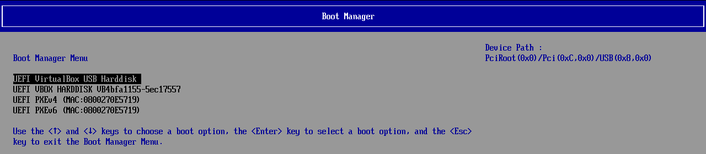

- UEFI:NTFS（Rufus が USB の末尾に足すパーティション）の画面。`Secure Boot status: Enabled` のまま、NTFS の中の `efi\boot\bootx64.efi` から Windows のブートマネージャーを起動する

  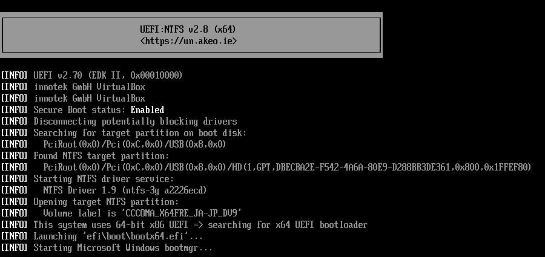

- インストールが途中で失敗した後に USB から起動し直すと、「言語設定を選択」の前にこの窓が出た。「はい」はアップグレードの続きで、この手順では使わない

  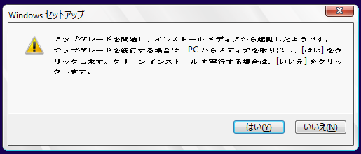

### 実施手順 / 手順 4: 補足: wpeutil UpdateBootInfo、キー配列、ディスクを外しておくこと

- `PEFirmwareType` は、WinPE（セットアップの環境）がどのモードで起動したかを示す値。Microsoft の文書（[参照](../reference/windows-dual-boot.md#参照)）では、`0x1` が BIOS、`0x2` が UEFI
- **この値は `wpeutil UpdateBootInfo` の後にしか無い**（同じ文書も、先に `wpeutil UpdateBootInfo` を実行している）。VM で先に `reg query` だけを打つと、`エラー: 指定されたレジストリ キーまたは値が見つかりませんでした` になった
- UEFI で起動していないと、手順 5 の GPT のディスクに Windows を入れられない
- ほかに内蔵のディスク（データ用など）がある PC では、取り違えないように、可能なら外してから始める
- 日本語の ISO のセットアップでは、言語やキーボードを選ぶ前から、コマンド プロンプトは日本語の配列で読む。VM に英語配列のキーの信号を送ると、`=` は `^`、`"` は `*`、`\` は `]`、`:` は `+` になった

VirtualBox の VM で撮った画面（[付録](#付録-virtualbox-の-vm-での検証2026-10-03)）:

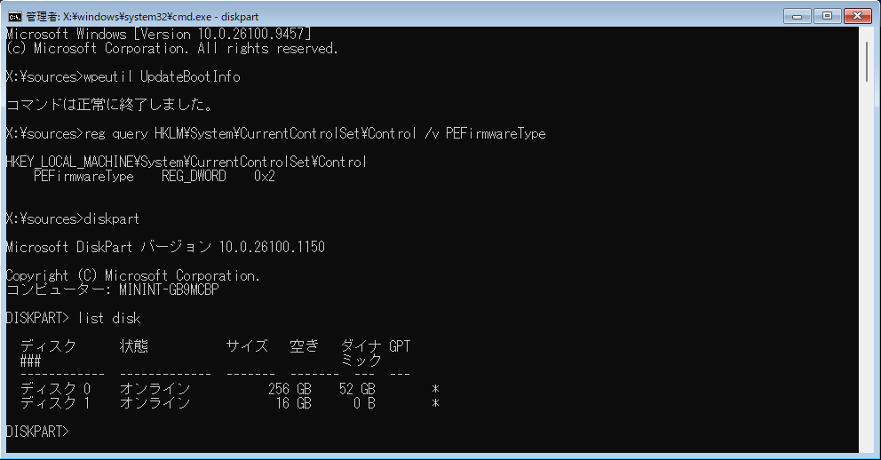

- 上はやり直しの 2 回目の画面で、手順 5 のパーティションが残っているので、ディスク 0 の空きが 52 GB になっている。初めてのときは、空きがディスクの大きさと同じで、GPT の印が無かった
- 次は、`wpeutil UpdateBootInfo` を打たずに `reg query` を打ったときの画面

  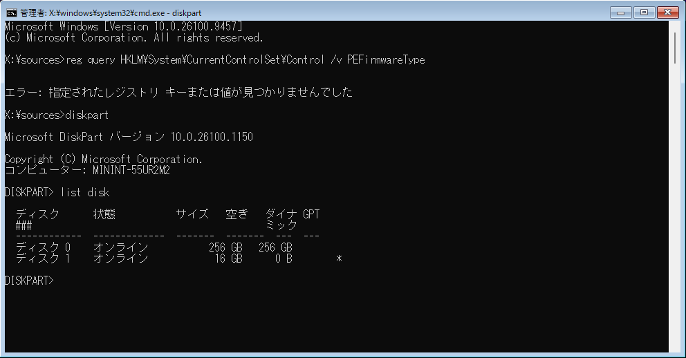

- 次は、英語配列のキーで `echo = " \ :` と打ったときの画面（Enter の前）

  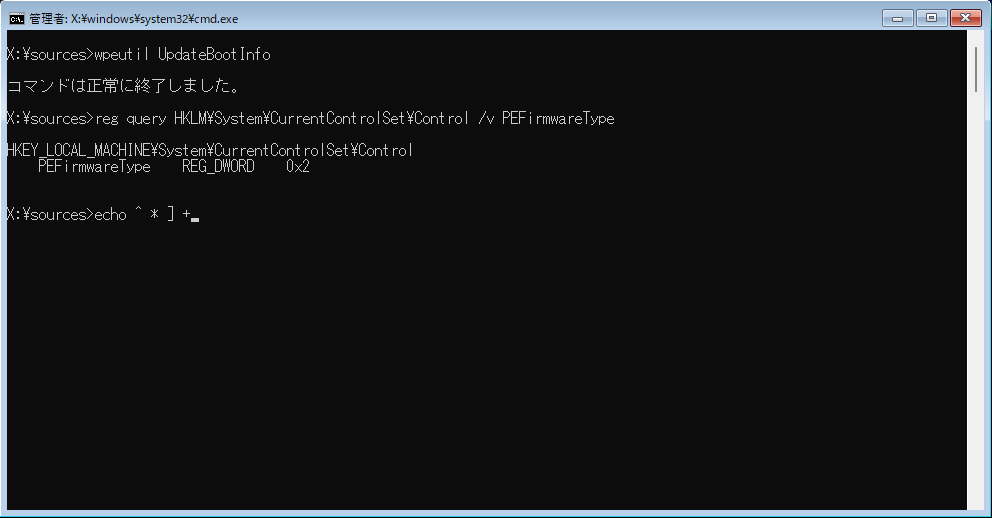

### 実施手順 / 手順 5: 補足: 4 つのパーティションと、並べる順番

Microsoft のサンプルの `CreatePartitions-UEFI.txt`（[参照](../reference/windows-dual-boot.md#参照)）と同じ形で、大きさだけを変えた。

| 順 | パーティション | 大きさ | 形式 | 役目 |
|---|---|---|---|---|
| 1 | ESP（EFI システム パーティション） | 2 GiB | FAT32 | Windows と AlmaLinux のブートローダーを置く。AlmaLinux と共用する |
| 2 | MSR（Microsoft 予約パーティション） | 16 MB | 無し | Windows が使う。中身は見えない |
| 3 | Windows | `204800` MB の例で 200 GiB | NTFS | C: になる |
| 4 | 回復（WinRE） | 1 GiB | NTFS | Windows の回復環境。ドライブ文字を付けない |
| — | 未割り当て | 残り | — | AlmaLinux 10 を入れる |

- **ESP を最初に置く**: Microsoft の GPT の FAQ は、ESP をディスクの先頭に置き、1 台のディスクに ESP を 2 つ作らないよう書いている。AlmaLinux も、この ESP を共用する
- **MSR は 16 MB**: Microsoft の今の文書の値（古い FAQ には 32 MB・128 MB とある）
- **回復は Windows のすぐ後ろ**: Microsoft の文書は「Windows のパーティションの直後に置く」としている。WinRE の更新で大きさが足りないとき、Windows が C: を縮めて回復パーティションを広げられるため
- **回復は 1 GiB**: Microsoft は、自分で並びを作るときは 990 MB 以上（空き 250 MB 以上）を勧めている
- `set id=` の値は回復パーティションの種類、`gpt attributes=0x8000000000000001` は「ドライブ文字を付けない」と「プラットフォームに要る」の 2 つの属性
- サンプルは `create partition primary` で残り全部を取ってから `shrink` で回復の分を空けるが、ここでは後ろに AlmaLinux の領域を残すので、Windows と回復の大きさを `size=` で決めた
- diskpart では `cls` は使えない（打つと HELP の一覧が出る）。画面を消したいときは、`exit` で diskpart を抜けてから `cls`

VirtualBox の VM（256 GiB のディスク）で、このブロックの後半を打った画面（[付録](#付録-virtualbox-の-vm-での検証2026-10-03)）:

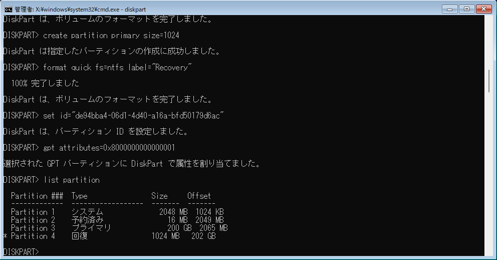

### 実施手順 / 手順 6: 補足: VM で撮ったセットアップの画面と、既存のパーティションに入れるとき

- 一覧が手順 5 の前のままなら、「最新の情報に更新」を押す
- 既にある ESP と MSR を、セットアップは作り直さずに使う（Microsoft の古い文書では、どちらも無いときだけ作る）
- WinRE がどこに入るかは、手順 9 で確かめる
- 画面の名前は、Windows 11 26H2（ビルド 26300）の日本語の製品版の ISO を VirtualBox の VM で動かして写した（[付録](#付録-virtualbox-の-vm-での検証2026-10-03)）。VM の「キーボードの種類」の既定は 101/102 キーだった

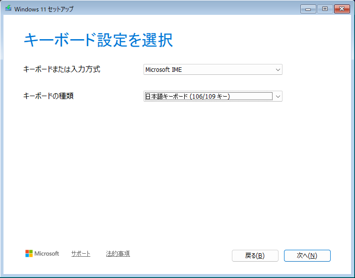

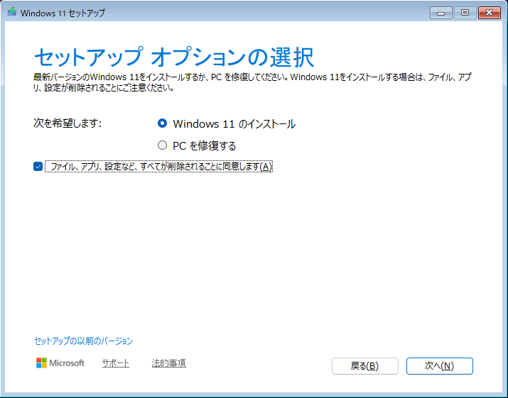

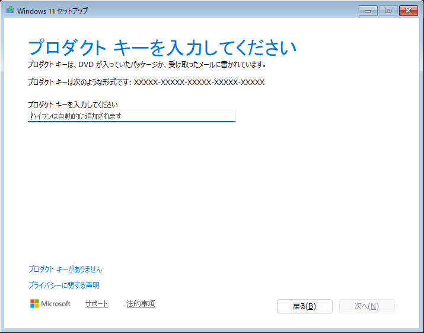

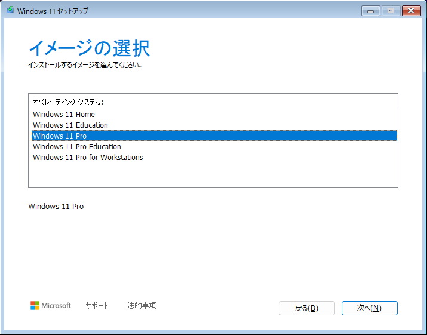

- 「Windows 11 をインストールする場所の選択」には手順 5 の並びがそのまま出て、パーティション 3 が最初から選ばれていた。下の 2 行（ディスク 1）は Rufus の USB

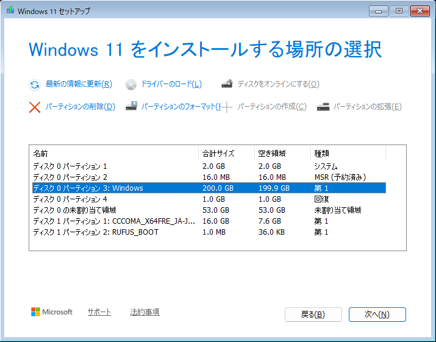

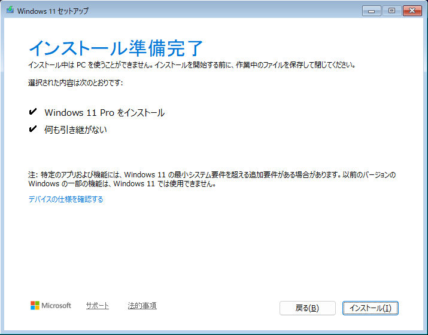

### 実施手順 / 手順 7: 補足: Rufus が OOBE で行うこと、VM で撮った画面

- Rufus 4.15 の `src/wue.c` は、オンにした項目から `unattend.xml` を作り、USB の `sources\$OEM$\$$\Panther\` に置く
- セットアップがファイルをコピーするときに `C:\Windows\Panther\` へ入り、初回の起動（OOBE）とその前の段階で使われる
- 「ローカルアカウントを次の名前で作成:」: Administrators のローカル アカウントを空のパスワードで作り、最初のサインインのときに `net user "<名前>" /logonpasswordchg:yes`（次のサインインでパスワードの変更を求める）と `net accounts /maxpwage:unlimited`（パスワードの有効期限を無くす）を実行する
- 「オンラインアカウントの要件を削除」: `BypassNRO` を 1 にする（ネットワーク無しで進む選択肢を出す）
- 「データ収集を無効化」: ライセンスの画面を出さず、プライバシーの質問に「いいえ」で答える（`HideEULAPage`・`ProtectYourPC` が 3）
- 「地域設定をこのユーザーと同じものに設定」: Rufus を動かした PC の入力ロケール・ロケール・タイムゾーンを書く（タイムゾーンは手順 11 で確かめる）
- ネットワークの画面を隠す設定（`HideOnlineAccountScreens` など）は、Rufus はサイレントのときにしか書かない

VirtualBox の VM で撮った画面（[付録](#付録-virtualbox-の-vm-での検証2026-10-03)）。ネットワークの画面の後は何も聞かれずにロック画面になり、キーを押すとアカウント `user`（Rufus で付けた名前）でデスクトップまで進んだ:

- サインアウトしてサインインし直すと、次の画面が出た。OK の後は「パスワード」（空のまま）・「新しいパスワード」・「パスワードの確認入力」の 3 つの欄で、決めると「パスワードは変更されました。」が出てデスクトップまで進んだ

  

### 実施手順 / 手順 9: 補足: WinRE の場所と、VM での出力

- Microsoft の文書によれば、セットアップは WinRE のイメージをまず `C:\Windows\System32\Recovery` に置き、specialize の段階で回復パーティションへコピーする
- Microsoft の文書では、セットアップが自分で作っていない回復パーティション（手順 5）を使うかは確かめられなかったが、VM では使われた（`partition4`）
- WinRE が C: にあっても回復環境は動く。回復パーティションが使われずに残るだけ

VirtualBox の VM（256 GiB のディスク、`size=204800`）で、このブロックを打った画面（[付録](#付録-virtualbox-の-vm-での検証2026-10-03)）。`LargestFreeExtent` の 56889442304 バイトは約 53 GiB:

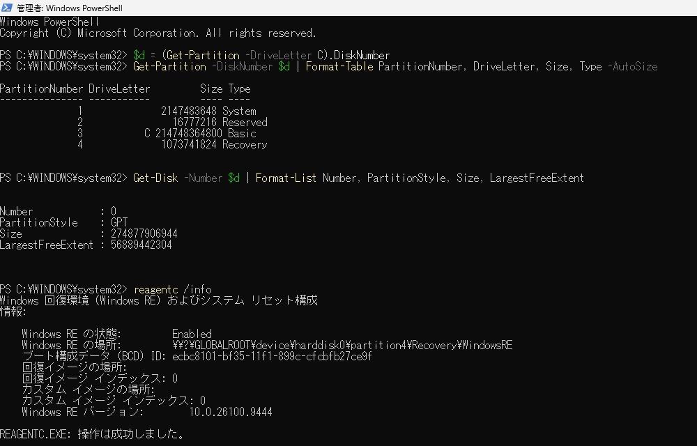

### 実施手順 / 手順 11: 補足: 高速スタートアップを切る理由と、タイムゾーン

- 高速スタートアップは、シャットダウンのときに Windows のカーネルの状態を休止状態のファイルに書いて、次の起動を速くする。切っておくと、AlmaLinux に切り替える前のシャットダウンが、毎回ふつうのシャットダウンになる
- Rufus の「利便性向上パッチ」は、最初のサインインのときに `HiberbootEnabled` を 0 にする（`src/wue.c`）
- Rufus の「地域設定をこのユーザーと同じものに設定」は、Rufus を動かした PC のタイムゾーンの表示名（`GetTimeZoneInformation` の `StandardName`）を、`unattend.xml` の `TimeZone` に書く
- `TimeZone` が受け付けるのは `Tokyo Standard Time` のような ID。日本語の Windows で Rufus を動かすと、表示名の `東京 (標準時)` が書かれ、受け付けられない
- VM では、`C:\Windows\Panther\UnattendGC\setupact.log` に `[Shell Unattend] TimeZone: Unknown time zone '東京 (標準時)'` の警告が出て、値は無視された。それでも `Id : Tokyo Standard Time` だった（日本語の ISO の既定と思われる）
- Rufus の issue（[参照](../reference/windows-dual-boot.md#参照)）にも、この項目でタイムゾーンが設定されなかった報告がある

VirtualBox の VM で、このブロックを打った画面（[付録](#付録-virtualbox-の-vm-での検証2026-10-03)）:

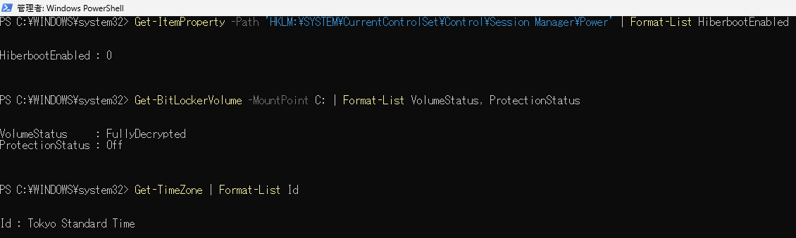

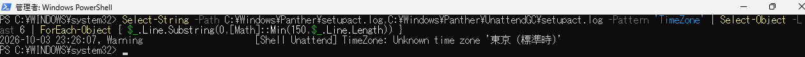

### 次回だけ AlmaLinux で起動する（任意） / 手順 3: 補足: ハッシュと署名の確認範囲

- このハッシュは、取得した ZIP と GitHub のリリース API の `digest` が一致した値（[付録](#付録-qefi-entry-manager-の配布物とソースの確認2026-10-04)）
- 同梱の `QEFIEntryManager.exe` と `qefibootmgr.exe` の Authenticode は、どちらも `NotSigned`（署名無し）だった
- ハッシュの一致は配布物の同一性の確認で、作者の署名の確認や安全性の保証ではない

### 次回だけ AlmaLinux で起動する（任意） / 手順 5: 補足: CLI の 0000 表示だけでは判定できない

- v0.5.0 の CLI は、`BootNext` が未設定でも、読み取りに失敗しても `BootNext: 0000` と表示する。実際にエントリ `0000` を指定している場合と区別できない
- 同梱ライブラリの `qefi_get_variable_uint16` は、2 バイトを読み取れないと `0` を返す。一方、CLI は `0xFFFF` だけを未設定とみなしている（[参照](../reference/windows-dual-boot.md#参照)）
- そこで BCDEdit の `{fwbootmgr}` の `bootsequence` も使い、予約の有無と対象を確認する。`displayorder` は通常の起動順。どちらも Windows の `{bootmgr}` ではなく、ファームウェアの `{fwbootmgr}` を見る
- CLI の番号と BCDEdit の識別子（GUID）は別の形式なので、文字列としては一致しない。同じ名前・EFI パスのエントリを対応させる
- BCDEdit と実際の EFI 変数の対応を含め、この節の読み戻しは本実行していない。表示がこの手順と合わなければ、成功とみなさず中断する

### 対象と検証環境

- **目的**: 1 台のディスクに Windows 11 と AlmaLinux 10 を入れるために、Windows を先に新しく入れる
  - Windows のセットアップのコマンド プロンプトで、ESP を 2 GiB で作り、Windows と回復のパーティションの後ろに AlmaLinux 用の未割り当て領域を残す
  - AlmaLinux 10 のインストールは、この文書には含めない（[注意点](../extra/windows-dual-boot.md#注意点)に、入れるときの要点だけを置いた）
  - 両 OS の導入後に使う任意節として、Windows の QEFI Entry Manager で次回だけ AlmaLinux を起動する方法も扱う
- **進め方**: インストールメディアは、利用者が Rufus で作ったもの（「インストーラーをカスタムしますか?」の 7 項目をオン）を使う。手順 4・5 はセットアップのコマンド プロンプトに手で打ち、手順 9〜13 は入れた Windows の PowerShell に貼る
- **状態（実施手順 1〜13）**: **VirtualBox の VM のみで検証**（2026-10-03。[付録](#付録-virtualbox-の-vm-での検証2026-10-03)）
  - 通したこと: Windows 11 Pro のホストの VirtualBox 7.2.20 の VM（EFI・Secure Boot 有効・TPM 2.0）で、Windows 11 26H2 の日本語の製品版の ISO から Rufus 4.15 で作ったメディアを USB の記憶装置として付け、手順 1〜13 を通した
    - Rufus は、検証のホストで実物を動かした（「インストーラーをカスタムしますか?」の 7 項目をオン）
    - キーとブロックは、VM に日本語 106/109 の配列のキーの信号を送って打った（手で打つ・貼る代わり）
    - 手順 10・12・13 は条件に当たらなかったので、ブロックが動くことだけを確かめた
  - 確かめたこと
    - 手順 4 の `reg query` の前に `wpeutil UpdateBootInfo` が要る（無いとエラー。ブロックに足した）
    - 手順 5 の並びのままインストールでき、セットアップは手順 5 の回復パーティションに WinRE を置いた
    - セットアップと OOBE の実際の画面（名前を本文に合わせた）、次のサインインでのパスワードの変更
    - Rufus が書くタイムゾーン（表示名）は無視され、日本語の ISO では東京のままになった
    - やり直し（手順 4・5 を飛ばして手順 3 から）
  - 検証のホストの不具合（メモリかと思われる）で、Rufus が書いた `install.wim` が 2 回とも化け、インストールが 2 回 `0x80070570` で失敗した。ISO の `install.wim` でメディアの 1 ファイルだけを上書きしてから通した（付録）。手順書の誤りではない
  - **確認していないこと**: 実機（UEFI の設定画面・実物の USB メモリと起動メニュー・物理の日本語キーボード・Shift+Fn+F10）、3rd Party UEFI CA を許可しないときに止まること、Home エディション、BitLocker が有効になる PC、AlmaLinux 10 のインストール（[注意点](../extra/windows-dual-boot.md#注意点)はソースから読んだまま）
  - 書いたときの資料（[参照](../reference/windows-dual-boot.md#参照)）: Microsoft Learn の UEFI/GPT のパーティションの文書とサンプルの `CreatePartitions-UEFI.txt`、Rufus 4.15（2026-06-30）のソース（`src/wue.c`・`src/drive.c`・`res/loc/rufus.loc`）、Microsoft の KB5028997、AlmaLinux 10.2 のインストーラ（Anaconda 40.22.3.46）の `rhel-10` ブランチと blivet のソース
  - その前に試した VM（QEMU の TCG）は、Windows のブートマネージャーの後に画面が出ないまま中止した（[付録](#付録-vm-での試み2026-10-03中止)）
- **状態（QEFI Entry Manager の任意節）**: **本実行未検証**（2026-10-04。[付録](#付録-qefi-entry-manager-の配布物とソースの確認2026-10-04)）
  - 確かめたこと: 公式 ZIP のハッシュと中身、GUI と CLI の署名の有無、v0.5.0 のソース、BCDEdit の文書とヘルプ、追加した PowerShell ブロックの 5.1 での構文
  - CLI のヘルプの実行は、非管理者の環境で管理者特権を要求して失敗した。CLI の動作確認済みとはしていない
  - 確認していないこと: GUI の操作、EFI の読み書き、BCDEdit との照合、予約の取り消し、AlmaLinux の起動とその後の通常の起動順への復帰（実機・VM とも）

| 項目 | 想定 |
|---|---|
| PC | x86_64、UEFI（Secure Boot と TPM 2.0 が有効）、内蔵のディスク 1 台 |
| Windows | Windows 11（24H2 以降。検証は 26H2、ビルド 26300） |
| メディア | Rufus 4.15 で作った USB（GPT、ターゲットは UEFI、NTFS + UEFI:NTFS） |
| 後で入れるもの | AlmaLinux 10.2（x86_64） |

> [!NOTE]
> 手順 5 の値（ディスクの番号 `0`、Windows の大きさ `204800`）は例で、手で打つときに直す。各手順の補足の画面は VirtualBox の VM で撮ったもので、ローカル アカウントの名前は試験用の `user` にした。

手順書全体に関わる理由・落とし穴（手順ごとのものは各手順の末尾の「補足」にある）。手順を実行するだけなら読まなくてよい。

### 選択した方針

- **次回だけの切り替えには QEFI Entry Manager の `Set reboot` を使う**
  - 通常の起動順を変えて後で戻すのではなく、UEFI の `BootNext` で 1 回だけ指定する
  - GUI の確認画面や同梱 CLI の成功の文だけには頼らず、CLI と BCDEdit を読み戻してから再起動する
  - エントリの追加・削除、ESP の中身の編集、GRUB の設定変更はこの節では行わない
- **ESP を 2 GiB にする**
  - セットアップの「Windows 11 をインストールする場所の選択」の画面では、ESP の大きさを選べない。そこで、手順 5 で diskpart を使って先に作る
  - Microsoft Learn（2026-09-09 更新）が示すのは最小（512 / 512e のディスクで 200 MB、4Kn で 300 MB）だけで、上限は無い。diskpart の文書の例も `create partition efi size=1000`
  - 2026-05 の更新プログラム KB5089549 は、ESP の空きが 10 MB 以下の 24H2 / 25H2 の PC で失敗した（Windows のリリース正常性）
  - AlmaLinux の shim と GRUB、ファームウェアの更新のファイル、将来の UKI や別の Linux を置いても余裕がある。AlmaLinux のインストーラが自分で ESP を作るときは 500〜600 MiB
- **ESP は Windows と AlmaLinux で共用する**: 1 台のディスクに ESP を 2 つ作らない（Microsoft の GPT の FAQ）。Rufus も、USB の UEFI:NTFS のパーティションを ESP の種類にしない（Windows のセットアップが 2 つ目の ESP で失敗するため。`src/drive.c` のコメント）
- **並びは Microsoft のサンプルに合わせ、大きさを `size=` で決める**: ESP → MSR → Windows → 回復の順。回復を Windows の直後に置き、AlmaLinux の領域はその後ろに残す（手順 5 の補足）
- **Windows のセットアップの中で diskpart を使う**: 別の道具でパーティションを作ると、Rufus の USB のほかにもう 1 本のメディアが要る。セットアップの環境（WinPE）に入っている diskpart で足りる
- **「⚠サイレント⚠ ディスクの削除とインストール」は使わない**: 最初に見つかったディスクを確かめずに消し、ESP を 260 MB で作って、残り全部を Windows にする（`src/wue.c`）。手順 5 の並びにならない
- **ロールバックの節は置かない**: ディスクを消して入れ直す手順なので、戻すときも手順 3 から入れ直す

**Rufus 4.15 の実際の画面**（検証のホストの Windows 11 で、Windows 11 26H2 の ISO を 16 GiB の VHD に書いたとき。[付録](#付録-virtualbox-の-vm-での検証2026-10-03)）:

### 完了時点の状態

手順どおりに進めたときの、ディスクの並び（VM の 256 GiB のディスクで確かめた。AlmaLinux から見たときの扱いは想定）:

| パーティション | 大きさ | Windows の `Type` | GPT の種類 | 後で AlmaLinux から見たとき |
|---|---|---|---|---|
| 1. ESP | 2 GiB | `System` | `c12a7328-f81f-11d2-ba4b-00a0c93ec93b` | `/boot/efi` に割り当てる（フォーマットしない） |
| 2. MSR | 16 MB | `Reserved` | `e3c9e316-0b5c-4db8-817d-f92df00215ae` | 触らない |
| 3. Windows | 手順 5 の `size=` | `Basic`（C:） | `ebd0a0a2-b9e5-4433-87c0-68b6b72699c7` | 触らない |
| 4. 回復 | 1 GiB | `Recovery`（WinRE が入る） | `de94bba4-06d1-4d40-a16a-bfd50179d6ac` | 触らない |
| 未割り当て | ディスクの残り | — | — | AlmaLinux 10 を入れる |

- ファームウェアの起動項目に `Windows Boot Manager`（ESP の上）がある
- 高速スタートアップは切れている（`HiberbootEnabled` が 0）
- BitLocker（デバイスの暗号化）は使われていない
- Rufus で作ったローカル アカウントがあり、最初のサインインはパスワード無しで入り、次のサインインでパスワードを決める
- ローカル アカウントのパスワードの有効期間は「無制限」（`net accounts`）

### 操作上の注意と併記されていた記録

- **この後 AlmaLinux 10 を入れるとき**（AlmaLinux 10.2 のインストーラのソースから読んだこと。試していない）

### 付録: VM での試み（2026-10-03、中止）

**目的**: この文書の手順 3〜13 を VM で通す予定だった。利用者の指示で、途中で中止した。

**環境**: Ubuntu 24.04 / x86_64 のクラウドホスト（KVM 無し）の QEMU 8.2.2（TCG）。OVMF は Ubuntu の 2024.02-2ubuntu0.9 の `OVMF_CODE_4M.secboot.fd` と `OVMF_VARS_4M.ms.fd`（db に Microsoft の 2011 と 2023 の CA が入っている）、swtpm の TPM 2.0、NVMe のディスク。

**メディア**: Rufus は Windows でしか動かないので、Windows 11 Enterprise 評価版（26H2、日本語、ビルド 26300.9457）の ISO から、Rufus 4.15 のソースどおりの USB のイメージを Linux の道具で作った。

- GPT で、NTFS の「Main Data Partition」と、末尾 1 MiB の「UEFI:NTFS」（basic data、ドライブ文字を付けない属性。中身は Rufus の `res/uefi/uefi-ntfs.img`）
- `boot.wim` の 2 番のイメージの SYSTEM ハイブに `LabConfig` の 3 つの値、空の `appraiserres.dll`、Rufus の `setup.exe` のラッパー
- `sources\$OEM$\$$\Panther\unattend.xml`（7 項目で `src/wue.c` が書く内容を、そのまま生成したもの）

**結果**:

- Secure Boot が有効なまま、UEFI:NTFS 2.8 が起動し（`Secure Boot status: Enabled`）、NTFS の中の `efi\boot\bootx64.efi` から Windows のブートマネージャーが起動した
- ブートマネージャーが `boot.wim`（約 670 MB）を読み込んだ後、画面が真っ黒のままになった。vCPU はカーネルとユーザーモードのコードを実行し続けていたが、1 回目（`-vga std`・`-cpu max`）は約 45 分待っても画面は出なかった
- CPU を `Skylake-Client-v4` に変えた回（約 15 分）、元の ISO を CD として起動した回（約 6 分）、さらに表示を `ramfb` に変えた回（約 38 分）も、同じだった
- ここで利用者の指示により中止した。パーティションの手順（手順 4 以降）には進んでいない

### 付録: VirtualBox の VM での検証（2026-10-03）

**目的**: この文書の手順 1〜13 を VM で通す（AlmaLinux 10 は入れない）。

**環境**:

| 項目 | 値 |
|---|---|
| ホスト | x86_64 のデスクトップ PC（AMD Ryzen 9 5900X、メモリ 32 GB）の Windows 11 Pro（ビルド 26300）。Hyper-V は動いていない |
| 仮想化 | VirtualBox 7.2.20（winget の `Oracle.VirtualBox`。ネットワークのドライバーは入れず、VM は NAT だけ） |
| VM | 種類 Windows11_64、メモリ 8 GB、CPU 8、EFI、Secure Boot 有効（`modifynvram … enrollmssignatures`）、TPM 2.0、SATA の 256 GiB のディスク、NIC は NAT（手順 7 まではケーブルを外した状態）、ホスト I/O キャッシュは無効 |
| Secure Boot の db | Microsoft Corporation UEFI CA 2011・Microsoft UEFI CA 2023（3rd Party UEFI CA）、Microsoft Windows Production PCA 2011、Windows UEFI CA 2023、Microsoft Option ROM UEFI CA 2023 |
| ISO | Windows 11 26H2 Home/Pro/Edu 日本語（`Windows11_Client_x64_ja-jp_26300_9457.iso`、ビルド 26300.9457）。Fido 1.71 の `-GetUrl` で Microsoft から取得。SHA256 `923EC1A2…DE3A0C`（Microsoft の公表値とは照合していない） |
| Rufus | 4.15.2396 のポータブル版（Authenticode `Valid`、署名者 Akeo Consulting）。書き込み先は、ホストに接続した 16 GiB の VHD |
| メディアの付け方 | 書いた VHD を、VM の USB の記憶装置（VirtualBox の USB のストレージ コントローラー）として付けた |

**操作の方法**:

- VM の画面は `VBoxManage controlvm … screenshotpng` で撮った
- キーは `keyboardputscancode` で、日本語 106/109 の配列のキーの信号（例: `\` は `0x73`、`=` は Shift と `0x0C`）を送った。手順 4・5 の手打ちと、手順 9〜13 の貼り付けの代わり
- Rufus は、ホストの管理者の Windows PowerShell 5.1 から Win32 のメッセージ（`WM_COMMAND`・`BM_SETCHECK`・`WM_SETTEXT`）で操作した（UI Automation では Rufus の部品がどれも `Pane` に見え、使えなかった）

**Rufus**:

- ISO を選ぶと、パーティション構成 `GPT`・ターゲット システム `UEFI (CSM 無効)`・ファイル システム `NTFS`・ボリューム ラベル `CCCOMA_X64FRE_JA-JP_DV9` になった。デバイスは `NO_LABEL (ディスク 2) [17 GB]`（VHD）
- 「インストーラーをカスタムしますか?」は 10 項目（[選択した方針](../reference/windows-dual-boot.md#選択した方針)の画面）。この文書の 7 項目に印を付け、ローカルアカウントの名前は `user` にした
- ログの `Selected Windows User Experience options:` には 9 行（利便性向上パッチが 3 行に分かれる）が出た
- ログの UEFI ブートローダーの解析では、`/bootmgr.efi` と `/efi/boot/bootx64.efi` が `Microsoft Windows Production PCA 2011` の署名で、「`Windows UEFI CA 2023` に更新した PC では Secure Boot の検証に失敗するかもしれない」の注意が出た
- USB の並び: GPT、1 番が NTFS の `Main Data Partition`（16 GiB）、2 番が FAT の `UEFI:NTFS`（`RUFUS_BOOT`、1 MiB、ドライブ文字を付けない属性）。どちらも basic data の種類
- 書いた `sources\$OEM$\$$\Panther\unattend.xml`: `TimeZone` は `東京 (標準時)`、`InputLocale` は `00000411`、`SystemLocale`・`UserLocale`・`UILanguage` は `ja-JP`、アカウントは `Administrators;Power Users`
- 書き込みは 2 分半〜3 分半だった

**手順ごとの結果**（画面は各手順の補足）:

- 手順 1: VM の設定で相当（EFI・Secure Boot・TPM 2.0）。3rd Party UEFI CA を外したときに止まるかは試していない
- 手順 3: 起動メニューの `UEFI VirtualBox USB Harddisk` から、UEFI:NTFS 2.8（`Secure Boot status: Enabled`）→ Windows のブートマネージャー → 約 25 秒で「言語設定を選択」
- 手順 4: 初めは `reg query` だけを打ち、`エラー: 指定されたレジストリ キーまたは値が見つかりませんでした` になった。`wpeutil UpdateBootInfo` の後は `0x2`。この結果でブロックに `wpeutil UpdateBootInfo` を足した。WinPE は 10.0.26100.9457、diskpart は 10.0.26100.1150
- 手順 5: 全行が成功し、`list partition` はシステム 2048 MB・予約済み 16 MB・プライマリ 200 GB・回復 1024 MB（オフセットは 1024 KB・2049 MB・2065 MB・202 GB）。2 回通して同じだった
- 手順 6: 画面の名前は手順 6 の本文のとおり。1 回目は「イメージの選択」で Education を選んでいたのに「インストール準備完了」で気付き、戻ると「適用される通知とライセンス条項」で戻れなくなった。Esc →「本当に終了しますか?」→「はい」で VM が再起動し、USB の UEFI:NTFS から起動し直した
- 手順 6 のインストールの失敗（2 回）: 下の「インストールの失敗」
- 手順 7: OOBE は「ネットワークに接続しましょう」の 1 画面だけで、「インターネットに接続していません」→ ロック画面 → キーでそのままデスクトップ（23:29、アカウント `user`）。デスクトップの後で VM のケーブルをつないだ
- 手順 8: 検索の右側の「管理者として実行する」（Ctrl+Shift+Enter で押した）→ UAC の「はい」。最初のサインインの直後は、スタートメニューが勝手に開き直したので Esc で閉じた
- 手順 9: 4 つのパーティションが `System`・`Reserved`・`Basic`（C:）・`Recovery`、`PartitionStyle` は `GPT`、`LargestFreeExtent` は `56889442304`。WinRE は `Enabled`・`partition4`（Windows RE のバージョン 10.0.26100.9444）
- 手順 10・12・13: 条件に当たらなかった。ブロックだけ流し、どれも成功した
- 手順 11: `HiberbootEnabled : 0`、`FullyDecrypted`・`Off`、`Tokyo Standard Time`。`UnattendGC\setupact.log` に `TimeZone: Unknown time zone '東京 (標準時)'`
- 手順 7 の残り: `shutdown /l` でサインアウトし、サインインすると「サインインする前にユーザーのパスワードを変更する必要があります。」→ 新しいパスワードを 2 回 →「パスワードは変更されました。」→ デスクトップ
- 追加の確認: `ProductName` は `Windows 10 Pro`（レジストリの古い名前のまま）・`EditionID` は `Professional`・`DisplayVersion` は `26H2`・ビルド 26300.9457、`Confirm-SecureBootUEFI` は `True`、TPM は有効、`bcdedit /enum firmware` に `Windows Boot Manager`（`partition=\Device\HarddiskVolume1`）、`net accounts` のパスワードの有効期間は「無制限」、各パーティションの `GptType` は[完了時点の状態](#完了時点の状態)の表のとおり

**インストールの失敗（検証のホストの不具合）**:

- 1 回目と 2 回目（手順 4・5 を飛ばしたやり直し）は、どちらも「Windows 11 のインストールが失敗しました」で止まった
  - `setuperr.log` は `Error in apply of …\Microsoft.WindowsAppRuntime.1.6_6000.424.1611.0_x64__8wekyb3d8bbwe\ml-IN\Microsoft.ui.xaml.dll.mui. GLE [1392]` と `CApplyWIM: Failure while applying image 3 for D:\Sources\Install.wim. Error 0x80070570`
  - 2 回とも同じファイルで止まった
- メディアの `install.wim` を ISO の中のものと比べると、16 KB の塊 4 か所で、64 バイトおきに 1 バイトずつ値が違っていた。ISO 自体は、SHA256 を 2 回取って同じだった
- このホストでは、同じファイルをキャッシュを通して読むたびに SHA256 が変わり、キャッシュを通さずに読む（`FILE_FLAG_NO_BUFFERING`）と変わらなかった。どの CPU コアに固定しても化けた。WHEA のエラーは出ていない（メモリは ECC ではない）。メモリかメモリ コントローラーの不具合と思われる
- Rufus で作り直しても、`install.wim` はまた化けた（SHA256 が違うまま 2 回読んでも同じ値）
- Rufus は `install.wim` を ISO から手を加えずに写すだけなので、ISO から取り出してキャッシュを通さずに 3 回読んで同じ値だった `install.wim` を、`robocopy /J`（キャッシュを通さないコピー）で上書きした。上書きした後は ISO と同じ値になった
- ほかに Rufus が手を加えないファイル 1,060 個も、ISO から 2 回取り出したものと同じ値だった。手を加える 4 つ（`setup.exe`・`autorun.inf`・`sources\boot.wim`・`sources\appraiserres.dll`）は比べていない
- 3 回目（手順 3 → 6、手順 4・5 は飛ばした）は 23:23 に最初の再起動まで進み、そこで USB を外した。C: に前の回の残りがあったので、`C:\Windows.old` ができた（中身は空の `ProgramData` だけ）

### 付録: QEFI Entry Manager の配布物とソースの確認（2026-10-04）

- **対象**: v0.5.0 の `QEFI.Entry.Manager.for.Windows.Qt6.8.3.zip` と同じタグのソース。Windows の上で配布物を検査したが、GUI での指定・EFI 変数の読み書き・再起動は行っていない
- **配布物**
  - ZIP は 23,278,457 バイト。SHA256 は `FC2D83F1369AF02A48072644B08CA7D3D4B2547B955A2088918E7C1179051A10` で、GitHub のリリース API のアセットの `digest` と一致した
  - ZIP の直下に `QEFIEntryManager.exe`（499,200 バイト）・`qefibootmgr.exe`（104,960 バイト）・`efibootmgr.exe`（104,960 バイト）があった
  - `Qt6Core.dll`・`Qt6Gui.dll`・`Qt6Widgets.dll` と `platforms/qwindows.dll` などが同梱されていた
  - GUI と `qefibootmgr.exe` を展開して `Get-AuthenticodeSignature` で調べると、どちらも `NotSigned` だった
- **CLI の実行の試み**
  - 展開した CLI の `--help` と `--version` を非管理者の PowerShell から呼んだが、出力が得られなかった
  - `--help` を `Start-Process` で標準出力・標準エラーを分けて起動し直すと、「要求された操作には管理者特権が必要です」で失敗した。ヘルプや版の動作を確認できたとはしていない
  - 昇格しての再試行、`-v`、`-N`、GUI の起動はしていない
- **ソースから確認したこと**
  - `MainWindow` のタブ名は `Boot Entries`。`Set reboot` は `BootNext` を書いてから `Do you want to reboot now?` を出す
  - `Yes` は Windows の `shutdown /r /t 0` を起動し、`No` は何もしない（既に書いた `BootNext` は残る）。`Save` は `BootOrder` を書く
  - GUI の `setBootNext` も CLI の `-N` も、EFI の書き込みの戻り値を判定していない
  - qefivar の Windows 向け `qefi_get_variable_uint16` は、読み取れた長さが 2 バイト未満なら `0` を返す。CLI は `0xFFFF` 以外を表示するので、未設定でも `BootNext: 0000` となる
  - この不具合のため、同梱 CLI だけの確認にはせず、BCDEdit の `{fwbootmgr}` の `bootsequence` も見る手順にした
- **文書と構文**
  - Microsoft の BCDEdit `/enum` の文書と、この Windows の `bcdedit /? ENUM` で、`firmware` がファームウェアのアプリケーションを列挙することを確認した
  - 追加した PowerShell ブロックは、Windows PowerShell 5.1.26100.9444 の構文解析器で確認した。ブロックを機械的に本実行してはいない
- **残っている未確認事項**: GUI の画面と UAC、管理者での CLI、Windows の実際の `bootsequence` と EFI の `BootNext` の照合、指定と取り消し、AlmaLinux の起動、1 回の起動後に通常の起動順へ戻ること（実機・VM とも）

### 分離前の検証状況の記録

> [!WARNING]
> - **実施手順 1〜13 は、VirtualBox の VM でだけ通した**（実機の UEFI の画面・USB メモリ・キーボードでは確かめていない。[対象と検証環境](#対象と検証環境)）

### 操作上の注意と併記されていた記録

  - `0x80070570`（`Error in apply of …`）は、メディアの `install.wim` が壊れている。同じメディアでやり直しても、同じファイルで止まる。Rufus でメディアを作り直し、作った PC で `install.wim` のハッシュを ISO の中のものと比べてから使う（検証では、Rufus を動かした PC の不具合で 2 回とも化けた。付録）

### 操作上の注意と併記されていた記録

- **手順 4・5 を飛ばしてやり直したとき**: C: に前の回の残りがあると、セットアップが `C:\Windows.old` を作る（検証では中身は空だった）。要らなければ、ディスク クリーンアップで消す

### 実施手順 / 手順 8: 補足: VM で撮った検索の画面

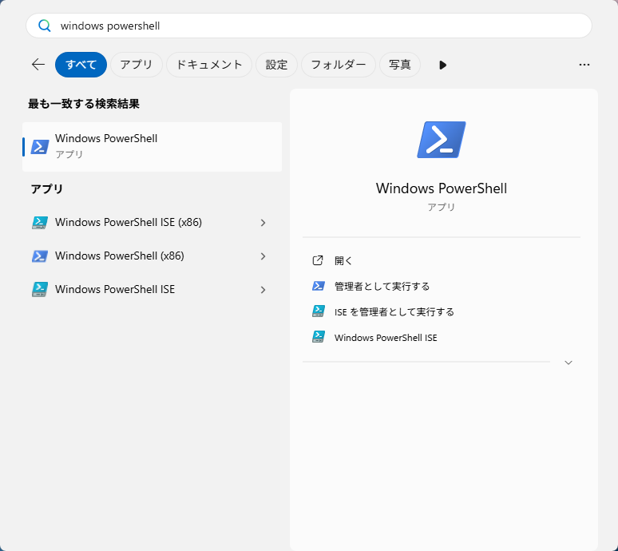

### 実施手順 / 手順 12: 補足: VM での結果

- VM では手順 11 で `0` だったので、この手順には当たらなかった。ブロックだけ流すと、`HiberbootEnabled : 0` が出た

### 実施手順 / 手順 13: 補足: VM での結果

- VM では手順 11 で東京だったので、この手順には当たらなかった。ブロックだけ流すと、`Id : Tokyo Standard Time` が出た

### 実施手順 / 手順 10: 補足: この 2 つのコマンドで移る理由

- Microsoft の KB5028997（回復パーティションを手で広げる手順。[参照](../reference/windows-dual-boot.md#参照)）は、`reagentc /disable` で WinRE を C: に戻し、回復パーティションを作り直してから `reagentc /enable` で WinRE を有効にし、`reagentc /info` で回復パーティションに入ったことを確かめている
- この手順では、回復パーティションは手順 5 で作ってあるので、作り直しを省いた
- VM では WinRE が最初から `partition4` にあったので、この手順には当たらなかった。ブロックだけ流すと、どれも `REAGENTC.EXE: 操作は成功しました。` で、`partition4` のままだった（BCD の ID は変わる）

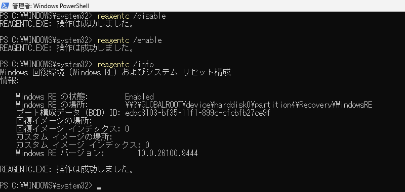

## 参考資料から分離した記録

### 参考資料: 選択した方針

**Rufus の 7 項目と、この文書の手順の関係**:

| Rufus の項目 | Rufus がすること（4.15 の `src/wue.c`） | この文書の手順 |
|---|---|---|
| 4GB以上のRAM、セキュアブート及びTPM 2.0の要件を削除 | `boot.wim` の中のレジストリに `HKLM\SYSTEM\Setup\LabConfig` の `BypassTPMCheck`・`BypassSecureBootCheck`・`BypassRAMCheck` を書く | 無し（要件を満たす PC でも、Rufus はオンを勧めている） |
| オンラインアカウントの要件を削除 | `BypassNRO` を 1 にする。ネットワークから外しておくことが条件 | 手順 2・7 |
| ローカルアカウントを次の名前で作成: | 空のパスワードの管理者のアカウントを作り、次のサインインで変更を求める | 手順 7 |
| 地域設定をこのユーザーと同じものに設定 | Rufus を動かした PC の入力ロケール・ロケール・タイムゾーンを書く | 手順 11・13 |
| データ収集を無効化 | ライセンスの画面を隠し、プライバシーの質問に「いいえ」で答える | 手順 7 |
| BitLocker 自動デバイス暗号化を無効化します。 | `PreventDeviceEncryption` を true にする | 手順 11 |
| 利便性向上パッチ(Microsoftの各種ソフトウェアの無効化) | OneDrive・Outlook・Teams を外し、Copilot・ニュースなどを切り、`HiberbootEnabled` を 0 にする | 手順 11・12 |

- メイン画面は、ISO を選ぶとパーティション構成 `GPT`・ターゲット システム `UEFI (CSM 無効)`・ファイル システム `NTFS` になった（変えずにスタート）
- 「インストーラーをカスタムしますか?」は 10 項目で、初めに印が付いていたのは要件の削除とオンラインアカウントの 2 つだけ
- 「⚠サイレント⚠」は、ローカルアカウント・地域設定・データ収集の 3 つに印を付けたときだけ現れ、エディションの選択（既定 `Windows 11 Pro`）が付く
- ローカルアカウントの名前の既定は、Rufus を動かした Windows のユーザー名（検証では `user` に変えた）
- 「スタート」の後に「警告: デバイス “<デバイス>” のデータは消去されます。」の確認が出る

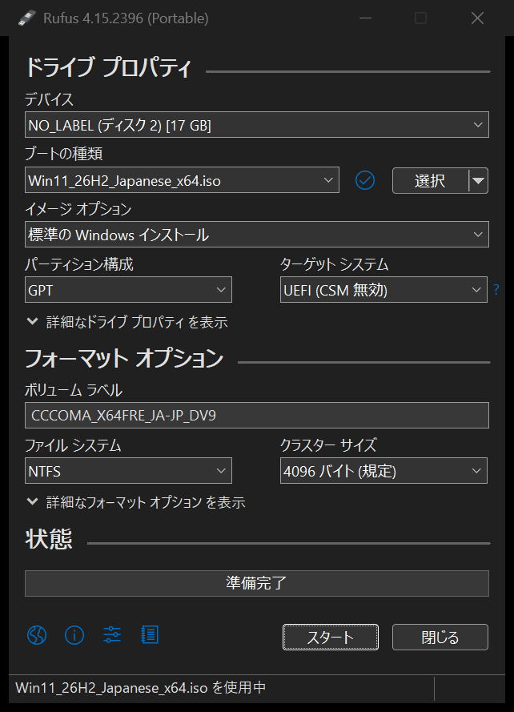

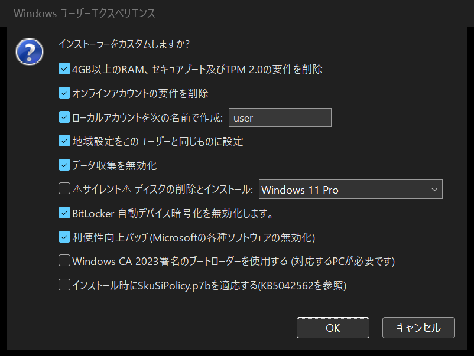

### 参考資料: 参照

- [UEFI/GPT-based hard drive partitions](https://learn.microsoft.com/en-us/windows-hardware/manufacture/desktop/configure-uefigpt-based-hard-drive-partitions)（ESP・MSR・回復の大きさと並び、サンプルの `CreatePartitions-UEFI.txt`）
- [Windows and GPT FAQ](https://learn.microsoft.com/en-us/windows-hardware/manufacture/desktop/windows-and-gpt-faq)（ESP は先頭に 1 つ）
- [create partition efi](https://learn.microsoft.com/en-us/windows-server/administration/windows-commands/create-partition-efi)（diskpart の `create partition efi size=`）
- [Boot to UEFI Mode or legacy BIOS mode](https://learn.microsoft.com/en-us/windows-hardware/manufacture/desktop/boot-to-uefi-mode-or-legacy-bios-mode)（`PEFirmwareType`）
- [Windows Recovery Environment (Windows RE) technical reference](https://learn.microsoft.com/en-us/windows-hardware/manufacture/desktop/windows-recovery-environment--windows-re--technical-reference)（セットアップが WinRE を回復パーティションへコピーする段階、回復パーティションの広げ方）
- [KB5028997: Instructions to manually resize your partition to install the WinRE update](https://support.microsoft.com/en-us/topic/kb5028997-instructions-to-manually-resize-your-partition-to-install-the-winre-update-400faa27-9343-461c-ada9-24c8229763bf)（`reagentc /disable` → `reagentc /enable`）
- [インストール メディアを使用して Windows を再インストールする](https://support.microsoft.com/ja-jp/windows/reinstall-windows-with-the-installation-media-d8369486-3e33-7d9c-dccc-859e2b022fc7)（セットアップの手順。画面の名前は VM の実物に合わせた）
- [Windows 11, version 25H2 known issues](https://learn.microsoft.com/en-us/windows/release-health/status-windows-11-25h2)（KB5089549 と ESP の空き）
- [BitLocker countermeasures](https://learn.microsoft.com/en-us/windows/security/operating-system-security/data-protection/bitlocker/countermeasures) / [Find your BitLocker recovery key](https://support.microsoft.com/en-us/windows/find-your-bitlocker-recovery-key-6b71ad27-0b89-ea08-f143-056f5ab347d6)（PCR 7、回復キー）
- [Rufus](https://github.com/pbatard/rufus) 4.15 のソース: `src/wue.c`（「インストーラーをカスタムしますか?」の各項目）、`src/drive.c`（USB の並びと UEFI:NTFS）、`res/loc/rufus.loc`（日本語の表示）、[issue #2499](https://github.com/pbatard/rufus/issues/2499)（地域設定でタイムゾーンが設定されなかった報告）
- [rhinstaller/anaconda](https://github.com/rhinstaller/anaconda) の `rhel-10` ブランチ（既存の ESP の再利用、Windows の検出と `/etc/adjtime`）
- [QEFI Entry Manager](https://github.com/Inokinoki/QEFIEntryManager) / [v0.5.0 の配布物](https://github.com/Inokinoki/QEFIEntryManager/releases/tag/v0.5.0)（Windows の管理者起動、次回だけ別の OS を起動）
  - [GUI の操作](https://github.com/Inokinoki/QEFIEntryManager/blob/v0.5.0/qefientryview.cpp)と [EFI 変数の書き込み](https://github.com/Inokinoki/QEFIEntryManager/blob/v0.5.0/qefientrystaticlist.cpp)（`Set reboot` と `Save` の違い、書き込みの結果を確認していないこと）
  - [CLI のマニュアル](https://github.com/Inokinoki/QEFIEntryManager/blob/v0.5.0/qefibootmgr.8)と [CLI の実装](https://github.com/Inokinoki/QEFIEntryManager/blob/v0.5.0/cli.cpp)、[同梱の qefivar](https://github.com/Inokinoki/qefivar/blob/6e0a29d9267a83cb79c0b4f324e382ba9ffbe1c8/qefi.cpp)（`-v`・`-N`、未設定の `BootNext` を `0000` と表示する不具合）
- [BCDEdit /enum](https://learn.microsoft.com/en-us/windows-hardware/drivers/devtest/bcdedit--enum) / [BcdBootMgrElementTypes](https://learn.microsoft.com/en-us/previous-versions/windows/desktop/bcd/bcdbootmgrelementtypes)（ファームウェアの一覧、`DisplayOrder` と `BootSequence`）
