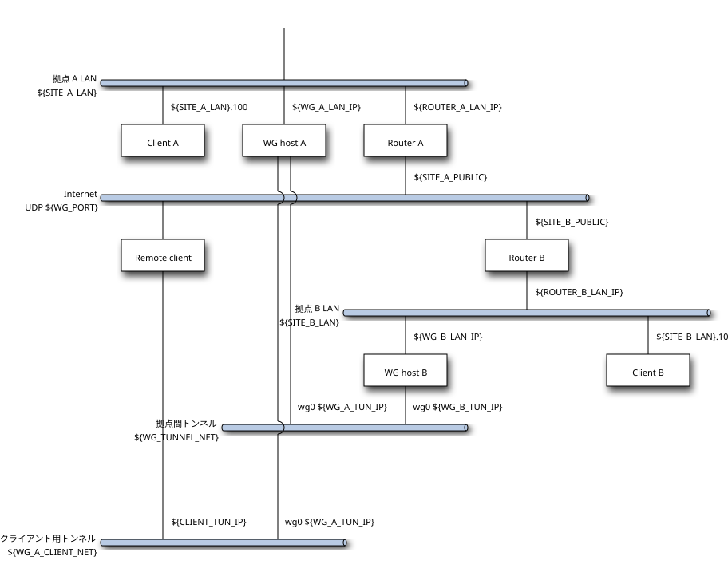

# WireGuard Road Warrior 設定手順（AlmaLinux 10 クライアント / NetworkManager + nmcli）

- **目的**: [WireGuard VPN 構築手順](wireguard.md)で建てた拠点の WG ホストに、外出先の AlmaLinux 10 ノート PC から接続し、両拠点の LAN に届くようにする。鍵は PC で作り、**公開鍵だけ**を WG ホストに登録する。トンネルは NetworkManager のプロファイル `wg0` として持ち、`nmcli connection up wg0` / `down wg0` で張る・切る（`wg-quick` は使わない。→ [代替](#代替-wg-quick-で張る場合)）
- **進め方**: **冒頭の変数ブロックに値を 1 度書き、以降のコマンドをそのまま貼る。** 手順 3 と手順 7 の後半だけは WG ホスト上で実行する（そのブロックの先頭にも変数がある）。WG ホスト側は `wg-vpn.sh` の `client add --pubkey` → `apply` → `client show` で、[wireguard.md の手順 4](wireguard.md#4-クライアントの登録) と同じ
- **状態**: **未検証。2026-09-22 時点で Road Warrior の実機では実行していない。** この文書を書いたマシンは拠点 B の稼働中の WG ホストで、クライアント側の手順を実行できる PC が手元に無かった。NetworkManager の挙動のうち「要確認」と付けた項目は `nm-settings-nmcli(5)` と upstream の資料からの推定で、確認した事実ではない。WG ホスト側の `client add --pubkey` / `client show` は wireguard.md の[スタブ検証](wireguard.md#付録-スクリプトの検証)の範囲。実機で実行した結果を[付録](#付録-実機での検証記録未実施)に記録してから、この行と各所の「要確認」を更新する

下表の値は想定。実機の `rpm -q` / `uname` で更新する。

| 項目 | 値 |
|---|---|
| 実施日 | （未実施） |
| OS | AlmaLinux 10.2 (Lavender Lion)（アーキテクチャは実機で記入） |
| カーネル | 6.12 系（`wireguard.ko` を同梱） |
| NetworkManager | 1.56.0（Wi-Fi を NetworkManager が管理している前提） |
| `wireguard-tools` | 1.0.20250521-1.el10（appstream。依存で `systemd-resolved` が入るが有効にしない） |
| firewalld | 2.4.3（既定ゾーン `public`） |
| SELinux | Enforcing |
| WG ホスト側 | [wireguard.md](wireguard.md) の構成（`wg-vpn.sh`）。例の値は `site.env.example`（拠点 A がクライアントを受ける）のもの |



図の Remote client が本書の PC。接続先拠点（図では拠点 A）の WG ホストにトンネルを張り、拠点 A・B の LAN に届く（→ [パケットの流れ](wireguard.md#パケットの流れremote-client--各拠点)）。

> **注記**: 環境固有の値は**シェル変数**で書いてある。PC 側は[手順 0](#0-変数を設定する)、WG ホスト側は[手順 3](#3-wg-ホストに公開鍵を登録するwg-ホストで実行)の先頭で 1 度だけ設定すれば、以降のコマンドはそのまま貼って実行できる。例は `site.env.example`（拠点 A がクライアントを受ける構成）の値。
>
> | 変数 | 設定する場所 | 意味 | 例 |
> |---|---|---|---|
> | `${WG_DIR}` | PC | 鍵と conf の一時置き場。取り込んだら秘密鍵と conf は消す（手順 9）。WG ホストの `~/wg` と取り違えないよう別の名前にしてある | `~/wg-client` |
> | `${WG_HOST_TUN_IP}` | PC | 接続先拠点の WG ホストの `wg0` アドレス（`site.env` の `WG_A_TUN_IP`） | `10.99.0.1` |
> | `${WG_HOST_LAN_IP}` | PC | 同じホストの LAN 側 IP（`WG_A_LAN_IP`） | `192.168.110.2` |
> | `${ROUTER_LAN_IP}` | PC | 接続先拠点のルーターの LAN 側 IP（`ROUTER_A_LAN_IP`） | `192.168.110.1` |
> | `${PEER_WG_LAN_IP}` | PC | 相手拠点の WG ホストの LAN 側 IP（`WG_B_LAN_IP`） | `192.168.120.2` |
> | `${REPO}` / `${SITE}` | WG ホスト | このリポジトリの clone 先 / クライアントを受ける拠点（`A` か `B`） | `~/setup-notes` / `A` |
> | `${CLIENT_NAME}` / `${CLIENT_PUBKEY}` | WG ホスト | 登録簿（`clients.list`）に載せる名前 / 手順 2 で PC に表示された公開鍵 | `laptop` /（`wg pubkey` の出力） |
>
> 出力例・表の中の値は `<CLIENT_NAME>` / `<CLIENT_TUN_IP>`（ホストが割り当てるトンネル IP）/ `<CLIENT_PUBKEY>` / `<SITE_A_PUBKEY>` / `<SITE_A_PUBLIC>` / `<WG_PORT>` / `<WG_HOST_TUN_IP>` などのプレースホルダで書いてある。**`<...>` を含むコマンドは bash のコードブロックには置かない**（本文中のインラインコードで示し、値に読み替える）。読者が値を入れる必要があるコードブロックは、先頭で変数が空なら中断するようにしてあり、値を入れずに貼っても何も実行されない。
>
> 秘密鍵はこの文書に載せず、手順の中でも端末に表示しない。公開鍵も検証用の使い捨ての値なので載せない。

---

## 手順の流れ

**PC で実行する。手順 3 と手順 7 の後半だけ WG ホストで実行する。** 手順 6 以降（トンネルを張る）は**拠点の LAN の外**（スマートフォンのテザリングなど）で行う（→ [注意点](#注意点)）。手順 0 で変数を設定したシェルで、上から順にコードブロックを貼る。理由・落とし穴は[補足](#補足)にまとめてあり、実行するだけなら読まなくてよい。

| 手順 | 内容 | 実施場所 |
|---|---|---|
| [0. 変数を設定する](#0-変数を設定する) | 接続先の値を書き、読み戻す | PC |
| [1. パッケージのインストール](#1-パッケージのインストール) | `wireguard-tools`（`wg` コマンド。カーネルモジュールは同梱） | PC |
| [2. 鍵ペアの生成](#2-鍵ペアの生成) | `wg genkey` / `wg pubkey`。公開鍵を表示する（秘密鍵は表示しない） | PC |
| [3. WG ホストに公開鍵を登録する](#3-wg-ホストに公開鍵を登録するwg-ホストで実行) | `client add --pubkey` → `apply` → `client show` | **WG ホスト** |
| [4. conf を PC に置き、秘密鍵を入れる](#4-conf-を-pc-に置き秘密鍵を入れる) | `client show` の内容を `wg0.conf` に貼り、`PrivateKey` 行だけ置き換える | PC |
| [5. NetworkManager に取り込む](#5-networkmanager-に取り込む) | `nmcli connection import`、autoconnect を無効にし、プロファイルを確認する | PC |
| [6. トンネルを張る](#6-トンネルを張る) | `nmcli connection up wg0`、`wg show`、経路、MTU、ゾーン | PC（LAN の外で） |
| [7. 疎通確認](#7-疎通確認) | WG ホスト・ルーター・相手拠点への ping / tracepath、逆方向 | PC と **WG ホスト** |
| [8. トンネルを切る・日常の使い方](#8-トンネルを切る日常の使い方) | `nmcli connection down wg0`。日常はこの up / down だけ | PC |
| [9. 平文の鍵と conf を消す](#9-平文の鍵と-conf-を消す) | `wg0.key` / `wg0.conf` を削除する（秘密鍵は NetworkManager のプロファイルにだけ残る） | PC |

戻すときは[ロールバック](#ロールバック)。

### 0. 変数を設定する

**編集するのは接続先拠点の 4 つの IP。** `WG_DIR` は既定のままでよい。**`sudo -i` した root のシェルではなく、自分のシェルで貼る**（`~` が自分のホームになるため）。**新しいシェルを開いたら（SSH を張り直したあとも）先にこのブロックを貼り直す。**

```bash
WG_DIR=~/wg-client                   # 鍵と conf の一時置き場（手順 9 で秘密鍵と conf を消す）
WG_HOST_TUN_IP=10.99.0.1             # 接続先拠点の WG ホストの wg0 アドレス（site.env の WG_A_TUN_IP）。<WG_HOST_TUN_IP>
WG_HOST_LAN_IP=192.168.110.2         # 同じホストの LAN 側 IP（WG_A_LAN_IP）。<WG_HOST_LAN_IP>
ROUTER_LAN_IP=192.168.110.1          # 接続先拠点のルーターの LAN 側 IP（ROUTER_A_LAN_IP）。<ROUTER_LAN_IP>
PEER_WG_LAN_IP=192.168.120.2         # 相手拠点の WG ホストの LAN 側 IP（WG_B_LAN_IP）。<PEER_WG_LAN_IP>
```

**値を読み戻して確かめる。** 拠点 B がクライアントを受ける構成なら、`site.env` の `*_B_*` 側の値が入っていること。

```bash
for v in WG_DIR WG_HOST_TUN_IP WG_HOST_LAN_IP ROUTER_LAN_IP PEER_WG_LAN_IP; do
  printf '%-15s = %s\n' "$v" "${!v}"
done
```

→ [補足](#手順-0-変数について)

### 1. パッケージのインストール

```bash
sudo dnf install -y wireguard-tools
rpm -q wireguard-tools NetworkManager systemd-resolved
systemctl is-enabled systemd-resolved         # disabled（依存で入るだけ。本手順では有効にしない）
modinfo -n wireguard                          # カーネル同梱のモジュールのパスが出る
```

→ [補足](#手順-1-パッケージ)

### 2. 鍵ペアの生成

秘密鍵は `wg0.key` に書き、端末には表示しない。公開鍵（44 文字）だけを手順 3 で WG ホストに渡す。

```bash
if [ -e "${WG_DIR:?手順 0 の WG_DIR が空のまま}/wg0.key" ]; then echo '中断: wg0.key が既にある（作り直すなら先に消す。WG ホストに登録済みの公開鍵と対応しなくなる）' >&2; else
  mkdir -p "${WG_DIR}" && chmod 700 "${WG_DIR}" &&
  ( umask 077; wg genkey | tee "${WG_DIR}/wg0.key" | wg pubkey > "${WG_DIR}/wg0.pub" ) &&
  ls -l "${WG_DIR}/wg0.key" "${WG_DIR}/wg0.pub" &&           # どちらも -rw------- で 45 バイト
  cat "${WG_DIR}/wg0.pub"                                     # この 1 行（公開鍵）を WG ホストへ渡す。秘密鍵（.key）は渡さない
fi
```

→ [補足](#手順-2-鍵ペア)

### 3. WG ホストに公開鍵を登録する（WG ホストで実行）

**ここだけ WG ホストのシェルで実行する**（[wireguard.md の手順 1](wireguard.md#1-siteenv-を書く) の `REPO` と `~/wg/site.env` がある前提）。別のシェルなので先頭で変数を設定する。

```bash
REPO=~/setup-notes                   # WG ホスト上でこのリポジトリを clone した場所（wireguard.md の手順 1 と同じ）
SITE=A                               # クライアントを受ける拠点（A または B）
CLIENT_NAME=laptop                   # 登録簿（clients.list）に載せる名前。英数字・-・_ のみ
CLIENT_PUBKEY=                       # 手順 2 で PC に表示された公開鍵（44 文字）を貼る
```

登録済みのクライアントを確認する。**同じ名前が既にある（ホスト側で鍵を作って登録したものなど）なら先に消す**（登録簿は名前で一意。→ [クライアントを削除する](wireguard.md#クライアントを削除する)。`apply` は次のブロックでまとめて行う）:

```bash
cd "${REPO:?REPO が空のまま}/scripts/wireguard" && ./wg-vpn.sh -e ~/wg/site.env client list
```

```bash
sudo ./wg-vpn.sh -e ~/wg/site.env client remove "${CLIENT_NAME:?CLIENT_NAME が空のまま}"   # 同名の登録があるときだけ。無ければ「登録されていません」で止まる
```

公開鍵で登録し、ホストに反映して、クライアント用 conf を表示する:

```bash
if [ -z "${CLIENT_PUBKEY}" ]; then echo '中断: CLIENT_PUBKEY が空のまま。手順 2 の公開鍵を入れて貼り直す' >&2; else
  cd "${REPO:?REPO が空のまま}/scripts/wireguard" &&
  sudo ./wg-vpn.sh -e ~/wg/site.env client add "${SITE:?SITE が空のまま}" "${CLIENT_NAME:?CLIENT_NAME が空のまま}" --pubkey "${CLIENT_PUBKEY}" &&
  sudo ./wg-vpn.sh -e ~/wg/site.env apply "${SITE}" &&
  sudo ./wg-vpn.sh -e ~/wg/site.env client show "${CLIENT_NAME}"      # この出力を PC へ持っていく（秘密鍵は含まれない）
fi
```

`client show` が表示する内容（`PrivateKey` はプレースホルダのままなので**秘密情報を含まない**。端末からコピーして PC に持っていく）:

```
[Interface]
# Client <CLIENT_NAME> (site A)
Address = <CLIENT_TUN_IP>/32
PrivateKey = <CLIENT_PRIVATE_KEY>

[Peer]
# Site A
PublicKey = <SITE_A_PUBKEY>
Endpoint = <SITE_A_PUBLIC>:<WG_PORT>
AllowedIPs = <SITE_A_LAN>, <SITE_B_LAN>, <WG_TUNNEL_NET>
PersistentKeepalive = 25
```

→ [補足](#手順-3-wg-ホストでの登録)

### 4. conf を PC に置き、秘密鍵を入れる

手順 3 の出力を PC に持ってくる。端末からコピーして下の `vi` に貼るのが簡単。ファイルで渡すなら、WG ホストで `client show` の出力をファイルに書き出し（秘密鍵は入っていないので平文でよい）、`scp` で `${WG_DIR}/wg0.conf` に置く。**ファイル名は `wg0.conf` にする**（NetworkManager がファイル名から接続名とインターフェース名を決める。要確認 → [補足](#手順-4-conf-と秘密鍵)）。

```bash
( umask 077; vi "${WG_DIR:?手順 0 の WG_DIR が空のまま}/wg0.conf" )    # 手順 3 の client show の出力をそのまま貼って保存する
```

`PrivateKey` 行だけを手順 2 の秘密鍵に置き換える（`PrivateKey` 行がちょうど 1 行でなければ何もしない。鍵は表示しない）:

```bash
if [ "$(grep -c '^PrivateKey *=' "${WG_DIR:?手順 0 の WG_DIR が空のまま}/wg0.conf" 2>/dev/null)" != 1 ] || [ ! -s "${WG_DIR}/wg0.key" ]; then
  echo '中断: wg0.conf の PrivateKey 行が 1 行ちょうどでないか、wg0.key が無い' >&2
else
  sed -i "s|^PrivateKey *=.*|PrivateKey = $(cat "${WG_DIR}/wg0.key")|" "${WG_DIR}/wg0.conf" &&
  grep -c '^PrivateKey = [A-Za-z0-9+/]\{43\}=$' "${WG_DIR}/wg0.conf" &&    # 1（置き換わった。鍵そのものは表示しない）
  grep -v '^PrivateKey' "${WG_DIR}/wg0.conf"                                # 残りの行を目で確かめる（Address / PublicKey / Endpoint / AllowedIPs）
fi
```

→ [補足](#手順-4-conf-と秘密鍵)

### 5. NetworkManager に取り込む

取り込んだ直後に NetworkManager が `wg0` を**自動で張る可能性がある**（`connection.autoconnect` の既定が `yes` のため。要確認）。拠点の LAN 内で作業しているなら、2 つ目のブロックで即座に切る。

```bash
sudo nmcli connection import type wireguard file "${WG_DIR:?手順 0 の WG_DIR が空のまま}/wg0.conf" &&
sudo nmcli connection modify wg0 connection.autoconnect no &&
nmcli -f NAME,TYPE,DEVICE,STATE,AUTOCONNECT connection show | grep -E '^(NAME|wg0 )'    # STATE が activated なら import 直後に張られている（要確認）。AUTOCONNECT は no
```

```bash
nmcli -t -f NAME,STATE connection show | grep -qx 'wg0:activated' && sudo nmcli connection down wg0    # 張られていたら切る（手順 6 で改めて張る）
```

プロファイルの内容と、秘密鍵の保存先を確認する:

```bash
nmcli -f connection.id,connection.interface-name,connection.autoconnect,connection.zone,ipv4.method,ipv4.addresses,ipv4.dns,ipv6.method,wireguard connection show wg0
sudo ls -l /etc/NetworkManager/system-connections/wg0.nmconnection     # -rw------- root root。秘密鍵はこの中（表示はしない）
```

見るところ: `ipv4.method` が `manual`、`ipv4.addresses` が `<CLIENT_TUN_IP>/32`、`ipv4.dns` が `--`、`wireguard.private-key` が `<hidden>`、`wireguard.peer-routes` が `yes`、`wireguard.peers` に接続先拠点の公開鍵。

→ [補足](#手順-5-import)

### 6. トンネルを張る

**拠点の LAN の外で行う。**

```bash
sudo nmcli connection up wg0 &&
nmcli device status | grep -E '^(DEVICE|wg0 )' &&                            # wireguard  connected  wg0
nmcli -f GENERAL.STATE,IP4.ADDRESS,IP4.ROUTE,IP4.DNS connection show wg0 &&   # activated。IP4.ROUTE に AllowedIPs の 3 経路（mt = の値を記録する）
ip -4 route show dev wg0 &&                                                  # 同じ 3 経路と metric
ip link show dev wg0 | grep -o 'mtu [0-9]*' &&                               # 1420 のはず（要確認）
sudo wg show wg0                                                             # latest handshake が数秒前、transfer の received が 0 でない
```

```bash
sudo firewall-cmd --get-active-zones           # wg0 が既定ゾーン public に入る（要確認）
cat /etc/resolv.conf                           # 手順 1 の前と同じ（DNS = が無いので変わらない。要確認）
sudo ausearch -m AVC -ts recent                # <no matches>
```

→ [補足](#手順-6-up)

### 7. 疎通確認

**PC で。** トンネル IP → WG ホストの LAN 側 → ルーター → 相手拠点の順に試す。どこで止まるかで疑う場所が変わる（→ [補足](#手順-7-疎通確認)）。

```bash
for h in "${WG_HOST_TUN_IP:?手順 0 の変数が空のまま}" "${WG_HOST_LAN_IP:?}" "${ROUTER_LAN_IP:?}" "${PEER_WG_LAN_IP:?}"; do
  echo "== $h"; ping -c 3 -W 2 "$h" | tail -2
done
tracepath -n "${PEER_WG_LAN_IP:?}"             # <WG_HOST_TUN_IP> → <PEER_WG_LAN_IP> の順に出る
```

相手拠点の LAN 上の別のホストへの `ping`、トンネル越しの `ssh <ユーザー>@<WG_HOST_LAN_IP>` も試しておくとよい。

**WG ホストで**（手順 3 のシェル）。ハンドシェイクと、**逆方向**（拠点 → PC）を確認する:

```bash
cd "${REPO:?REPO が空のまま}/scripts/wireguard" &&
sudo ./wg-vpn.sh -e ~/wg/site.env client list &&                                        # LAST_HANDSHAKE が「N 秒前」
CLIENT_TUN_IP=$(awk -v n="${CLIENT_NAME:?CLIENT_NAME が空のまま}" '$1 == n { print $3 }' ~/wg/clients.list) &&
ping -c 3 "${CLIENT_TUN_IP:?clients.list にその名前が無い}"                              # 拠点 → PC（PC の public ゾーンは ping に応答する）
```

接続先拠点の LAN 上の別のホストから `ping <CLIENT_TUN_IP>` も通る（ルーターにクライアント帯の静的経路がある前提）。片方向だけ失敗する、`latest handshake` が出ない、といった場合は [症状と原因の対応](wireguard.md#症状と原因の対応実測)。

→ [補足](#手順-7-疎通確認)

### 8. トンネルを切る・日常の使い方

```bash
sudo nmcli connection down wg0 &&
nmcli device status | grep -E '^(DEVICE|wg0 )'         # wg0 の行が消える（要確認）
```

日常は、外出先で `sudo nmcli connection up wg0`、拠点に戻る前に `sudo nmcli connection down wg0`。autoconnect を無効にしてあるので、再起動しても勝手には張られない。

→ [補足](#手順-8-down-と日常の使い方)

### 9. 平文の鍵と conf を消す

秘密鍵は手順 5 で NetworkManager のプロファイルに入っているので、平文のファイルを残さない（`wg0.pub` は公開鍵なので残してよい）。

```bash
rm -f "${WG_DIR:?手順 0 の WG_DIR が空のまま}/wg0.key" "${WG_DIR}/wg0.conf" &&
ls -l "${WG_DIR}"                                       # wg0.pub だけ残る
```

→ [補足](#手順-9-後片付け)

---

## ロールバック

PC で。`rm -rf` は使わない（`WG_DIR` を WG ホストの `~/wg` と取り違えて貼っても登録簿を消さないため）:

```bash
sudo nmcli connection down wg0 2>/dev/null; sudo nmcli connection delete wg0
rm -f "${WG_DIR:?手順 0 の WG_DIR が空のまま}/wg0.key" "${WG_DIR}/wg0.conf" "${WG_DIR}/wg0.pub" && rmdir "${WG_DIR}"
sudo ls /etc/NetworkManager/system-connections/             # wg0.nmconnection が無い
```

パッケージも消すなら:

```bash
sudo dnf remove wireguard-tools     # 依存で入った systemd-resolved も一緒に消える（dnf.conf の clean_requirements_on_remove=True）。トランザクション表を見てから y
```

WG ホストで（手順 3 の変数を設定したシェルで）:

```bash
cd "${REPO:?REPO が空のまま}/scripts/wireguard" &&
sudo ./wg-vpn.sh -e ~/wg/site.env client remove "${CLIENT_NAME:?CLIENT_NAME が空のまま}" &&
sudo ./wg-vpn.sh -e ~/wg/site.env apply "${SITE:?SITE が空のまま}"
```

ルーターの静的経路（クライアント帯）は他のクライアントも使うので触らない。

---

## 補足

手順の理由・落とし穴・検証記録。手順を実行するだけなら読まなくてよい。

### 実施前の状態

（実機で採取して記入する。採取コマンドは[付録](#付録-実機での検証記録未実施)の「記録用ブロック」）

| 項目 | 状態 |
|---|---|
| OS / カーネル | （未記入） |
| NetworkManager / `wireguard-tools` / `systemd-resolved` | （未記入） |
| firewalld（既定ゾーン、active zones） | （未記入） |
| SELinux | （未記入） |
| Wi-Fi デバイスと経路の metric | （未記入） |
| `/etc/resolv.conf` | （未記入） |
| `nmcli connection show`（`wg0` が無いこと） | （未記入） |
| `/etc/wireguard`（無いこと）/ `lsmod`（未ロード） | （未記入） |

### 選択した方針

- **NetworkManager（`nmcli connection import`）で張る** — PC の Wi-Fi を NetworkManager が管理しているので、トンネルも同じ管理下に置く。`wg-quick` が作った `wg0` は NetworkManager から `connected (externally)` に見え、NetworkManager が同名の一時プロファイル（`autoconnect yes`）を作る（この文書を書いた WG ホストで実測: `nmcli device status` に `wg0  wireguard  connected (externally)  wg0`）。管理者が 2 つになるのを避ける。`import` はホストが出す conf をそのまま読むので、手で写すのは秘密鍵の 1 行だけ。RHEL 10 のドキュメントは `nmcli connection add` で組む方式（→ [代替](#代替-nmcli-connection-add-で組む場合rhel-のドキュメントの方式)）
- **鍵は PC で作り、公開鍵だけをホストに渡す** — 秘密鍵が PC から出ない。`client show` の出力に秘密が無いので、渡す経路を選ばない。ホストに秘密鍵入りの conf が残らないので、wireguard.md 手順 4 の最後の `rm` も要らない（`--pubkey` で作った conf はプレースホルダのまま残してよい）。→ [wireguard.md: クライアントの秘密鍵の扱い](wireguard.md#クライアントの秘密鍵の扱い)
- **ファイル名は `wg0.conf`** — NetworkManager の importer はファイル名（`.conf` を除いた部分）を接続名とインターフェース名にする（要確認）。`wg0` なら WG ホスト側と同じ呼び名になる
- **スプリットトンネル、`DNS =` 無し** — ホストが出す conf のとおり。`AllowedIPs` は両拠点の LAN とトンネル網だけで、それ以外の通信は今いるネットワークにそのまま出る。`site.env` の `WG_CLIENT_DNS` が空なので resolv.conf にも触らない。全トラフィックを通す構成（`0.0.0.0/0`）は[対象外](wireguard.md#全トラフィックを-vpn-経由にする場合対象外)
- **autoconnect は無効** — 拠点の LAN 内で自動的に張られると、ヘアピンと経路の奪い合いになる（→ [注意点](#注意点)）。外出先で手で `up` する。常に外にある端末なら `sudo nmcli connection modify wg0 connection.autoconnect yes` に戻してもよい
- **firewalld は触らない** — PC 側で開けるものは無い（外向きの UDP は既定で通る）。`connection.zone` を設定しないので `wg0` は既定ゾーン `public` に入るはず（要確認）。拠点側からトンネル越しに PC へ入れるのは、`public` で許可済みのもの（`ssh` など）だけ
- **`nmcli` の変更系は `sudo` で統一** — polkit の既定（`/usr/share/polkit-1/actions/org.freedesktop.NetworkManager.policy`）では `settings.modify.system` / `network-control` が `allow_active=yes` なので、ローカルのコンソールなら `sudo` 無しで通るが、SSH 越し（`allow_any=auth_admin_keep`）では認証エージェントが要る。どちらでも同じ結果にするため `sudo` を付ける
- **秘密鍵の置き場所は NetworkManager のプロファイルだけ** — `/etc/NetworkManager/system-connections/wg0.nmconnection`（root の 0600）。取り出すときは `sudo nmcli -s -g wireguard.private-key connection show wg0`。バックアップは取らず、失ったら手順 2 からやり直す（ホスト側は `client remove` → `client add --pubkey`）。WG ホストの[バックアップ](wireguard.md#バックアップと復旧os-の再インストール)にクライアントの鍵は含まれない

### 手順の補足

#### 手順 0: 変数について

変数名は PC 視点（`WG_HOST_*` = 接続先拠点、`PEER_*` = 相手拠点）。拠点 B がクライアントを受ける構成なら `site.env` の `WG_B_TUN_IP` / `WG_B_LAN_IP` / `ROUTER_B_LAN_IP` と `WG_A_LAN_IP` を入れる。`WG_DIR` を WG ホストの `~/wg`（`site.env` と `clients.list` の置き場）と別の名前にしてあるのは、同じ人が両方のマシンを触るときに、ロールバックの `rm` を取り違えても登録簿が消えないようにするため。

#### 手順 1: パッケージ

`wireguard-tools` は `wg` / `wg-quick` と、依存の `systemd-resolved` を入れる。`systemd-resolved` は有効にしない（有効にすると NetworkManager の DNS 処理が resolved 経由に切り替わる。`DNS =` を使わない本手順では不要）。`modinfo -n` はモジュールの存在確認だけで、ロードは `nmcli connection up` の時点で NetworkManager が行う。

#### 手順 2: 鍵ペア

`umask 077` で `wg0.key` / `wg0.pub` を 0600 にする。`tee` で秘密鍵をファイルに落としつつ `wg pubkey` に流すので、秘密鍵は端末に出ない。`wg genkey` / `wg pubkey` はカーネルモジュール無しで動く。既に `wg0.key` があるときに中断するのは、上書きするとホストに登録済みの公開鍵と対応しなくなるため。

#### 手順 3: WG ホストでの登録

`client add` は同じ名前・同じ公開鍵・同じトンネル IP を拒否する（`wg-vpn.sh` の `cmd_client_add`）。`--pubkey` で登録した conf の `PrivateKey` は文字列 `<CLIENT_PRIVATE_KEY>` のまま書かれる（`client add` の末尾にもその旨が出る）。`apply` は `wg0.conf` を作り直して `systemctl restart` するので、他のクライアントと拠点間トンネルが数秒切れる（`reload` では経路が入らない。→ [落とし穴 2](wireguard.md#落とし穴-2-reload-では経路が追加されない)）。`apply` の末尾に出るルーターの設定（クライアント帯の静的経路）は、既に入っていれば変更不要。トンネル IP は帯の中で最小の空きが割り当たる（`--ip` で指定できる）。

#### 手順 4: conf と秘密鍵

- `sed` の区切りを `|` にしているのは、base64 の鍵に `/` が含まれるため（`|` `&` `\` は base64 に含まれない）。`$(cat …)` の展開結果は端末に出ない。シェルの履歴には展開前の文字列が残るので鍵は残らない
- 2 つの `grep -c` は「置き換え前に `PrivateKey` 行がちょうど 1 行あること」と「置き換え後に 44 文字の鍵になったこと」の確認
- `sed -i` は元ファイルのモード（`umask 077` の 0600）を引き継ぐ
- ファイル名を `wg0.conf` にするのは、NetworkManager が `import` で接続名とインターフェース名をファイル名から決めるため（要確認。有効なインターフェース名 + `.conf` でないと拒否されると思われる）

#### 手順 5: import

- `nmcli(1)` の man は `connection import` を「VPN 設定のみ」と書いているが、WireGuard の wg-quick 形式も読む。`/usr/share/doc/NetworkManager/NEWS` では 1.16 で WireGuard に対応（nmcli は当時 peer の設定・表示だけ未対応）、1.34 で「wg-quick 形式の import が負の排他的な `dns-priority` を設定しなくなった」「DNS ドメインとアドレスファミリ無効の import の修正」、1.56 で「nmcli が WireGuard の peer の表示・管理に対応」とある。コメント行・空行・`PersistentKeepalive` を読めるかは要確認
- 対応: `Address` → `ipv4.method manual` + `ipv4.addresses`、`DNS` → `ipv4.dns`（本手順では無し）、`PublicKey` / `Endpoint` / `AllowedIPs` / `PersistentKeepalive` → `wireguard.peers`
- `connection.autoconnect` は既定 `yes`。NetworkManager は autoconnect のプロファイルがあるとソフトウェアデバイスを作って張るので、import 直後に up になると思われる（要確認）。それを止める `import` のオプションは無いので、直後に `modify` で無効にし、張られていれば切る
- `-f` に `wireguard` を書くと `wireguard.*` の全項目が出る（この書式は NetworkManager 1.56 で確認済み）。`wireguard.peers` に公開鍵しか出ないか、`endpoint=` / `allowed-ips=` まで出るかは要確認（この文書を書いた WG ホストの外部管理プロファイルでは公開鍵だけだった）

#### 手順 6: up

- `GENERAL.STATE` / `IP4.ROUTE[n]: dst = …, nh = …, mt = …` の書式は NetworkManager 1.56 で確認済み。`mt` の値（WireGuard デバイスの既定 metric）は要確認。50 なら Wi-Fi の 600 より優先される（→ [注意点](#注意点)）
- `wireguard.peer-routes yes` が `AllowedIPs` の経路を入れる（`nm-settings-nmcli(5)`）。`ip4-auto-default-route` は `/0` の peer が無いので関係ない
- MTU は `wireguard.mtu 0` のときカーネル既定の 1420 になるはず（要確認）。`wg-quick` と違い NetworkManager は経路から MTU を計算しない
- `wg show` の `listening port` はランダム（`wireguard.listen-port 0`）。`latest handshake` が出ない場合は、鍵の対応（ホストの `clients.list` と `wg0.pub`）、`Endpoint`、ルーターのポート転送を疑う

#### 手順 7: 疎通確認

4 段階の意味: (1) `<WG_HOST_TUN_IP>` はトンネルそのもの（届かなければハンドシェイクか `AllowedIPs`）、(2) `<WG_HOST_LAN_IP>` は WG ホスト自身の LAN 側（届かなければ `AllowedIPs` に拠点 LAN が無い）、(3) ルーターは `wg0 → LAN` の転送とルーターのクライアント帯の静的経路、(4) 相手拠点の WG ホストは拠点間トンネルと相手ホストの `AllowedIPs`（クライアント帯）。→ [wireguard.md: 疎通確認の補足](wireguard.md#疎通確認の補足)、[症状と原因の対応](wireguard.md#症状と原因の対応実測)。トンネル越しの ssh は [WG ホスト自身の ssh へ入る場合](wireguard.md#トンネル越しに-wg-ホスト自身の-ssh-や-cockpit-へ入る場合)。

#### 手順 8: down と日常の使い方

`down` で NetworkManager が作ったリンク `wg0` が消えるかは要確認。GNOME の設定画面やクイック設定に VPN として出るかも未確認。

#### 手順 9: 後片付け

後片付けを最後にしているのは、import に失敗したときに `sudo nmcli connection delete wg0` → 手順 5 をやり直すのに conf が要るため。秘密鍵は手順 5 の時点で NetworkManager の keyfile に入っている。

ガードの確認（2026-09-22、この文書を書いた WG ホストで）: 各ブロックを `PATH` を空にした bash に変数が空のまま流し、値を使うブロックはすべて先頭のガードで止まって、ファイルを作る・書き換える・消すコマンドの起動が 1 つも試みられないことを確認した（起動が試みられたのは、値を含まない読み取り系と、意図どおりの `nmcli connection up` / `down` / `delete` だけ）。手順 2 と手順 4 のブロックは一時ディレクトリで本物の `wg` / `sed` を使って実行し、鍵が 0600 で作られること、`PrivateKey` 行だけが 44 文字の鍵に置き換わり他の行が変わらないこと、`PrivateKey` 行が 2 行あるときと `wg0.key` が無いときに中断してファイルが変わらないことを確認した。

### 完了時点の状態

（実機で採取して記入する）

### 代替: wg-quick で張る場合

NetworkManager を使わない場合（未検証）。手順 4 までは同じで、conf を `/etc/wireguard/wg0.conf` に置いて `wg-quick` で張る。NetworkManager の `wg0` プロファイルが無いこと（同じ ifname で併用しない）。

```bash
sudo install -m 600 -o root -g root "${WG_DIR:?手順 0 の WG_DIR が空のまま}/wg0.conf" /etc/wireguard/wg0.conf &&
sudo restorecon /etc/wireguard/wg0.conf &&
sudo wg-quick up wg0                     # 切るのは sudo wg-quick down wg0
```

- `DNS =` を書くなら `resolvconf` 経由で `systemd-resolved` が要る（→ [wireguard.md: `DNS =` を書く場合](wireguard.md#dns--を書く場合)）
- 起動時に張るなら `systemctl enable wg-quick@wg0`。ただし Wi-Fi より先に走り、`Endpoint` が名前なら解決に失敗しうる。拠点の LAN 内でも張られる
- NetworkManager からは `connected (externally)` として見え、同名の一時プロファイルが作られる（WG ホストで実測）
- wireguard.md の namespace ラボはクライアント側をこの経路で動かして疎通を確認している（→ [リモートクライアントの検証](wireguard.md#リモートクライアントの検証2026-09-19)）。本書の時点で検証済みなのはこちらだけ

### 代替: WG ホスト側で鍵を作る場合

wireguard.md 手順 4 の元の流れ。ホストで `client add A NAME`（`--pubkey` 無し）→ `client show NAME` の出力に秘密鍵が入っているので、LAN 内の `scp` など安全な経路で PC の `${WG_DIR}/wg0.conf` に置き（手順 4 の `sed` は不要）、手順 5 以降は同じ。取り込んだらホストで `sudo rm /etc/wireguard/clients/NAME.conf`（→ [wireguard.md 手順 4](wireguard.md#4-クライアントの登録)、[秘密鍵の扱い](wireguard.md#クライアントの秘密鍵の扱い)）。端末のスクロールバックとクリップボードに鍵が残る点に注意。スマートフォンは `client show NAME --qr` でこちらの流れになる。

### 代替: nmcli connection add で組む場合（RHEL のドキュメントの方式）

conf を import せず、値を手で写す方式（未検証）。`nmcli connection add type wireguard con-name wg0 ifname wg0 autoconnect no` → `nmcli connection modify wg0 ipv4.method manual ipv4.addresses <CLIENT_TUN_IP>/32` → `wireguard.private-key`（秘密鍵）→ `wireguard.peers '<SITE_A_PUBKEY> endpoint=<SITE_A_PUBLIC>:<WG_PORT> allowed-ips=<SITE_A_LAN>;<SITE_B_LAN>;<WG_TUNNEL_NET> persistent-keepalive=25'`（`allowed-ips` は `;` 区切り。`nm-settings-nmcli(5)`）→ `nmcli connection up wg0`。最初から `autoconnect no` にできるのが利点。

### 注意点

- **拠点の LAN 内では切る**: `Endpoint` 宛ての通信がルーターで折り返す[ヘアピン](wireguard.md#クライアントが拠点の-lan-内にいるとき)に加えて、NetworkManager が入れる `<SITE_A_LAN>` の経路（metric 50、要確認）が Wi-Fi の直結経路（metric 600）に勝ち、LAN 宛ての通信がすべてトンネルに入る。手順 6 以降は LAN の外で行い、import 直後に自動で張られたら（要確認）すぐ切る
- **`DNS =` の扱いが wg-quick と違う**: NetworkManager では `ipv4.dns` になり、接続中は resolv.conf を NetworkManager が書き換えるので `systemd-resolved` は要らない（要確認）。wg-quick は `resolvconf` 経由で resolved が要る（→ [wireguard.md](wireguard.md#dns--を書く場合)）。本書は `DNS =` 無し
- **MTU**: `wireguard.mtu 0` のときカーネル既定の 1420（要確認）。PPPoE やモバイル回線で大きい通信だけ止まるなら `sudo nmcli connection modify wg0 wireguard.mtu 1380` して down / up（→ [wireguard.md: MTU](wireguard.md#mtu)）
- **全トラフィックを VPN に通す構成は対象外**: NetworkManager 側は `wireguard.ip4-auto-default-route`（`/0` の peer で自動有効）、拠点側は NAT が要る（→ [wireguard.md](wireguard.md#全トラフィックを-vpn-経由にする場合対象外)）
- **`Endpoint` が DDNS 名のとき**: NetworkManager が再解決するかは未確認（→ [wireguard.md](wireguard.md#endpoint-に-ddns-名を書く場合)）。本書の例は IP リテラル
- **サスペンド復帰・Wi-Fi の切り替え**: `autoconnect no` のプロファイルをスリープ復帰後に NetworkManager が張り直すかは要確認（張り直さない可能性が高い。復帰後に `nmcli device status` を見る）。Wi-Fi が変わっても WireGuard は送信元の変化に追従するはず（要確認）。`PersistentKeepalive = 25` が NAT の穴を維持する
- **1 台のクライアントは 1 つの拠点だけ**（→ [wireguard.md](wireguard.md#1-台のクライアントは-1-つの拠点にしか接続できない)）。別拠点用は別名のプロファイルを作り、同時には張らない
- **同じ ifname で wg-quick と NetworkManager を併用しない**: `/etc/wireguard/wg0.conf` と NetworkManager の `wg0` を両方置くと、どちらが `wg0` を持つかで衝突する
- **同名クライアントの登録があれば先に `client remove`**: `client add` は同名を拒否する
- **秘密鍵は `nmcli -s` で読める**: root なら常に。ローカルのコンソールにログイン中のユーザーは polkit の既定（`allow_active=yes`）で `sudo` 無しでも読める可能性がある（要確認: 非 root で `nmcli -s -g wireguard.private-key connection show wg0 | wc -c` を実行し、45 が出るか）。PC のログインパスワードが鍵の守りになる
- **GNOME の UI**: NetworkManager のプロファイルなので設定画面から up / down できる可能性があるが未確認

### 参照

- [Chapter 7. Setting up a WireGuard VPN — Configuring and managing networking (RHEL 10)](https://docs.redhat.com/en/documentation/red_hat_enterprise_linux/10/html/configuring_and_managing_networking/setting-up-a-wireguard-vpn)（7.10 "Configuring a WireGuard client by using nmcli" は `nmcli connection add` で組む方式）
- [WireGuard VPN 構築手順](wireguard.md)（手順 4・5、症状と原因の対応、各注意点）
- `man nmcli`（`connection import`。man は「VPN のみ」と書くが WireGuard も読める）/ `man nm-settings-nmcli`（`wireguard` setting: `peers`、`peer-routes`、`mtu`、`ip4-auto-default-route`。`connection.autoconnect`、`ipv4.route-metric`）/ `/usr/share/doc/NetworkManager/NEWS`（1.16 / 1.34 / 1.56 の WireGuard の項）/ `man wg`（cryptokey routing、endpoint roaming）/ `man wg-quick`（`DNS`、`MTU`）
- `/usr/share/polkit-1/actions/org.freedesktop.NetworkManager.policy`（`sudo` を付ける根拠）
- [`scripts/wireguard/wg-vpn.sh`](../scripts/wireguard/wg-vpn.sh) の `render_client_conf` / `cmd_client_add` / `cmd_client_show`

---

### 付録: 実機での検証記録（未実施）

この文書はまだ実機で実行していない。実行したら、下の「記録用ブロック」と各手順の出力を貼り、冒頭の**状態**の行・バージョン表・[実施前の状態](#実施前の状態)・[完了時点の状態](#完了時点の状態)を更新し、本文の「要確認」を確認できた事実に置き換える（違っていれば本文を直す）。鍵・グローバル IP・ホスト名はプレースホルダに置き換えて貼る。

#### 記録用ブロック（手順 1 の前に、PC で）

```bash
head -2 /etc/os-release; uname -rm
rpm -q NetworkManager wireguard-tools systemd-resolved firewalld
nmcli general status; nmcli device status; nmcli -f NAME,TYPE,DEVICE,STATE,AUTOCONNECT connection show
ip -4 route show
cat /etc/resolv.conf
sudo firewall-cmd --get-default-zone; sudo firewall-cmd --get-active-zones
getenforce; ls /etc/wireguard; lsmod | grep -c wireguard
```

#### 手順ごとに貼る出力

| 手順 | 貼るもの | 決まること |
|---|---|---|
| 1 | `dnf install` のトランザクション表（何が依存で入ったか）、`is-enabled`、`modinfo -n` | バージョン表 |
| 2 | `ls -l` の 2 行（公開鍵の値は載せない） | — |
| 3（WG ホスト） | `client add` のメッセージ（割り当てられたトンネル IP）、`apply` の末尾、`client show`（鍵・グローバル IP は伏せる） | — |
| 4 | `grep -c` の 2 つの値、`grep -v` の表示 | — |
| 5 | `import` の全出力、直後の `connection show \| grep wg0`（**import 直後に張られたか**）、`down` が走ったか、`connection show wg0` の全項目（`ipv6.method`、`wireguard.peers` の表示）、keyfile の `ls -l` | 未確認事項 1・2・4・5 |
| 6 | ブロックの全出力。特に `IP4.ROUTE[n] … mt = ?`、`ip -4 route show dev wg0`、`mtu`、`wg show`（鍵・endpoint は伏せる）、`ip -4 route show` 全体（Wi-Fi の metric と並べる）、`--get-active-zones`、resolv.conf、`ausearch` | 未確認事項 3・6・7・9 |
| 7 | ping × 4 と tracepath（宛先はプレースホルダに）、WG ホストの `client list`（LAST_HANDSHAKE）と逆方向の ping | 状態の行 |
| 8 | `down` 後の `nmcli device status` と `ip link show wg0` | 未確認事項 8 |
| 9 | `ls -l` | — |
| 任意 | サスペンド復帰後の `nmcli device status`、Wi-Fi を切り替えた後の `wg show`（handshake が続くか）、非 root での `nmcli -s -g wireguard.private-key connection show wg0 \| wc -c`、GNOME の設定画面に出るか、ロールバックの `dnf remove` のトランザクション表（`systemd-resolved` が消えるか） | 未確認事項 10 と注意点 |
| 失敗したとき | エラーの全文と、どう直したか | 本文 |

#### 未確認事項

1. `import` の接続名・インターフェース名がファイル名（`.conf` を除いた部分）になること
2. `import` 直後に autoconnect でトンネルが張られること
3. `peer-routes` が入れる 3 経路の metric（50 と想定）
4. `import` で `ipv6.method` が `disabled` になること
5. `nmcli connection show wg0` の `wireguard.peers` に endpoint / allowed-ips まで出るか
6. `wireguard.mtu 0` のとき MTU が 1420 になること
7. `wg0` が firewalld の既定ゾーン `public` に入ること
8. `nmcli connection down` でリンク `wg0` が消えること
9. `DNS =` が無いので resolv.conf が変わらないこと
10. `Endpoint` が DDNS 名のときの再解決、サスペンド復帰・Wi-Fi 切替後の復帰、GNOME の UI に出るか、非 root で秘密鍵が読めるか
